# AI 绘画+自媒体 202308

> 来源：[`remhu1p2pr.feishu.cn/docx/SIS1dCUX2oqr6CxM0l0ckTkrnJh`](https://remhu1p2pr.feishu.cn/docx/SIS1dCUX2oqr6CxM0l0ckTkrnJh)

出品时间：2023 年 8 月 7 日

手册使用说明：本文旨在向你展示一个项目的更多可能性，帮助你更好地理解和实操。

建议：如果需要快速定位到精确内容，可以使用快捷键 Ctrl + F/command + F 的形式，搜索「关键字/词」，查找你想要的内容。

# 写在前面

💡Hi,

欢迎大家来到 8 月航海｜AI 绘画学习 | 实战手册，相信在接下来的日子里，我们将在这里见面很多次。

AI 绘图，顾名思义，即用 AI 实现绘图，在特定程序中输入特定关键词/指令，即可产出新的图片，而图片的主人就是你自己。简单来说，这是一种让你即使没有绘画能力，也能产出画作的技术。

目前 AI 绘画在全球已经有了非常良好的开源生态，一句话来说，AI 绘图，来路清晰，前路已通。但据了解，目前国内跑的最快的中文 AI 绘画产品，也只是到了“做出来”这步，正在探索“引爆的方法”。

亦仁曾预测：中文版本的 AI 绘画，会产生不少于 10 个年利润不低于百万的小程序，看谁先做出来并引爆。

所以，此时不下场，更待何时呢？

如果你以前从未接触过 AI，但最近看到 AI 绘画被频频提起，想做个基本了解，这篇手册将向你简单介绍 “AI 绘画” 的发展历程和技术原理；

如果你正想入局 AI 绘图，却不知道从何开始、如何创作，这篇手册将教给你简易与进阶共 7 种绘图方式，总有一种适合你；

如果你已经在使用 AI 绘画工具进行创作，但是总是画不出自己想要的效果，这篇手册将告诉你怎么使用 “咒语”，才能把心中的景象，清晰明白地传达给你的 “法杖”；如果你已经发现了 AI 绘画的异常值，但不清楚具体可以应用在哪些方向，这篇手册将带你了解 AI 绘画如何在各大领域大展拳脚，希望你也能从中找到适合自己的实践玩法。

先进入跑道了解赛制，远比在观众席等待结果更加有趣。

🔥如何使用本手册？

AI 绘画不断迭代玩法，作为航海教材的本手册也迭代并承载了非常多新内容，希望大家可以通过以下几点了解，如何更好使用本手册：

1.

本手册上篇为【学会 AI 绘画】，新手建议从上篇开始，了解 AI 绘画并学习 AI 绘画；

1.新手初学 AI 绘画时，选择的工具最好由简至难：建议先用国内工具，比如国内小程序或网站，其次 MJ，其次 SD，所以大家按照上篇的工具顺序学习即可；

2.

检测自己是否已具备 AI 出图能力，最好的办法就是把图片发出来，所以在【七、检测 AI 绘图能力】，我们为大家提供了「AI 绘画+小红书笔记」的模板，这是本次「AI 绘画+自媒体航海」的重点，也是新增内容最多的章节，希望你勇敢迈出这一步；

1.本手册下篇为【AI 绘画的应用与变现】，如果你对 AI 绘画目前的场景应用与商业发展更感兴趣，或者已熟练掌握 AI 出图，可以跳转阅读。

除了上述内容外，还有个核心就是多提问，多交流，在这里没办法满足你的地方，多问问，我们会一起找到关于难题更多的解法。

希望大家可以在这次航行里收获成果外，结识一群战友。

以下内容由生财有术联合圈友制作而成，仅供航海船员以及生财有术星球圈友学习使用。

同时也欢迎圈友们在实践过程中持续反馈，和我们共同完善，可以联系鱼丸（yuwan387）提供修改建议～

# 上篇：学会 AI 绘画，完成自检一、了解 AI 绘画

## 1.1 AI 绘画的历史与发展 @麻木尔杜斯戈里亚

AI 绘画的整个发展史，总体而言有这样几个关键节点。

第一个节点：GAN 的时代

“旧纪元时期”，彼时 AI 绘画的方案还是 GAN。GAN 这种方案就是训两个模型，一个造假，一个判真，两个模型相互卷，直到卷到造假的模型能造出 “以假乱真” 的图片时，就算练成了。但 GAN 有个致命缺陷叫做 “鞍点问题”，它造成 “模型训练过程中，数据处理的难度很大”，而且数据越复杂、越多样，难度就越大。这时的模型是很不稳定的，自然也不可能依托它形成什么商业模式。

第二个节点：一篇论文，带来新的范式

2020 年发布的开创性论文《Denoising Diffusion Probabilistic Models》，带来了一种新的图像生成范式。用这个方法生成出来的图片效果非常好，比 GAN 要好的多，而且不存在 GAN 的缺陷，由此，这种新范式突破了实用化的临界点。（PS：这就是为

什么后来的模型多叫做 XX Diffusion 的原因。)

Diffusion 算法的原理是先将一幅画面逐步加入噪点，一直到整个画面都变成白噪声，记录这个过程，然后逆转过来给 AI 学习（当然不只是一副画，而是极大数量的画）。从 AI 视角看，就是学习一副全是白噪声的画面，怎么一点点去除噪点变清晰，直至变成一幅画。用说的可能不清楚，我弄一组图片在下面，大家看了就明白了。

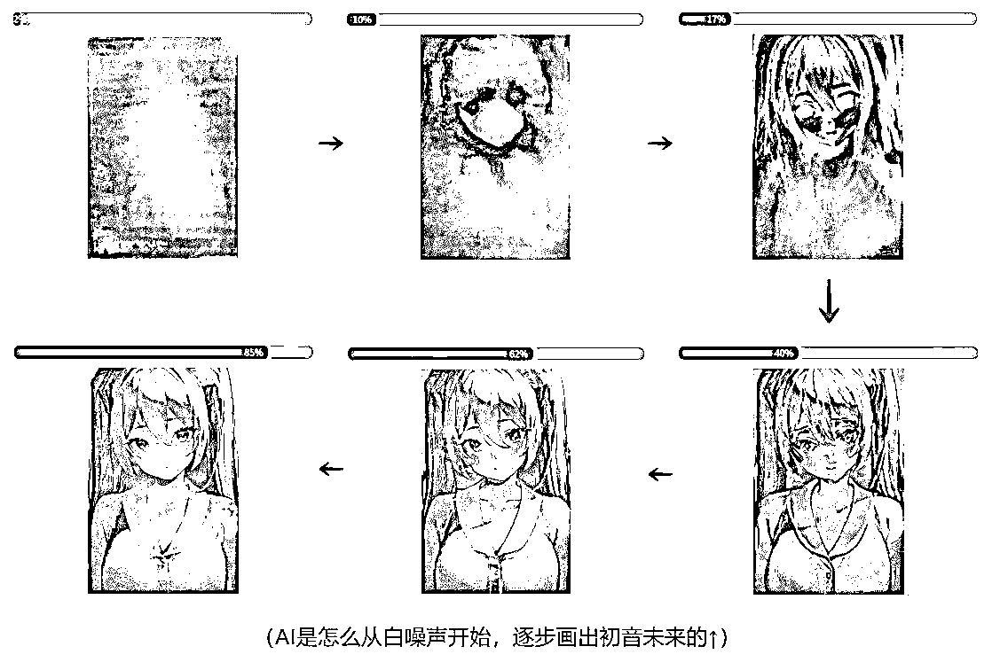

虽然新范式出现了，但此时还是不具备爆发的全部条件。这一时期出现了很多运用 Diffusion 技术的模型，比如 DALL-E 系列，MidJourney 等等，它们都有非常不错的效果，例如使用 MidJourney 创作的画作《太空歌剧院》就在美国科罗拉多州博览会的艺术比赛中获得了第一名，引发了媒体的竞相转载，以至于在指数工具里飙出了一个很高的 “异常值”，但因为它们要么是彻底闭源的，要么是只开放一些 api，所以 “异常值” 飙的快降得也快，最终没有特别出圈，停留在了新闻和少量技术尝鲜者中。

第三个节点：优秀的开源模型出现

2022 年 8 月份，Stable Diffusion 模型的开源给“AI 绘画的爆发”补上了倒数第二块拼图，这个模型的生成图像效果丝毫不逊于 DALL-E 系列，MidJourney 等商业模型，而且还有优良的开源社区支持。最重要的是，它在“大模型”家族里算是比较小巧的，个人设备也可以完成推理过程。

第四个节点：爆发，二次元的破圈力

2022 年 10 月份，基于 Stable Diffusion 但 “二次元专精” 的 NovelAI 模型发布当天被黑客泄露事件，彻底引爆了 AI 绘画，事件影响大大超过了绝大多数人的预期，AI 绘画作为大部分时间里一直默默无闻的新技术，被一瞬间推进到公众讨论阶段。

时至今日，AI 绘画在全球已经有了非常良好的开源生态，越来越多人将 AI 绘画运用到各行各业，衍生出许多行之有效的新玩法。例如包装领域、插画设计、AI 模特、产品定制、美甲设计等……期待能跟大家一起在新领域碰撞出新火花。

内容来源：《发展史+模型清单+咒术详解+中文本土化+版权 QA+生意探索=普通人的 AI 绘画挖宝指南！》

## 1.2 AI 绘画的实际应用

往期的 AI 绘画航海，我们更多聚焦于学习出图方法，并初步了解其可能的变现方向。

而本次 AI 绘画航海，在此基础上，我们新增了更多新场景下的新玩法，如，

AI 绘画+艺术二维码：艺术二维码最近非常火，是 AI 绘画新玩法的典型，学会出图后，你可以尝试接单定制，也可以做知识付费，甚至制作出图小程序、网页等，详情👉【八、AI 绘画如何应用于艺术二维码】

AI 绘画+四维彩超：很多孕妈妈在看到四维彩超时就会好奇宝宝的样子，而这样的需求，就决定了 AI 绘画+四维彩超的可行性，详情👉【九、AI 绘画如何应用于四维彩超】AI 绘画+动态视频：生成 AI 图片后，我们可以搭配腾讯智影等工具将其做成动态视频，虽然目前该玩法的收益路径还不清晰，但是思路值得借鉴，详情👉【十、AI 绘画如何应用于动态视频】AI 绘画+包装领域：即利用 AI 绘画辅助完成产品包装，不仅能提高创意性、进一步提高设计生产力，还能降低大家想要完成个性化包装定制的门槛，详情👉【十一、AI 绘画如何应用于包装领域】AI 绘画+插画设计：插画设计是指通过手绘或计算机绘图等方式制作图像，应用于插画，而 AI 的介入在很大程度上实现了插画设计的提效，详情👉【十二、AI 绘画如何应用于插画设计】

AI 绘画+电商领域：AI 绘画在电商领域的应用，主要是辅助产出模特图或产品图，即使没有真人模特，也能通过 StableDiffusion、MidJourney 等 AI 绘图软件产出商品展示图片，详情👉【十三、AI 绘画如何应用于电商领域】

AI 绘画+IP 定制：常规的 IP 定制，一般由专业工作室或画师对知名影视、漫画、游戏等 IP 进行二次开发，应用于文创或其他更多领域，AI 绘画作为生产力辅助工具，在一定程度上拓宽了 IP 风格，并能做到提效增速，详情👉【十四、AI 绘画如何应用于 IP 定制】

AI 绘画+LOGO 设计：LOGO 一般指企业、组织、品牌等在商业活动中使用的标志和标识，LOGO 设计一般需要考虑品牌的特点和定位，AI 绘画在其中能给到更多创意和想法，当然，目前 AI 绘画在 LOGO 设计中还有一些短板，比如文字和字母等无法完美体现，详情👉【十五、AI 绘画如何应用于 LOGO 设计】

AI 绘画+产品定制（以品牌周边为例）：产品定制的范畴很大，比如品牌周边、个性化定制等，常规的产品定制会根据需求，由人工产出方案与产品图，AI 绘画则能够辅助提高产品新颖度，满足更多个性化需求，虽然 AI 绘画的辅助仍有一定局限性，但已然是不错的辅助工具，详情👉【十六、AI 绘画如何应用于产品定制】

AI 绘画+头像壁纸：头像壁纸大家都很熟悉，在 AI 绘画爆火之初，就已经有许多朋友产出头像壁纸，做图文号实现变现了，现在，AI 绘画在头像壁纸领域的玩法更加丰富，详情👉【十七、AI 绘画如何应用于头像壁纸】AI 绘画+室内装饰：如何用 AI 绘画作出室内装潢渲染图、装饰效果图、装饰挂画、制作家具效果图？这就是该玩法下，大家共同探讨研究的方向，详情👉【十八、AI 绘画如何应用于室内装饰】AI 绘画+美甲设计：用 AI 生成的抽象艺术、花卉图片、人物肖像、风景图像等做成美甲，也是目前比较热门的一个玩法，有些美甲店也会在线上开设 AI 美甲设计的账号，吸引更多流量，详情👉【十九、AI 绘画如何应用于美甲设计】AI 绘画+摄影照片生成：真实的摄影照片往往需要摄影师亲自到场拍摄，AI 绘画的介入，则能让我们通过关键词的组合，产出更自由、不被地域光线等限制的照片，详情👉【二十、AI 绘画如何应用于摄影】

AI 绘画+更多玩法：该章节是更多大家可尝试的变现方向或思路，部分来源于圈友实操经历，部分来源于风向标，主要用途是希望帮大家打开变现思路，详情👉【二十一、更多 AI 绘画玩法】

以上便是我们在本次手册的【下篇：AI 绘画的应用与变现】中会具体展开讲的内容，选择的 10 个领域也是目前比较前沿、高频的玩法，希望你能从中打开更多思路。

当然，如果你还是一个新手，建议按照本手册的教程，先学习如何用 AI 绘画工具完成出图。没有人能够一蹴而就，不积跬步无以至千里。

## 1.3 AI 绘画工具选择 @天辉 🔥

### 1.3.1 主流出图工具

本小节中，我们会为大家介绍目前常见的出图工具。

🔥对于新手来说，建议先用国内工具，比如国内小程序或网站，其次 MJ，其次 SD🔥

国内工具能够辅助大家理解 AI 绘画的出图逻辑，在你有了一定认知和经验后，再使用 MJ 或 SD，能获得更流畅的出图体验。如果上来直接尝试 MJ 或 SD，很有可能直接被吓退。

所以不论在【上篇：学会 AI 绘画，完成自检 】，还是单论本小节，我们的教学逻辑都是由简至难，新手按照该逻辑开展自己的 AI 绘画体验即可。

#### 1.3.1.1 国内小程序或网站

门槛：几乎没有

操作语言：中文（如果遇到需要英文描述词的情况，善用翻译器）

操作步骤：跟着操作框操作即可

微信小程序

如，MEWX AI、小狸猫 MEWX AI 教程👉《二、简易方法：学会用 MEWX AI 完成 AI 绘画》

Vega AI

网页：https://rightbrain.art/

Vega AI 教程👉《三、简易方法：学会用 Vega AI 完成 AI 绘画》无界 AI

网页：https://www.wujieai.com/

#### 1.3.1.2 MidJourney

出图网站：www.MidJourney.com

使用门槛：付费订阅才能使用详细教程：【四、学会用 MidJourney 完成 AI 绘画】

MidJourney 是一个超强大模型（闭源）系统。除核心团队外，没有人知道这个大师的代码，不知道它是怎么训练出来的。

它极强，发展到现在，很简单的描述就可以有很不错的效果。操作界面简单，完成前置操作后，只需要聊天栏打字即可生成图像。

比如我们输入描述词“充满活力的加利福尼亚花”，点一下 prompt 按钮：

就会出现如下的图片生成过程：

更多详细使用命令和参数，，可以跳转后文【四、学会用 MidJourney 完成 AI 绘画】或阅读该精华帖：《行动起来，就会有好事发生（附 AI 绘画万字长文）》

#### 1.3.1.3 Stable diffuison

出图网站：需要下载安装到本机使用，或者使用其他人简化开发好的软件、小程序。

模型开源信息网址：https://github.com/AUTOMATIC1111/stable-diffusion-webui

使用门槛：界面复杂，新手上手较困难，如果是本地版，因为开源，所以免费，但是对电脑配置有要求（后文【Stablediffusion 安装使用细节】中会提到）

详细教程：【五、学会用 Stable Diffusion 完成 AI 绘画】

Stable diffuison 是一个开放的大模型（开源）系统 + 若干特化小模型，任何人都可以借助其代码，训练自己想要的大模型或者小模型，或者开发相应的插件。

但相应地，对描述词与模型有很高的要求。不同的描述词搭配不同的模型，图片的风格也会有天差地别。如【1girl+二次元模型】，就是一张二次元的女孩图片；【1girl+真人模型】，出来的就是 3D 真人图片。

Stable diffuison 有一个官方的大模型，加一个官方的用户操作界面，类似一个初始安卓机（如下图，原页面是纯英文，此处已做汉化）。

上述两个主流出图工具，我们一般简称 MJ（即 MidJourney）和 SD（即 Stable diffuison），也是本次 AI 绘画航海中，我们主要会讲的两大工具。

除此之外，本次手册我们还新增两个 AI 出图工具教程，方便大家学习：

MEWX AI：国内出图平台，依托于小程序，详细教程👉简易方法：学会用 MEWX AI 完成 AI 绘画 Vega AI：操作流程更加简化的，国内在线出图工具，页面简单，目前免费，新人上手快。详细教程👉学会用 Vega AI 完成 AI 绘画

如果你想尽快上手 AI 绘画，可以先尝试 MEWX AI，作为国内小程序，他的出图操作更加简单；但如果你想要探索更多更广阔的 AI 绘画世界，MJ 与 SD 是必须了解的两大工具。

### 1.3.2 其他出图工具

门槛：几乎没有

操作语言：中文（如果遇到需要英文描述词的情况，善用翻译器）

操作步骤：跟着操作框操作即可

百度文心

百度文心一格：https://yige.baidu.com/百度的 ERNIE-ViLG 文生图体验（可以在微信端体验）：https://wenxin.baidu.com/moduleApi/ernieVilg

Tiamat

https://tiamat.world/ 微信小程序 Tiamat 暂时没有网页端盗梦师

西湖大学心辰科技 （网页端和小程序）：https://www.printidea.art/

即时 AI

基于 SD 的图生图插件：https://js.design/意间 AI

网页：http://yjAI.AI-galaxy.com/

如果你已经能够流畅出图，想尝试更多 AI 绘画的应用与变现，可以直接跳转至【下篇：AI 绘画的应用与变现】

# 二、简易方法：学会用 MEWX AI 完成 AI 绘画 @MEWX AI 官方教程

AI 绘画的爆火带动了一批国内出图平台的诞 生，MEWX AI 就是其中之一，我们可以通过以下流程跑通 AI 绘图，并快速产出你的第一张作品。

## 2.1 注册登录

扫如下码，注册小程序：

它目前最大的特色在于，与小红书极其适配，小红书上的热门 Stable diffusion 类型的图片，在这里都可以找得到。

## 2.2 了解 MEWX AI

MEWX AI 小程序主要页面只有 4 个：画廊页面：画廊里的都是精选作品。如果写词没有灵感，可以来这里翻阅一下大家的创意和写词技巧，新手也可以来画廊里选择自己喜欢的一键画同款试试。

创作页面：为我们主要的创作地，在这里不仅可以写简单的词描述生成图片，还可以一键把你的照片转成各种漫画风，也可以使用高级功能如 ContrlNet 等。

画夹页面：你创作过的作品都可以在你的画夹页面找到。除非是个人主动投稿，否则个人作品都属于私人作品，不会被公开到画廊。

我的页面：我的页面里展示了关于你账号的一些信息，和一些额外的功能。

画廊页面

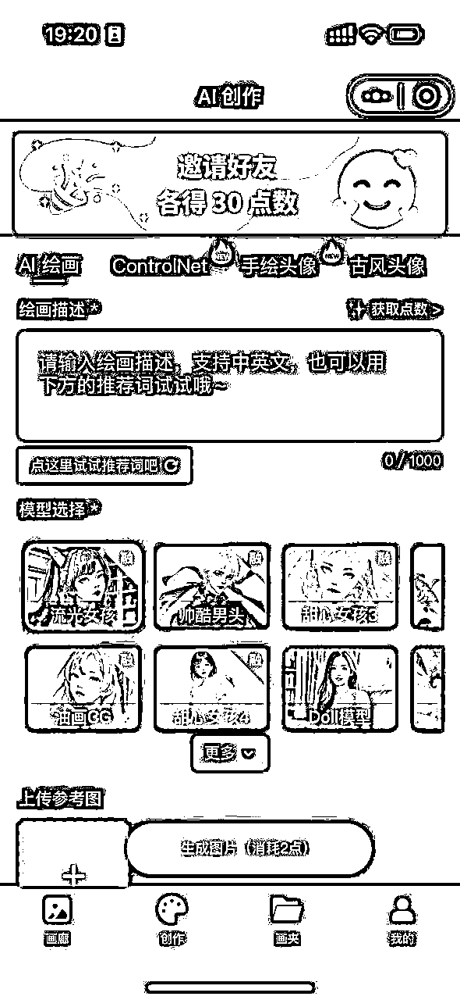

创作页面

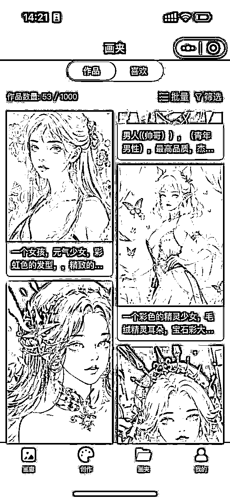

画夹页面

我的页面我们出图，主要使用的就是【创作页面】，而在创作过程中，除了我们会输入的关键词或图片，影响出图的另一大因素就是各类模型。

模型可以说是影响图片生成最大的因素，同样的关键词，在不同的模型下表现可能完全不同。

一个模型，笼统来说代表了一种画风和一种表现手法。在合适的词下选择合适的模型，是很充分必要的。

目前 MEWX AI 提供了各类不同的模型供大家选择，其中古风 V3、流光女孩等，使用频率较高，深受喜欢。

## 2.3 新手创作教程

如何使用 MEWX AI 进行 AI 绘图呢？下文提供两种常规方法、一个快捷技巧，和一个高阶玩法。

### 2.3.1 常规方法一：纯文字生成图片

用语言告诉 AI 你的需求，即文生图，输入对图片的描述，要求 AI 由你的文字生成画作。

可以输入短语、词语的组合，支持中文、英文，也支持中英文混合输入。

第一步：在【绘画描述】输入你对画面的描述，如果不知道输入什么，也可以查看输入框下方的推荐词。如果想要有更多自己的风格，可以👉【六、学习描述词】查看关键词如何组合使用；

第二步：选择自己喜欢风格的模型，主要有流光/国风/二次元/真人/通用几个大类型可供选择；

第三步：选择想要生成的图片比例、数量；

第四步：选择图片质量，越高清的图片，需要的消耗的点数越多；

第五步：生成图片

绘画描述是最重要的一项，它决定了你的图片里会有什么元素。但也不要一股脑的什么单词短语组合都往上堆砌，可能会让 AI 无法理解你的表达。

这里的原理是什么呢？

用文字描述图片特征后，AI 解析了我们输入的词组和短语后，去生成我们想要的画作。

关键词：一个开心笑的小女孩，在滑雪场滑雪

可以看出，AI 会根据我们的描述词来生成图片。描述词描述的越清晰越详细，作图就会越准确。而我们没有描述到的画面内容，AI 可能会自由发挥。

MEWX AI 关键词小技巧可以加一些修饰词来保证高质量，例如 Masterpiece， best quality， 8k 等。

对某些需要强调的词可以加（）括号来加强权重，一个括号是 1.1 倍的权重，或者例如直接写 （word: 1.6），给这个 word 提升为 1.6 倍的权重。

若想要单人，但画面出现多人，可以在关键词前加 solo 或者独奏。

### 2.3.2 常规方法二：参考图生成图片

用图片告诉 AI 你的需求，即图生图，要求 AI 用你选定的风格画出一张类似的作品。

第一步：在【绘画描述】写下你的绘图描述；

第二步：选择你喜欢的风格模型；

这种方式是你可以上传一张参考图作为生成图的基底，可以是一张照片也可以是一副草图等等。AI 会结合你的参考图与你的绘画描述和选择的模型风格，共同完成画作。

这里值得注意的是，上传参考图后，下方会出现一个叫做风格强度的值。这个值越小生成图会与原图越相似，这个值越大生成图越像你在第二步选择的风格。

大家做的真人漫改头像，也是一样的方式。风格强度调低，就比较接近真人，在此基础上，我们可以根据需要再选择不同模型风格。

### 2.3.3 快捷技巧：手绘头像 / 古风头像

在创作页的手绘头像和古风头像页面，我们只需上传参考图，调整风格强度，即可得到一张你的专属定制头像。

风格强度一般为 30～80 之内会比较好。

手绘头像和古风头像的画风如下图所示：

### 2.3.4 高阶玩法：LoRA 模型融合创作

融合模型即为 LoRA，全称为 Low-Rank Adaptation of Large Language Models。

什么是 LoRA（融合模型）？

LoRA 是一种体积比较小的绘画模型，不同于【基础模型】中只能选择一个大模型进行作画，LoRA 可以在已选择大模型的基础上添加一个或者多个，从而融合出不同的画风和人物特征。

如何使用 LoRA（融合模型）？

在 MEWX AI 的【创作页面】，我们进行常规绘图创作后，能看到底部有一个【高级设置】，点开它，就能看到一系列融合设

你可以在高级设置里选择你想要的融合模型，以及调整其比例。

不同的模型搭配不同比例的 Lora，会产生奇妙的化学反应，大家可以多多探索，尝试出自己喜欢的风格，例如：

注意事项具体参数比例的调试非常重要，可以先加低比例的融合模型先试试，然后逐渐调整比例；

有时候添加太多或者比例设置太高并不会让结果变好，反而可能会造成崩图。若效果不好，请多次调试，打造自己最满意的风格。

MEWX AI 中还有许多有趣玩法，例如线稿上色、人脸修复、服装设计等，这里不做更多展开，大家积极探索即可～

### 2.1.4 使用规则

该平台的步骤操作都是有消耗的：

每次出图操作会消耗 2-8 个点数，普通用户初始免费点数为 30 点；每日任务可获赠 70 点数的免费额度（下图所示）；

邀请好友，双方可以各得 30 点数；

如果后期出图熟练，按平台的免费点数，约能出 8～30+图片，对于普通的图文账号玩家来说完全够用。

如果想要获得更多操作点数，可以通过充值或升级会员来实现：

每日任务：免费获取点数

充值或开通会员，获取更多点数

# 三、简易方法：学会用 Vega AI 完成 AI 绘画 @天辉

简单来说，所有国内的小程序或网站，本质上都是 MidJourney 或者 Stable diffusion 的衍生物

如果，你的预算不足，订阅费有困难，或者本地电脑配置不够强，或者对线上部署和训练操作看的云里雾里，那么，国内的小程序和网站，就是为省钱、简化界面、简化操作方式等而产生的。

在网站运行的初期，需要大量的用户和数据，为了储存大量的关键词数据，培养用户习惯，或者优化生态等。这个时候，一般是免费为主，很多网站都是如此，Vega AI 也不例外。目前，它处于免费使用的时期，只要注册了，就可以无限制地免费使用。

一句话介绍 Vega AI : Stable diffusion 的国内简版产品，方便操作。

尽管，它支持中文生成，但毫无疑问，英文的描述词是最准确和贴近原生态的，所以，尽可能地使用英文描述词，会更准确。同时，因为它是 Stable diffusion 的套壳网站，所以，Stable diffusion 的描述词语法，在这里一样是通用的。

我们将它放在这里，是给看到 Stable diffusion 就头大的伙伴，一个简版的缓冲区。

Vega AI 官网：

https://rightbrAIn.art/

Vega AI 的优势：操作流程更加简化，能够更好更快地创作内容

几分钟内构思，快速生成高质量的画面支持在线快速训练，自由定制

率先开放视频生成大模型，体验视频生成的功能

Vega AI 的功能：文生图：输入文本生成图片，同时支持中英文

用户在线训练：自由上传图片，定制自己的风格模型风格模型仓库：多种基础大模型 + 风格广场

图生图：一张图片，无限风格

图片超分：HD 一键高清局部编辑：图片编辑，局部修改 【新】

条件控制：线稿上色，姿态动作，区域控制 【新】其他：历史记录管理与删除，生成时间优化【新】

## 3.1 创作教程

### 3.1.1 玩法一：文生图

进入官网（https://rightbrAIn.art/）后，基础操作步骤如下：第一步：在右侧工作区选择【基础模型】

第二步：在右侧工作区选择【定制风格】，建议勾选模型适配

第三步：在右侧工作区选择尺寸和张数第四步：在页面下方的输入框里，输入你的生成文案，即关键词

第五步：点击【生成】，完成出图，即如下图所示

下面我们来说一下每个步骤中，涉及到的名词是什么？如何使用？

#### 3.1.1.1 基础模型（核心）

「基础模型」作为文生图以及模型定制的基底大模型，可以按照以下场景进行选择。

Vega 提供的基础大模型适用案例如下：

基础模型：写真

适用场景：亚洲人、真人写真、coser、少年感、少女感

基础模型：3D 二次元

适用场景：偏 3D 的动画人物、游戏道具、游戏人物

基础模型：虚拟建模

适用场景：建模虚拟人、有光泽的场景和物体

基础模型：真实影像

适用场景：宠物、电影人物、工业设计、包装设计

基础模型：二次元

适用场景：偏平面的二次元人物、动画场景

#### 3.1.1.2 定制风格

「定制风格」展示的是【仓库】-【风格模型】中「我的风格」「我的风格」来源于：（1） 风格广场中收藏 （2）点击风格定制训练新的风格

「模型适配」默认勾选，勾选上会根据选择的风格自动匹配相对应的基础模型

比如 emoji 风格是基于虚拟建模基础模型训练的，点击 emoji 风格，基础模型自动会匹配到虚拟建模，当然也可以选择其他基础模型，但是整体效果会差一点，不过偶尔也会触发出惊艳的效果～

#### 3.1.1.3 其他文生图参数

1）基础参数风格强度：定制风格强度，强度越大（与训练数据越相似），强度越小（生成图片的操控性越大）

图片尺寸：提供常用分辨率（512x512、512x682、512x768）

张数：可选 1-4 张 2）高级参数：建议使用默认参数即可。

#### 3.1.1.4 输入生成文案

输入框上会有提示文案，例如“一头黑色长发，脖子上戴着项链的女子表情严肃地盯着镜头”。点击提示文案左边的更新按钮，还可以更新推荐文案。

点击文案：直接进到输入框根据文案的主体描述，进一步编写文案，如提示文案主体是女子，即可以用女子作为对象进行创作，丰富你的描述关键词，最终生成自己想要的图片。

当然，你也可以按照自己的想法，不参考系统推荐，完全由自己撰写描述词，生成自己想要的图片。

如果想要有更多自己的风格，可以👉【六、学习描述词】查看关键词如何组合使用；

#### 3.1.1.5 查看历史记录

点击工作区旁的“历史记录”，就能查看自己生成的历史图片：

### 3.1.2 玩法二：图生图

上传图片后，可以用「画笔」涂抹想要编辑修改的地方，「橡皮」可以擦除画笔痕迹：

文本输入描述目标内容，同时调高编辑强度可以增大修改的强度，一般 0.5 即可：

### 3.1.3 玩法三：风格定制

风格定制，即由你自己挑选同一类型的图片 10 张以上，在线训练出自己的专属风格。

原图质量越高，数量越多，效果越好：

第一步：准备图片图片类型：如同一人物、同一画风、同一物体、同一纹理、同一材质、同一姿势等

图片数量：10-100 张之间，图片数量越多效果越好

图片大小：建议分辨率在 512x512 像素以上图片的内容：建议保持主体一致，避免主体元素过小

第二步：上传图片

左侧菜单栏【训练】—>【风格定制】，点击「上传照片」或使用鼠标进行拖拽上传：

第三步：选择训练参数（很重要！！！)

「风格名称」：“定制风格”模型的名称

第三步：选择训练参数（很重要！！！)「风格名称」：“定制风格”模型的名称高级设置：建议使用默认参数即可～

第四步：开始训练

点击「开始训练」：耐心等待约 15 分钟，等待时间内可以进入其他页面进行操作，训练完成将会有弹窗提示。

第五步：使用风格模型

1）「风格定制」—> 我的模型 可以查看到刚才训练的模型，点击去应用

2）「文生图」选取训练的风格，输入文案即可进行创作

### 3.1.4 玩法四：条件生图

条件控制有三种方式：分为线稿生成、动作捕捉以及区域构图；

条件输入有两种形式：条件图片（普通图片即可）、条件特征（线稿、姿态图或者色块图）；使用“条件图片”，系统就根据选的“条件图片”生成“条件特征”去输入来生图

使用“条件特征”，系统直接使用用户上传的“条件特征”作为输入来生图方便理解，举个例子，我们在右侧配置“条件控制”选择“线稿生成”

如果选择“条件图片”，上传普通图像以后，系统会自动提取它的线稿，指引生成新的图像，你可以在条件特征里看到对应的线稿如果选择“条件特征”，那就需要自己上传线稿、姿态图或者色块图，系统直接根据条件特征生成新的图片

下面我们来具体讲讲条件生图的三种方式。

#### 3.1.4.1 线稿生成

第一步：右侧设置区选择「线稿生成」， 选择需要的模型和风格👇第二步：画布区我们选择「条件图片」，并上传一张图片👇

第三步：输入文本描述词（可以选择合适的推荐词）

第四步：点击生成，等待几秒就可以生成和原图线稿类似的新图了

点击「条件特征」可以看到原图的线稿，我们可以在这个线稿基础上继续生成：

Plus:也可以在第二步时，在画布区直接点击「条件特征」上传线稿，类似于上图 👆，直接用线稿生成新图。

#### 3.1.4.2 动作捕捉

类似于「线稿生成」，只不过我们的条件换成了动作。

第一步：右侧设置区选择「动作捕捉」， 选择需要的模型和风格 👇

第二步：画布区我们选择「条件图片」，并上传一张图片 👇

第三步：输入文本描述词（可以选择合适的推荐词）

第四步：点击生成，等待几秒就可以生成和原图动作形式类似的新图了：

第五步：在「条件特征」可以看到系统捕捉到的原图的动作，我们可以在这个动作图基础上继续生成其他图片

Plus:也可以在步骤 2 时直接点击「条件特征」上传动作图，类似于上图 👆，直接用动作图生成新图

Tips:

在线编辑骨骼动作网站：https://avatarposemaker.deezein.com/，可以在这儿里定义想要骨骼动作 3.1.4.3 区域构图

第一步：右侧设置区选择「区域构图」， 选择需要的模型和风格 👇第二步：画布区我们选「条件图片」，并上传一张图片 👇

第三步：输入文本描述词（可以选择合适的推荐词）

第四步：点击生成，等待几秒就可以生成和原图构图形式类似的新图了：

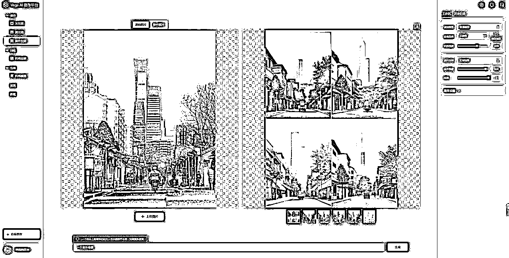

在「条件特征」可以看到系统提取到的原图的区域构图，我们可以在这个构图基础上继续生成其他图片：

## 3.2 其他常见功能

### 3.2.1 风格仓库

「风格广场」中的风格模型可点击“收藏”按钮添加至「我的风格」中

「我的风格」中可以查看到收藏的风格，点击应用，可以直接跳转文生图界面

### 3.2.2 模型分享

目前 Vega 已经支持用户分享自己训练的风格模型与风格广场投稿。

注：为避免侵犯他人隐私/肖像权，暂不支持特定真人风格的分享与投稿。

分享风格功能支持用户选择风格生成链接和提取码，他人可通过链接和提取码获取到对应的风格模型。

进入我的风格界面，点击要分享的风格进入详情页面，选择分享风格：

如果模型未经过审核，分享前需要先提交官方审核：

等待审核，审核结果会及时同步到界面右上角的系统通知：

等待审核，审核结果会及时同步到界面右上角的系统通知：

### 3.2.3 投稿广场

投稿广场支持用户将自己训练的风格模型投稿至风格广场。

进入我的风格界面，点击要分享的风格进入详情页面，选择投稿广场：

如果模型未经过审核，分享前需要先提交官方审核：

通过审核后即可投稿到风格广场展示：

# 四、学会用 MidJourney 完成 AI 绘画 @天辉老师

本篇是初次使用教程，指导你从零起步，开始一步一步使用 MidJourney。

它的显著特点是使用过程更简单，出图更精致更绚丽，出图速度快，电脑、手机端都可以使用。真正的 1 分钟出图。

在不加任何修饰语的情况下，MidJourney 也会随机生成非常好看的图片，操作界面也很友好。

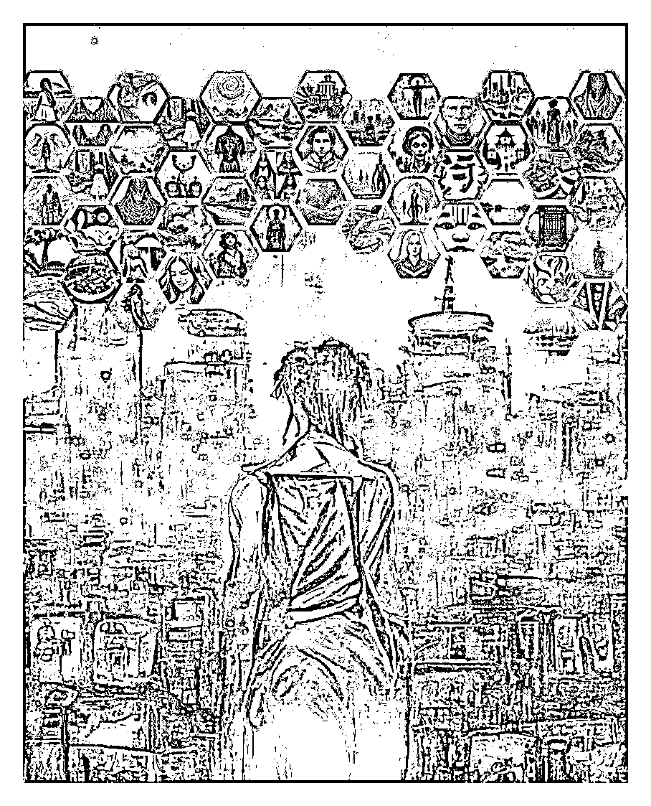

MidJourney 是一个前端通过 discord 聊天软件进行外显交互的 AI 绘图网站，因此在使用的过程中，会需要一个 discord 的账号，如果你之前没有，本文会带着你注册。

前期准备：

① 一个能使用的谷歌账号

② 可以访问外网

已经会基础使用的小伙伴可以跳过本章节。

## 4.1 初次使用

本质上，是先注册一个 discord 的账号，随后添加 MidJourney 服务器频道

出图网站：www.MidJourney.com

① 点击按钮：

② 进入 discord 界面

如果你之前没有注册过 discord 的账号，这里就会出现注册的界面，输入用户名，点继续，然后它会验证你是不是人类等，包括

如果注册好，或者之前就有 discord 账号，就会出现接受邀请按钮，点击接受会进入 discord 界面：

③ 进入 discord 界面后，左边频道栏就会出现一个小帆船图标，点一下：

如果此时没有出现小帆船图标，重复一下 ①② 步骤即可。

④ 鼠标放在频道处，往下滑动滚轮：

⑤ 找到 “ newbies - XX ” 频道，点击进入（每个人的数字不一定相同）：

⑥ 在这里，你就可以看到别人出的图片以及别人出的描述词：

按钮 U：在对应图片的基础上细化，出一张大图

按钮 V：在对应图片的基础上再变化出 4 张新图

⑦ 完成出图

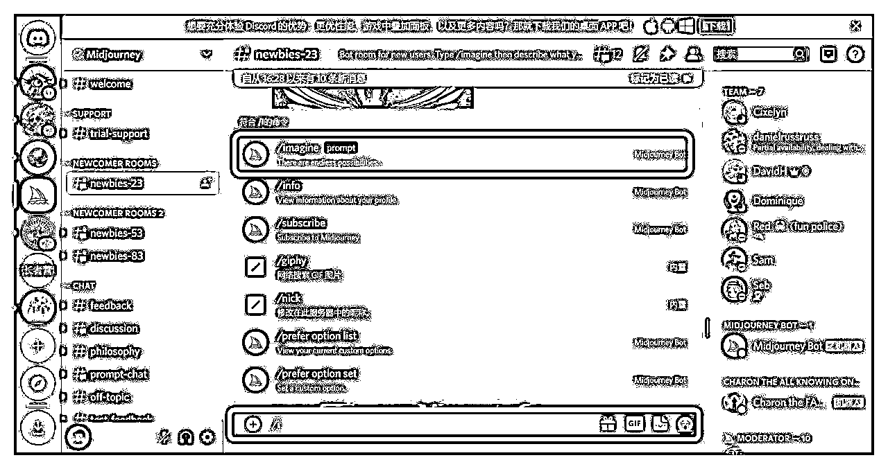

接着就可以在这里输入描述词了：

如果不清楚描述词如何写，可以👉【六、学习描述词】查看关键词如何组合使用。

⑧ 我们尝试一组关键词，例如“ 一个质朴的小屋子，宫崎骏风格 ” ，输入 “ A rustic little house， Miyazaki style ”

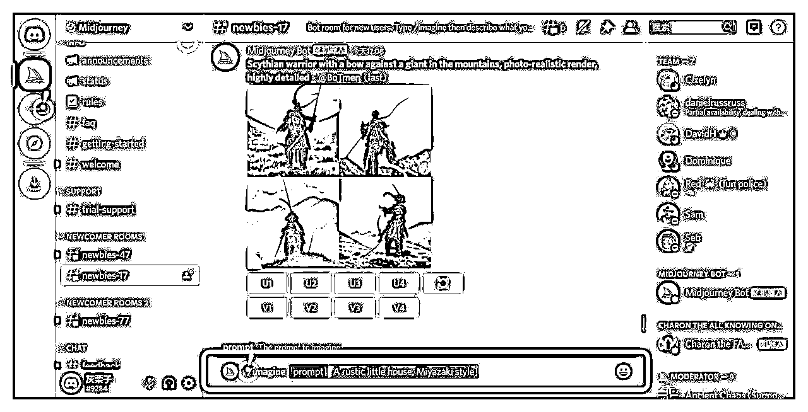

去聊天栏找你正在生成的图片：

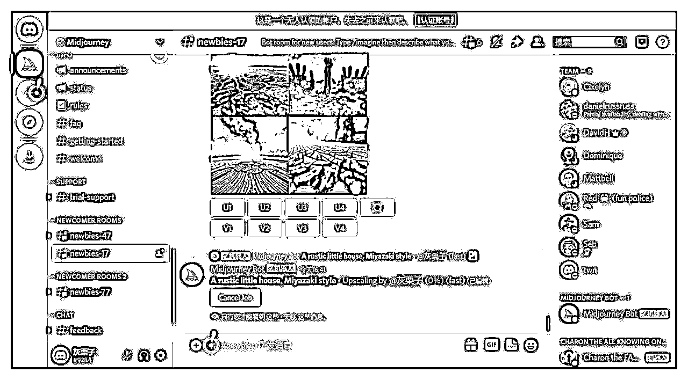

会慢慢出 4 张图，大约 1 分钟左右出完：

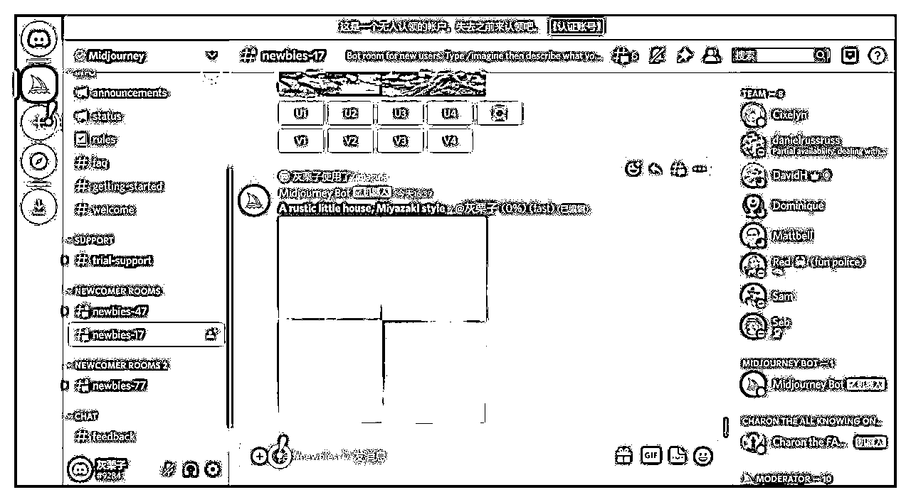

加载到 100%时，会在最新的聊天记录里出现，需要你回去找（找不到就上下翻找）：

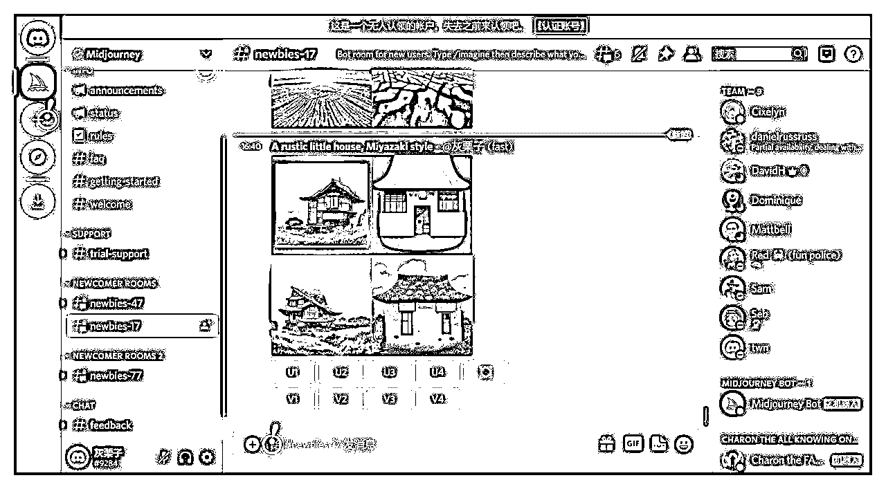

实在找不到，就在搜索栏搜索：

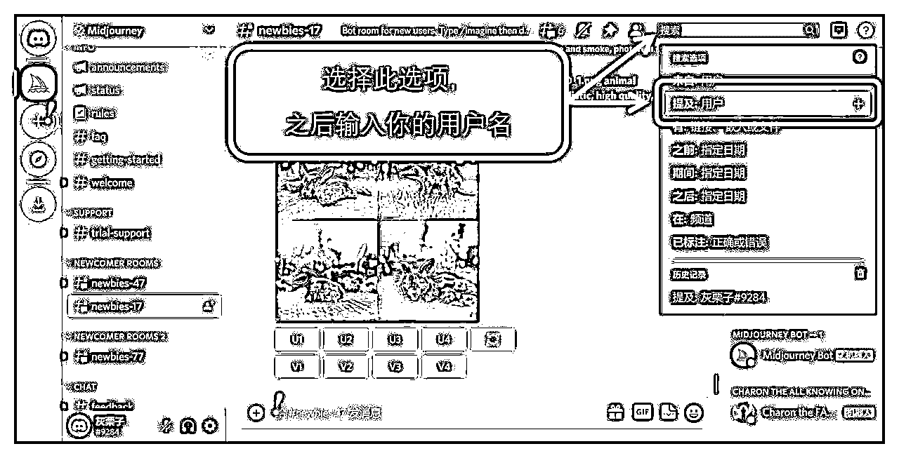

点你的名字：

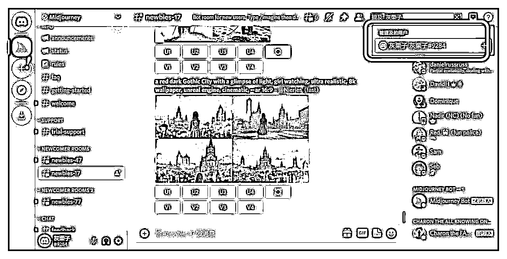

在右边提及你的部分，点击文字部分，左边就会跳转至你出图的界面：

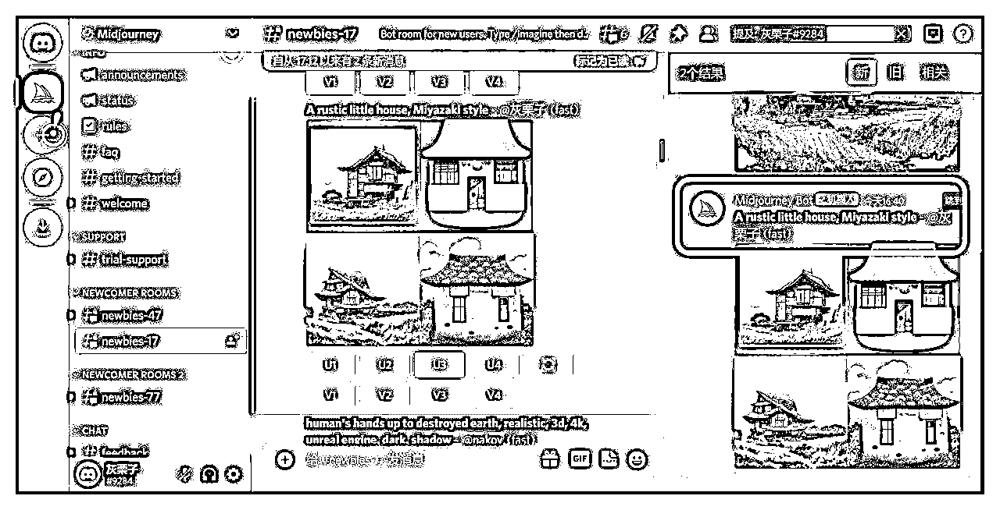

这里，比如我们觉得第三张图更像我们想要的，点一下 U3 按钮 即可。它会在第三张图的基础上细化，出大图：

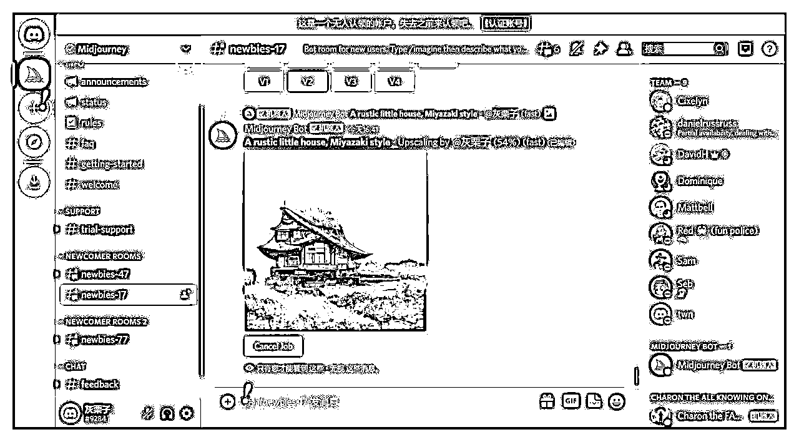

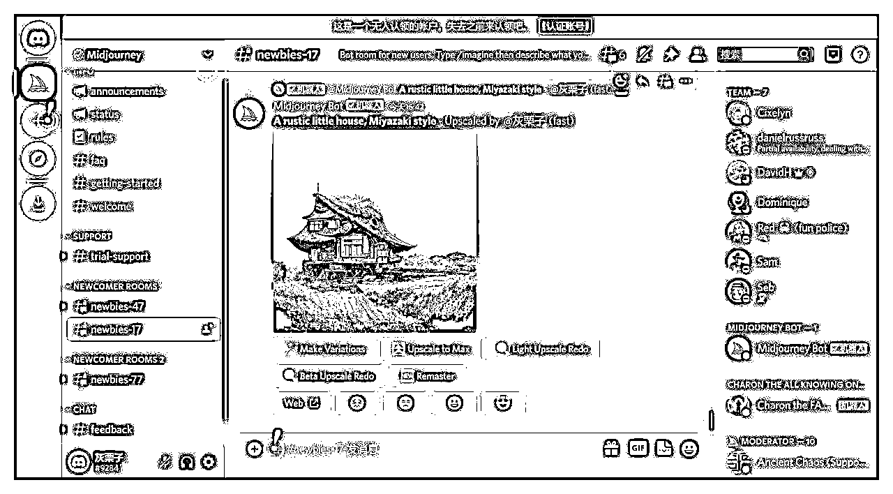

到这里，1 分钟的时间，我们的图片就已经生成完毕。

此处，各个按钮的作用：

Make Variations：在此基础上再生成 4 张图

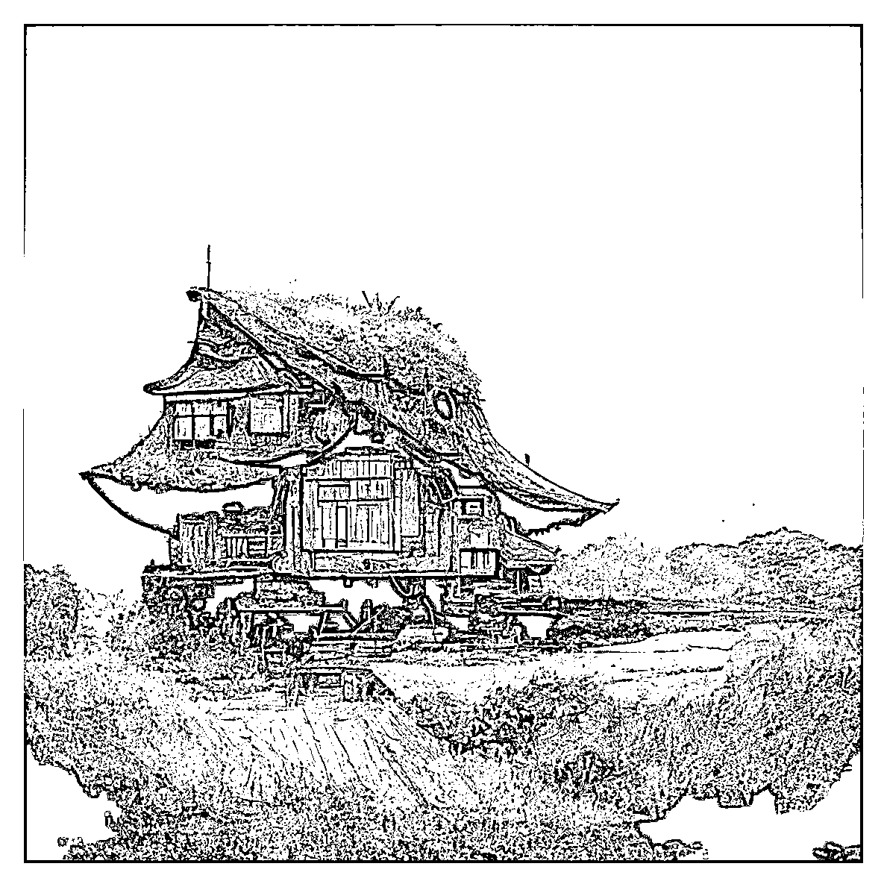

## 4.2 再次使用

前文方法是初次使用的流程，对于再次使用的朋友们而言，直接到你的 discord 账户里找小帆船即可。后续操作同初次使用。

电脑端：https://discord.com/channels/@me 手机端：

下载 discord，找到 “ newbies - XX ” 频道

在聊天框打一个 “ /i ” 字符，选择出现的 /imagine

后续操作同电脑端

# 五、学会用 Stable Diffusion 完成 AI 绘画

💡

章节概要这一章节很长，但是并不要求所有小伙伴学完。

Stable Diffusion 本身界面复杂，新手上手较困难，如果你在阅读过程中发现理解困难，这很正常。

如果实在啃不下这个工具，前文的几个工具已经能够支持你完成出图；

但如果你对自己有更高要求，想要探索 AI 绘画更深层次的玩法与应用，建议多提问、多检索，至少明白如何用 SD 完成文生图和图生图。

本章节主要从以下几个角度出发，为大家描绘 Stable Diffusion 的世界：✅了解 Stable Diffusion，详见👉【章节 5.1】

✅Stable Diffusion 的简易玩法：使用他人简化开发的程序完成出图，详见👉【章节 5.2】

✅Stable Diffusion 进阶用法第一步：安装到本机，详见👉【章节 5.3】

✅Stable Diffusion 进阶玩法：完成文生图，详见👉【章节 5.4】

✅Stable Diffusion 进阶玩法：完成图生图，详见👉【章节 5.5】✅Stable Diffusion 进阶玩法：识别图片参数，详见👉【章节 5.6】

✅Stable Diffusion 进阶玩法：模型介绍、使用与炼制，详解👉【章节 5.7】

✅Stable Diffusion 进阶玩法：插件安装与使用，详见👉【章节 5.8】

大部分小伙伴，学习【章节 5.1-5.5】的内容即可，如果仍有余力，可以探索后续章节的内容。

圈友@吴东子 也写过一篇非常详细的 SD 精华帖，大家可以点击查看原帖：

《耗时 80 小时！超详细的胎教级 Stable Diffusion 使用教程，看这一篇就够！》@吴东子

## 5.1 了解 Stable Diffusion @大刘 @天辉

Stable Diffusion 是模型的名称，是一个主题，为了方便大家使用这个软件，GitHub 一位大佬基于 Stable diffusion 开发了一个页面，就是我们现在一直看到的 Stable diffusion webUI，下面是所有 Stable diffusion 都表示 webUI 的页面。

一句话概括 Stable Diffusion：一个开源（免费），可以在自己电脑上无限制生成图片的一款软件。

Stable diffusion 能做到通过文字描述生成一张图片（文生图），亦可以在一张图片上进行部分修改或重新生成一张类似的图片（图生图）。

在 Stable diffusion 中，玩家们有个好听的称呼：魔法师，生成图片的描述词则被称为魔咒。

当你看到这句话的时候，恭喜你，发现了通往魔法世界的九又四分之三站台。

通过这个软件你可以，线稿提取再生成新图片、室内风格设计、训练模特、生成各种头像、商业设计等～Stable diffusion 图片生成的原理是把一张全是噪点的图，通过去噪的方式还原成最终的图片，如下图：

看不太懂没关系，不需要前期去研究。只需要了解到：AI 学习图片是从左到右，生成噪点来学习。

AI 生成图片时，初始一张都是噪点的纸，通过去噪来还原图片 Stable diffusion 由于其开源特性，发展极为迅猛，可以说很多效果超过了 MidJourney 也完全不过分，知识系统十分庞杂，这里引入门之后，推荐大家在各种平台搜索“Stable diffusion”相关消息，尤其关注“训练”、“模型”等词汇，Novel AI 是 Stable diffusion 的一个二次元特化分支，用相关关键词，搜索可得大量资料。

相对前文的 MidJourney 而言，Stable diffusion 的强大之处还在于集成了众多优秀的插件，可以让你对生成的图片有更好的控制。并且可以训练专属的模型，号称万物皆可炼。

### 5.1.1 丰富的插件

Stable Diffusion 有丰富的插件玩法。

比如 ControlNet，一款可以提取物体轮廓、人体姿势骨架、画面深度信息、进行语义分割的插件，可以控制人物的动作姿势，手势等等细节、重绘的功能可以实现只修改图片部分地方而其他地方没有任何变化。

再比如，Mov2Mov 可以把一种的视频转换成另一种风格的视频；

Tagger 可以让你随便拿一张图片，能帮你较为精准反推出大部分图片上的关键词。

### 5.1.2 丰富的模型以及自己训练的模型

模型图片太多了，光模型大大小小都上万了。随便两张经典模型封面镇楼：

上图左边的魔咒（关键词）：modelshoot style, (extremely detAIled CG unity 8k wallpaper), full shot body photo of the most beautiful artwork in the world, medieval armor, professional majestic oil pAInting by Ed Blinkey, Atey GhAIlan, Studio Ghibli, by Jeremy Mann, Greg Manchess, Antonio Moro, trending on ArtStation, trending on CGSociety, Intricate, High DetAIl, Sharp focus, dramatic, photorealistic pAInting art by MidJourney and greg rutkowski

Negative prompt: canvas frame, cartoon, 3d, ((disfigured)), ((bad art)), ((deformed)),((extra limbs)),((close up)),((b&w)),wierd colors, blurry, (((duplicate))), ((morbid)), ((mutilated)), [out of frame], extra fingers, mutated hands, ((poorly drawn hands)), ((poorly drawn face)), (((mutation))), (((deformed))), ((ugly)), blurry, ((bad anatomy)), (((bad proportions))), ((extra limbs)), cloned face, (((disfigured))), out of frame, ugly, extra limbs, (bad anatomy), gross proportions, (malformed limbs), ((missing arms)), ((missing legs)), (((extra arms))), (((extra legs))), mutated hands, (fused fingers), (too many fingers), (((long neck))), Photoshop, video game, ugly, tiling, poorly drawn hands, poorly drawn feet, poorly drawn face, out of frame,mutation, mutated, extra limbs, extra legs, extra arms, disfigured, deformed, cross-eye, body out of frame, blurry, bad art, bad anatomy, 3d render

Seed: 105259061, Steps: 30, Sampler: DPM++ SDE Karras, CFG scale: 10

上图右边的魔咒（关键词）：photorealistic, long_hAIr, realistic, solo, long_hAIr, (photorealistic:1.4), best quality, ultra high res, teeth, Long sleeve,Blue dress, Big mouth,full body, 3girls, Grin, graffiti (medium), ok sign,

smile, stand,

1girl,full body,

beautiful, masterpiece, best quality, extremely detAIled face, perfect lighting, 1girl, solo,best quality, ultra high res, (photorealistic:1.4),

parted lips

Lipstick,

ultra detAIled,

Peach buttock,looking at viewer,

masterpiece, best quality,

Negative prompt: (worst quality:2), (low quality:2), (normal quality:2), lowres, normal quality, ((monochrome)), ((grayscale)), skin spots, acnes, skin blemishes, age spot, glans,extra fingers,fewer fingers,strange fingers,bad hand

(low quality, worst quality:1.4), (bad_prompt:0.8), (monochrome), (greyscale)

Seed: 3662021034, Steps: 59, Sampler: Euler a, CFG scale: 9

## 5.2 简易玩法：学会用简化版 Stable diffusion 完成 AI 绘图 @天辉

因为新手直接使用 SD 的流程较为麻烦，所以这里推荐 3 个上手直接就能用的网站，都是根据 SD 简化开发的：

Dreamlike: https://dreamlike.art/createPlayground: https://playgroundai.com/create

Dreamstudio: https://dreamstudio.AI/dream

它们出图都比较方便，操作起来也简单，输入关键词即可出图。所以下文只做简单说明和图示，关键词逻辑可以学习「六、学习描述词」。

前期准备：

① 一个能使用的谷歌账号

② 可以访问外网 5.2.1 直接用 Dreamlike

初始有 100 点额度，默认尺寸下，生成一张图，消耗 1 点额度，当步数上升，尺寸上升时，额度消耗会加大如果你消耗了额度，每隔 1 小时，给你恢复 1 额度，最多到 100。也就是说，默认尺寸下，可以免费生成 100 张图。

打开网站

https://dreamlike.art/create 界面（使用需要登录谷歌账号）

下面的「Generate 1 image」是生成按钮，「2.2 credits」则是指本次生成图片需要消耗 5 额度。

生成一张图消耗 2.2，这里为啥我这里是消耗 2.2 呢？因为，它默认一次出 5 张图，如果想要调整数量，可以在描述词这一列往下翻，找到调整图片张数的地方做调整。（见下图）

左边的 Kandinsky 2.1 代表选用的模型。

下面的小齿轮是设置，可以将 5 改为 1，这样每次只出一张图，消耗 2.2 个积分。

主要出图按钮就是这些，填入关键词后就能生成对应的图片。至于其他按钮代表什么意思，大家可以自行摸索，写进航海日志。

### 5.2.2 直接用 Playground

网站：https://playgroundai.com/create

界面：

最基础的出图方法：在红色框框里输入英文字符，然后点击 Generate 生成图像

这个网站目前每个用户每天可以生成 1000 张图，足够尝试出各种按钮和参数的功能，所以这里不再赘述，大家积极尝试即可。

尝试的过程，是自己体验的过程，也可以记下来成为日志，成为帮助别人的攻略，它对你只有好处没有坏处。

### 5.2.3 直接用 Dreamstudio

网站：https://dreamstudio.AI/dream 界面：

同样一个对话框和生成按钮，右上角是每张图片的消耗额度，每个账户 1000 Credits 的额度，用完即止。

## 5.3 Stable diffusion 安装使用细节 @大刘

Stable diffusion 是一个开源的模型，开源=公开=免费，意味着你可以把这个模型下载到你自己的电脑上或者服务器上面畅玩，没有审核人员卡你图片是否有问题，随意出图。

如果不想使用上述三个由开源的 Stable diffusion 简化后的软件、网页，可以根据如下教程，学习安装 Stable diffusion 到自己电脑上进行出图。但需要注意的是，这一玩法有一定难度和门槛，你需要有一台配置还算可以的电脑或者云服务器即可上车～5.3.1 查看自己的电脑配置

本地电脑最低使用配置如下（非购买建议）

CPU：无特殊要求

存储：50G 以上（主要是模型比较多，还有点大），就是你电脑可以放东西的空间。

显卡：推荐 N 卡 20 系列或以上

显存：普通生成图片 4G-6G 即可入门（越大能使用的功能越丰富～炼制模型建议 8G 以上）

如何查看自己电脑的配置？

鼠标放到最下面的地址栏—>右击—>任务管理器，就会得到以下图片

### 5.3.2 Stable diffusion WebUi 的安装和启动（以秋叶的整合包为例）

Stable diffusion 是一个模型，webUI 是 GitHub 上一位大佬基于 Stable diffusion 模型研发的一个操作页面，可以让我们通过网页的方式操作使用 Stable diffusion，以下是从安装到使用的具体步骤。

#### 5.3.2.1 下载整合包

新手推荐两位的整合包，秋叶和星空。

秋叶安装包下载地址：

链接：https://pan.baidu.com/s/1JOkrjcGchWd3pSA5HAHYOA?pwd=sdsd

提取码：sdsd

推荐理由：下载后解压即可食用，启动器对新手超级友好～ 是前几天刚发布的全新启动器，UI 好评先下载这两个文件，

下载完成后把这个 zip 文件解压（注意：文件较大，请放在有空余的硬盘下）

如果是第一次使用，请把这个文件双击安装，直接全部下一步即可。

再点击 A 启动器启动

星空安装包下载地址：

百度：https://pan.baidu.com/s/1_J2vDta7JUa4358uykTYbQ?pwd=pctg 夸克：https://pan.quark.cn/s/91252d95a346 推荐理由：插件更新很勤，上述整合包的内容中包括 Controlnet1.1 和 SadTalker 插件。

星空 AMD/Intel 显卡整合包

夸克：https://pan.quark.cn/s/ee9553e37ad4

百度： https://pan.baidu.com/s/11dzn4SMQqjQmG1fyftyC0Q?pwd=ap5t

注意：请解压时，不要给文件夹取中文名或者加空格、奇奇怪怪的符号，不然有可能会报错，很难排查！！！

#### 5.3.2.2 安装 Python

Python 安装有什么用呢？主要是方便启动 Stable diffusion webUI 这个软件使用这个软件在上述两位的一键安装包中已集成，可以不用安装。安装包中的没有环境变量，新手可暂时无视。

如果要安装，请安装 3.10.6 版本的：

链接：https://pan.baidu.com/s/1E-f0jZFEnLN1_61dPCoI8A?pwd=9lik 提取码：9lik5.3.2.3 安装 git

作用：在你通过启动器无法下载或更新插件的时候，可以使用手动下载或更新，git 就是手动下载或更新插件的工具。

同样在安装包有集成，新手也可以暂时不用安装，当你遇到无法下载和更新插件的时候再安装也不迟～安装链接：https://pan.baidu.com/s/1qWdx1hsi06h_WQ4Ia8CgiA?pwd=82uq 提取码：82uq

#### 5.3.2.4 秋叶启动器的介绍

首次打开这个页面时，请点击左边的版本管理，把主体和插件最好是更新到最新版本，避免兼容问题，如下图操作：

大家先简单了解即可，后文中，我们会对出图步骤做详细讲解。

## 5.4 如何实现文生图 @大刘

### 5.4.1 写出描述词

#### 5.4.1.1 了解正反描述词

Prompt：即你写的文字，通常也被叫做，，。

正描述词：你想让 AI 帮你生成图片的描述词，可以是单词，也可以是句子，中间用逗号隔开，用英文描述。如我们前文出现过的 1girl， long hAIr；

通用：masterpiece，the best quality

大致顺序（画面质量提示词）， （画面主题内容）（风格）， （相关艺术家）， （其他细节）

例如：（masterpiece），（best quality），（ultra-detAIled）， （full body:1.2）， 1girl，chibi，cute， smile， white Bob hAIrcut， red eyes， earring， white shirt，black skirt， lace legwear， （sitting on red sofa）， seductive posture， smile， A sleek black coffee table sits in front of the sofa and a few decorative items are placed on the shelves， （beautiful detAIled face）， （beautiful detAIled eyes），负描述词：不想让 AI 在图片上出现的描述

通用：extra arms， disfigured， deformed， cross-eye， body out of frame，NSFW， （worst quality:2）， （low quality:2）， （normal quality:2）， lowres， normal quality， （（monochrome））， （（grayscale））， skin spots， acnes， skin blemishes， age spot， （ugly:1.331）， （duplicate:1.331）， （morbid:1.21）， （mutilated:1.21），（tranny:1.331）， mutated hands， （poorly drawn hands:1.5）， blurry， （bad anatomy:1.21）， （bad proportions:1.331）， extra limbs， （disfigured:1.331）， （missing arms:1.331）， （extra legs:1.331）， （fused fingers:1.61051）， （too many fingers:1.61051）， （unclear eyes:1.331）， lowers， bad hands， missing fingers， extra digit，bad hands， missing fingers， （（（extra arms and legs）））

#### 5.4.1.2 如何写描述词

更多描述词相关的内容，可以跳转至【六、学习描述词】进行学习，这里先做个梳理，方便大家了解。

描述词的概念一句话生成一张图，描述词是我们使用好 AI 绘图的核心

包括主题、风格、场景、细节、形象等一些具体包含的要素最好用英文书写

正负描述词

新手怎么快速用好描述词利用翻译工具

先描述好大的框架和场景描述再慢慢补充细节的描述词

借助各种 tag 网站

tag 超市 https://tags.novelAI.dev/魔咒百科 https://aitag.top/

AIGC 可视化编辑提示词等学习参考：参考网上图片的描述词，多用几次就有心得了

### 5.4.2 生成第一张图

以下就是启动成功后的页面，也就是魔法师施展魔法的地方。

图片放置的位置，可以点击图片左下角那个文件夹，或者上面启动器中的：

模型选择与调整

出图的步骤很直接，那么我们可以如何调整出图呢？其中一个办法就是选择模型：

调整出图【生成】按钮下方还有 5 个按钮，辅助我们操作更多步骤：

按钮 ①：从提示词中读取生成参数，如果提示词为空，则读取上一次的生成参数到用户界面

按钮 ②：删除现在描述词框中的描述词【生成】按钮下方还有 5 个按钮，辅助我们操作更多步骤：

按钮 ①：从提示词中读取生成参数，如果提示词为空，则读取上一次的生成参数到用户界面按钮 ②：删除现在描述词框中的描述词

### 5.4.3 参数介绍

这节主要是介绍文生图页面上各种按钮的用法，就是下方页面的按钮：

采样方法新手推荐下面三个采样方法，理由是 DPM++ 2M 算法更好一些，Karras 在这基础上的算法更完善一些，Euler a 则是时常会有点小惊喜的效果：

其他按钮

① 迭代步数 Step

可以理解为 AI 是一个画家，在一张纸上画了多少笔，推荐 20-36，效果都还不错，不要太大。

如果你看懂了前文，并且能理解一点原理，这个步数就是去噪的步数，去噪越多，图片相对会越清晰和细节，但当然图片生成的时间也会增加，不要太大，去噪太多也不好～

② 面部修复主要是针对人脸的修复，真人 3D 可以勾，二次元和风景千万不要勾。右边两个是不同的算法而已：

原来的

GFPGAN

CodeFormer

③ 高清修复

觉得图片清晰度不高，比较模糊，可以点击勾选高清修复，生成大图（低显存就不开了哈～容易出不了图）

算法推荐：R-ESRGAN 4x+ Anime6B（二次元）R-ESRGAN 4x+ （真人）

重绘幅度，就是你在原来的图片上的改动，0.5-0.73 都还不错高清修复和面部修复不要同时开，不要同时开，不要同时开

④ 宽度高度就是生成图片的宽高度，想要大图不要拉大宽高，容易出奇奇怪怪吓人的图。

因为 AI 预想的描述词只能画 A4 纸的大小，你给了一张 A3 的纸，多余的地方 AI 只能重复画 AI 上的内容，所以出现多头多手的图时，请调整你的宽高。

常用尺寸 512512 768768 512*768 等

想要大图可以选高清修复。

⑤ 提示词相关性（CFG）

表示你输入的魔咒对画面的影响度，越小 AI 自由发挥的空间越大，值越大 AI 发挥的空间小，会出现锐化，线条不好的情况。

⑥ 种子 Seed

可以理解为生成每张画用的纸的编号，-1 表示随机抽一张纸和笔，所以不同的种子，哪怕描述词一样，图片也会有点差异。

如果你觉得某张图片非常不错，想在这基础上稍微调整或修改，请固定种子（骰子右边的绿色箭头组成的圆圈，点一下就是固定目前图片的种子）

理论上，同一台电脑中，在应用完全相同参数（如 Step、CFG、Seed、prompts）的情况下，生产的图片应当完全相同。

⑦ 生成批次和数量的介绍

批次：每次生成图片的组数，批次的图相对变化会大一点；

数量：就是一次出几张图，相对变化会小一点（因为是同一批），但是如果显存不太行就还是每次 1 张吧。

## 5.5 如何实现图生图 @大刘

人物换衣、人物换背景、画风转换等等，都可以在图生图功能中实现。例如：换脸换衣服：

静物拟人：

真人转动漫：

### 5.5.1 基本介绍

图生图简述：就是文生图的升级版，如果说文生图全靠想象，图生图就是告诉 AI，你就参考这个模板+我的描述给我画。

按钮相对文生图没有新增太多，但是功能都很实用，如绘图，局部重绘，局部重绘（手绘版），上传蒙版等，具体详见下图：

### 5.5.2 如何绘图

在「绘图」区上传图片，加上描述词，就能成图。

下图中左边是我随手涂鸦了几笔，加上 tag 描述词，右边就是 AI 出的图片：

### 5.5.3 进阶玩法

#### 5.5.3.1 局部重绘

1）对图片进行部分区域的修改

拉伸：上传参考图和下面宽高不一致就会直接拉伸参考图的宽高，图片里面的图也会被挤压；剪裁：以图片的中点为中心，把多余的部分直接裁掉；

填充：如果生的图片的尺寸比参考图大，多余的部分 AI 会自动帮助填充内容，常用于风景。

2）蒙版模糊：类似 PS 或美图软件里面的边缘羽化，越小越锐化，越大边缘越模糊到接近原图。

3）蒙版模式

重绘蒙版内容：只会重新生成蒙版蒙住的内容，其他地方没有变化；重绘非蒙版内容：蒙住的部分不变，没有蒙住的地方重绘。

4）蒙版蒙住的内容

填充：预处理图片时，把蒙住的内容重新打散了，再去重组后填充到蒙版的位置；原图：预处理图片时，参考原图修改；

潜空间噪声：预处理图片时，通过噪声去铺满蒙住的位置，再去噪得出图片；潜空间数值零：预处理图片时，理解为那一块儿重回混沌了，然后再生成图片。

原始图

填充

原图

潜空间噪声

潜空间数值零

#### 5.5.3.2 手绘蒙版

跟重绘蒙版的按键差不多，就多了个蒙版透明度

蒙版透明度：数值越大，蒙住的位置颜色越淡 5.5.3.3 上传蒙版

上传蒙版的参数和局部重绘是一样的，区别在于：

局部重绘需要手动慢慢涂蒙版；上传蒙版是直接借用其他工具，例如 PS 直接把图片处理好了上传上去再生成新的图片。

注意，在上传蒙版中，白色代表重绘，黑色代表不处理。也不用细分，如果弄错了，在蒙版模式中选择重绘非蒙版就可以。

📌

到这一步为止，你已经了解 SD 的基础功能，能够使用 SD 完成出图了。但如果你想要了解更多 SD 的神奇之处，可以继续探索后文内容。

需要预警大家的是，【章节 5.6-5.8】的内容难度较高，但细嚼慢咽，多问善思，你也能在实践中体会到乐趣。

## 5.6 识别图片参数，放大生成的图片 @大刘

如果我们看到一张 Stable diffusion 生成的图片，如何提取其信息？并获得高清大图呢？

### 5.6.1 图片信息

当我们看到一张觉得非常不错的图片时，如果知道是 Stable diffusion 生成的原图，可以通过图片信息这个功能还原出图片的原始重要信息。

使用方式：

把图片上传到上方图片的位置（拉进去也行），右边会自动出来图片的信息。

第一行就是图片的正描述词：描述词多的会有很多行，看到第二行中的 Negative prompt，就表示正 tag 结束；

第二行中的 Negative prompt：表示负描述词；

第三行很多参数：表示步数、采样方法，用的什么模型，种子，图片大小等等信息；

第四行方框中【>>文生图 >>图生图 >>局部重绘】等：表述一键把上方的图片信息带到这些功能中。

### 5.6.2 tag 反推

哎，有小伙伴就说了，那万一图片不是 SD 的原图怎么搞咧，别急，可以使用 tag 反推功能区识别图片上的内容 CLIP 反推

CLIP 反推是自然语言的形式，反推出来的描述词是由一句话一句话组成。

例：A girl with long hAIr wore a pale yellow dress

DeepBooru 反推提示词这个反推出来的提示词是单词或者小短语的形式。

例：1girl，long hAIr，a pale yellow dress

### 5.6.3 tagger 插件

这是一个关键词反推的插件，推荐使用，生成的描述词更加精准。

用前文整合包的魔法师，整合包中这个插件一般自带下载好了的：

### 5.6.4 提高分辨率

真人 3D：算法 1 推荐 R-ESRGAN 4x+

二次元动漫：算法 1 推荐 R-ESRGAN 4x+ Anime6B

具体如下图所示：

## 5.7 模型介绍、使用与炼制 @大刘 @吴东子

### 5.7.1 模型介绍

简单来说，如果把 Stablediffusion 比喻成一本空白的画册，模型就可以看成不同的画师，每位画师的画风、擅长绘画的领域都有所不同，所以他们每个人分别画一本空白的画册，最后出来的内容也是有各种区别的。

而这些画师，在 Stable diffusion 里面称之为模型。

常见的模型主要分为两大类：用于固定整体画风的大模型和用于微调大模型的小模型。

大模型就是 latent-diffusion 模型，拥有完整的 TextEncoder、U-Net、VAE；小模型分为：Embedding 模型、Hypernetwork 模型、LoRA 模型；

还有一种就是 VAE（不是许嵩～）

VAE 中文名叫变分自编码器，主要作用是把潜空间的数据转换成最终的正常图片展示出来；你可以简单理解成滤镜，增加图片的色彩和处理一点图片的细节；

有些大模型是自带有 VAE 的，这个时候就不需要我们额外添加使用；但是有部分大模型是融合了多个模型出来的，VAE 已经融合坏了，就需要额外的 VAE 去帮助图片能更好的展现；

有些模型有时候出图时，画面会比较模糊、发灰、就是这个因为 VAE 坏了，又没有额外加载来帮忙。

哪里下载模型？

前面有提到，Stable diffusion 万物皆可炼，各种模型累积已经有上万的了，主要几种在两个地方

C 站：https://civitAI.com/抱脸：https://huggingface.co/models

#### 5.7.1.1 文件后缀问题

这是新手对于模型区分最容易糊的地方。

目前常见的模型文件后缀有：.ckpt .pt .pth .safetensors，但仅通过文件后缀来判断，是区分不了具体这些文件哪一种模型的。

区别：前 3 种：是基于 pytorch 的标准模型保存格式；

第 4 种：是由于前三种会有反序列化攻击的风险，所以这个是后面出来的新型模型格式。

实际使用起来没什么区别，只是安全性的区别而已。

#### 5.7.1.2 大模型

如标题，大模型也称为底模，是生成图片的整体风格的基础，就一个字，大。

文件大小通常是 GB 为单位，常见的有 2G、4G、7G

文件后缀目前常见 .ckpt 和 .safetensors

使用方法：打开你的绘图界面，点这个刷新圈圈，在这个红色框框中选择你需要的大模型名称即可

#### 5.7.1.3 VAE

文件格式和区分常用格式： .ckpt 和 .safetensors

文件大小：通常是几百 MB 区分：名称中大部分会带有 vae

放置位置：放在 Stable diffusion 根目录\models\VAE 下即可

使用方法：同大模型，位置也在大模型旁边

#### 5.7.1.4 嵌入式 Embedding（Textual inversion）

简介：一般是对大模型中某些特别细分的调整，比如一种画风，一个有标志的物品，光线调整等等文件格式和大小：通常是 .pt .safetensors，大小是 KB 级别的，蛮小的文件

使用方式

#### 5.7.1.5 超网络 Hypernetwork

文件格式和大小：常见格式为 .pt，大小一般在几十兆到几百兆不等。

由于这种模型可以自定义的参数非常之多，一些离谱的 Hypernetwork 模型可以达到 GB 级别。

放置位置：Stable diffusion 根目录\models\hypernetwork 下即可

使用方法：同上 Embedding，这里选择 Hypernetwork 里面的就行。

#### 5.7.1.6 LORA 模型

Lora 可以理解为是基础大模型下的又一个小模型，是对某种画风或者是人物，物品，风景等等训练的比较专一的小模型。来源一般是 C 站或者自己炼（俗称炼丹，这里不展开了，新手先不慌哈～先用别人练好的玩）。

文件格式和大小：常用 .ckpt .safetensors 格式，大小一般在 8mb～144.14mb 区间，也有极少部分不在这个里面放置位置：和其他小模型不同，lora 有两个位置，一个是通过插件的方式（先有这个），另一种自带的和上面小模型一样

插件 lora 放置的位置

WebUI 自带 lora 放置的位置使用方法

插件 lora 的使用

WebUI 自带 lora 的使用

### 5.7.2 LORA 模型和底模的使用技巧

光看标题是不是很难理解，别慌，这一章节的意思其实是，教你还原一张他人生成的图。

当你打开 C 站，看到某一个模型，咦，这模型好看，我想试试～ 这标题上的运用就开始了。

这就是 C 站，一个专为 Stable diffusion 打造的模型网站：

模型的筛选：

单独模型介绍：

查看图片信息

总结一句话，把作者图片上的参数，包括种子，都放到你的出图参数里。大小模型都选择一样的，就会有比较高的还原，有些细节不同也是正常的，毕竟不是同一台电脑。

快捷使用作者或者其他人的参数方式：点击图片右下角的感叹号，点复制，再去你的 webUI 页面，生成按钮下第一个箭头，点击即可。

### 5.7.3 自己动手训练 LORA 模型

今年 7 月份时，生财有术邀请视频创作者@吴东子 制作了一期视频，详细讲解 Lora 的功能、炼丹方法和实操案例。如果觉得本章节的文字版内容不易消化，不妨尝试视频教程👇

《保姆级 Lora 炼丹教程，一站式整合包，让你实现真人模特定制》@吴东子

视频里用到的工具也放在下面啦，需要的自取哈~

链接：https://pan.baidu.com/s/1dzhkZc3Hdj9EFcwfeFg2Ag?pw...提取码：wdz6

以下文字版内容来源于@大刘老师，enjoy~

#### 5.7.3.1 准备工作

介绍就不用我赘述了哈，到这里都是中高阶魔法师们了，应该用过别人的模型，现在想自己炼模型，不管是服装、人物、风景、亦或是其他，都可以慢慢训练，AI 的牛逼在于你给它东西它是真的学啊！

LORA 模型的训练最低显存需要 8G，越多越稳，训练需要的时间越短，玩的花样就更多；

实在想用 6G 尝试一下，先说好，时间会有点长，需要足够的耐心；

为了方便可以直接下载安装包，已进阶为高级的魔法师们，请自由发挥；准备工作：

Stable diffusion webUI 训练模型的软件包

流程：做好准备工作（装主体文件）—>选数据集—>打标（提示词）—>设置训练参数—>开始训练—>训练完成，测试使用模型有没有感觉这个流程，把很多图片放一起训练，像是修仙小说的炼丹，最后模型训练成功就是丹成。

#### 5.7.3.2 安装包下载

这个没有可视化 UI 页面，我个人觉得更简洁。

下载 LoRa 解压包，来源 B 站：秋葉 aaaki

训练包下载地址：夸克：https://pan.quark.cn/s/d81b8754a484

百度：https://pan.baidu.com/s/1WMjja4uHB9tkZoBvgmm_ZA?pwd=lora 提取码：lora

Github: https://github.com/Akegarasu/lora-scripts 下载完成后会有这三个文件：

解释下：第一个压缩包是模型训练的主体，需要解压，解压位置你自己选，注意路径尽量不要有中文名；

第二个是一个文本编辑器，可以更好的帮你修改文本内容；

第三个是 Python 的安装包，lora 训练原作者是建议 3.10.8 版本。

① 安装环境 Python 3.10.8：刚下载好的安装包里面有安装包，双击即可开始安装。

左下方这个 addPython.exe to PATH 一定要勾上，这是环境变量；先点击数字 1 再点击 2 开始安装，最后点一下箭头指的位置，再点 close：

② 清除 ps 脚本签名校验和验证 Python 是否安装成功命令行（黑窗口）打开方式：

③ 输入以下内容（主要是清除 ps 脚本签名校验用的）

Set-ExecutionPolicy -ExecutionPolicy RemoteSigned

上方图片中输入 Python 回车后出现下面的字就算成功了。这个窗口可以关了。

④ Notepad（文本编辑器）

步骤如下：

⑤ 更新主体文件

⑥ 用 PowerShell 运行 install-cn.ps1（安装依赖文件）

#### 5.7.3.3 挑选图片集

图片集就是你想训练模型，让 AI 学习的图片。模型训练的好坏，图片集和打标的重要性基本是排在首位；如果是单一人物，请让画面中只出现这一位人物，脸部多个角度图片，手、腿、身体，局部图片都可以加上；

如果希望对角度有较多要求，请给一些多角度的图片让 AI 学习；

什么拟合性这种词我就不讲了，讲白话白话：如果希望 AI 学的好，多给点图片让它充分的学习，以便模型出的图片有较高的还原度；

也建议不要给太多图片，以免适配性不强，就是学太多了，想和其他模型一起用就有点为难；题外话，见过一位豪狠人，用了 3000 张图片，训练步数 40000 步。结果是中途报错了（⊙o⊙）…

如果是摄像的图片，底图原图最好；

初级炼丹师建议：图片大小最好统一，推荐 512512 或 768768；图片可以用各种工具裁剪，截图，或者在下文【5.7.3.4 处理训练图片】处理图片时处理也行（随意～）

如果训练风格，就尽量都是统一风格的图片 5.7.3.4 处理训练图片

打开 Stable Diffusion 的页面

点击下方图片标识 1 和 2；源目录就是放自己手动截屏或者网上下载好的图片文件夹（尽量同一风格，同一分辨率大小，不要出现黑框）；

目标目录：等下预处理完成后图片和文件放置的位置（自己新建一个就好）；点击下方图片标识 3、4、5，等待完成后在目标目录中可查看到：

数字 3 的位置是图片如果大了，就会根据图片的中心点进行裁剪（我不太建议勾选）；

数字 4 就是让 webUI 帮我们给图片打标签（生成描述词）。

#### 5.7.3.5 图片打标

图片预处理后每张图片生成的 txt 文件中就是你这张图片的描述词（也叫标签，处理这些描述词也叫打标）；如果你想固定词语，请手动打标（用工具也可以）；

打标就是处理这些图片对应文件的描述词，新增或者删掉一部分文本中的描述词；AI 会根据文本的描述词去对应图片中的内容，有对应描述词的就会学到，这个描述词代表这个；

如果没有识别到的，常见两中方式，第一中就是自己手动在每个图片的文本中加一个或多个关键词，AI 就会把在图片中没识别到的内容当成是你手动写进去的描述词去学习（这个词通常就是模型的触发词）。

例：如果我想生成一个女孩的头像，脸是固定的。在文本中就要把关于脸的描述词，比如大眼睛，高鼻子，长眼睫毛这类的词，都删掉，再加一个你新增的描述词 如 jessie。AI 就会把这个文本中的 tag 没对应上的内容，当成你新增的描述词学习，当你使用这个模型的时候，打一个 jessie，出来的脸大概率是 jessie，小概率是你模型没练好。

#### 5.7.3.6 把预处理后的图片放到 loRA 新建的文件夹中

步骤：

在 Lora 文件夹下新建一个文件夹—>再建一个放置图片的文件夹—>训练次数文件夹—>上面 2.1 中生成的图片和文本都粘贴进来。

#### 5.7.3.7 设置训练参数

打开 trAIn.ps1 文件：双击打开步骤 1—>鼠标按住 trAIn.ps1 文件拖到打开的步骤 1 里面，效果如下

拷贝 SD 底模到 lora 的 models 文件下面去，参考下图

设置训练数据集路径：把右边文本中的 aki 换成左边这个自己新建的文件夹名称（就是有那个文件夹的上一层文件夹名称）

其他参数如下：

标注 1： 填写上面图片预处理时的分辨率就好了，如 512512，768768；标注 2： 推荐 15-20（因为上面文件夹的数字如果是 6，这里如果是 20，就是一张图片训练 6 次，循环 20 次，一共学了 180 次）；

标注 3: aki 改成 lora 中自己建的第二层文件夹；其他暂时不用改变（第一次先跑通流程）；

按 Ctrl+S 保存 按 Ctrl+S 保存 按 Ctrl+S 保存

#### 5.7.3.8 开始训练

回到 LoRA 文件夹，右击 PowerShell 运行 trAIn.ps1 这就已经开始训练啦～耐心等待即可：

查看训练完成的模型：在 Lora 文件夹下的 output 文件夹下即可查看

#### 5.7.3.9 测试训练的模型是否成功？关键词是否有效？

可以直接在 web_ui 文生图的描述框里面输入几个 tag，出图；

然后固定 seed 值，再加入刚才自己设置到 txt 文件中的关键词（触发词）和选择炼好的模型；再生成一次图片，拿原图和这张图对比，看有没有效果，权重也可以微调测试；

如果对比原图基本一模一样，说明关键词没有触发成功：

调整 lora 模型的去权重底模换成你训练模型时的底模

推荐使用脚本 xyz 轴测试（显卡不太行的还是手动吧）。

#### 5.7.3.10 SDXL1.0 安装和使用步骤

此模型对硬件要求较高～ 内存建议 32G 以上（虚拟内存可以设置高一些） 显存 12G 以上，效果更佳

先更新 SD 主体到 1.5.0 或以上版本，参考：更新 SD 版本和插件版本下载 SDXL 的两个主模型和 VAE

https://huggingface.co/stabilityai/stable-diffusion-xl-refiner-1.0/tree/mainhttps://huggingface.co/stabilityai/stable-diffusion-xl-base-1.0/tree/main

注意事项：

SD 主体必须更新到 1.5.0 或以上才能使用 SDXL 的模型；

base 主模型主要用于文生图，和对应的 baseVAE 搭配使用；refiner 主要用于图生图，和对应的 refinelVAE 搭配使用；

图片生成大小建议 1024*1024；内存的作用主要是用来加载主模型，小了主模型加载不了，更别说使用了；

## 5.8 插件安装与使用

### 5.8.1 插件安装（以 ControlNet 为例）

#### 5.8.1.1 插件简介

因为 Stable diffusion 是开源的，所以有很多大神们在此基础上开发了许多实用的插件，来帮我们对生成的图片进行更好的控制，或者是更好的提高软件使用的效率

其中最具有代表性的就是 ControlNet（也还有其他例如 Tagger、C 站助手、3D openPose 等等插件），这里只拿一种举例，只要你懂了，后面就是一通百通～5.8.1.2 下载方式

webUI 页面中下载：有两个地方

可用插件

从网址直接装

Git 手动下载：首先你需要有一个 git 工具，具体步骤如下点击后会出来黑色的窗口，按我的操作来

输入 cd .. 回车

输入 cd extensions 回车

输入 git clone XXXXX.git 回车，等待下载完成

注 1：这个 xxxxx 表示你要下载插件地址注 2：用 git 的好处是后期方便插件更新

示例：

zip 解压：不推荐，理由是不方便后期插件的更新

解压步骤：在网站中下载好插件文件的压缩包，到 Stablediffusion 根目录\extensions 文件下解压，重启后即可

#### 5.8.2 ControlNet1.1 插件的基础使用

#### 5.8.2.1 简介

ControlNet 可以通过线稿、动作识别、深度信息、等对生成的图像进行控制。目前已经更新到 1.1 版本，有了更多更精准的控制～

如：人物骨骼图中手部识别更加精准、识别面部表情等等～详见【5.8.2.4 ControlNet 的模型介绍】5.8.2.2 页面简介

插件上一步已经下载完成啦，接下来就是模型的下载，对的，这个插件也有他自己专属的模型。

还有部分同学的页面长这样：可以直接参考中文翻译的意思或者对应上图：

#### 5.8.2.3 各个模型的介绍使用

以下是 ControlNet1.1 最新版本的配置介绍，不是之前的版本（以下来自官方文档）。

注：ControlNet 和 ControlNet1.1 暂时不是同一个插件（如果之前下过，需要把之前删掉，再下载新的），后期稳定后会合并到 ControlNet 中的。

ControlNet 1.1 与 ControlNet 1.0 具有完全相同的体系结构，ControlNet 1.1 包括所有以前的模型，具有改进的稳健性和结果质量，并添加了几个新模型；

ControlNet 1.1 包括 14 个模型（11 个生产就绪模型，2 个实验模型，1 个未完成模型），模型名称如下

control_v11p_sd15_cannycontrol_v11p_sd15_mlsdcontrol_v11f1p_sd15_depthcontrol_v11p_sd15_normalbaecontrol_v11p_sd15_segcontrol_v11p_sd15_inpAIntcontrol_v11p_sd15_lineartcontrol_v11p_sd15s2_lineart_animecontrol_v11p_sd15_openposecontrol_v11p_sd15_scribblecontrol_v11p_sd15_softedgecontrol_v11e_sd15_shufflecontrol_v11e_sd15_ip2pcontrol_v11u_sd15_tile

模型下载地址：https://huggingface.co/lllyasviel/ControlNet-v1-1/tree/main

放置位置：

在你的 Stable diffusion（根目录）\extensions\sd-webui-controlnet\models

#### 5.8.2.4 ControlNet 的模型介绍

是模型不是预处理器哈。

Depth 深度图

用深度图控制稳定扩散出图。

模型文件：control_v11f1p_sd15_depth.pth

配置文件：control_v11f1p_sd15_depth.yaml 训练数据：Midas depth（分辨率 256/384/512）+ Leres Depth（分辨率 256/384/512）+ Zoe Depth（分辨率 256/384/512）。多分辨率的多深度图生成器作为数据增强。

可接受的预处理器：Depth_Midas、Depth_Leres、Depth_Zoe。该模型非常稳健，可以处理来自渲染引擎的真实深度图。

随机种子 12345（“a handsome man”）非 cherry-picked 批次测试：

Normal

使用法线贴图控制稳定扩散出图。

模型文件：control_v11p_sd15_normalbae.pth

配置文件：control_v11p_sd15_normalbae.yaml

训练数据：Bae 的法线图估计方法。

可接受的预处理器：普通 BAE。只要法线贴图遵循 ScanNet 的协议，该模型就可以接受来自渲染引擎的法线贴图。也就是说，您的法线贴图的颜色应该看起来像这张图片的第二列。

请注意，此方法比 ControlNet 1.1 中的 normal-from-midas 方法合理得多。以前的方法将被放弃。

随机种子 12345（“a man made of flowers”）

随机种子 12345（“room”）

Canny 边缘检测

使用 Canny 预处理器的图控制稳定扩散（人话：通过边缘检测预处理后的图处理成一张图片）。

模型文件：control_v11p_sd15_canny.pth 配置文件：control_v11p_sd15_canny.yaml

训练数据：具有随机阈值的 Canny。

可接受的预处理器：Canny。

随机种子 12345（“dog in a room”）

MLSD 线条图

用 M-LSD 直线控制稳定扩散出图。主要是直线，常用于室内设计

模型文件：control_v11p_sd15_mlsd.pth

配置文件：control_v11p_sd15_mlsd.yaml

训练数据：M-LSD 线。

可接受的预处理器：MLSD。

随机种子 12345（“room”）

Scribble 涂鸦

用涂鸦控制稳定扩散（下方能接受的预处理器或者自己手动画粗线条涂鸦生成图片）。

模型文件：control_v11p_sd15_scribble.pth

配置文件：control_v11p_sd15_scribble.yaml

训练数据：合成的涂鸦。

可接受的预处理器：合成涂鸦（Scribble_HED、Scribble_PIDI 等）或手绘涂鸦。

随机种子 12345（“man in library”）

随机种子 12345 +描述词 the beautiful landscape

Soft Edge 软边缘

使用软边（粗线条线稿）控制稳定扩散。

模型文件：control_v11p_sd15_softedge.pth

配置文件：control_v11p_sd15_softedge.yaml

训练数据：SoftEdge_PIDI、SoftEdge_PIDI_safe、SoftEdge_HED、SoftEdge_HED_safe。

可接受的预处理器：SoftEdge_PIDI、SoftEdge_PIDI_safe、SoftEdge_HED、SoftEdge_HED_safe。

与以前的模型相比，该模型有了显著改进。所有用户应尽快更新。

ControlNet 1.1 中的新功能：现在我们添加了一种名为“SoftEdge_safe”的新型软边缘。这是因为 HED 或 PIDI 倾向于在软估计中隐藏原始图像的损坏灰度版本，而这种隐藏模式会分散 ControlNet 的注意力，从而导致不良结果。解决方案是使用预处理将边缘图量化为多个级别，以便完全删除隐藏的模式。实现在 annotator/util.py 的第 78 行。

性能可以大致记为：

鲁棒性：SoftEdge_PIDI_safe > SoftEdge_HED_safe >> SoftEdge_PIDI > SoftEdge_HED 最高结果质量：SoftEdge_HED > SoftEdge_PIDI > SoftEdge_HED_safe > SoftEdge_PIDI_safe

考虑到权衡，我们建议默认使用 SoftEdge_PIDI。在大多数情况下，它工作得很好。

随机种子 12345（“a handsome man”）

Segmentation 语义分割用语义分割控制稳定扩散生成图片。不同的颜色表示不同的物品和场景，可以识别后再手绘对应物品的颜色上去

网上可搜语义分割的颜色物品对应图；

模型文件：control_v11p_sd15_seg.pth

配置文件：control_v11p_sd15_seg.yaml

训练数据：COCO + ADE20K。

可接受的预处理器：Seg_OFADE20K （Oneformer ADE20K）、Seg_OFCOCO （Oneformer COCO）、Seg_UFADE20K （Uniformer ADE20K） 或手动创建的掩码。

现在该模型可以接收 ADE20K 或 COCO 两种类型的注释。我们发现识别分段协议对于 ControlNet 编码器来说是微不足道的，并且训练多个分段协议的模型可以带来更好的性能

使用随机种子 12345（ADE20k 协议，“house”）

使用随机种子 12345 的非 cherry-picked 批次测试（COCO 协议，“house”）

Openpose 传说中的骨骼识别

就是通过骨骼图生成图片，用于固定人物姿态、动作，现在这个新增了一个可以识别面部表情。下面有组合方式模特动作？模特表情？不方便多讲，可自行研究

使用 Openpose 控制稳定扩散。

模型文件：control_v11p_sd15_openpose.pth

配置文件：control_v11p_sd15_openpose.yaml

该模型经过训练，可以接受以下组合：打开姿势身体

张开手打开姿势脸

Openpose 身体 + Openpose 手

Openpose 身体 + Openpose 脸部 Openpose 手 + Openpose 脸

Openpose 身体 + Openpose 手 + Openpose 脸

然而，提供所有这些组合太复杂了。我们建议只为用户提供两种选择：“Openpose”= Openpose 身体

"Openpose Full" = Openpose 身体 + Openpose 手 + Openpose 脸

1.

这个模型的改进主要是基于我们对 OpenPose 的改进实现。我们仔细回顾了 pytorch 的 OpenPose 和 CMU 的 c++openpose 的区别。现在处理器应该更准确，尤其是手。处理器的改进导致了 Openpose 1.1 的改进。

支持更多输入（手和脸）。

之前 cnet 1.0 的训练数据集有几个问题，包括（1）一小部分灰度人像被复制了数千次（！！），导致之前的模型有点可能生成灰度人像；（2） 某些图像质量低下、非常模糊或有明显的 JPEG 伪影；（3） 由于我们数据处理脚本的错误导致一小部分图片出现配对提示错误。新模型修复了训练数据集的所有问题，在很多情况下应该更合理随机种子 12345（"man in suit"）的非 cherry-picked 批次测试：

非 cherry-picked batch test with random seed 12345（multiple people in the wild， "handsome boys in the party"）：

Lineart 线稿用 Lineart 预处理器的线稿控制稳定扩散生成图片。可用于不改形状的情况下出同类产品。

模型文件：control_v11p_sd15_lineart.pth

配置文件：control_v11p_sd15_lineart.yaml

该模型是在 awacke1/Image-to-Line-Drawings 上训练的。预处理器可以从图像（Lineart 和 Lineart_Coarse）生成详细或粗略的线稿。该模型经过足够的数据增强训练，可以接收手动绘制的线稿。

随机种子 12345 的非 cherry-picked 批次测试（详细的艺术线条提取器，“bag”）

随机种子 12345 的非 cherry-picked 批次测试（粗线条提取器（lineart），“Michael Jackson's concert”）

使用随机种子 12345 的非 cherry-picked 批次测试（使用手动绘制的线稿，“wolf”）

Anime Lineart 动漫线稿

用动漫提取线稿的预处理器或手绘上传的线稿生成图片，这个比之前版本处理的更加细节

用动漫艺术线条控制稳定扩散。

模型文件：control_v11p_sd15s2_lineart_anime.pth 配置文件：control_v11p_sd15s2_lineart_anime.yaml

培训数据和实施细节：（已删除说明）。

该模型可以将真实的动漫线条图或提取的线条图作为输入。

非 cherry-picked batch test with random seed 12345 （"1girl， in classroom， skirt， uniform， red hAIr， bag， green eyes"）:

随机种子 12345 非 cherry-picked 批次测试（“1girl，saber，at night，sword，green eyes，golden hAIr，stocking”）

Non-cherry-picked batch test with random seed 12345（提取线图，“1girl， Castle， silver hAIr， dress， Gemstone， cinematic lighting， mechanical hand， 4k， 8k， extremely detAIled， Gothic， green eye”）

Shuffle 洗牌（风格重组）

简单理解为把图片上的颜色和内容打散，再用打散的东西重组成一张新的图片。

通过内容随机播放控制稳定的传播。

模型文件：control_v11e_sd15_shuffle.pth

配置文件：control_v11e_sd15_shuffle.yaml 该模型经过训练以重组图像。我们使用随机流来打乱图像并控制稳定扩散来重组图像。

随机种子 12345（“hong kong”）非 cherry-picked 的批次测试

在右侧的 6 张图像中，左上角的图像是“打乱”的图像。其他都是输出。

事实上，由于 ControlNet 被训练来重组图像，我们甚至不需要打乱输入——有时我们可以只使用原始图像作为输入。

这样，这个 ControlNet 可以通过提示或其他 ControlNet 的引导来改变图像风格。

请注意，此方法与 CLIP 视觉或其他一些模型无关。

这是一个纯 ControlNet。

随机种子 12345（“iron man”）的非 cherry-picked 批次测试

随机种子 12345（“spider man"）的非 cherry-picked 批次测试：

Instruct Pix2Pix

可以理解为图生图，就是在原图的基础上添加描述词去修改图片。

使用 Instruct Pix2Pix 控制稳定扩散。

模型文件：control_v11e_sd15_ip2p.pth

配置文件：control_v11e_sd15_ip2p.yaml

这是一个在 Instruct Pix2Pix 数据集上训练的控制网络。

不同于官方的 Instruct Pix2Pix，这个模型是用 50%的指令提示和 50%的描述提示来训练的。例如，“一个可爱的男孩”是描述提示，而“让男孩变得可爱”是指令提示。

因为这是一个 ControlNet，所以你不需要为原来的 IP2P 的 double cfg tuning 而烦恼。并且，该模型可以应用于任何基础模型。

此外，似乎“将其变成 X”之类的指令比“将 Y 变成 X”更有效。

随机种子 12345 的非 cherry-picked 批次测试（“make it on fire”）

使用随机种子 12345（“make it winter”）非 cherry-picked 的批次测试

我们将此模型标记为“实验性”，因为它有时需要挑选。例如，这是使用随机种子 12345（“让他成为钢铁侠”）的非 cherry-picked 批次测试

InpAIntControlNet 的蒙版重绘（简单测试时感觉比自带的图生图重绘效果更好，在蒙版边缘的拼接更加自然）

使用 InpAInt 控制稳定扩散。

模型文件：control_v11p_sd15_inpAInt.pth

配置文件：control_v11p_sd15_inpAInt.yaml

一些注意事项：

1.这个修复 ControlNet 使用 50% 的随机掩码和 50% 的随机光流遮挡掩码进行训练。这意味着该模型不仅可以支持修复应用程序，还可以处理视频光流扭曲。也许我们将来会提供一些示例（取决于我们的工作量）。

此 gradio 演示不包括后期处理。理想情况下，您需要在每次扩散迭代中对潜像进行后处理，并对 vae 解码后的图像进行后处理，使未遮罩区域保持不变。然而，这实现起来很复杂，也许更好的想法是在 a1111 中实现。在这个 gradio 示例中，输出只是扩散的原始输出，图像中未遮罩的区域可能会因为 vae 或扩散过程而改变随机种子 12345（“a handsome man”）非 cherry-picked 批次测试

Tile 拼接 （模型还未完成）

简单的说就是把一张图切割成多张小图片，再对小图片进行细节化的重绘。重绘完成后拼接回原图片

用 Tile 控制稳定扩散。

模型文件：control_v11u_sd15_tile.pth

配置文件：control_v11u_sd15_tile.yaml

越来越多的人开始考虑采用不同的方法在拼贴处进行漫射，以便图像可以非常大（4k 或 8k）。

问题是，在 Stable Diffusion 中，您的提示总是会影响每个板块。

比如你的提示是“a beautiful girl”，你把一张图片分成 4×4=16 个 block，每个 block 做 diffusion，那么你得到的是 16 个“beautiful girls”，而不是“a beautiful girl”。这是一个众所周知的问题。

现在人们的解决办法是使用一些无意义的提示，比如“清晰、清晰、超清晰”来扩散块。但是你可以预料，如果去污强度高，结果会很糟糕。而且由于提示很糟糕，所以内容非常随机。

ControlNet Tile 就是解决这个问题的模型。对于给定的图块，它识别图块内部的内容并增加识别语义的影响，如果内容不匹配，它还会减少全局提示的影响。

随机种子 12345（“a handsome man”）非 cherry-picked 批次测试（看左边上传的图片，有圈出来小框框，右边的 6 张图是重绘框中的图像）

你可以看到提示是“一个帅哥”，但是模型并没有在树叶或手部区域绘制“一个帅哥”。相反，它会识别树叶和手并相应地进行绘画。

通过这种方式，ControlNet 能够更改任何稳定扩散模型的行为以在分块中执行扩散。

请注意，这是一个未完成的模型，我们仍在寻找更好的方法来训练/使用这种想法。现在，该模型在 200k 4k 分辨率的图像上进行了训练。

#### 5.8.2.5 ControlNet 组合技

组合技，即如何同时使用多个。

例如下图的两只狗狗，这里是使用了两张 Canny 提取的预处理图片，分别放在两个 ControlNet 里面

ControlNet0

ControlNet1

出图

不光是这点，还有例如线稿+骨骼、线稿+深度图、骨骼+语义分割等等等等，多尝试各种组合方式，时常会有意想不到的收获或惊喜～

怎么开启多个 ControlNet

这样就会有多个了，组合拳打起来～ 闪电五连鞭～

恭喜你！当你能完成插件的安装使用和模型的炼制，就已经成为一名优秀的高阶魔法师啦～

## 5.9 常见问题答疑

问题一：电脑配置比较低，显存只有 6G 怎么办？

解决办法：

问题二：如果报错说页面文件太小怎么办？

解决办法：参考以下步骤设置一下虚拟内存

1.首先打开我的电脑，在系统桌面上找到“此电脑”的图标，鼠标右键点击这个图标在弹出的菜单中点击“属性”选项。

在打开的系统页面，点击左侧导航栏中的“高级系统设置”标签。

在弹出的系统属性界面中，点击“高级”标签选项卡，在性能那一栏下面有个“设置”按钮，点击这个按钮进入性能选项页面。

在“性能选项”窗口中，点击顶端的“高级”标签选项卡，在“虚拟内存”一栏下面有个“更改”按钮，请点击这个按钮。

在弹出的虚拟内存窗口中，点击“自动管理所有驱动器的分页文件大小”复选框，去掉复选框里的小勾。

6.点击你电脑系统所在的驱动器，再点击“自定义大小”选项，在“初始大小”和“最大值”的输入框里输入设定的大小数值，最后再点击“设置”按钮和底部的“确定”按钮即大功告成。切记一定再点一下设置按钮，不然不生效！ 建议设置的大一些（不够再加，记得确认，不想玩了记得改回来）

# 六、学习描述词 @天辉 @大刘 @瑾糖🔥

💡

章节概要

描述词，也叫关键词、提示词，是学习 AI 绘画中关键的一环，简单来说，就是学会与 AI 沟通的语言，让它听懂你的需求，描绘出你想要的画面。即会说话，就会画画；会改数字，就会改图。

想要学好 AI 绘画，学习描述词就是必经之路。

如果是在早期，我会推荐大家用对标模仿的形式进行描述词的撰写工作，因为描述词对画质的影响极大，并且一张图的产出要非常久的时间。

但是现在，随着技术的发展，

对于 MidJourney 来说，描述词已经没有那么复杂也可以画出很好看的图片，

对于 Stable diffusion 来说，模型和各种插件占据的效果会更强。

因此，我会推荐大家简单了解描述词的逻辑之后，直接上手，用自然语言去描述画面。

简而言之，【我想画一幅什么样的图片】的重要性，大于描述词的技巧。

当然，这里仍然会给到大家大量的描述词进行参考，毕竟，对于新手伙伴，通过复制粘贴的方式进行熟悉，是最方便快捷的方式。

MidJourney 描述词网站，不需要多，以下 3 个就足够前期参考用：https://www.midlibrary.io/styles

https://lib.kalos.art/

https://www.MidJourney.com/app/feed/（MidJourney 付费用户可查看）

下述对标模仿的内容，尽管是早期撰写，部分已经不适应现在的技术，但是思考方式和底层逻辑是通用的，因此，阅读后相信也会有所收获。

## 6.1 深度了解描述词

为了让大家在各个工具中能够顺利完成出图，前面我们零散提过一些描述词的写法。

但实际上，描述词是一门值得细细推敲的学问，也是我们做好 AI 绘画的核心。所以我们来深度了解一下，描述词还有哪些需要注意的要点。

提示词（Prompt）包括的内容很广泛，它会包括一些作品主题、画风、形象特点以及一些具体包含的要素。

描述词的分类画质

(masterpiece),(the best quality),extremely detAIled , ultra high res, best quality, photo, 4k, (photorealistic:1.4),主题/场景

Indoor, outdoor, grass

人物属性特征头发长短、颜色、脸部、头饰、装饰、服装：hAIr length， hAIr color， hAIr style， decorations on head

姿势角度等 pov_hands,sitting,the_whole_body

look at, look up, look down, bird 's-eye view

物体 book,cloud,gun,pen,teacup

时间光线 day,evening,morning,night,twilight

rim light, Warm light, soft light,back light

画风 cartoon, streampunk, Disney style

艺术家 Van Gogh, Hayao Miyazaki

镜头

depth of field,模型引入等

描述词的基本框架描写人物，如 1 girl， solo， Silver hAIr， Necklace， Green dress， Short sleeves

描写场景，如 outside， forest， Botany， Flowers and plants， Shrub

描写环境，如 During the day， Morning， Tyndall effect， Light 描写视角，如 Whole body， Wide angle， 24mm， Depth of field

描写质量，如 Virtual engine， CG， UHD， best quality， 16k 描写画风，如 Animation， dream， Illustration

其他细节，如 Exquisite makeup， Slim figure

描述词书写方式词语：1girl， smile， street

句子：A smiling girl， walking in the street 短语：A girl is walking down the street with a smile and an ice cream in her hand

Emoji: money-mouth face,smiling face with hearts,smiling face with heart-eyes

参考—>https://unicode.org/emoji/charts/emoji-list.html 颜文字：o_O 这种

参考—>https://zh.wikipedia.org/wiki/%E8%A1%A8%E6%83%85%E7%AC%A6%E8%99%9F%E5%88%97%E8%A1%A8 分隔：不同的描述词中间用英文逗号隔开，有空格和换行不影响

同一类描述词：如 blonde hAIr， blue hAIr（金色头发和红色头发）会分别或者混合出现

用 AND 把多种要素都融进去进去（用 AND 要素都能出现，逗号不一定）

例：blonde hAIr AND blue hAIr（AND 必须是大写）

正描述词：你想让 AI 帮你生成图片的描述词，可以是单词，也可以是句子，中间用逗号隔开，用英文描述。如我们前文出现过的 1girl， long hAIr；通用：masterpiece，the best quality

大致顺序（画面质量提示词）， （画面主题内容）（风格）， （相关艺术家）， （其他细节）

例如：（masterpiece），（best quality），（ultra-detAIled）， （full body:1.2）， 1girl，chibi，cute， smile， whiteBob hAIrcut， red eyes， earring， white shirt，black skirt， lace legwear， （sitting on red sofa）， seductive posture， smile， A sleek black coffee table sits in front of the sofa and a few decorative items are placed on the shelves， （beautiful detAIled face）， （beautiful detAIled eyes），

负描述词：不想让 AI 在图片上出现的描述通用：extra arms， disfigured， deformed， cross-eye， body out of frame，NSFW， （worst quality:2）， （low quality:2）， （normal quality:2）， lowres， normal quality， （（monochrome））， （（grayscale））， skin spots， acnes， skin blemishes， age spot， （ugly:1.331）， （duplicate:1.331）， （morbid:1.21）， （mutilated:1.21）， （tranny:1.331）， mutated hands， （poorly drawn hands:1.5）， blurry， （badanatomy:1.21）， （bad proportions:1.331）， extra limbs， （disfigured:1.331）， （missing arms:1.331）， （extra legs:1.331）， （fused fingers:1.61051）， （too many fingers:1.61051）， （unclear eyes:1.331）， lowers， bad hands， missing fingers， extra digit，bad hands， missing fingers， （（（extra arms and legs）））

描述词的权重：简单说就是优先级，AI 对描述词处理的优先级权重写法

（word） - 将权重提⾼ 1.1 倍例：（best quality），（masterpiece）

（（word）） - 将权重提⾼ 1.21 倍（= 1.1 * 1.1）（多个括号就是继续*1.1）

例：（（masterpiece））

{word} - 将权重提⾼ 1.05 倍 每加一层额外×1.05 倍

（word:1.5） - 将权重提⾼ 1.5 倍，数字代表增强的权重[word] - 将权重降低 90.91%

例：[flower]

（word:1.5） - 将权重提⾼ 1.5 倍例：（long skirt:1.5）

（word:0.25） - 将权重减少为原先的 25%例：（long skirt:0.25）

\（word\） - 在提示词中使⽤字⾯意义上的 （），让 AI 理解这个不是加权重的意思

常见出现在写作者或者是风格描述上字符提示词越多，个词权重越⼩

描述词替换（渐变）

[to:when] == [关键词：数字]

在生成图片的过程中增加这个关键词进去

[from::when] == [关键词：:数字]在生成图片的过程中删除这个关键字

数字大于 1—>表示步数 例如[bow tie:12] 第十二步的时候就不使用这个关键词了。

[from:to:when] == [关键字 1:关键字 2:数字]

数字大于 1 表示从第多少步之前用关键字 1，之后就变成执行关键字 2

数字小于 0 表示百分比，例如 0.5—>表示 50%之前用前面的关键字，步数达到 50%以后用后面的关键字循环实现关键字

[关键词 1|关键词 2|关键词 3] == [a|b|c]轮流使用关键词生成，如第一步生成 a，第二步 b，第三步 c，第四步 a 这样循环

模型调用（LORA 等）

LORA「lora:模型名称：权重」

例：「lora:blindbox_V1Mix:1」，权重可以调整，数值越小，使用率越低，建议最大不超过 1lora 可以同时使用多个，多个 lora 的权重总和建议不要大于 1.3，不然图片上的画面容易崩掉～

Embedding

直接在模型处点击即可调用模型不能放到负描述词中！！！

注意点不要有错误的单词，会被乱识别

用词尽量具体，不要模糊广泛，避免随机性太大

受权重影响，读取顺序—>从左到右，越到后面权重越小

## 6.2 寻找对标，优化提升描述词

经过之前的教程，相信你已经能写出简单描述词，完成第一张出图了。但是，与那些网上的大神相比，自己总是显得逊色许多，该如何获得提升呢？

早期阶段的提升只有四个字：对标模仿找到已经产生很好看图片的描述词略作修改，或者完全不修改，在不断接触优质描述词结构出图的过程中，找到一些规律，再系统地进行学习和创造。

### 6.2.1 如何升级 AI 图

前期 AI 绘图打怪升级路径就两点：

① 找现成的好看图片描述词，照搬出图（10 张）

② 换其中部分字词，体会修改创作的乐趣

前期快乐最重要，什么生涩难懂的术语和复杂参数的修改统统都不要，对标提质量，随机出奇迹。

### 6.2.2 参考学习：优质描述词与对应图片

在学习描述词之前，先来看看优秀描述词的生成效果。

使用方式：

找你最喜欢的 AI 图，复制图对应的描述词，按照前文所教方法出图（描述词是纯英文，下方对应的中文是我翻译的，方便大家理解）。

复制描述词可选择：1）炫彩模型关键词（点击下述链接即可跳转）

炫彩关键词 1（图文）

炫彩关键词 2（图文）

炫彩关键词 3（图文）

炫彩关键词 4（图文）

炫彩关键词 5（图文）

炫彩关键词 6（图文）

炫彩关键词 7（图文）

炫彩关键词 8（图文）

炫彩关键词 9（图文）

2）Disco Diffusion 模型关键词（点击下述链接即可跳转）

DD 关键词 1（图文）

DD 关键词 2（图文）

DD 关键词 3（图文）

DD 关键词 4（图文）

DD 关键词 5（图文）

DD 关键词 6（图文）

3）动物写实关键词（点击下述链接即可跳转）

动物写实 1（图文）

动物写实 2（图文）

动物写实 3（图文）

4）二次元类目关键词（点击下述链接即可跳转）

二次元词组分享

二次元（图文）

5）婚纱礼服关键词（点击下述链接即可跳转）

婚纱 1（图文）

婚纱 2（图文）

婚纱 3（图文）

婚纱 4（图文）

婚纱 5（图文）

婚纱 6（图文）

6）抖音爆款关键词（点击下述链接即可跳转）

抖音爆款 1（图文）

快手爆款 1（图文）

7）人物关键词（点击下述链接即可跳转）

人物关键词（图文）

8）祈福关键词（点击下述链接即可跳转）

祈福关键词（图文）

9）十二生肖关键词（点击下述链接即可跳转）

发财系列（图文）

功夫系列 （图文）

汉服系列（图文）

铠甲系列（图文）

唐装系列（图文）

10）AI 绘图热度关键词（点击下述链接即可跳转）

200 个热度关键词图 1

A beautiful ultradetAIled anime illustration of a city street by beeple, makoto shinkAI, and thomas kinkade, anime art wallpaper 4k, trending on artstation

（一个美丽的超细致的的城市街道动画插图，甲壳虫，makako shinkAI 风格，thomas kinkade 风格，4K 动画艺术壁纸，趋近艺术风格）

图 2

Spaceship about to landing on a cornfield, steampunk, clouds in the sky, by Greg Rutkowski, concept art.（即将降落在玉米地上的飞船，蒸汽朋克，云浮于空，Greg Rutkowski 画师风格，概念艺术）

图 3

A beautiful pAInting of captivating castles on hills and mountAIns, along plAIns and rivers, by IsmAIl Inceoglu（一幅美丽的图画，坐落在山丘和山上、平原和河流边的迷人城堡，IsmAIl Inceoglu 画师风格）

图 4

Rustic interior of an alchemy shop（质朴的炼金店内部）

图 5

clouds surround the mountAIns and Chinese palaces,sunshine,lake,overlook,overlook,unreal engine,light effect,Dream, GregRutkowski,James Gurney,artstation

（云环绕山脉和中国宫殿，阳光，湖泊，远眺，远眺，虚幻引擎，光效果，梦想，Greg Rutkowski 风格，James Gurney 风格，艺术站风格）

图 6

in the morning light,Overlooking TOKYO city by greg rutkowski and thomas kinkade,Trending on artstationmakoto shinkAI style

（在晨光中俯瞰东京城市，greg rutkowski 和 thomas kinkade 风格，趋近 artstationmakoto shinkAI 风格）

图 7

Cyberpunk city in the night seen from below,cityscape,mist,rAIn,artstation,Greg Rutkowski

（赛博朋克城市夜晚，下面视角，城市景观，雾，雨，艺术站风格，Greg Rutkowski 风格）

图 8

A beautiful pAInting of a map of the city of Atlantis

（一副好看的图画，亚特兰蒂斯城市地图）

图 9

A beautiful pAInting of a map of the city of China

（一副好看的图画，中国地图）

### 6.2.3 替换字词思路

通过上述描述词，你一定已经体会到了至少一个小规律：那就是优质描述词出的图质量都不会太差。

那么我们的改图能力修炼就可以从优质描述词的基础上开始，比如，

插画能不能改成素描、木版画、壁画、......

illustration → drawing, woodblock print, fresco, ......

城市能不能改成乡村、工厂、景区、......city → country, factory, scenic area, ......

东京能不能改成北京、南京、上海、......

TOKYO → Beijing, Nanjing, ShanghAI, ......蒸汽朋克能不能改成赛博朋克、原子朋克、冰朋克、......

steampunk → cyberpunk, atompunk, icepunk, ......

Greg Rutkowski 画师能不能改成梵高、齐白石、宫崎骏、.......

Greg Rutkowski → Vincent van Gogh, Qi bAIshi, Miyazaki Hayao, ............（思路还有很多）

### 6.2.4 替换字词示例

画师风格对图片笔触影响很大，因此拿来举例。

Spaceship about to landing on a cornfield, steampunk, clouds in the sky, by Greg Rutkowski, concept art.

（即将降落在玉米地上的飞船，蒸汽朋克，云浮于空，Greg Rutkowski 画师风格，概念艺术）

by Greg Rutkowski

在保持其他不变的情况下，将 by Greg Rutkowski 替换成 by XXX，比如，换成梵高

Spaceship about to landing on a cornfield, steampunk, clouds in the sky, by Vincent van Gogh, concept art.

by Vincent van Gogh（梵高）

改成其他画师原理相同。

by Qi bAIshi（齐白石）

by Picasso（毕加索）

by Miyazaki Hayao（宫崎骏）

by Eiichiro Oda（尾田荣一郎 - 海贼王作者）

找到你喜欢的画师风格，加入你的描述词中，会有不一样的惊喜。

### 6.2.5 实践：对标模仿替换

基本上来说，我们的描述词优化方向就是这些。大家可以从上述你喜欢的 AI 图片中选择一个进行模仿：

复制原文生成一下，看看有什么样的效果；改变其中部分字词，看看有什么样的效果。

实践之后，你可能会很好奇，为什么本文第四部分替换画师风格的示例里，6 张图片构图都如此相似，而自己模仿的图片每张构图都不同，它与种子值（seed）有关。

如果你玩过 MC，那么你肯定不是第一次看到 seed 这个词了，在 MC 的世界当中，如果你预先知道“一种世界”的 seed，那么你就可以随时随地开出一模一样的世界来。

对于 AI 绘画来说也一样，如果你在网上看到一张图片特别美，想要生成一张一模一样的（或极其类似的），那光拿到 tag 组合是不够的，因为影响 AI 绘画的参数有很多，seed 也是其中一个。当我把所有的参数都拿到了，就能确保出极其类似的图了。

简而言之，seed 的参数变化会影响最终的出图样式，但每个出图网站的修改位置不同，这个完全看各家的 UI 怎么设计，有的小程序甚至没有给出“修改位置”。

如果已经开始注意到 seed 值，相信小伙伴自己一定会想方设法找答案。掌握 tag 写法之后，如果要调 seed 而用的网站上没给调的位置，完全可以自己本地部署一个 SDWebUI～

如果你已经自行探索到这一步，那么恭喜你，已经在迈向进阶玩家的道路上了。

你可以自己多角度自己探索，谷歌会告诉你许多答案。

## 6.3 自我突破，学习描述词的组成方式（Promp）

了解完单个字词对画面的影响后，我们来学习如何组成描述词，生成自己想要的图片。

组成方式：【形容词】+【类型】+【细节设定】+【风格修饰词 / 参考艺术家】。

通俗来讲，就是告诉 AI，一个什么样子的某某物，置于什么样子的环境下，画面以什么样的构图形式出现，有哪些光影、摄

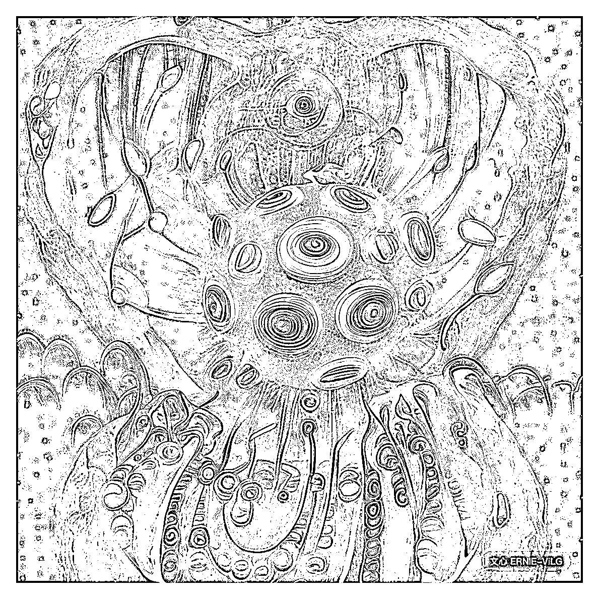

以上描述词在上一篇也讲过，例如：

一个细胞的特写超现代主义插画，新海诚风格，吉田明彦风格，天野喜孝风格，超细节，高清壁纸用中文拆解比用英文要方便一些，然后再翻译成英文输入即可。

在这里分享一篇文心的描述词写法教程：描述词的写法（点击跳转）

其中给出了许多描述词效果、风格词参考、艺术词参考、摄影词参考以及各类技巧，值得大家好好阅读学习。

链接中已经提过的内容不再赘述，补充一些额外的描述词方面的理解，适用于现有的所有 AI 绘画平台。

比起干燥的文字，我们借助一个可视化程度非常高的描述词生成工具来完成后面部分的讲解：描述词生成器（点击跳转）

### 6.3.1 绘画主体

主体也就意味着，它是你想要的核心内容。

比如之前所描述的那样：一个质朴的小屋子；

飞船落在玉米地上；

......

它也可以是：一只戴着墨镜的猫；

特朗普与希拉里在拥抱；

乡间田野的小村庄；

五彩缤纷的花朵；

一个置物架；穿梭的星际宇宙；

......

简而言之，你想要什么画面，这部分属于你的自由发挥区域，天马行空，无拘无束。也是我们普通人最能够进行发挥的地方。

然后我们点开上面提到的这个工具：描述词生成器（点击跳转）

我们在这里填写前文使用过的描述词：质朴小屋子 A rustic little house

最上面一栏，会自动同步更新描述词

2\. 选择最接近你想要画面的场景

接下来会以你的选择给你可视化的示例：

在这之后，如何修饰你想要的画面，这就需要构图语言。

### 6.3.2 构图语言

构图语言分为美术修饰、摄像语言、主色彩、维度、显示器、几何形状、感受、光线、材质、后处理、细节几个大板块。

当然，也还有其他结构，不过，前期这些完全足够。

上面的每个按钮都可以点，点一下，就会放大出现次级选项。

简单介绍一下：美术语言（Art Medium），就是绘画的笔触、应用场景、图画类型等选项；

摄影语言（Camera），就是想象你在拍摄它你是什么角度拍摄，怎么曝光，视角在何处等等；

色彩（Color），画面呈现的色彩，没有什么说的；维度（Dimensionality），2D，3D，4D，5D 这些；

显示器（Display），一些像素语言，可以根据效果选；几何形状（Geometry），顾名思义，就是其中某主体的形状；

感受（Intangibles），这个较为复杂，开心、快乐、郁闷等情感可以是，大、小、胖、瘦，也可以是，风水、矛盾等不可名状的词，都在这里；光线（Lighting），光源的位置以及照射方式；

材质（Material），塑料、金属、大理石、等等；

后处理（Post-processing），对称、折叠、加框、等等，与照片的后期处理类似；增强（Advanced），是丰富细节，还是印象写意。

不懂它们应该怎么选择？

没关系，语言不懂，我们会看啊，只要点开相应的板块，就会有示例图片告诉你它们之间的区别，用眼睛选。

接下来，我会见样选择一个，告诉你一种选择，你当然也可以选择其他的进行组合创造。

美术修饰

① 点开 Art Medium 选项卡

② 选择 “ Print ”（输出形式）→ “ Logo ”，也就是黄色框框处点一下：

③ 这样，它就会消失不见，同时，上方的框框自动出现对应描述词：

④ 并不是一个系列只能选一个，我们还能选其他的，它就会风格杂糅在一起

需要知道一点，这个描述词并非越多越好，当然，也可以自己试验看看效果。

比如这里我们选择了 “ Drawing ”（绘图类型）→ “Illustration ”，就能进一步决定其画面风格：

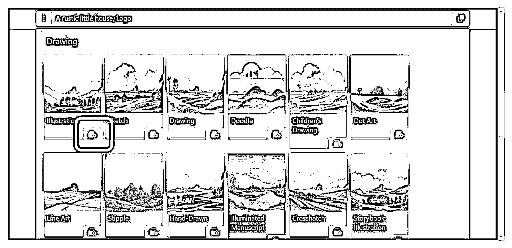

摄影语言同理，选择 “ Camera ” → “ Scenes ” → “ Time-Lapse ”

色彩

同理，选择 “ Color ” → “ Chromatic Palettes ” → “ Polychromatic-Colors ”

维度

选择 “ Dimensionality ” → “ 2D-5D ” → “ 2.5D ”

显示器

选择 “ Display ” → “ Palettes ” → “ HDR ”

遇到不懂的，可以随时查一查啥意思。

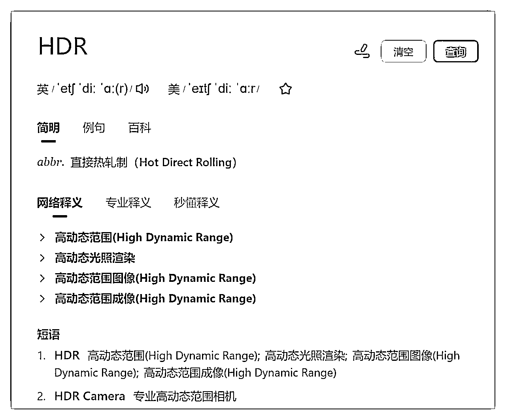

emm......查了也不懂，没关系，这不重要，实在想知道也可以去谷歌再查查。

几何形状

“ Geometry ” → “ Bodies ” → “ Cupola ”:

感受

“ Intangibles ” → “ Concepts ” → “ Refreshing ”:

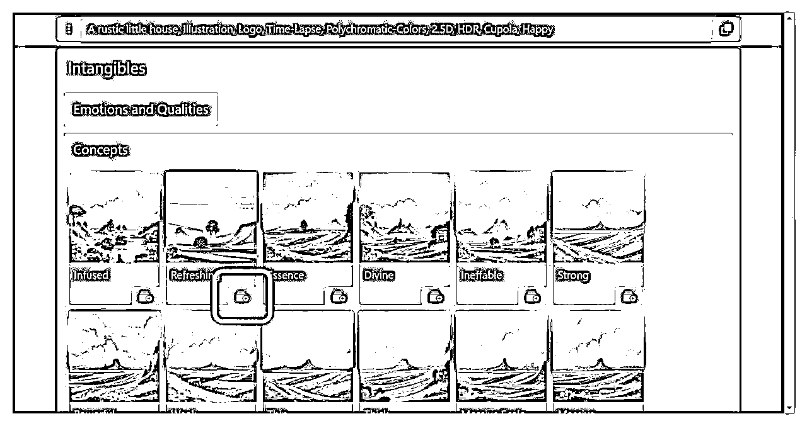

光线

“ Lighting ” → “ Styles ” → “ Soft Lighting ”:

材质“ Material ” → “ Plants ” → “ Acorn ”:

后处理“ Post-processing ” → “ Shaders ” → “ Ray Traced ”:

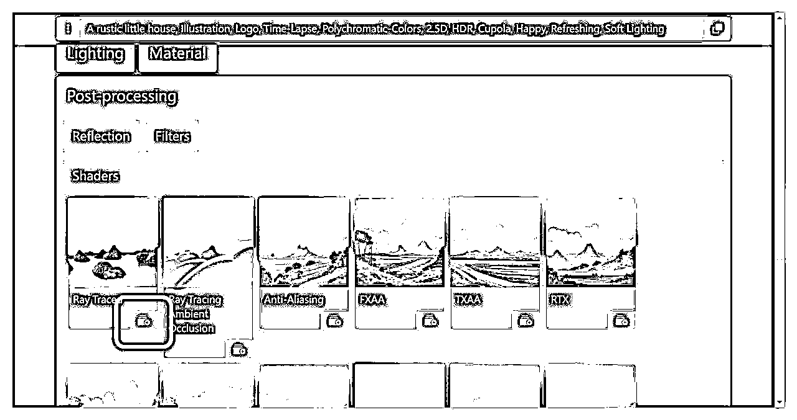

增强

“ Advanced ” → “ detAIled and intricate ”

这个很有意思，选择以后，描述词自动多出来一大堆东西：insanely detAIled and intricate, hypermaximalist, elegant, ornate, hyper realistic, super detAIled

以上逐个选择完毕后，在框框里会自动出现描述词，点右上角的复制按钮即可一键复制。

当然，对选择的不满意，还可以将对应的效果点一下垃圾桶按钮删除，如下图的 “ Cupola ” 效果：

至此，我们将简单的描述词：A rustic little house

转化成了我们想要修图的描述词：A rustic little house, Illustration, Logo, Time-Lapse, Polychromatic-Colors, 2.5D, HDR, Cupola, Happy, Refreshing, Soft Lighting, Acorn, Ray Traced, insanely detAIled and intricate, hypermaximalist, elegant, ornate, hyper realistic, super detAIled

需要很强的英文水平吗，不需要，这些单词都能查。

当然，上述过程只是展示了一遍描述词的组成过程，大家可以根据自己的需求更改自己的需求词。

将上述描述词放入前文提到的三个生成模型中，就能产出自己的 AI 绘图了。

### 6.3.3 画师或整体风格选择

如果上述构图语言全部写完，其实就等于你就是一个固定了风格的画师，但你仍然可以选择画师继续影响你的绘图。

有名气的画师都有一套自己的风格，它们对于色彩、镜头、光影都有自己的一套逻辑。按道理讲，其实写上想要画师的名字，很多语言都不需要写了。

不过，别忘了 AI 是可以整合的，所以，可以用 “ 画师 + 你设置的语言 ” 碰撞的方式看看会出什么样的火花。

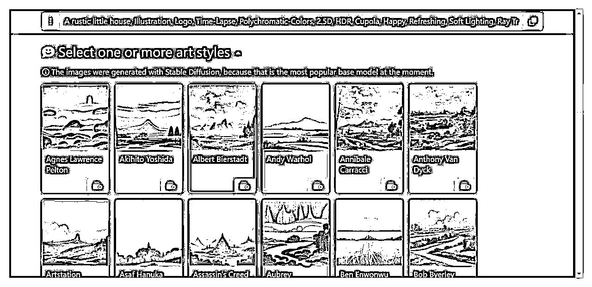

操作也很简单，描述词中加一个 “ by XXX ” 即可。

我还是比较喜欢宫崎骏和新海诚，因此，之前的描述词最终成型：

A rustic little house, Illustration, Logo, Time-Lapse, Polychromatic-Colors, 2.5D, HDR, Cupola, Happy, Refreshing, Soft Lighting, Acorn, Ray Traced, insanely detAIled and intricate, hypermaximalist, elegant, ornate, hyper realistic, super detAIled, by Miyazaki Hayao and Makoto ShinkAI 翻译一下：

一个质朴的小房子，插画，logo，延时摄影，多色彩，2.5D， HDR，圆屋顶，快乐，清爽，柔和的光线，橡子材质，射线追踪，疯狂的细节，复杂，超大主义，优雅，华丽，超现实，超细节，宫崎骏和新海诚风格

对比一下最初的图：

哈哈，兜兜转转，还是最初的小房子更质朴，但改了之后的小房子变得更炫技和华丽了。

不过这也难怪，之前的词都是为了演示所以随机选的。像多色彩、华丽、等词语对质朴这个概念是有害的，可以删去之后再看看效果如何，有兴趣的伙伴可以尝试一下。

比如我们去除了 “ 多色彩（Polychromatic-Colors） ” 、“ 华丽（ornate） ” 两个词语，果然质朴多了。

与最初的图相比，画质、精细度也有了很明显的提升。

描述词如下：

A rustic little house, Illustration, Logo, Time-Lapse, 2.5D, HDR, Cupola, Happy, Refreshing, Soft Lighting, Acorn, Ray Traced, insanely detAIled and intricate, hypermaximalist, elegant, hyper realistic, super detAIled, by Miyazaki Hayao andMakoto ShinkAI

前期，我们对标优质描述词作修改。

现在，我们可以自己生成好描述词，并在自己的基础上作修改了，多试试，多改改，你也可以达到进阶水平。

### 6.3.4 用 ChatGPT 写描述词

ChatGPT 在 AI 绘画的领域表现的也不错，因为它数据量庞大，可以学习但想象力不受限制的特点，在提供描述词这方面可以给我们很大的帮助。

这里主要讲一讲 ChatGPT 在两个 AI 绘画工具上的使用方式，分别是 MJ 和 Stable Diffusion。在图片创作中，调教 ChatGPT 主要用到的方法有：喂数据法

充当法充当提词器并激发想像（开盲盒）

只改动部分提示内容

帮助完成元素组成详情👉【5 月航海 | ChatGPT 自媒体提效 | 实战手册：7.2 图片创作】

### 6.3.5 描述词词库

获取关键词的途径有很多，你可以花钱买（花多少就看个人了），也可以通过各途径搜索，网上存在大量免费的关键词网站，比如，

MidJourney 词库：https://www.midlibrary.io/styles

https://lib.kalos.art/

Stable diffuision 词库：https://lexica.art/?continueFlag=7aff77349db15b85171d200cab31b8cb

一些付费的关键词词库：https://www.MidJourney.com/app/feed/（MidJourney 付费用户可查看）

并且，大量 AI 出图网站基本都会有一个自己的画廊，你也可以在画廊中看到各图片的关键词。

除以上外，我们还整理了一批 AI 绘图热度关键词供大家参考：1）炫彩模型关键词（点击下述链接即可跳转）

炫彩关键词 1（图文）

炫彩关键词 2（图文）

炫彩关键词 3（图文）

炫彩关键词 4（图文）

炫彩关键词 5（图文）

炫彩关键词 6（图文）

炫彩关键词 7（图文）

炫彩关键词 8（图文）

炫彩关键词 9（图文）

2）Disco Diffusion 模型关键词（点击下述链接即可跳转）

DD 关键词 1（图文）

DD 关键词 2（图文）

DD 关键词 3（图文）

DD 关键词 4（图文）

DD 关键词 5（图文）

DD 关键词 6（图文）

3）动物写实关键词（点击下述链接即可跳转）

动物写实 1（图文）

动物写实 2（图文）

动物写实 3（图文）

4）二次元类目关键词（点击下述链接即可跳转）

二次元词组分享

二次元（图文）

5）婚纱礼服关键词（点击下述链接即可跳转）

婚纱 1（图文）

婚纱 2（图文）

婚纱 3（图文）

婚纱 4（图文）

婚纱 5（图文）

婚纱 6（图文）

6）抖音爆款关键词（点击下述链接即可跳转）

抖音爆款 1（图文）

快手爆款 1（图文）

7）人物关键词（点击下述链接即可跳转）

人物关键词（图文）

8）祈福关键词（点击下述链接即可跳转）

祈福关键词（图文）

9）十二生肖关键词（点击下述链接即可跳转）

发财系列（图文）

功夫系列 （图文）

汉服系列（图文）

铠甲系列（图文）

唐装系列（图文）

10）AI 绘图热度关键词（点击下述链接即可跳转）

200 个热度关键词

注意，由于模型的更改，现在 MidJourney 目前是 v4 模型，关键词的重要性降低，简单的词汇就会有很不错的效果，所以大家也不要局限于关键词，而上述关键词基本为旧版本的 v3 关键词，由于模型差异，词与效果会有差异，但仍然可以作为参考。

艺术家及艺术风格的选择可参考该文档：画了个画中的艺术家作品和艺术风格.docx

# 七、检测 AI 绘图能力 @二三 🔥

想要知道自己 AI 绘图学得怎么样，最快的办法就是将图片发出来，尤其是发在小红书、抖音等公域平台，看看大家的评价和总体数据表现。

加上 8 月航海，AI 绘画已经开过 4 期航海，部分船员已经将学习到的技术应用于实践，在各个公域平台取得了不错的数据，其中小红书更是大家的必去之地。

本章节的第一部分，我们提供了 AI 绘画自检的基础标准，大家可以对照查看自己是否具备基础的出图能力；如果已经完成出图，建议大家跟随「章节 7.2」的脚步，尝试在小红书发出自己的成图，看看数据反馈。

🔥本章节的动作可以视做本次航海的重点动作，希望大家勇敢迈出这一步，从自媒体渠道获取反馈。

为了降低大家的行动门槛，我们也为大家提供了一批小红书模板，选择自己喜欢的模板试试水吧～7.1 AI 绘图能力自检

如何检验自己是否具备 AI 绘图能力呢？很简单，看看自己是否掌握基本出图方式，进行实际操作，做出几张精美图片或爆款图片。

检验新手达标的标准：

给你一段文字，能把它变成一张图片可以分析字词作用，作局部替换更改（比如小狗换成小猫）

能用主流软件的基础按钮进行图片的修整或重塑

尝试使用前文所述的平台，结合你习得的描述词的写法，创作并优化你的 AI 图片吧。

## 7.2 发布 AI 成图，检验绘图质量

发图首选哪个平台呢？小红书。

目前小红书的社区氛围与用户需求，与 AI 绘图的契合度是比较高的，圈友们的账号数据也佐证了这一点。当然，学习了如何在小红书发布 AI 绘图后，你也可以把作品同步到其他平台，比如：在知乎发头像壁纸

在抖音发图文视频

……

在小红书发布笔记的第一步，你需要有一个能正常运行的小红书账号，具体教程可参考「8 月航海｜小红书运营｜实战手册」：章节二、搭建小红书账号

拥有账号后，如何将自己的 AI 图片发布为笔记呢？与一些圈友们沟通过后，我们了解到，目前在小红书发布 AI 绘图其实没有很固定统一的公式（这也意味着，现在的 AI 绘画还没进入到规模化阶段，对于大家来说，是依然有机会入局的时间段）。

但为了降低大家的行动成本，我们还是参考目前小红书上比较热门的 AI 绘图笔记，为大家总结了一些可参考的小红书笔记格式。大家可以按需选择。

如果你已经有自己想要学习的对标账号，也可以直接模仿对标账号的风格与格式发布小红书笔记，一切辅助都是为了更好地帮你踏出第一步。

### 7.2.1 记录型/日记型

这一类笔记的特征为：

在标题中会写明「每日一画画」「每日练习」等，表示自己发布的笔记就是日常练习而已。对于没有什么明确主题，只想每天发发图片做练习的朋友来说，是比较合适的，门槛较低。

但是相对的，该类笔记数据随机性很大，有点赞数大几千的，也有浏览量低于 50 的。

举例：

标题格式参考：

每日一画画｜主标题 AIGC｜第 1 天出图练习

「每日练习」+主标题拒绝摆烂｜AI 绘画练习打卡 Day1

Midjourney 每日练习（一）

正文格式参考：方法一：对画面的简单描述即可，或与画面有关的简单段子

方法二：给出图片的描述词，简单记录自己的创作思路方法三：如果不知道写什么，不写都行

示例：

标题：每日一画画｜MJ 做的乌梅子酱面包🍞

正文：midjourney 做的果酱面包，怎么吃都不会胖

### 7.2.2 提示词型/咒语型

这一类笔记的特征为：

在标题中会说明有描述词分享，比如「prompt 分享」「AI 附咒语」等。笔记正文中，也会附上该图片的具体描述词。如果大家选择发布这类笔记，只需要在发笔记时将自己的提示词写上即可，门槛同样不高。

一般来说，包含提示词教程的笔记跟上一类绘图练习的笔记相比，点赞和收藏数据会更高。你的图越漂亮，大家越想跟着学。

举例：

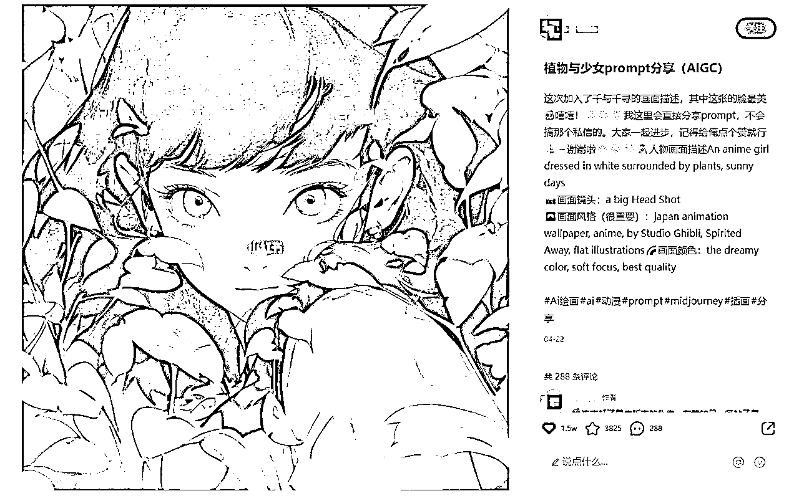

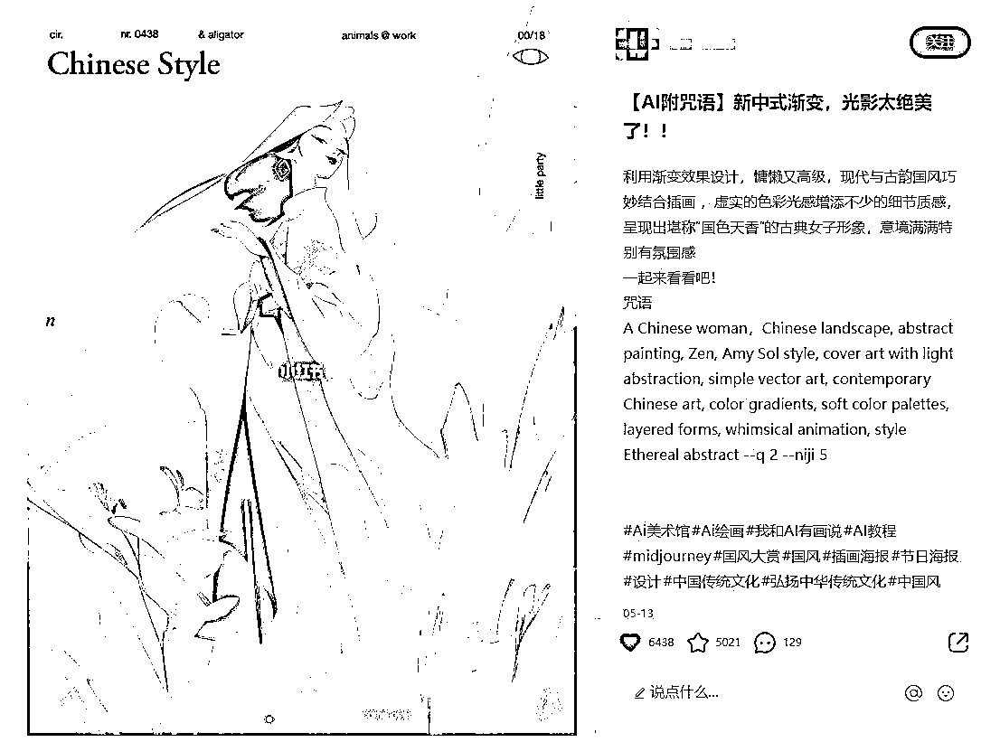

标题格式参考：

图片简单描述｜prompt 分享

【AI 附咒语】+简单画面描述图片简单描述｜咒语分享｜附教程

AIGC｜找到了特别好用的咒语咒语直出，拿来即用🔥+画面简单描述

正文内容参考：

方法一：给出正反描述词，简单说明自己的思路方法二： 给出使用的绘图模型，简单说明自己的思路

方法三：把描述词拆开分析，从人物画面描述、画面镜头、画面风格、画面颜色等角度解析该描述词的构成上述三种正文内容的写法也可以交叉使用，具体看你的描述词长什么样，以及你能够对描述词分析到什么程度。如果暂时分析不出描述词的具体构成，直接把描述词放上去也是可以的。

示例：

标题：植物与少女 prompt 分享（AIGC）

正文：

这次加入了千与千寻的画面描述，其中这张的脸最美，嘻嘻！

🌟🌟🌟我这里会直接分享 prompt，大家一起进步，记得给俺点个赞就行👍～谢谢啦🌟🌟🌟

🎨人物画面描述 An anime girl dressed in white surrounded by plants， sunny days📷画面镜头：a big Head Shot🌄画面风格（很重要）：japan animation wallpaper， anime， by Studio Ghibli， Spirited Away， flat illustrations🌈画面颜色：the dreamy color， soft focus， best quality

### 7.2.3 需求解决型（如头像壁纸）

这一类笔记的特征为：

看准某一类用户需求，制作对应的图片并发布笔记。常见的有头像、壁纸、海报、人设图等，其中头像和壁纸是大家最常选择的类型，出图方便且需求人数多。

这类笔记对 AI 成图要求会稍高一点，因为大部分头像还是需要有主体人物，甚至闺蜜头像或情侣头像需要保留相似元素。越好看的越符合用户审美的图片和笔记，数据会更高，目前小红书中不乏点赞收藏上万的头像笔记。

但是大家不用太担心，如果不知道自己出的图好不好看，直接发出去，数据会告诉你答案。后续如果账号能渐渐做起来，大家还能直接实现引流或头像定制赚钱。

举例：

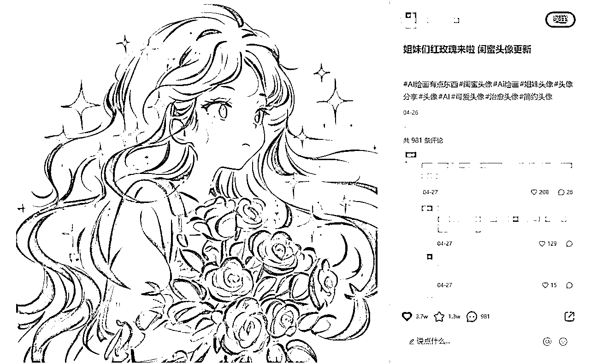

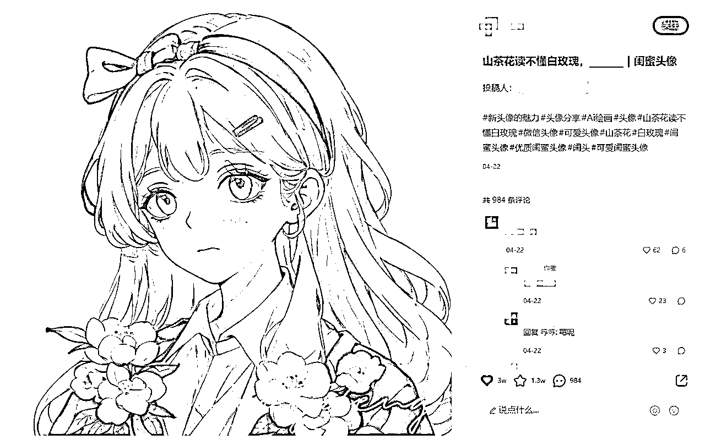

标题格式参考：

简单描述画面主题或画风｜闺蜜头像（同理可以替换为情侣头像/xx 风格头像/壁纸……）

今天发一组 xxxx（简单描述画面主题或画风）的头像/壁纸

头像/壁纸｜简单描述画面主题或画风

女生头像｜漫画蓝色系（适合发布一个系列的头像组图时使用）

适合 xxx（具体人群）用的 xxx（风格）头像

头像合集｜简单描述画面主题或画风简单描述画面主题｜头像可随意取

……

正文内容参考：方法一：简单描绘图片内容或风格

方法二：发一些符合图片风格、能提供一些情绪的的文艺短句，如：街边的玫瑰开了，是蝴蝶的浪漫方法三：结合当下热门网络用语，简单玩梗，如：找不到喜欢的头像？无所谓，我会出手

方法四：简单说明自己的出图过程，含一些简单教程分享

方法五：什么都不写，放上图片和标题，打上标签直接发示例：

标题：清冷气质女头｜听说美女都用这些头像

正文：

←←←左滑看两种风格对比🌟后面的图使用了[flat illustration 扁平插画]出图🌟

🌟再用 sd 对面部做加工提升精致感🌟

末尾有两组🆚对比

虽是 AI 绘画，仍需一定时间精力脑力探索您的❤️⭐️以及留言，是对每个博主最大的鼓励！

小红书头像号已经存在非常久，在 AI 绘画出现前，就已经有很多成熟的头像号、壁纸号。如果实在不知道怎么发布头像类笔记，直接小红书搜索关键词，例如「头像」「AI 头像」，就能获得更多参考答案。

### 7.2.4 系列连载型

这一类笔记的特征为：

会围绕一个主题进行做连载笔记，在标题上有很明显的连载特色和相似性，部分标题上会标明序号，笔记图片也大多同一个风举例：

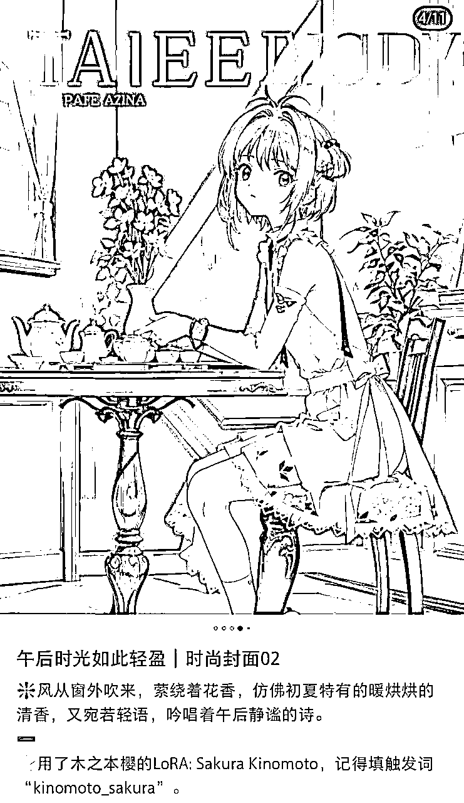

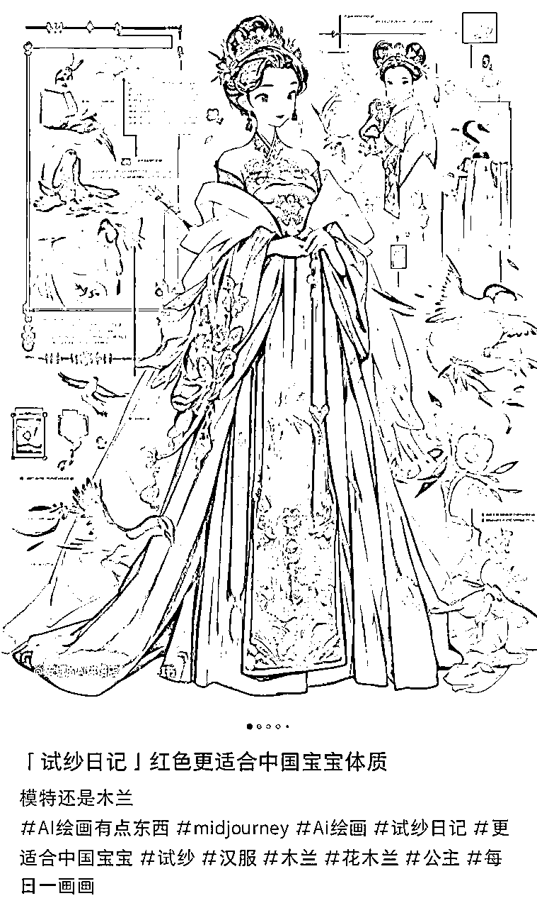

标题格式参考：

「系列连载名」+主标题，如，「试纱日记」红色更适合中国宝宝体质主标题｜系列连载名+数字序号，如，时光如此轻盈｜时尚封面 02

第 x 集+连载名｜主标题，如，第 9 集旧漫头像｜哪位集美要的黑色系

连载名+第 x 弹，如，搞怪可爱头像第三弹来喽～连载名+vol.x｜主标题，如，艺术家和猫 vol.49｜st.aftercigs

正文内容参考：

对画面内容做简单补充即可，也可以附上你的描述词，哪怕都不写也行。

示例：

标题：午后时光如此轻盈｜时尚封面 01

正文：

⭐️风从窗外吹来。萦绕着花香，仿佛初夏特有的暖烘烘的清香，又宛若轻语，吟唱着午后静谧的诗✅kinomoto_sakura, girly style, lace dresses, pastel colors,floral prints, high-wAIsted sskirts, ballet flats, delicate accessories, cafe, indoors, hiigh tea, sit down, table,a young beautiful girl, greein eyes, brown short hAIr, ulttra detAIled, official art, unity 8k wallpaper, (fashion magJazinecover:1.3), masterpiece, besst quality,

### 7.2.5 追热点型（如热门影视剧）

这一类笔记的特征为：

题材紧跟当时的热门影视剧或话题，比如电影《芭比》、电视剧《长相思》、多巴胺配色等，出图类型一般有头像、壁纸、人设图、CP 图、3D 手办模型等。

发布这类笔记的优势是，能够紧跟当下热门话题，吸引许多剧粉等关注你的笔记，并收藏点赞。但门槛也相对较高，需要你对热门话题或影视剧有一定基础了解，且能够按照理解调教出适合的 AI 图片。

举例：

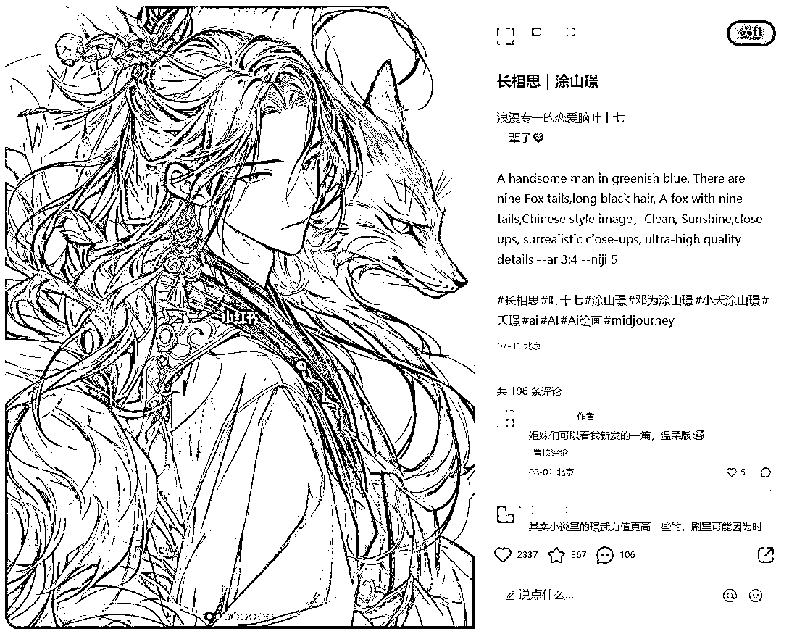

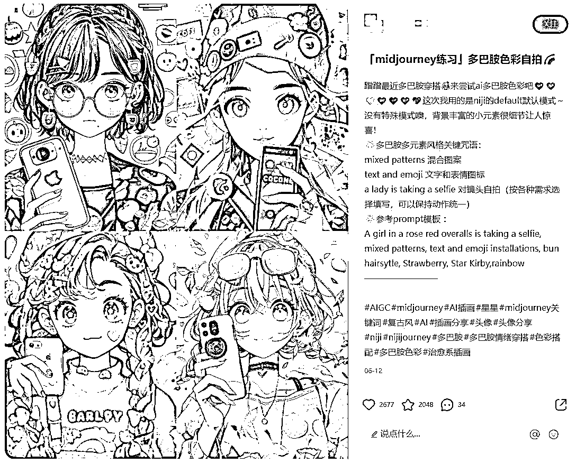

标题格式参考：热门剧目或话题名+简单描述图片内容或风格

追热门型的 AI 绘画笔记，标题上没有太多固定的参考格式，大家结合热门话题、剧名、角色名的关键词来取标题即可。如果还是没有思路，可以直接在小红书、微博等地搜索该热点词，看看大家有哪些在讨论该热点时有哪些常用的表述或话题，然后以此进行 AI 绘画的创作思路，并写进标题中即可。

正文内容参考：

方法一：简单发表对该热点话题、热门剧目、热门角色看法，适当引起讨论方法二：用该热门剧目的经典台词，或热点话题的核心观点

方法三：简单描述图片内容方法四：可以附上 AI 出图的模型与描述词等

示例：

标题：「midjourney 练习」多巴胺色彩自拍🌈

正文：

蹭蹭最近多巴胺穿搭来尝试 AI 多巴胺色彩吧❤️🧡💛💚💙💜💖这次我用的是 niji 的 default 默认模式～没有特殊模式噢，背景丰富的小元素很细节让人惊喜！🌟多巴胺多元素风格关键咒语：mixed patterns 混合图案 text and emoji 文字和表情图标 a lady is taking a selfie 对镜头自拍（按各种需求选择填写，可以保持动作统一）🌟参考 prompt 模板 ：A girl in a rose red overalls is taking a selfie， mixed patterns， text and emoji installations， bun hAIrsytle， Strawberry， Star Kirby，rAInbow————————

### 7.2.6 对号入座型（如星座拟人图）

这一类笔记的特征为：

与星座、16 型人格、生肖的强结合，AI 出图基本都围绕这 3 个主题。比如星座主题的拟人头像、美图、壁纸等，同理也能换成 16 型人格和生肖。

这类笔记的优势在于，能吸引大家点进笔记查看，自己对应的图片长什么样，提升笔记浏览量，如果符合用户心意，还能增加点赞与收藏数据。

但门槛在于，需要大家有相对稳定的模型或描述词，保持出图为一个画风或相似画风，否则看起来会缺乏关联性。

举例：

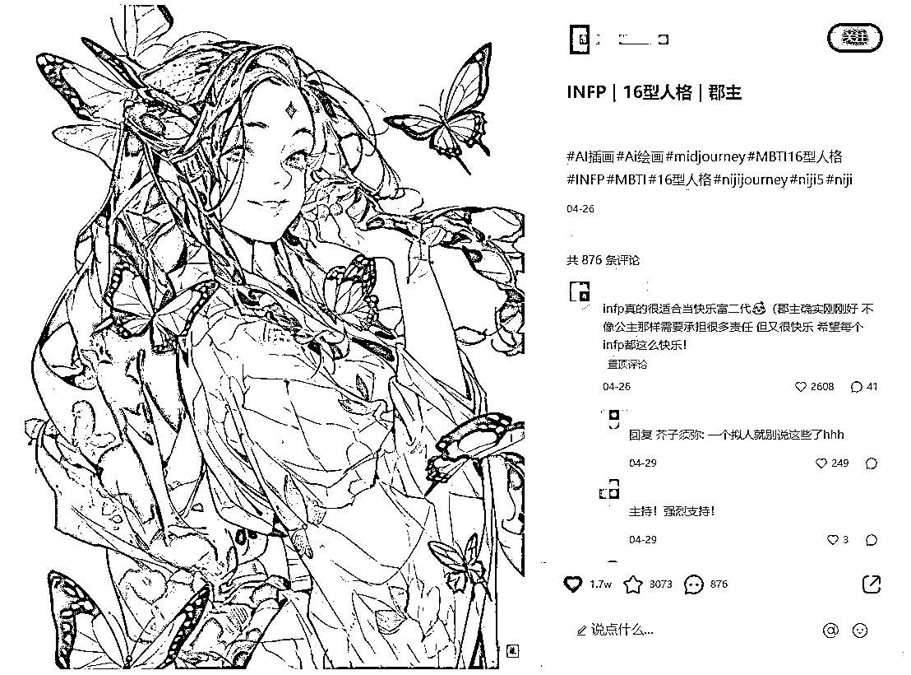

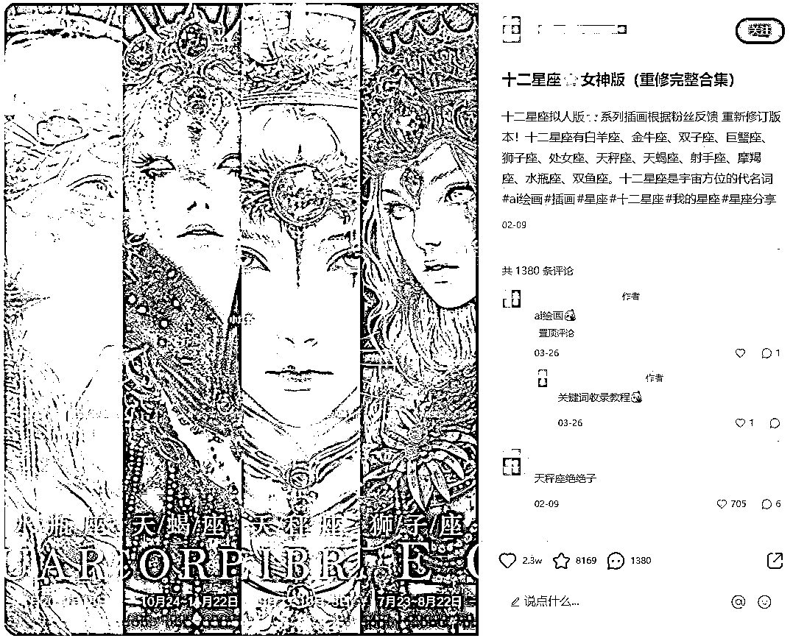

标题格式参考：十二星座合集｜简单说明自己风格或主题

十二星座｜具体某几个星座｜简单说明自己风格或主题

当十二星座遇上 xxx（你的创作主题，如水墨画、动漫风等）

以上格式中的「十二星座」均可替换成「16 型人格」或「十二生肖」

正文内容参考：方法一：简单描述图片风格或创作思路

方法二：可以附上 AI 出图的模型与描述词等

方法三：提问大家最喜欢哪个星座/16 型人格/生肖的图片？或者提问大家是哪个星座/16 型人格/生肖？

方法四：描写一些各星座/16 型人格/生肖的人群特征，这些信息可以百度搜索

什么都不写也可以，对正文的内容要求不高示例：

标题：十二星座公主和骑士（大合集）

正文：

做骑士的时候有边做边考虑跟公主的 cp 感，发完骑士合集突然灵机一动，把公主跟骑士拼到一起，感觉效果也不错～～全靠公主们颜值撑着哈哈哈十二星座看的是出生那年的阳历，按小时划分的，每年会有变动的哦～以下是我查到的详细划分：白羊座♈Aries，约 3 月 21 日 07:21-4 月 20 日 18:17，积极、自信、好胜，火象星座金牛座♉Taurus，约 4 月 20 日 18:17-5 月 21 日 17:21，踏实、坚定、耐心，土象星座

……

特殊点：

大部分该类笔记的封面上，会写明图片与星座/16 型人格/生肖的对应关系，并将几张图片做成一个合集型封面，且不展示清晰原图，以此吸引大家点进笔记，大家在封面时可以参考这种技巧；具体到每张图片上，也需要标明对应哪个星座/16 型人格/生肖；

比如：

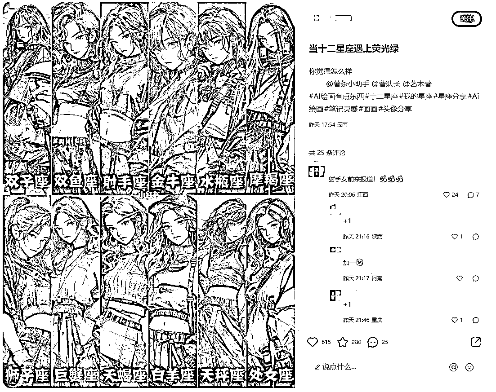

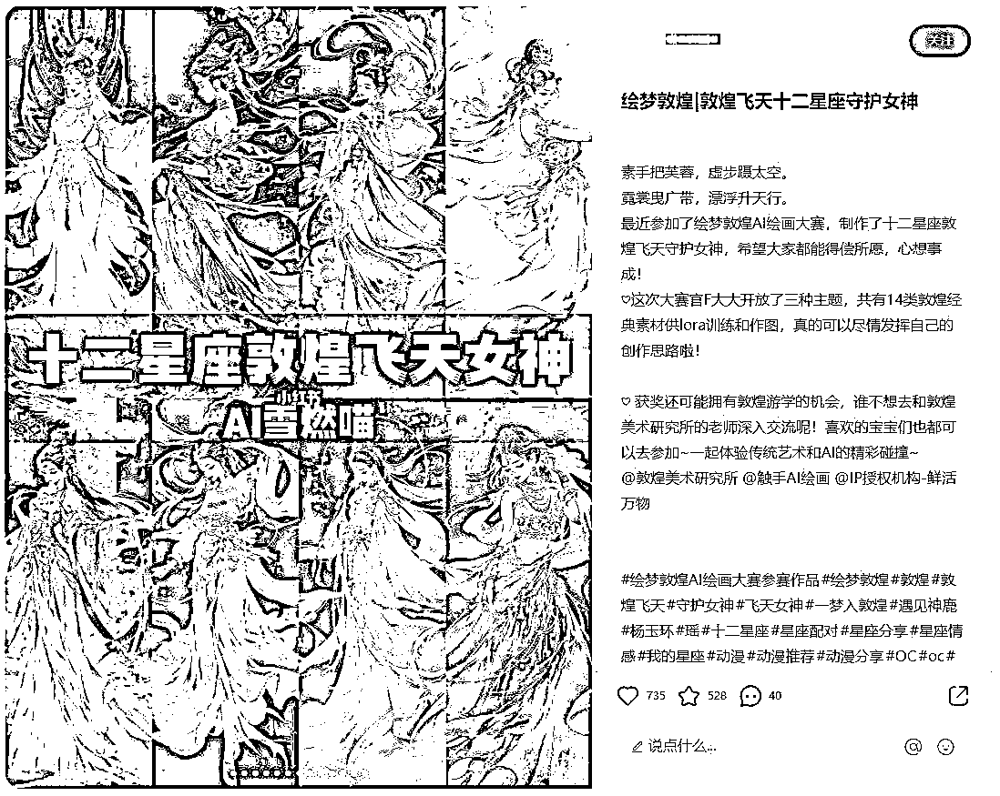

### 7.2.7 直白描述型

这一类笔记的特征为：

直白，图片是什么就说什么，主打一个随性，所以也很适合大家练手时随手发。

但难点也是在于随性，如果不知道发什么，反而会阻挡部分朋友发笔记的脚步。所以这种类型放在最后来谈，也是希望大家可以优先尝试前 6 种笔记类型。

举例：

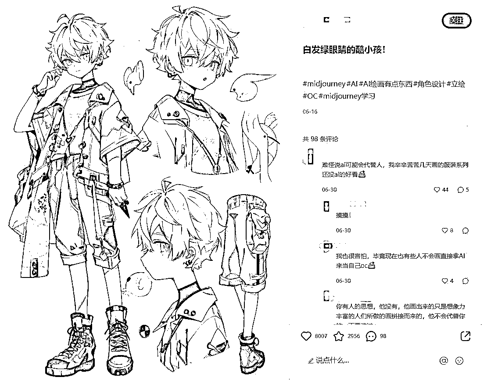

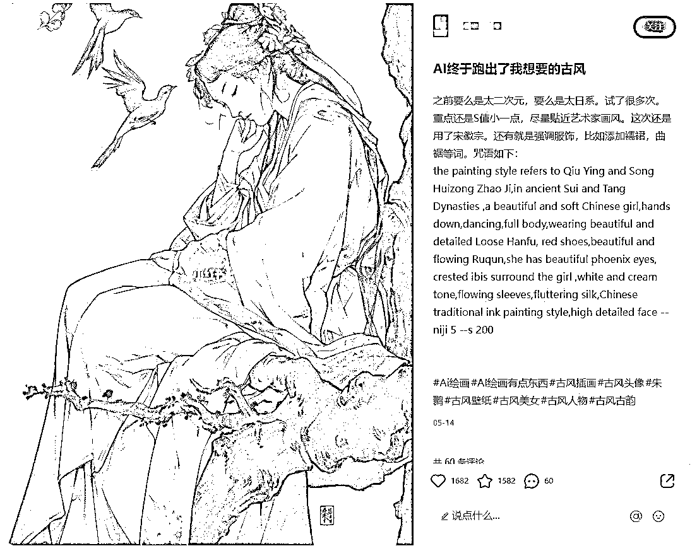

这类笔记本身就很随性特殊，标题和内容可以直接按创作者的想法来写，大部分情况下，大家可以根据具体画面，想写什么写什么。

或者在正文里，大家可以概述一下自己的创作思路与描述词等。

如果没有思路，可以多看看小红书的对标账号，这里我们也给大家找到一些参考：

直白描述画面是什么，如，白发绿眼睛的酷小孩

AI 终于 xxxx，如，AI 终于跑出了我想要的古风当我把 xx 丢给 AI，如，当我把草图丢给 AI

AI 绘画｜简单描述画面内容，如，AI 绘画｜这样的古风插画好绝啊示例：

标题：AI 终于跑出了我想要的古风

正文：

之前要么是太二次元，要么是太日系。试了很多次。重点还是 S 值小一点，尽量贴近艺术家画风。这次还是用了宋徽宗。还有就是强调服饰，比如添加襦裙，曲裾等词。

咒语如下：the pAInting style refers to Qiu Ying and Song Huizong Zhao Ji，in ancient Sui and Tang Dynasties ，a beautiful and soft Chinese girl，hands down，dancing，full body，wearing beautiful and detAIled Loose Hanfu， red shoes，beautiful and flowing Ruqun，she has beautiful phoenix eyes， crested ibis surround the girl ，white and cream tone，flowing sleeves，fluttering silk，Chinese traditional ink pAInting style，high detAIled face --niji 5 --s 200

### 7.2.8 【通用模块】如何打标签

如果大家在发布笔记时不知道如何打标签，可以参考以下我们为你整理的内容。

通用标签：

#AI #AI #AI 绘画有点东西 #壁纸 #创作灵感 #AI 绘画 #AIGC #构图 #技巧 #场景 #插画 #分享 #动漫 #每日一画画 #每日练习 #AI 美术馆 #我和 AI 有画说 #插画海报 #设计根据绘图类型和主题，可以再选择以下合适的标签：

#极简美学#节日海报

#厚涂 #立绘 #OC #角色设计

#国风大赏 #国风 #中国风 #古风插画 #古风头像 #古风壁纸 #古风美女#闺蜜头像 #姐妹头像 #头像分享 #头像 #可爱头像 #治愈头像 #简约头像 #情侣头像 #新头像的魅力 #微信头像 #优质闺蜜头像 #闺头

#十二星座 #我的星座 #星座 #星座分享#MBTI16 型人格 #MBTI #16 型人格

……更多主题，可以寻找对标账号并模仿根据不同创作工具，可以再选择以下合适的标签：

#stablediffusion #midjourney #midjourney 学习 #sd

如果你的笔记给了描述词，可以添加：

#提示词 #prompt #AI 教程如果笔记内容紧跟热点，还可以打上该热点话题、热门剧目、角色名称等标签，如：

#多巴胺 #多巴胺色彩 #长相思 #涂山璟 #长风渡……更多热点标签，可以寻找对标账号并模仿。

## 7.3 总结：先尝试，再优化

通过了解上述笔记类型，大家可以发现，AI 绘画笔记的正文内容的要求非常低，甚至几乎可以没有。你可以描述你的画面，可以给描述词，也可以干脆什么都不写，所以大家不必害怕发笔记。

只要标题有一定指向性，配上适合的标签，再放上你的 AI 图片即可。

当然，上述风格与笔记类型也可以融汇贯通。

比如本质上你的笔记内容是头像，也可以在文案中附上你的提示词，并在标题中写上“附 AI 咒语”等字样。大家不必限制自己非要一直发某一类型的笔记，尝试更多可能，也能帮助你打开思路，了解用户更喜欢什么。

如果笔记数据没什么起色，一方面，大家需要优化自己的 AI 绘图，提升图片整体质量；

另一方面，大家也可以结合小红书运营思路进行调整，想了解更多小红书运营的具体思路与细节，可以查看👉「8 月航海｜小红书运营｜实战手册」。

如果发布一段时间的笔记后，平台给了你正向的数据反馈，你也对用户喜好有了一定了解，可以逐渐保留风格与特色，尝试将账号与笔记数据做的更好，以此探索更多变现可能。

本手册【下篇：AI 绘画的应用与变现】，围绕目前热门的 AI 绘画+各行各业赛道做了一些讨论与展望，大家也可以尝试从其中找到适合自己深耕的赛道。

或者可以尝试用 AI 绘画结合自身行业，探索更多变式与玩法。

# 下篇：AI 绘画的应用与变现

💡

篇章概要 AI 绘画发展到现在，已经诞生出许多应用方向与场景，根据了解，我们整理出 13 个讨论热度高、相对高频、实用的 AI 绘画应用方向，并已整理相关资料，或邀请已经在 AI 绘画领域深耕的老师们为大家描绘了玩法：

✅AI 绘画+艺术二维码

✅AI 绘画+四维彩超

✅AI 绘画+动态视频

✅AI 绘画+包装领域

✅AI 绘画+插画设计

✅AI 绘画+电商领域

✅AI 绘画+IP 定制

✅AI 绘画+LOGO 设计

✅AI 绘画+产品定制

✅AI 绘画+头像壁纸

✅AI 绘画+室内装饰

✅AI 绘画+美甲设计

✅AI 绘画+摄影照片生成

在【二十一、更多 AI 绘画应用思路】，我们给出了更多正在发展中但新颖有趣的 AI 绘画应用思路，你可以从中发现更多方向，或许某个玩法就能让你灵光一现。

本下篇的核心目的，是希望大家们看到对应场景下的内容后，能够了解 AI 如何在对应场景发挥作用，并逐渐开始自己尝试～比如 AI 绘画+包装，希望大家看完后，能知道如何用 AI 绘画进行包装相关的创作，辅助提高生产力或完成变现。

需要注意的是，受限于目前的发展，部分玩法已有成功案例，大家可以参考学习，但仍有许多玩法仍在探索期，如果愿意钻研，你可能就是第一匹跑出来的黑马。

期待能跟大家一起在新领域碰撞出新火花。

# 八、AI 绘画如何应用于艺术二维码 @明月 @重庆-羊羊羊🔥

## 8.1 玩法介绍

艺术二维码最近有多火就不多说了，给大家放一些图看一下：

如何生成上述二维码呢？今年 6 月，生财有术邀请圈友@重庆-美羊羊老师 为出过一版「艺术二维码」视频教程，大家可以跟着视频学习👉《如何生成精美又能赚钱的艺术二维码》@重庆-羊羊羊

如果你想要追寻更高难度，可以参考下文 @明月老师的技术向文字版教程。

以下是@明月老师 的深度研究成果：

这些二维码都可以使用微信直接识别出来，而且是通过 SD 文生图直接生成的。

做到这种程度，艺术性和实用性达到了一定的平衡，但想要产出类似图片，建议先学习前文的 SD 教程👉

【五、学会用 Stable Diffusion 完成 AI 绘画】学会出图后，你可以

自己定制属于自己 IP 的艺术二维码引流，预防平台检测

AI 艺术二维码小程序挂流量主与各种品牌合作，植入广告推广变现

可以做成各种周边衍生品，比如包包、纸杯、雨伞等一对一私人定制艺术二维码，与设计师合作开店

制作课程售卖

为模板二维码的小程序、商家提供具有艺术特色的二维码稿件......还有很多变现方向待挖掘

## 8.2 如何生成高质量艺术二维码

以下面图为例，我们来一步一步拆解这张图是怎么做出来，每个参数起到的是什么作用：

二维码参数

遇到图片二维码可以用草料二维码进行解析，得出来二维码链接之后可以进行下一步操作。

按理说，链接越短，出来的二维码像素点就越少，也就更好识别，容错率更低。

这一步可以优化使用短连接，效果会更好，但是不优化也可以，我用的是最复杂的方法，容错率最高。

按理说，链接越短，出来的二维码像素点就越少，也就更好识别，容错率更低。这一步可以优化使用短连接，效果会更好，但是不优化也可以，我用的是最复杂的方法，容错率最高。

反色（即图中的倒置）开启不开启都可以，看自己想要什么风格，想要明亮一点的画面就不启用反色，反之，想要暗一点的画面就开启反色。

不同参数的二维码出来的图形也有一定差异，如下图（来自安东尼大佬）：

二维码样式

不同的二维码样式出来的效果也不同，如上图（来自安东尼大佬）。

正面提示词

1girl， solo ，（flower:1.3） ， long skirt， dark background， long white hair ， angel， backlighting， Dark background， ，正面提示词这块可以加上，Ribbons， feathers， birds， flowers， lace， snowflakes， waves， leaves， architecture，hair 等提示词，可以让二维码融合的更好，更具有美感，一次性加上其中一种元素即可。

百花酿的 lora 作用也是让画面中增加更多花朵元素，同理，如果有其他元素的 lora 也可以添加进去。

负面提示词

nsfw, paintings, sketches, (worst quality:2), (low quality:2), (normal quality:2), lowres, nsfw,(worst quality:1.4), (low quality:1.4), (normal quality:1.4), ng deepnegative _v175t,text,logo,watermark,signature, bad_prompt_version2-neg, badhandv4, By bad artist -neg, verybadimagenegative_v1.3,负面提示词是通用负面提示词，没什么好讲的。

唯一要提的是里面用到了很多 Embedding 嵌入型模型，bad_prompt_version2-neg， badhandv4， By bad artist -neg， verybadimagenegative_v1.3，这些全部都是，如果你没有下载这些模型，单单使用这些提示词是不起作用的。

尺寸

Size: 880x880

尺寸不建议超过 10241024，因为会额外出现很多额外的，令人意想不到的内容。

尺寸也不建议使用 512512，因为大多模型用这个尺寸出来的图像细节方面都不尽人意。

768*768 倒是个不错的选择，后期可以通过高清修复进行放大。

模型 Model hash: cbfba64e66， Model: 动漫插画小清新 CounterfeitV30_v30，

模型这块可以多尝试一下不同类型的模型，个人测试下来，动漫模型都有较不错的效果。

控制器 1ControlNet 1: "preprocessor: tile_resample, model: control_v11f1e_sd15_tile [a371b31b]

第一个模型使用的是 tile 模型，目的是在画面生成的过程中控制生成的前一部分，以免让算法随意发挥。

简单的做个比喻，如果你想要一棵树木按照自己的想法生长就要在不同的成长阶段进行修剪。

现在我们的目的也是一样的，我想让生成出来的图像按照我们预想的方向发展，那我们就要对其进行控制。

tile 模型的作用很多，可以在图像放大的过程中增加一定的细节，也可以很好的控制图像的形状。在这里也可以使用 Brightness 模型进行控制，但是我使用下来感觉 tile 效果更好一些。

控制器 1 权重

weight: 0.4tile 模型在生图过程中起到的作用太过明显，需要把权重降低，避免对画面起到太过明显的作用。

控制器 1 起始时间

starting/ending: (0, 0.25)

这个就对应了小树苗的不同生长阶段，也就是生图的前 1/4 阶段，这块至关重要。

不一定要从生图开始阶段就介入控制，可以自行把控。开始时间 0-0.1 都可以，结束时间 0.2-0.3 都可以。这个控制范围尽量控制在 0-0.3 之间。

需要给到另一个控制器一定的发挥空间。

控制器 2ControlNet 0: "preprocessor: inpaint_global_harmonious, model: control_v1p_sd15_qrcode_monster [a6e58995]

另一个模型就相当重要了，生图的大多数时间都要用这个模型进行控制。

qrcode_monster 模型可以让二维码发生更加自然的变化。

控制器 2 权重

weight: 1.6

与 tile 模型不同，使用 qrcode_monster 模型需要更加高的权重才能发挥出更好的效果。如下图 qrcode_monster 模型在不同权

权重越低，图片中的二维码越难扫描出来，权重越高，图片中的二维码越容易扫描出来。

同样的，低权重下的图片美感更强，高权重下美感更弱。

控制器 2 起始时间

starting/ending: (0.25, 1)

前部分已经用其他模型进行控制了，那么后半部分就需要用 qrcode_monster 模型进行控制了。

如果想让算法有自由发挥的空间。介入时间可以控制在 0.25-0.4 之间，超过 0.4 的话二维码扫描难度会增大。

结束时间可以控制在 0.8-1 之间，可以提早结束控制让 AI 算法有一定的自由发挥空间。

高清修复

Hires upscale: 2, Hires upscaler: R-ESRGAN 4x+如果按照上述的参数和方法成功做出来了可以扫描的二维码。

但是想要放大图像，可以启用高清修复，放大倍数默认*2，放大算法使用 R-ESRGAN 4x+，重绘幅度调整到 0.4，这里千万不能调的太高。

内容来源：【技术向】一文讲透如何用 SD 制作出来高质量艺术二维码、《如何生成精美又能赚钱的艺术二维码》

# 九、AI 绘画如何应用于四维彩超 @竹子🔥

AI 绘画+四维彩超的玩法并不是一个常规赛道，但圈友@竹子 快速下场，并抢占了市场先机，实现 17 天收入过万，目前也在持续开展这个项目。

比起普通画宝宝头像，孕妈妈更好奇宝宝未出生时的样子，都愿意为 AI 图 + 四维彩超生成图付费。

图片的具体生成方式，主要是 Midjourney 图生图。

变现路径一：客单画图变现

抖音短视频/小红书笔记-引流到微信-客单画图变现

引流到私域后的变现方式，就是接四维 AI 绘图的客单，比如 29.9 一单。但是如果想画得像或者客户的四维照片质量不太好的话，可能每单需要花 20-30 分钟。

前期每天的客单量大概 20 到 30 左右（团队内有位小伙伴一天可以做 50+，日收入连续三天 1k+，很猛，如果不那么追求完美的话），后期稳定的话一天也有 10 单+，这样就比较轻松，可以有空学习一些别的知识。

变现路径二：知识付费

当你的项目做的有起色的时候，就会有别人想入场赚钱，客单中也夹杂了个别询问怎么收徒，愿意付费学习的人。不但可以自己收学员，还能让做出成绩的学员收徒，自己拿小部分比例的返点。

知识付费是一个很好的变现渠道，比自己画图收入来的快得多。

除此之外还可以选择在一些抖音合作的知识付费平台上传课程，可以上传课程后将课程购买链接挂载在短视频或者直播间，这样应该可以卖得更多（当然，课程平台是需要付费的，了解了一下大概 1999-5999 元一年）。

圈友@竹子 主要的变现方式为路径一，在引流方式和转化方式上，她也做了一些调整尝试，但这些内容就不在 AI 绘画的手册中具体展开了，大家可以查看下方原帖。

内容来源：《新手小白受到一条风向标的启发，执行拉满，跑通抖音四维彩超 AI 项目，实现 17 天收入过万的复盘》@竹子另一篇圈友的精华帖中，也详细说明了她在「AI 绘画 + 四维彩超」玩法上的一些尝试，大家可以查看原帖：

《抖音三天快速起号，四维彩超宝宝 AI 绘画项目，播放量 100w+，引流精准粉近 400，月入过万》@一棵小苗苗

# 十、AI 绘画如何应用于动态视频 @蕃茄

主要玩法是，使用的是 AI 绘画工具绘制一个美女图，然后搭配腾讯智影等这类工具做成动态视频：

收益数据

制作这类动态图的时间成本非常低、预计 15 分钟不到就能做完一个。

在今日头条平台上，展现量有 57W+，阅读量 5W9+，最后的收益是 22.46 元：

步骤一：绘制美女图以 无界 AI 举例，进入广场后，随便翻一下，可以看到很多美女图：

随便点一个美女进去，点击右下角一键同款，这样我们就可以得到和作者一样的图了：

步骤二：如何让纸片人老婆动起来？

步骤三：写文案

文案怎么来？ChatGPT 帮忙写，比如我们给美女一个人设。

ChatGPT 咒语 ①：创建一个中国偶像人设，需要的参数有 姓名、身高、体重、星座、血型、出生地、爱好和喜欢吃的美食 ChatGPT 咒语 ②：以王婵娟 自己的口吻介绍自己，口语化，用可爱俏皮的口气

然后一个美女说话的动态视频就生成啦：WeChat_20230531203704.mp4【在线播放】

步骤四：上传平台类似的平台有今日头条的图文、百家号、知乎等，基本上只要发文就会有收益（记得打开投放广告），知乎对应的活动是想法创作。

平台的收益如何算？

基础千次阅读单价 0.1307 × 作者系数 （ 原创内容系数 ×优质作者系数 ×用户偏好系数 ×涨粉系数 ）

在今日平台网页版的收益数据可以看自己的作者系数和千次阅读的收益价格：

知乎想法收益，每天发一个想法可以提高账号等级、之后也可以申请好物带货、付费问答以及接商单：

变现优缺点

优点：只要看的人多，收益没有上限，通过 AI 创作的成本也很低；

缺点：同质化会严重、如果没有爆款收益非常低，可能只有几分钱。需要大家有好的网感和对平台用户的了解。

这里只是给大家一个思路，大家可以举一反三，根据这些工具发挥自己的创造力去创作优质的内容，从而变现。

内容来源：《AI 绘画变现思路分享》

# 十一、AI 绘画如何应用于包装领域

## 11.1 玩法介绍 @刘楚宾

AI 绘画+包装领域，即利用 AI 绘画辅助完成产品包装，不仅能提高创意性、进一步提高设计生产力，还能降低大家想要完成个性化包装定制的门槛。

该玩法目前主要在以下几个类型上发挥作用：① 个性化定制包装。AI 可以根据消费者上传的照片或描述，自动生成带有个人特征的定制包装，如带有自己脸部或名字的蛋糕盒、香水瓶等。这满足消费者的个性化需求。

② 限量版包装。AI 可以快速生成一系列限量版包装设计样本，供设计师选择和创作者购买，产出的限量版包装更加新颖独特，满足爱好收藏的需求。

③ 情景广告包装。AI 可以根据品牌提供的商业场景描述，自动生成带有情景故事的广告包装，带来更强的情景感和视觉震撼，在促销中发挥重要作用。

④ 节日包装。AI 可以根据不同节日主题，生成带有节日元素如春节红色等的包装设计，满足节日销售的市场需求。设计师只需要提供简单的节日关键词，AI 可以快速生成相关设计样本。

⑤ 虚拟品牌包装。AI 可以通过学习分析大量真实品牌的包装设计，输出自己的创作品——全新的虚拟品牌的包装设计。这可以作为设计师构思全新品牌视觉设计的创意来源。

⑥ 梦幻风格包装。AI 可以根据描述生成色彩鲜明、形象离奇的梦幻包装设计，如星夜下的飞马等，这类包装更加突出视觉冲击感，在青少年市场备受欢迎。

当然，你也可以由此找到更多新奇、自我的玩法。

AI 绘画在包装领域的优势有：

提高创意性：AI 可以无限组合现有图像，生成全新的视觉效果，能够激发设计师的创意灵感，推动包装设计向更加新颖独特的方向发展。

加速设计速度：AI 可以在很短时间内根据设计师的描述生成大量样本图像，设计师可以从中选取最佳方案，大大加快设计迭代的速度。

Lower 设计成本：AI 可以自动生成包装设计样本，不需要人工绘制大量样稿，可以显著减少人工成本支出。

满足个性化需求：AI 可以根据消费者喜好与品牌定位定制个性化包装，生成具有个性特征的包装设计，满足消费者对个性产品的需求。

提高设计生产力：一位设计师使用 AI 辅助设计工具可以在同一时间内完成更多设计工作，产出更多更优质的创意方案，大幅提高团队的设计生产力。

更加环保：AI 绘画技术是数字化设计工具，不需要纸质或者其他材料消耗，设计过程更加环保地球。

吸引消费者眼球：AI 生成的新颖设计可以带来强烈的视觉冲击，吸引消费者的注意力，在营销及品牌推广中发挥重要作用。

AI 绘画为包装设计带来了诸多优势，相信在未来会与包装设计深度结合，推动包装设计朝着数字化、个性化与创新性的方向发展。但人工审美与操作也同样重要，AI 应作为设计师的创作助手与工具存在。

当然，与之相对的，AI 绘画仍存在一定局限性：缺乏情感特质：AI 生成的图像天然缺乏人工设计那样丰富的情感与文化内涵，难以打动消费者情感或传达品牌精神。

缺乏品牌个性：AI 目前难以全面掌握品牌的特征与个性，生成的包装设计可能缺乏品牌特征，难以塑造品牌在消费者心中的印象。

单一创意类型：AI 生成图像的分布往往过于集中在某些创意类型，会限制设计师的思维，导致包装设计流于同质化。人工设计则可以跳脱这种限制。

图片质量参差不齐：AI 生成图像的品质参差不齐，有的图片细节处理得很好，有的则显得过于冗长或荒谬，无法直接使用，需要设计师进一步加工与改进。这需要一定人工成本。

过于务实缺乏美感：目前 AI 图像生成更注重图像信息的组合与拼贴，但在审美与艺术感度上还略显不足，不能完全取代人工美术设计。

依赖大量数据：AI 图像生成需要海量的数据集进行模型训练，数据质量和数量对生成结果有很大影响。获取该数据也需要投入大量资源，这会对研发成本造成影响。

存在潜在的道德风险：如果 AI 模型训练的数据集存在偏见，AI 生成的图像也会继承并扩大这些偏见，这会造成潜在的道德风险，需要在开发过程中引入更多人工判断与控制。

以上 AI 绘画的优势与局限性，在下文的其他玩法中也都是大致相似的。

综上，AI 绘画在包装设计领域的应用还需要在模型与算法的进一步提高，以及与人工设计的有机结合中不断优化与发展。人工审美与设计也同样重要，需要在 AI 应用中得到很好的平衡。

## 11.2 如何实操 @刘楚宾

该玩法中，我们推荐的工具为 MidJourney 画图+包小盒贴图。

如何使用 MidJourney，可参考章节【四、学会用 MidJourney 完成 AI 绘画】

包小盒网址：https://www.baoxiaohe.com 下面我们举个例子来看看实操过程：

第 1 步：MidJourney 画图/imagine prompt:Avatar of a girl with mixed ponytAIls, black hAIr, Chinese girl, cute girl, highly detAIled 3d cg --niji 5 --style expressive

关键词：一个合马尾辫女孩的头像，黑发，中国女孩，可爱的女孩，高度详细的 3d cg --niji 5 风格的表现力

成图为：

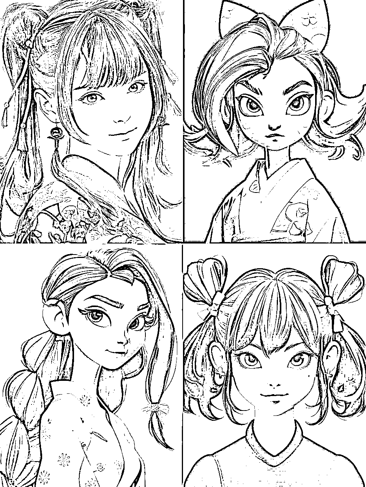

我们就选第一张的女孩子，做为我们的包装贴图。

第 2 步：包小盒贴图

打开包小盒官网，登录，选择智能样机库：

选择你需要的产品样机，然后点进去，我们就以瓶体为例：

比如我们选择纸杯：

然后上传刚才生成的 MJ 图片进行产品贴图：

换张图，换个样机，例如换成易拉罐，效果也不错：

操作说明：杯子，瓶子类的图，可以在 MJ 里面设置生成的图片尺寸为 16：9 的比较好；

会 Adobe Illustrator（支持 2019-2022 版本）的可以直接下载包小盒的 AI 插件，直接软件操作效果更好；

会 PS 更好，可以根据尺寸，直接在 PS 排版好，打上字体和标签，然后在贴图。

## 11.3 常用关键词 @Sky🏹

在上篇学习关键词时，我们了解过它的写法与组成。但在不同领域，常见关键词与常用关键词公式往往能帮我们节省很大精力。

包装领域-关键词公式：品类主题+包装造型+包装材质+包装风格+参考品牌+渲染场景+画面氛围+图像设定魔法词：packaging design（包装品类与风格）

辅助词： alcoholic beverrages（酒精饮料）、soft drinks（软性饮料）、home accessories（家居饰品）、cosmetic products （化妆品）、food products （食品）、dim sun（点心）、incense cigarettes（香烟）、household goods（家庭用

包装设计常用关键词：

这部分的关键词与分类非常多非常细致，上图仅为部分展示，光看小图就能看到密密麻麻的字符，具体详表见：

包装设计常用关键词上表中的这些关键词，在其他不同领域也能加以应用，关键就看大家如何吸纳变通～

下面我们来看一些应用示例：

描述：设计一款纯色英文手写字体，简单文字排列的，香薰蜡烛包装设计

翻译：Design a solid colorEnglish handwritten font simple text arrangement of aromatherapy Candle packaging design hd 8k

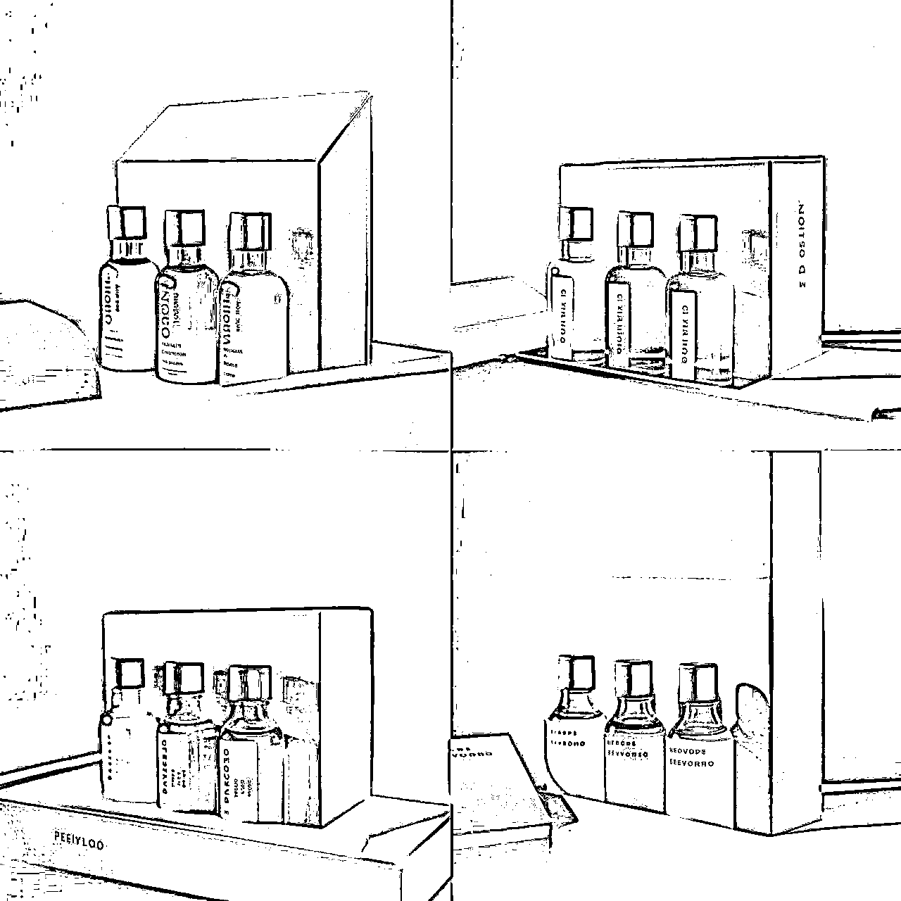

描述：芳香疗法精油包装设计，玻璃瓶礼品盒，文字信息，莫兰迪颜色，环境照明确定翻译：Aromatherapy essential oil packing design premium sense byredo glass bottle gift box text Message morandi colors ambient lighting ok

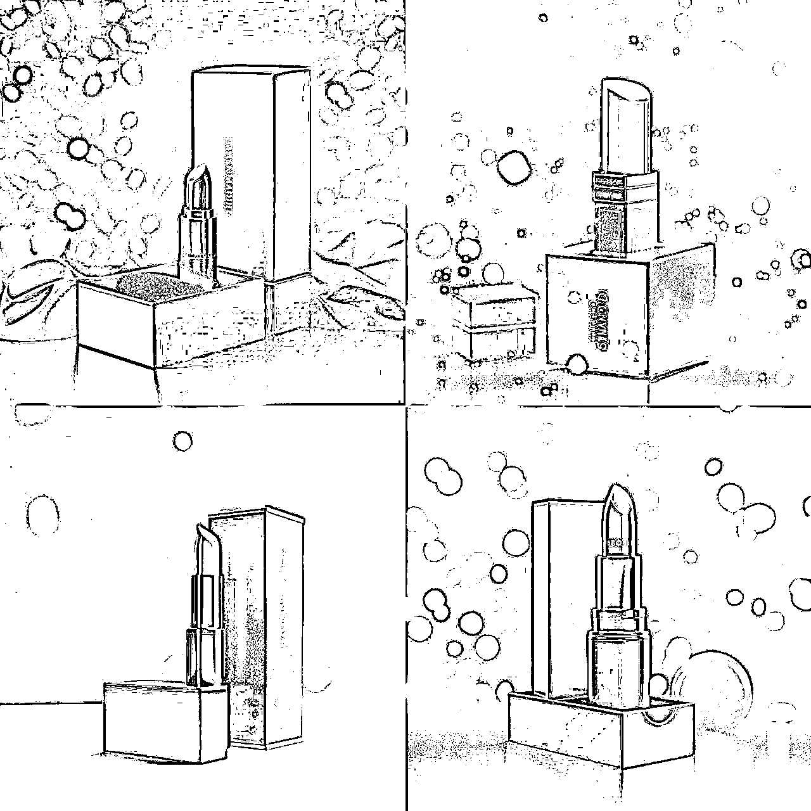

描述：口红包装，高档感，高饱和度，精美礼盒，文字信息简约风格，哑光标志，舞台灯光背景，超广角翻译：Lipstick packaging high-class feeling highly saturated exquisite gift box text messageminimalist style Style matte logo stage lighting background bokeh ultra wide angle 8k

描述：自然插图，充满生命力，鸟和花矿泉水瓶包装，高清晰度

翻译：An illustration of nature full of life birds and flowers mineral water bottle packaging hd

描述：设计一款，中国白酒包装设计，文字布局翻译：Design a text layout premium simple chinese liquor packing

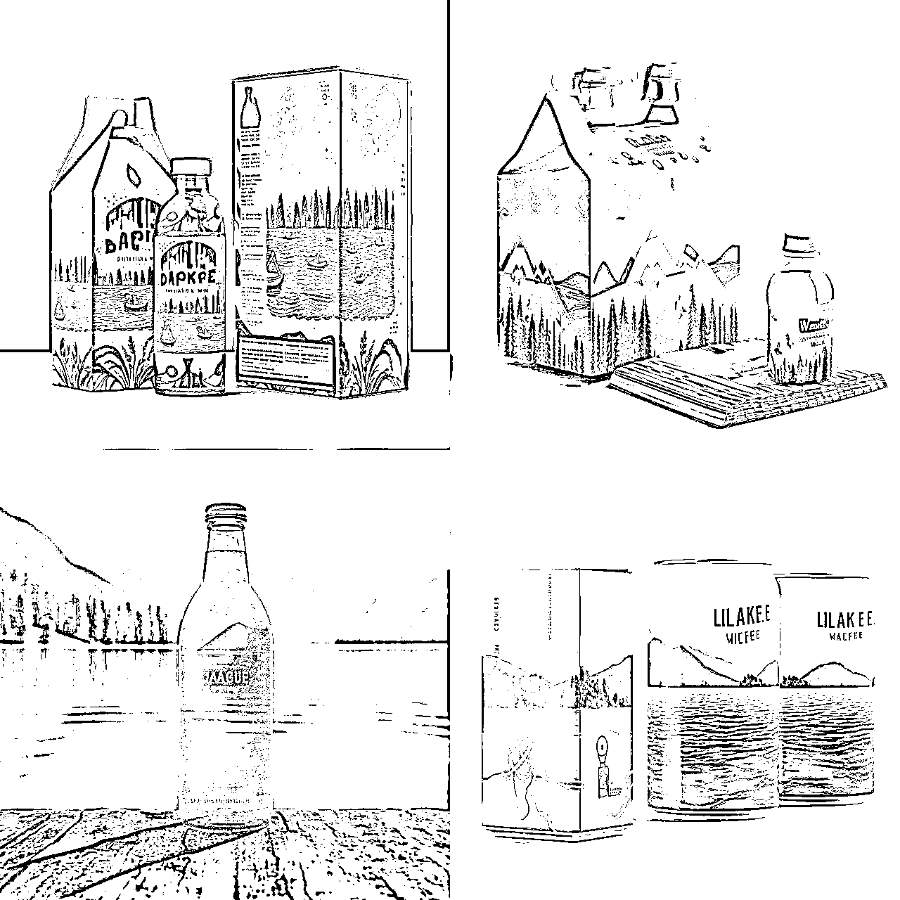

描述：设计一款矿泉水的包装，背景在湖面

翻译：Design a water package design On the lake

描述：设计一个现代极简的透明包装，新鲜的文字，果汁包装设计，高清翻译：design a modern minimalist transparent packaging fresh textarrangement of juice packaging design hd

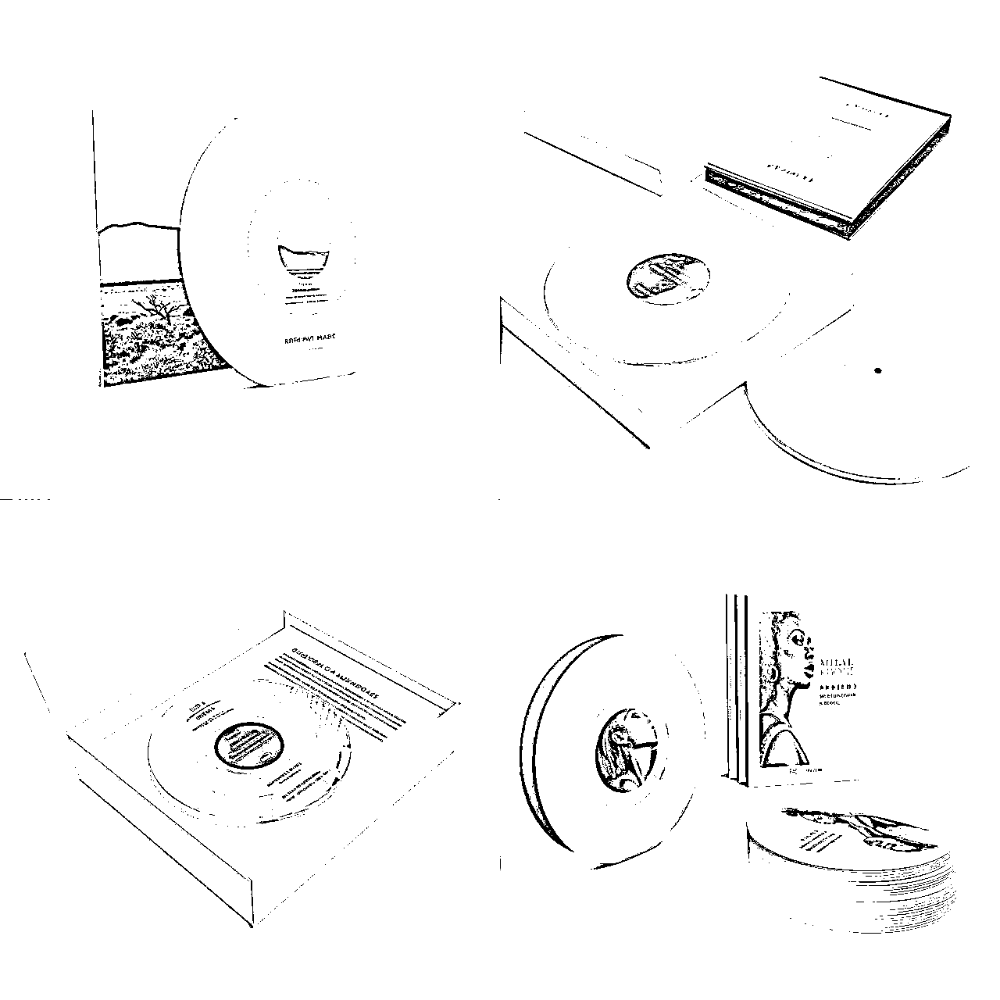

描述：CD 唱片包装设计，高品质，极简风格，白色背景，纯文字信息排列

翻译：cd record packing design high quality minimalist style kenya harawhite background pure text message arrangement

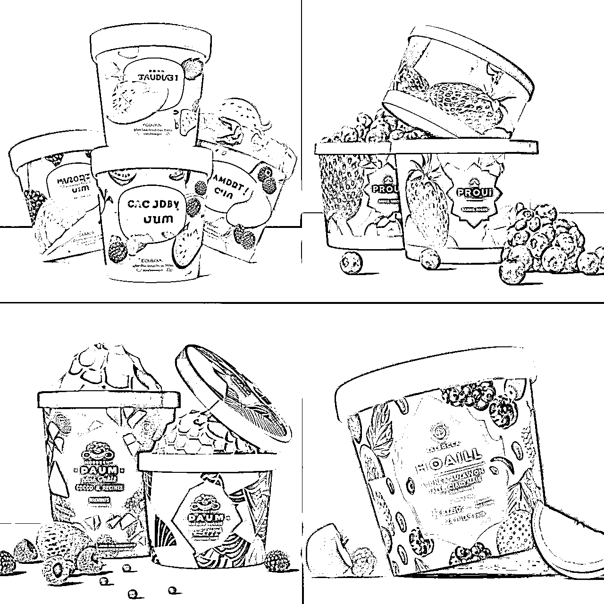

描述：设计一个几何平面风格的水果味冰淇淋包装设计，美丽的文字安排

翻译：design a geometric flatstyle fruit flavored ice cream packaging design with beautiful text arrangement hd 8k

描述：设计一个简单的米包装，纯色背景，文字信息，自然光，前视图高清

翻译：design a rice package simple solid color backgroundtext message natural light front view hd 4k

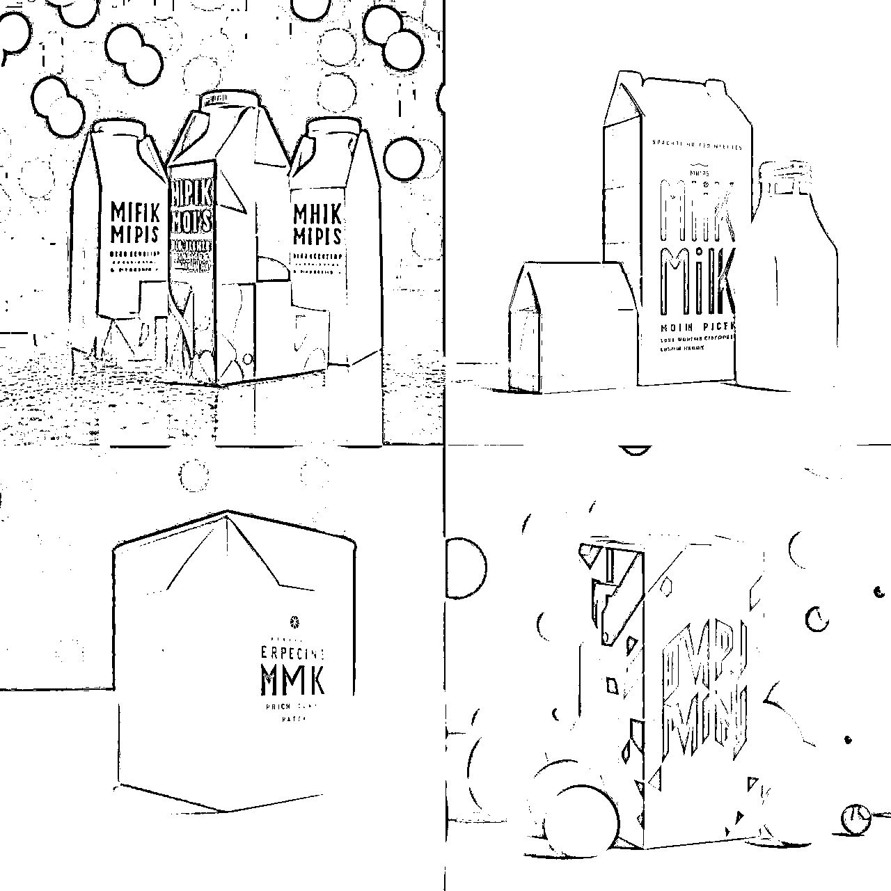

描述：牛奶包装，完美盒，孟菲斯配色方案，几何色块，简单质感，自然采光背景

翻译：milk packing perfect boxmemphis color scheme geometric color block simple premium sense text message natural lighting background bokeh medium 8k ultra hd

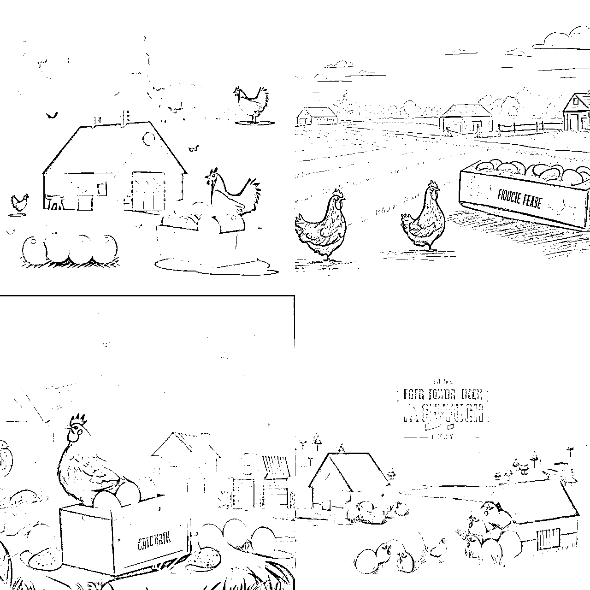

描述：鸡蛋礼盒包装，纯色养鸡场，素描文字插图，农场场景，鸡超广角翻译：egg gift box packaging solid color chicken farm sketch text arrangement illustration with farm scene and chicken super wide angle

描述：香水包装，高级感觉，玻璃瓶，淡色，精美礼盒，文字信息，岩石背景，自然光，深聚焦，超广角翻译：perfume packaging premium feel glass bottle pale colors fine gift box text message rocky background natural lighting deep focus ultrawide angle

描述：设计一个彩色条纹图形，重复图形，文字排版，英文排版，色块装饰，精美和简单的冰淇淋包装

翻译：design a colorful striped graphics repetitive graphics text typography label englishtypography color block accents decoration fine and simple ice cream packaging

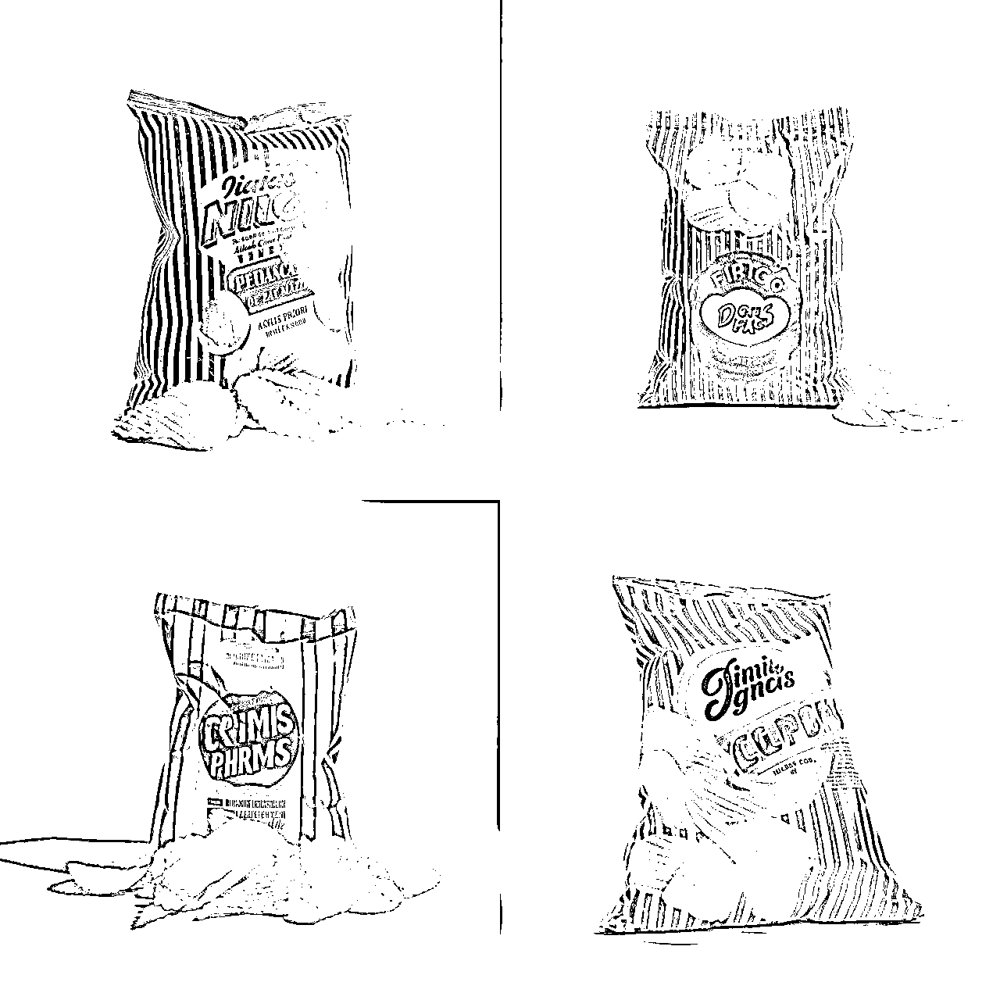

描述：薯片包装，橙色垂直条纹袋，黄色背景，薯片开胃，文字排版，完美的灯光效果，超宽的角度

翻译：chips packaging orangevertical striped bag yellow background chips appetizing text message perfect lighting effect super wide angel

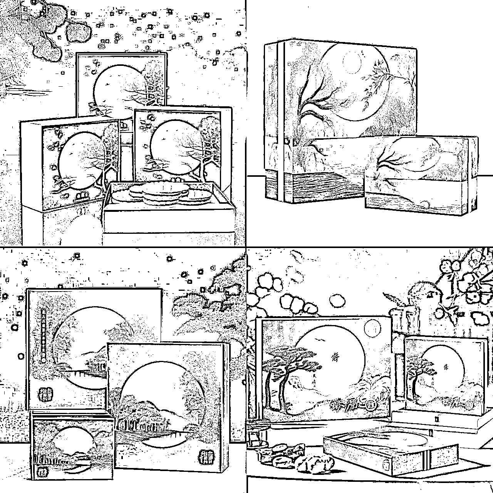

描述：中秋月饼礼盒套装设计，3 款产品，不同的盒型，出现月饼中秋和月亮，超广角视觉构图，背景星空夜景树枝，4k 超高清画质翻译：Beautiful goddess elf with holographic glowing reflections， by loish，目前，AI 绘画在包装领域尚未探索出体系化的变现方式，大家可以尝试做个先驱者，躬身探索。

# 十二、AI 绘画如何应用于插画设计 @木木｜终身成长践行者

不论是做什么设计图，首先要了解一个设计类型图片的概念、种类和风格，有了一个大概的框架，会有助于在接 AI 定制画的过程中，了解客户需求后，可以快速的提供设计思路，做出成品图。

而这一个框架的搭建，需要在实际应用的积累中完成，不要一次性的过多的输入各种关键词，对于非艺术专业来说，需要文字+图片的结合才会更直观的了解一个概念，这个是需要不断在「输入关键词→出图」的循环过程中实现的。

## 12.1 玩法介绍

先来了解一下插画设计的概念、种类和风格。

插画设计是指通过手绘或计算机绘图等方式制作的图像，通常用于书籍、广告、漫画、游戏、动画等领域。根据不同的制作方式和用途，插画设计可以分为以下几种类型：

1.

手绘插画

2.

数字插画

3.平面插画

4.

三维插画

5.

角色插画

6.

商业插画手绘插画，使用传统的绘画工具如铅笔、彩色铅笔、水彩、油画等手工制作完成的插画，可以分为以下几种具体类型：油画插画、水彩插画、铅笔插画、彩铅插画；

数字插画，具有高度的精确度和可编辑性，它的种类有很多，以下是一些常见的类型：平面数字插画、2D 动画数字插画、3D 数字插画：主要用于电影特效、游戏制作等领域，可以呈现出逼真的立体效果；

平面插画，用于印刷品或网络平面广告等场合，它的类型包括但不限于以下几种：平面设计、网络平面广告、商业插画、图标设计；

三维插画设计，可以呈现出立体的效果，用于游戏、动画等领域。它的种类包括但不限于以下几种：三维建模、三维渲染、三维动画；

角色插画设计，专门描绘人物形象的插画，可以根据不同的需求设计出不同的风格，如写实、卡通、漫画等。包括但不限于以下几种：写实风格角色插画、卡通风格角色插画、漫画风格角色插画；商业插画，用于商业广告宣传等用途的插画设计，通常是根据客户要求制作的定制化作品。它的类型包括但不限于以下几种：广告插画、包装插画、儿童插画、漫画插画、科技插画。

AI 绘画在插画领域的优势，大致与包装领域相似：快速批量生产：AI 绘画可以在短时间内生成大量的插画设计，节省了人工绘画的时间和费用。

提效，减少试错成本：AI 绘画可以根据用户需求可以快速生成设计方案，缩短设计周期，减少了人工设计的错误和不必要的工作。

多样性：AI 绘画可以生成多样的插画设计，包括风格、色彩、线条等方面的不同。

可定制：AI 绘画可以根据客户需求进行定制，生成适合客户需求的插画设计。

扩展创意：AI 绘画可以生成多样的设计风格，为设计师提供更多的创意灵感。

丰富内容提供多种选择：AI 绘画可以根据客户需求生成大量的设计内容，为客户提供更多的选择。

局限性上，AI 绘画做不到的内容也都差不多，难以应对复杂场景、依赖训练数据、缺乏创意和个性，但最主要的是，可能会存在版权问题。

如果在接商单的创作中，用了知名艺术家的名字生成的画，需要注意版权问题的处理，避免侵权和纠纷。当然，最好是别触及版权问题。

那么该如何用 AI 绘画工具完成插画设计呢？我们在实操部分来具体解析。

## 12.2 如何实操

关于文字插画，因为 AI 绘画现在识别不了字母，但是它对文字的排版还是可以的，我们可以根据图片上的文字排版，把图片上原有的文字消除掉，输入我们想要的文字，这样就可以用为图片封面使用了，对于电影海报插画和绘本封面插画来说，是很方便快捷的。

现代艺术插画，一个可爱的小女孩和一只狐狸，--ar 2:3 --niji 5 --style scenic

那么在基础公式上，我们还可以再继续添加：

【插画设计种类】+【插画风格】+【你想要的画面】+【by 艺术家姓名】+【其他】当然这个公式不是固定的，你可以加入你想加入的任何元素，或者直接用【插画风格】+【你想要的画面】都是可以的。

但是一开始，我建议大家先从少到多，这样才能直观的了解一个关键词所产生的画面是否是自己想要的，这个过程是一个非常有趣的探索过程。如：现实主义风格，儿童插图，一个小女孩在森林里玩耍时遇到了一只可爱的狐狸

realistic style, children's illustration,A little girl was playing in the forest when she met a cute fox --ar 3:2 --niji 5 --style cute

现实主义风格，儿童插图，一个小女孩在森林里玩耍时遇到了一只可爱的狐狸 realistic style, children's illustration,A little girl was playing in the forest when she met a cute fox --ar 3:2 --niji 5 --style cute

铅笔插图手绘，穿着海军制服的中国可爱女孩，非常可爱，黑色的大眼睛，短发，

Pencil illustration hand drawn, cute Chinese girl wearing navy uniform, very cute, with big black eyes and short hAIr, --ar 2:3 --v 5

## 12.3 常用关键词

给大家一些常用的关键词：手绘插画：油画、水彩、铅笔、彩铅

Hand-drawn illustration: oil pAInting, watercolor, pencil, colored pencil 数字插画：平面数字插画、2D 动画数字插画、3D 数字插画

Digital illustration: flat digital illustration, 2D animation digital illustration, 3D digital illustration 平面插画：平面设计、网络平面广告、商业插画、图标设计

Flat illustration: graphic design, web graphic advertising, commercial illustration, icon design 三维插画：三维建模、三维渲染、三维动画

3D illustration: 3D modeling, 3D rendering, 3D animation

角色插画：写实风格、卡通风格、漫画风格 Character illustration: realistic style, cartoon style, comic style

商业插画：广告插画、包装插画、儿童插画、漫画插画、科技插画 Commercial illustration: advertising illustration, packaging illustration, children's illustration, comic illustration, technology illustration

## 12.4 变现方式

在经历过了实操后，相信大家对插画的成图效果有了一定的了解，那么我们就可以结合自己的自身技能+想要的粉丝画像来进行出图，发布小红书等平台啦。

变现方式包括但不限定于：小红书+公众号+神图君取图/网盘拉新+社群/教学+定制图+自有业务推广。当然，这个变现玩法，不局限于哪类账号，基本都适用，就看如何选择。

需要注意的是，在此之前，我们还需要先想清楚自己帐号的定位，确定自己想要吸引什么样的粉丝，就做哪一类型的图。比如，想要吸引宝妈类的人群，可以做儿童插画，以绘本类的方式去出图，发小红书，可以搭配免费赠送绘本的方式引流。

不同类型的插画适合什么样的领域，在上面的介绍中已经很清晰了，如果想要做海报类的，就考虑广告插画，如果想要做绘本类的，可以考虑儿童插画，漫画插画，卡通风格角色插画等等，依据自己想要涉及的领域进行做图。

### 12.4.1 原图变现

可以做的账号类型有很多，这里提供 2 种，供大家参考。

#### 12.4.1.1 账号类型

类型二：教学号（难度等级🌟或者🌟🌟🌟🌟🌟）

难度等级🌟的教学号：

#### 12.4.1.2 变现方式

原图变现的方法主要有以下 3 种。

小红书群聊，引导粉丝进群后，可以在群聊公告里写出取图方式，粉丝直接去搜索取图小程序，通过粉丝取图看广告，我们赚取点击费。如：

方式二：建立小红书群聊，群公告改为自己的公众号

以公众号为媒介，公众号取图，涨粉速度快，且安全，不存在频繁被加风险，引流到公众号上，用户通过公众号获取图片。

那么到公众号取图，会有以下 3 种变现路径：

小程序取图收益：与方式一类似，在公众号上直接跳转到神图君等取图小程序，通过取图看广告，赚取点击费

这里要注意的是，某些取图小程序，比如神图君，要满 20，才能提现，变现不是即时的。当然，如果你神图君里的图片比较多，不排除用户会多点几个，让你收益多多。

网盘拉新：在公众号上回复设置好的引导词，如“取图 1”，会自动回复你设置好的网盘链接，用户点击网盘链接，下载 APP，转存获取图片，赚取拉新费用。

这里需要注意的一个点是：有可能你的用户已经有你要拉新的网盘，那么他就不属于一个新用户了，你可能就获取不了这部分收益，所以这个方式，是有几率赚不到钱的。

私域+网盘拉新：那么针对第 2 种，你可能赚不到钱的方式，我的建议是，回复关键词，跳转出你的微信二维码，让用户扫描二维码直接加你好友，把人导到私域里，再给他发网盘链接，

这样的话，假设网盘拉新失败，你还会有一个私域转化粉丝，这个粉丝单价是 0，也是很香的，后续如果喜欢你的图片，可能会找你定制头像，或者找你学习，亦或是你有自有业务，可以通过其他业务变现，这是隐藏价值。

当然，这里有 4 点需要说明：一是，有一部分人白嫖过后，会删除你的好友，对于这样的，咱们无视就好，要相信，下一个会更香；

二是，你需要做好你的朋友圈，日常发图，发文，运营好你的朋友圈，不然用户不了解你，吸引不了用户下单；

三是，建立群聊，会有人进入打广告，需要及时对广告进行撤回；

四是，不论哪种方式引流操作，都会有违规风险，大家做好心理准备。

### 12.4.2 定制变现

AI 绘画可以通过以下方式进行定制变现：

① 设计定制化插画：可以根据客户需求进行定制化设计，提供更多的选择和服务。

② 授权许可：可以通过授权许可的方式，将其应用于商业领域，如广告、包装设计等。

③ 出售设计方案：可以生成多样的插画设计方案（关键词），可以将其进行打包出售，提供更多的选择和服务。

④ 开发插画设计软件：可以通过开发插画设计软件，为用户提供更多的选择和服务。

具体可以根据客户需求定制相关，如：文创周边包括各种形式的衍生品，书籍插图、文具图案、服装图案、装饰画、海报设

# 十三、AI 绘画如何应用于电商领域 @常常🔥

## 13.1 玩法介绍

AI 模特图/产品图，是通过 Stable Diffusion、MidJourney 等 AI 绘图软件，以文字生图、图生图、条件生图等形式，在无真人模特、无真实拍摄条件下直接创作图片，以达到商家使用目的的项目制作过程。

目前的 AI 绘图技术不仅可以实现“一句话出图”，而且随着技术的不断进步，AI 绘画的作品开始慢慢变得以假乱真，AI 绘画制作的模特图和产品图的效果，已经慢慢超越现在很多新入电商摄影的新手。

目前使用 AI 绘画技术，可以完全实现简单基础纯色款衣物的模特图，比如：

大面积纯色块的 T 恤、卫衣、外套、裙子；

电商的产品拍摄图；

简单产品的不同场景图，比如形状规则的护肤品包装瓶等。

在商业应用中，除去可以为模特“穿上客户要求的衣服”，也可以为模特更换特定的衣服，做到同一个模特，适用更多的场景。

虽然现在的 AI 绘图可以胜任简单的模特图/产品图，但对于复杂和极高要求的模特图/产品图，在实际商用效果、成本、适用场景等方面，依然存在着差距。

其优势主要有以下几点：成本低：在一次性少量产品拍摄时，AI 绘画具有比较大的成本优势，而且随着 AI 绘画技术的不断发展，未来 AI 模特图的制作成本，将会变得更低，甚至可以在大规模的批量摄影上，与传统电商摄影抢占市场。

不受时间、空间场景的限制：AI 绘画可以根据客户指定的场景进行出图，不需要考虑拍摄场地，直接使用 AI 绘画技术进行场景的生成客户想要的效果图；相比于传统电商摄影，省去协调场地、准备拍摄环境等工作流程，帮助客户节省拍摄的时间和拍摄成本。

可以快速满足个性化、定制化需求：AI 绘画可以通过快速改换模特，生成符合产品特色的模特图/产品图，满足客户对于产品模特的个性化、定制化需求，保持整个店铺模特风格的统一性。

但 AI 绘画在实际电商图出图中仍有局限，比如我们来看下图：

（客户提出需求将模特进行替换，并进行合适的穿搭）

现在我给大家布置一道思考题：上图是否能够满足商家的商用需求？

答案是不能满足商家要求，不能满足商家要求的原因是：AI 生产的模特过于幼态，没有成熟女性（中老年）的气质。

目前达成 AI 模特有两大思路，各有局限性。

第一个思路是让 AI 根据投喂的图片重塑整张照片，优点是更智能，图片可能也会更容易协调，美观；

缺点是在这种条件下稳定性（生成对应的模特和服装）和细节准确性（服装的细节把控，比如衣领，扣子）会弱。

在这种技术下 AI 绘画“挑活”

AI 模特服装图复杂的款式目前技术达不到，能做简单款的产品，不能满足较高要求的拍摄，特别是带有繁杂花纹的衣服，很难保证 AI 模特的衣服与实物完全一致，需要借助后期处理技术；

但传统电商摄影不存在这个问题，传统电商的线下拍摄，有相机、有模特、有场景就可以拍，没有拍不出来的照片，而且可以保证照片即实物。

成品概率低，效率低

使用 AI 技术进行 AI 模特图/产品图创作，受限于机器性能、模型训练时间，在实际操作过程中，需要测试、训练多次才能达到满意的效果，适合产品的个性定制化，不适合大规模；一次进行上百款大规模产品拍摄，在使用同一位模特的情况下，使用传统摄影成本低、时间短，更为划算。

但是如果 AI 技术进一步进步，准确性进一步增强，会很有前景。

第二个思路是让 AI 根据投喂的图片，不改变衣服，只对模特，背景做出更换，这种情况下，实物容易保持一致，缺点是还不够那么的”智能“，图片可能协调度，美观度的上限不如第一种高。

让模特做一些简单的动作可以，但是复杂难以识别的不行，比较适合团队作战。

关于 AI 绘画在电商模特摄影领域的应用，更多的详细信息，可以参考生财有术圈友的精华帖：《失业危机自救：AI 模特项目 7 天跑通变现闭环的复盘实录》

## 13.2 如何实操

使用 AI 绘画技术，进行电商模特图/产品图的制作，目前能够实现的主要是三种技术：

### 13.2.1 初阶技术

方法一：使用 MidJourney 软件的以图生图功能

适用于纯色简单款衣服：如卫衣、T 恤、衬衫不适用于复杂花色、花纹类衣服，生成符合要求的模特模特

具体操作步骤：① 写一个符合你要求的文案，例如

“一张亚洲美女模特的全身照片，穿着舒适的运动衫，站在白色背景板前。这是一张人像照片，采用低角度拍摄，使用佳能 EOS R5 相机和标准镜头，拍摄模特整套服装，并展示她 165 厘米的身高。”

② 将这句话放入 ChatGPT 或者其他翻译软件中，翻译成适合 AI 绘画的英文提示词"A full body photo of a beautiful Asian model wearing a comfortable sweatshirt and standing in front of a white background board. This is a portrAIt shot, taken from a low angle, using a Canon EOS R5 camera and a standard lens, to capture the model's full outfit and show her height is 165 centimeters."

③ 将这句话放到 Discord 中，让 MidJourney 机器人去识别，在输入栏中输入 /imagine + 英文提示文案（这里的+号不用输入），发送指令，等待 AI 绘图完成：

④ AI 就直接生成了 4 个模特，对比较满意的模特，点击图片的 U1、U2、U3、U4 来直接打开大图。

⑤ 将符合要求的图片下载下来，与我们准备好的衣服照片，通过 Photoshop 等修图软件，简单的叠加放在一起：

⑥ 将经过 Photoshop 处理后的图片，按住 shift 键，上传至 MidJourney 的 Discord 机器人栏中，获取上传成功的图片链接。

⑦ 在输入栏中输入 /imagine + 图片链接 + 原来生成模特的文案 + -- iw2 （这里的+号不用输入）， -- iw 2 代表的是权重，发送指令后，生成穿上指定衣服的模特：

注：使用 MidJourney 绘图软件，在实际生成 AI 模特图时，会因为 AI 绘图的随机性，存在颜色和衣服上 logo 的变化，可以通过后期的修图进行处理，完成自己想要的作品。

方法二：使用 Vega AI 创作平台的软件的局部重绘功能考虑到部分圈友受限于电脑设备的硬件限制，不能流畅使用 Stable Diffusion 模型源代码安装包，所以，采取一种更为稳定、简单、可靠的方式，使用 Vega AI 创作平台进行快速进行 AI 模特局部更换。

Vega AI 教程👉【三、简易方法：学会用 Vega AI 完成 AI 绘画】Stable Diffusion 教程👉【五、学会用 Stable Diffusion 完成 AI 绘画】

① 我们以一张不是很满意的商品模特实拍图为例，对模特图进行局部调整，将模特图绘制成我们想要的样子：

② 将模特图上传至 Vega AI 创作平台，选择图生图的模式，选择真实影像。

③ 选择画笔笔刷，在图中需要改变的部分，绘制蒙版，在文本输入框中输入想要绘制的模特关键词：

④ 点击生成，等待图像生成。

现在，我们根据上文的过程，进行对其他图片换脸，商家要求：将下图的欧美模特换成亚洲模特。

如上图，我们完成 AI 模特的局部重绘。

但大家可以思考下：这样的图片可以完全满足商家需求吗？

答案是不能满足。

这个不能满足商家要求的原因是：模特脸部和身体的协调度低（可以理解为美洲豹身上长了一张兔子脸），有违和感，衔接不够自然，并且这张脸没有模特的张力感。

所以，AI 模特是电商摄影中的垂直细分领域，不是孤立的存在，如果我们想用 AI 模特生出符合商用标准的模特图，也需要注意学习电商摄影相关知识。

### 13.2.2 进阶技术

方法三：使用使用 Vega AI 创作平台的模型训练功能

① 根据 Vega AI 平台训练定制专属模型要求，准备图片：图片类型：如同一人物、同一画风、同一物体、同一纹理、同一材质、同一姿势等

图片数量：10-100 张之间，图片数量越多效果越好

图片大小：建议分辨率在 512x512 像素以上

图片的内容：建议保持主体一致，避免主体元素过小② 输入风格名称，根据下方五种基础模型的展示图，选择适合自己需要的模型，在右侧菜单栏的基础模型中选择基础模型，基础模型是 Vega AI 平台的内置模型，不同的模型之间差异非常大，会直接影响出图效果，需要进行慎重选择：

③ 上传图片，点击左侧菜单栏，选择风格定制，点击“上传照片”进行上传，或者使用鼠标进行直接拖拽上传：

④ 点击开始训练，一般需要等待 30 分钟左右时间，等待训练完成，训练完成后，会有弹窗提示进行操作：

## 13.3 变现方式

如果你本就在电商领域，你可以直接将 AI+电商领域的玩法学以致用；如果你非电商领域玩家，那么以下两种方式也可以变现。

方式一：出售教程

整理 Stable Diffusion 模特图/产品图的制作方法，制作课程，进行出售：

方式二：对接商家资源，为商家提供 AI 模特服务

在小红书、淘宝、闲鱼店铺，通过给商家发送私信，寻找合适的商家店铺，进行商家合作。

通过为商家提供不同的 AI 模特服务，按照实际出图张数进行收取费用。

方式三：成为 AI 模特商业链上面的任意一环比如，能够获取流量，能够获得很多商家资源，可以为 AI 摄影师提供商单资源，获得收入。同理，AI 摄影师也可以为这样的渠道提供人力资源。

所有生意都会有多个环节，供应链，流量，产品交付，在每个环节上都有着可以进行提供个人价值的变现机会。

方式四：资源组合，形成团队赚钱

在上文已经提及，AI 模特绘图单个个人进行产出，效率和收益都很低，难以接下大单，比如商家一次要 500 张图，要求一周内出图。

这种情况下，必须团队作战，比如有 10 个人，1 个负责推市场，1 人负责商家沟通和交付，剩下 8 人，负责出图，那么每人一周的工作量就是 60 张+，这就是可以做到的。

方式五：直接成为商家这个建议听起来大胆，但是对于生财的小伙伴，可行性非常高。

相信很多人已经从生财上学习了如何选品，如何运营的知识。

那么，现在正好有 AI 可以帮我们搞定图片，我们开店的成本进一步降低，图片也不再是能够阻挡我们的门槛。

当然，上述变现方法都还在探索初期，规则都并不完善，如果有兴趣，你可以亲自尝试一下。

# 十四、AI 绘画如何应用于 IP 定制 @饼公子

## 14.1 玩法介绍

IP 定制是指将知名的影视、漫画、游戏等 IP 进行二次开发，将其应用于其他领域，如文化创意、广告、游戏等，从而创造新的商业价值。

IP 定制的流程通常包括以下几个步骤：

IP 评估：评估目标 IP 的品牌价值、市场影响力、知名度等，确定是否适合进行定制。

品牌授权：与 IP 持有方进行谈判，获得品牌授权，并确定授权方式和费用等。

形象设计：根据 IP 特点和定制需求，进行形象设计，包括角色形象、场景设计、配色方案等。

周边产品开发：根据形象设计和定制需求，开发周边产品，如文化衫、手机壳、玩具等。

推广营销：根据定制需求和推广目标，制定推广方案，包括线上推广、线下活动、广告投放等。

迭代优化：根据市场反馈和用户需求，对定制方案进行优化和迭代。

举例 10 个知名的 IP 定制角色：Hello Kitty、Pikachu、Doraemon、Snoopy、Mario、Mickey Mouse、Minions、SpongeBob SquarePants、KAWS 的 Companion、BT21 的角色。

AI 绘画在 IP 定制领域的优势与前几种玩法类似，这里不再展开赘述，主要有以下几点：风格多变且新颖

支持高效定制降低成本

创意无限

支持更个性化的定制特别是在追求个性化和新颖的年轻群体中，AI 定制 IP 的潜力和吸引力是巨大的。

与之相对的，AI 绘画在 IP 定制领域也存在如下局限性：缺乏人文关怀：AI 生成的作品可能缺乏人文精神和情感体验，无法达到人工绘画的情感影响力；

风格相近且重复：如果 AI 模型的训练和学习不够丰富，其生成的作品风格可能比较单一和重复，无法持续输出新颖的效果，这会降低客户的新鲜感和购买欲望。

要素失真和不协调：AI 在生成复杂的绘画作品时，对图像中的要素可能处理不当，造成局部失真或不同要素间的不协调感，影响视觉体验。

个性化体验差：与人工定制相比，AI 定制的个性化体验可能相对差一点，无法达到人工定制的精细和贴身。这也是一大挑战，需要通过更强的客户参与和人工精修来改善。

## 14.2 如何实操

推荐工具：MidJourney

如何使用 MidJourney，可参考章节【四、学会用 MidJourney 完成 AI 绘画】关键词公式：【核心风格】，【主体】，【主体设定】，【风格设定】，【渲染工具/引擎】，【质量词】

目前较为流行的是 IP 是盲盒系列，那么就来做一个盲盒的举例。

常见盲盒定制

Blind Box style,dynamic pose, beautiful girl, blue princess dress, white long hAIr, black background, lumen reflection, 3D,C4D, CGI, VFX, HD, --niji 5 --style expressive

盲盒风格，动态姿势，美少女，蓝色公主裙，白色长发，黑色背景，流明反射，C4D，CGI，VFX，HD

常见盲盒定制 Blind Box style,dynamic pose, beautiful girl, blue princess dress, white long hAIr, black background, lumen reflection, 3D,C4D, CGI, VFX, HD, --niji 5 --style expressive 盲盒风格，动态姿势，美少女，蓝色公主裙，白色长发，黑色背景，流明反射，C4D，CGI，VFX，HD

全身盲盒

Blind Box style, POPMART, chibi,KawAIi,magician cute Girl, Cute and playful posture,full body ,PVC, reflective clothing,best quality,ultra detAIls --niji 5 --style expressive 盲盒风格，POPMART，Q 版，卡哇伊，魔术师萌妹，可爱俏皮姿势，全身，PVC，反光衣，极品，极致细节

不同职业

Blind box style, POPMART, chibi, dynamic pose, priest, girl, blue clothing, white background, lumen reflection, C4D, CGI, VFX, HD --niji 5 --style expressive

盲盒风格，POPMART，chibi，动态姿势，牧师，女孩，蓝色衣服，白色背景，流明反射，C4D，CGI，VFX，HD

## 14.3 常用关键词

核心风格词：盲盒风格/手办 Blind Box style/figure 等主体设定：外貌、服装、职业等

风格设定：平面 flat、3D、chibi、POPMART、动漫风 anime style、机械风 mechanical style、复古风 retro style、潮流风 trendy style、科技风 technological style、全息影像 holographic image、酸设计 Acid designd 等渲染工具/引擎：RTX、C4D、CGI、VFX、HDR、Maya 等

建议模型：niji expressive（并不是其他的不能用，而是暂时感觉这个效果比较好）

## 14.4 变现方式

目前，IP 定制的变现方法还不是很明确，大部分账号会发布自己创作的 IP 作品，一边积累流量，一边探索变现：

部分账号可能会接到一些定制商单，或者授权变现，但是都未成体系，感兴趣的小伙伴可以尝试做个先驱者。

# 十五、AI 绘画如何应用于 LOGO 设计 @木木|终身成长践行者

## 15.1 玩法介绍

LOGO 指的是企业、组织、品牌等在商业活动中使用的标志和标识，是品牌身份的重要组成部分。LOGO 设计需要考虑到品牌的特点和定位，通过图形、文字、色彩等元素的组合和运用，表达品牌的理念、特点和形象，从而达到品牌宣传和市场推广的目的。

LOGO 设计的类型有：

字形 LOGO：仅使用文字或字母来表达品牌形象和价值；图形 LOGO：使用图形或图案来表达品牌形象和价值；

组合 LOGO：将文字和图形组合在一起，形成更加复杂和丰富的品牌形象；

徽标 LOGO：类似于图章或徽章。

风格主要有：

扁平化风格：简化图形和色彩，强调简洁和现代感；立体化风格：使用阴影和渐变等效果，增强图形的立体感和质感；

手绘风格：手绘的方式表现图形和文字，增强品牌形象的个性和亲和力，适用于比较轻松和有趣的品牌形象；

经典风格：使用传统的设计元素和技巧，强调品牌的历史和传统，适用于具有丰富历史和传统的品牌；未来主义风格：使用未来感十足的图形和色彩，强调品牌的科技感和先进性，适用于科技和创新型品牌。

AI 绘画在 LOGO 设计领域的优势，与插画设计基本相似，这里不重复赘述。

局限性上，AI 绘画在 LOGO 设计领域的局限更多两条：

文字/字母无法完美体现

只能提供思路，不能完全当成品图

并且，AI 缺乏情感意识，设计出来的 logo 不够有趣，没有灵魂。对于商单来说，AI 绘画只能提供一个灵感，一个基础图形，对于 LOGO 来说，需要矢量图形，或者分层图层等等，这些都需要设计师进行二次创作。

## 15.2 如何实操

### 15.2.1 快速上手

一个快速的上手设计方法，公式：【LOGO 设计】+【LOGO 风格】+【你想要的画面】。

比如，我想为生财设计一个帆船图标 LOGO，用这样的方法，我可以快速设计出多组关键词。

以下出图均使用 MidJourney 工具，如何使用 MidJourney，可参考章节【四、学会用 MidJourney 完成 AI 绘画】。

LOGO 设计，立体化风格，一只绿色的帆船

LOGO design, 3D style, a green sAIlboat --v 5

LOGO 设计，手绘风格，一只绿色的帆船

LOGO 设计，经典风格，一只绿色的帆船

LOGO design, classic style, a green sAIlboat --v 5

### 15.2.2 延伸设计

拓展玩法一：扩展关键词，加入艺术大师名字关键词的组合可以多种多样，比如还可以加上 LOGO 领域的设计大师名字，做出相关的作品。

公式：【LOGO 设计】+【by 设计师名字】+【LOGO 风格】+【你想要的画面】

当今世界上有许多才华横溢的 LOGO 设计大师，他们设计的标志已经成为了很多知名品牌的象征。以下是 Notion AI 列出的顶级的 10 位 LOGO 设计大师及其代表作，供大家参考：

1.

Paul Rand - Paul Rand 是美国现代图形设计的奠基人之一。他设计的标志包括 IBM、ABC 和 UPS 等，这些标志已经成为了标志设计的经典案例。其中，IBM 的标志是一条条带组成的网格，代表着信息科技的复杂性和精准性。

Milton Glaser - Milton Glaser 是美国最伟大的平面设计师之一，他设计的标志包括 I <3 NY 和 DC Comics 等。其中，I <3 NY 已经成为了纽约市的象征，而 DC Comics 的标志则展现了超级英雄的力量和魅力。

3.Saul Bass - Saul Bass 是美国最著名的电影开场片和标志设计师之一，他设计的标志包括 AT&T、Kleenex 和 United AIrlines 等。其中，AT&T 的标志是一只手拿着电话听筒，代表着通信和联系的力量。

Massimo Vignelli - Massimo Vignelli 是意大利最伟大的图形设计师之一，他设计的标志包括 American AIrlines、Bloomingdale's 和 Ford 等。其中，Ford 的标志是一个蓝色的椭圆形，代表着汽车的精致和高贵。

Michael Bierut - Michael Bierut 是美国最有才华的图形设计师之一，他设计的标志包括 Hillary Clinton 2016、Saks FifthAvenue 和 MIT Media Lab 等。其中，Hillary Clinton 2016 的标志是一个 H 和一个箭头组成的标志，代表着希望和改变。

Lindon Leader - Lindon Leader 是美国最有天赋的标志设计师之一，他设计的标志包括 FedEx 等。其中，FedEx 的标志是一个紫色和橙色的箭头，代表着速度和可信赖。

Ivan Chermayeff - Ivan Chermayeff 是美国最有才华的图形设计师之一，他设计的标志包括 NBC、National Geographic 和 Showtime 等。其中，NBC 的标志是一个彩色的鸟笼，代表着娱乐和创造力。

8.Tom Geismar - Tom Geismar 是美国最着名的平面设计师之一，他设计的标志包括 Xerox、Chase Bank 和 Mobil 等。其中，Mobil 的标志是一个红色的圆圈和一个蓝色的斜线，代表着能源和创新。

Chermayeff & Geismar & Haviv - Chermayeff & Geismar & Haviv 是美国最著名的标志设计团队之一，他们设计的标志包括 Armani Exchange、National Parks Service 和 Library of Congress 等。其中，Armani Exchange 的标志是一个黑色的手写字母，代表着时尚和品味。

10.Chip Kidd - Chip Kidd 是美国最著名的平面设计师之一，他设计的标志包括 Jurassic Park、Batman 和 Jurassic World 等。其中，Jurassic Park 的标志是一个恐龙骨架的剪影，代表着冒险和惊险。

这里要说明一点，在接商单的时候，一定要避免使用艺术大师的名字，以免出现版权纠纷。

拓展玩法二：扩展关键词，加入其他风格词汇

AI 绘画最大的乐趣是，你加入一个不同的词，它出来的图的效果都不同，大家可以多进行尝试，惊喜就会多多，我们尝试一下，不加入 LOGO 风格限定，加入其他词语。

公式：【字母 LOGO 设计】+【其他风格】+【你想要的画面】，比如“极简风格”

字母 LOGO 设计，极简风格，一个女孩做瑜伽

Letter logo design, minimalist style, girl doing yoga

再多个控制，想要一个简单的背景和线条，那么我们可以写：

字母 LOGO 设计，极简线条，做瑜伽的女孩，白色背景

拓展玩法三：利用 BUG 进行文字排版上面我们说了，LOGO 的 4 种类型，有字形 LOGO，对于 AI 绘画来说，它识别不了文字，AI 出来的字母不是正确的文字，但是不妨碍我们可以利用它来进行排版。

以上面的图为例，一些聪明的朋友已经发现，LOGO 中多了文字，那是因为我的关键词不是单纯的【LOGO】，而是【字母 LOGO】，加上字母，会随机出现字母，而且，文字的排版已经不需要我们再去设计，将图片中的文字用 PS 或者美图秀秀等工具消除，再输入我们想要的字母即可。

以一个图为例：

修改前

修改后

## 15.3 变现方式

在讲变现之前，先来和大家说一下 Logo 的性质：

识别性、特异性、内涵性、法律意识、整体形象规划（结构性）、色彩性

logo 的种类和性质决定了它的制作是有一定门槛的，AI 绘画工具只是起到辅助作用。如果商用，需要进行二次创作，如修改 AI 出图后图片上的字体，添加场景使用等等，还需一定的语言功底，描述出设计理念。

发布小红书图文，如果是发纯 logo 的话，建议“赋予图片意义，给出使用场景”，比如，将 logo 用于门店上、周边文创的包装袋上、日历上、店铺小程序等等，更直观的展示，促进甲方老板下单定制，如：

可做的定制包括但不限定于：设计企业 LOGO 及周边产品，比如店铺的 LOGO，书籍封面图，店铺纪念徽章，书签等

# 十六、AI 绘画如何应用于产品定制 @刘楚宾🔥

## 16.1 玩法介绍

产品定制的范畴其实非常大，比如手机壳图案、帆布袋、马克杯、DIY 多功能卡套、钥匙扣定制等，都可以属于产品定制。

本章节，我们以品牌周边为例，展示 AI 绘画在产品定制中的玩法。

AI 绘画在产品定制中的优势，与前文的其他玩法相似，不部分优势不再赘述：

## 16.2 如何实操

### 16.2.1 玩法一：百度文心一格

文心一格网址：https://yige.baidu.com/

文心一格还提供周边定制，生成作品之后可以选择定制成手机壳、马克杯、帆布包等。不过，只有通过审核的图片才能定制相关周边。

我们可以根据客户要求，制作好图案，给客户确认，并在定制的价格上加个差价卖给需要定制的客户。

操作步骤如下图：

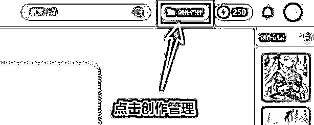

然后点击你生成的图案，就能看到应用场景下的 4 种周边产品，选择任意一个，就可以定制：

第一次定制的可以领取优惠券，会便宜点哈，然后点击【立即定制】，选好哪个款式，然后点击下一步。

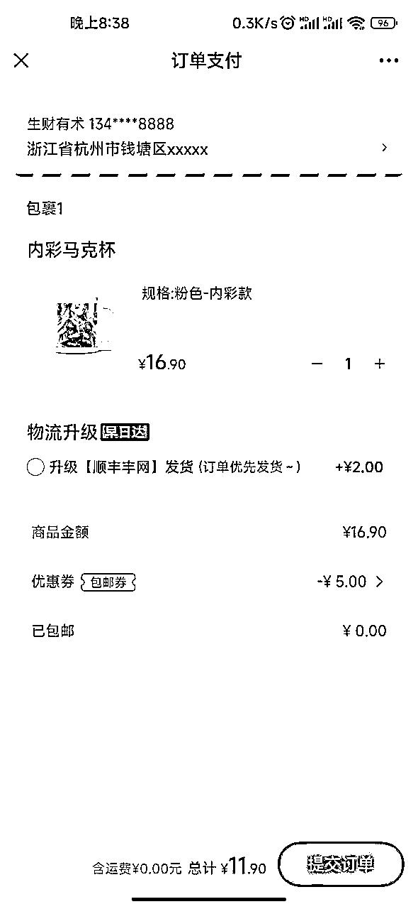

### 16.2.2 玩法二：MidJourney 画图

用 MidJourney 画出图案，然后再去淘宝或者 PDD 上面找定制商家，直接搜索【XX 定制】，然后再询问客服，是否支持一件定制。

如何使用 MidJourney，可参考章节【四、学会用 MidJourney 完成 AI 绘画】步骤分为两步：

① 和客户确定图案类型，然后画图；

② 找平台商家定制，然后加价给到顾客，赚差价。

周边产品图案主题可以是以下系列风格（也是部分常用关键词）：可以是星座、星⾠系列、十二生肖系列；

厚丙烯、油画肌理，抽象画 ，线条画；⽮量、极简图案、涂鸦；

国潮、3D 画；

艺术、风景、卡通；个人头像......等等

也可以根据顾客需求，写出符合的关键词，画出顾客满意的图案。

个人头像......等等也可以根据顾客需求，写出符合的关键词，画出顾客满意的图案。

个人头像......等等也可以根据顾客需求，写出符合的关键词，画出顾客满意的图案。

## 16.3 变现方式

产品定制的变现主要还是以接单为主，这就要求我们日常多发作品展示。

变现渠道主要有：

私域变现：朋友圈、群聊、粉丝群+快团团，案例可以参考【13.3 头像壁纸变现方式】公域变现：小红书、抖音、快手、视频号等平台发布图文笔记或者视频。

部分账号可能会接到一些定制商单，但是目前变现方式都未成体系，感兴趣的小伙伴可以尝试做个先驱者。

# 十七、AI 绘画如何应用于头像壁纸 @刘楚宾🔥

## 17.1 玩法介绍

头像壁纸大家都很熟悉，在 AI 绘画爆火之初，就已经有许多朋友产出头像壁纸，做图文号实现变现了，现在，AI 绘画在头像壁纸领域的玩法更加丰富。

AI 绘画+头像壁纸的优势与前文其他玩法类似，这里不再赘述。

虽然 AI 绘画和头像壁纸有很多优点，但也存在一些劣势。比如说，由于 AI 的算法受限于数据集和模型，生成的作品可能会缺乏创造性和艺术感。与此同时，AI 在处理复杂的主题和情感时，也可能无法达到人类的水平，导致生成的作品过于平淡或者表现不到位。

此外，AI 绘画和头像壁纸也存在版权问题。因为 AI 生成的作品大多数是根据已有的数据和模型进行生成，所以可能会存在与他人作品相似的情况，这就需要我们谨慎使用和保护版权。

## 17.2 如何实操

### 17.2.1 MidJourney 画头像

使用 MidJourney+InsightFaceSwap 插件来完成。

具体步骤：

第一步：MidJourney 垫图生成部分

① 垫图：（最多可以垫 5 张图）

② 右键点击图片，选择复制链接：

③ 在输入框/imaging prompt+链接+描述语

重点：将你想生成的头像的画面用英文描述下来（不写描述语 MidJourney 就会给你天马行空的画了），比如说 ：

宝宝，短头发、笑、皮克斯，卡通......( babies,short hAIr,cartoon,smile,pixar,cartoon)

辅助关键词：

3d character from pixar animation, a young woman, cute and dreamy, soft light, c4d, octane render, best quality, 8k 这个关键词加头像 URL 后面，都不会太难看（woman 可以换成 man）。

④ --iw 数值：基本描述语句后边可以加指令 iw，格式是：--iw 2

iw 值范围是 0.5-2，数值越大和原图越接近：

到此我们第 1 个步骤完成，开始第 2 个步骤。

第二步：InsightFaceSwap 换脸部分

① 邀请 InsightFaceSwap bot（https://discord.com/api/oauth2/authorize?client_id=1090660574196674713&permissions=274877945856&scope=bot)到你的 Discord 聊天室（就和你拉 MidJourney 机器人到你服务器一样的方式）。

顺利的话现在你会在聊天室右侧看到这样的列表：

图片放进去后，记得按下回车键。

出现这个就表示命名成功。

③ 换脸术，原理就是把我们上传的这张图的脸，换到我们用 MJ 生成的图片的脸上面。

以上就是成功换脸完毕。

注意事项：

可以使用「/listid」来列出目前注册的所有 ID。总数不能超过 10 个。也可以用「/delid」和「/delall」命令来删除 ID；注册的 ID 名字只能用英文和数字，并且不超过 8 个字符；

你可以输入多个 idname， 用逗号分割，用来实现多人脸替换的效果。例如「/setid me，you，him，her」；可以通过重新上传相同的 ID 名字来覆盖旧的 ID 特征；

如果你不想上传自己的照片，可以调用 insightface python package， 来生成自己的人脸特征，并保存成为一个 。npy 的 512 维向量文件上传；尽量的 ID 照片尽量保证 ：清晰、正脸、无遮挡；

不推荐上传：带眼镜的照片、过度美颜失去面部纹理的照片；

每个 Discord 账号每天可以执行 50 次命令，为了避免自动化脚本；不能保证每次生成的效果都很好；

请仅用于自我娱乐用途。

### 17.2.2 Vege AI 画头像或壁纸

也可以选择某个风格的照片训练成自己的 lora 模型：

比如在风格广场选择别人训练好的 lora 模型，点五角星，然后再回到图生图界面：

图生图界面中，选择彩虹女孩这个 lora，底模（基础模型）选 3D 二次元：

选择风格强度 0.40+，强度越大，越接近 lora 模型；编辑强度选择 0.35 左右，我们只改变部分，这样才会像原图；

张数就是你要生成多少张；图片质量，可以选高清，生成速度慢一点而已。

也可以选择两个 lora 模型混合。

以上就是用 Vega AI 制作头像壁纸的方式。

## 17.3 变现方式

头像壁纸的变现方式相对来说比较多，简单来说就是利用公域或私域流量成交：

私域：比如用快团团工具等工具发布团购，团购内容可以是收费制图，也可以是收费教学，发在群聊和朋友圈即可，有自己的私域流量的更好，吸引顾客下单成交；公域：比如在小红书上发布图片笔记或者制作成对比视频笔记（原图+换脸后的图），发布笔记。笔记火了，会有粉丝私聊你做定制，单价 30-99 元 3 张都是可以的。也可以一鱼多次，多平台发布，或者收费教学；

注意事项：受限于 AI 绘画的出图方式等，制作头像和壁纸不支持改稿，可以在约稿时提前和对方约定一口价；更多图文变现方式，可查看【2 月航海｜AI 绘画&ChatGPT｜实战手册】的章节【3.1.2 图文变现】

案例一：头像壁纸

比如该案例，在小红书上广受关注与喜欢，其定制的价格方案，大概是 129-189/张，笔记单图售卖 19.9 元。

案例二：知识付费

该账号起号 3 天，粉丝接近 2 万粉，并制作付费交付课程，付费会员几百个，客单价 299-599 之间。

案例三：儿童照片

目前宝妈宝爸群体还是愿意对这种儿童迪士尼风格的照片付费的，毕竟新鲜玩意，客单价合适的情况下，人家直接就付款了。

一个宝妈，平时就爱给自己的宝贝拍照，了解到 AI 绘画后，自己用 MJ 试了下效果很好，自己很满意，就琢磨着能不能通过这个赚点钱呢，补贴家用。

很快，她就用快团团发布 AI 绘画团购，在朋友圈和群发了个拼团，没想到两天时间，一千多人拼团，关键还没啥成本（就花费自己的人力成本）：

而这些，只需要套用关键词+垫图，就能直接出这种风格的照片。我们可以算一下她的收入：9.9 元*1500 人=14850 元，这直接就 5 位数。

对于超过 99%的人来说，使用 MidJourney 来创作自己的肖像照是不可行的。除非你是个大明星，这意味着在网上有几千上万张你的相片。但是现在，你可以借助 InsightFaceSwap 这个 Discord bot， 来帮助客户实现这个想法。

# 十八、AI 绘画如何应用于室内装饰 @饼公子

## 18.1 玩法介绍

AI 绘画在室内装饰领域，不仅可以完成硬包出图，还可以完成软包出图，室内装潢渲染图、装饰效果图、装饰挂画、制作家具效果图等都可以做到。

AI 绘画在室内装饰的优势：作为渲染图、宣传图，AI 绘画风格新奇，色彩和构图都很特别，可以为室内空间带来惊喜和视觉冲击力；

相比传统的手工艺术品或者知名艺术家的作品，AI 艺术品的成本更加亲民可及。这使更多人有机会使用艺术品装饰住所；作为装饰画可以快速打印。

当然，AI 绘画仍有较大局限性，它无法提供完整的尺寸、色号、品牌等信息，落地困难。

## 18.2 如何实操

推荐工具：MidJourney 如何使用 MidJourney，可参考章节【四、学会用 MidJourney 完成 AI 绘画】

关键词公式：【设计类型】，【主体】，【主体设定】，【风格设定】，【质量词】+（质感词）

### 18.2.1 家具设计

AI 绘画可以根据不同类型的家具来进行图片构造，碰撞出不同的思维火花，尤其是关于某个家具不同材质的变化，更是快捷便利。

Steel manufacturing, Nordic style swivel chAIr, metallic luster, lumen reflection, white background, minimalism, HD --v 5

钢铁制造，北欧风转椅，金属光泽，流明反射，白色背景，简约，HD

我们还可以尝试其他不同的家具。

### 18.2.2 装饰画

Wall art, geometric patterns, collection, gold and black, white background, HD --v 5

艺术挂画，几何图案，集合，金与黑，白色背景

如果大家只要一幅装饰画，那么只要把集合这个词删掉就好：

Art pAInting, geometric pattern, gold and black, white background, HD --v 5

艺术挂画，几何图案，金与黑，白色背景

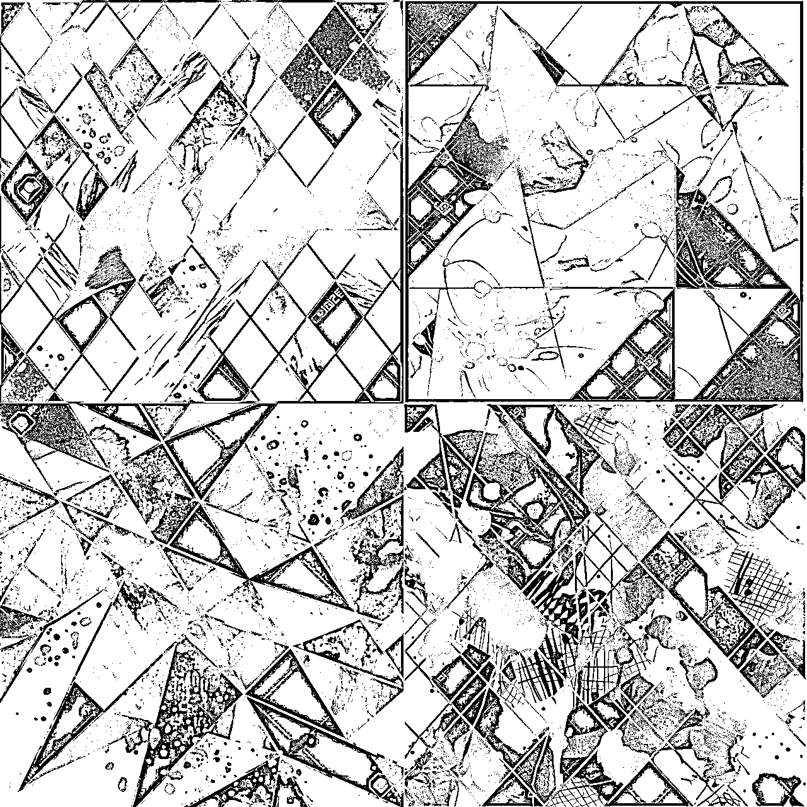

如果大家只要一幅装饰画，那么只要把集合这个词删掉就好：Art pAInting, geometric pattern, gold and black, white background, HD --v 5 艺术挂画，几何图案，金与黑，白色背景

### 18.2.3 整体装饰

室内设计，客厅，一个沙发，极简主义，侘寂风，原木色，温暖的阳光透过窗户，

Interior design, living room, a sofa, minimalism, wabi-sabi style, log color, warm sunlight through the window --v 5

## 18.3 常用关键词

再来复习一遍关键词公式：【设计类型】，【主体】，【主体设定】，【风格设定】，【质量词】+（质感词）

设计类型：室内设计 interior design、建筑设计 architectural design、椅子设计 chAIr design、餐桌设计 dining table design、沙发设计 sofa design 等等

主体设定：材质、形状、颜色等等风格：北欧风 Nordic style、包豪斯 Bauhaus、现代风格 Modern、田园风格 Rustic、复古风格 Vintage、地中海风格 Mediterranean、阿拉伯风格 Arabic、工业风格 Industrial、波斯风格 Persian 等等

质感词（有时候有效果）：坚硬 hard、柔软 soft、粗糙 rough 等去谷歌搜索一些著名的室内、建筑设计师，写进 MidJourney 会有惊喜：

菲利普·斯塔克（Philippe Starck）。法国设计大师，作品涉及产品设计、家具设计、室内设计等领域。代表作有皇家度假村酒店、法拉利车间等。以简洁和功能性著称。

扎哈·哈迪德（Zaha Hadid）。伊拉克裔英国女建筑设计师，被称为“女王建筑师”。作品以曲线流畅和前卫夸张著称。代表作有广州歌剧院、阿联酋摩天大楼等。

彼得·马里诺（Peter Marino）。美国建筑与设计师，擅长高端奢华风格设计。客户包括路易威登、香奈儿、迪奥等品牌。作品分布在纽约、巴黎、东京、米兰等全球各地。

潘妮露·琼斯（Patricia Urquiola）。西班牙室内设计师，作品风格简洁大方又不乏温馨惬意之美。曾为意大利设计品牌 Moroso、德国设计品牌 Walter Knoll 等设计产品和空间。

罗斯·班斯纳（Ross Lovegrove）。英国知名室内设计师和建筑设计师，作品风格流畅功能性极强。代表作包括伦敦 queens 大酒店和德国汉诺威体育场。

阿曼达·莱文达尔（Amanda Levete）。英国建筑设计师，风格简洁和富于创新精神。曾任 FOA 建筑设计事务所合伙人，代表作包括伦敦 V&A 博物馆外立面和葛兰者广场。

大卫·芝兰（David Chipperfield）。英国当代建筑大师，风格简洁素雅。代表作有柏林新博物馆、伦敦爱乐音乐厅翻新工程等。

目前，AI 绘画在室内装饰领域尚未探索出体系化的变现方式，大家可以尝试做个先驱者，躬身探索。

# 十九、AI 绘画如何应用于美甲设计 @饼公子

## 19.1 玩法介绍

用 AI 生成的图像做成美甲，也是目前比较热门的一个玩法，有些美甲店也会在线上开设 AI 美甲设计的账号，吸引更多流量：

可以用 AI 生成的抽象艺术或花卉图像转化为美甲贴纸设计，这类设计色彩鲜艳，充满未来感，会给人很强的视觉冲击力；可以用 AI 生成的人物肖像或动物图像作为美甲贴纸设计或直接绘画在指甲上，这类设计生动有趣，具有很高的个性化。

可以用 AI 生成的风景或建筑图像转化为美甲图案设计，如蓝天白云，层峦叠翠的山丘等自然风光，或者古典建筑的元素等都可以作为设计灵感。

## 19.2 如何实操

推荐工具：MidJourney

如何使用 MidJourney，可参考章节【四、学会用 MidJourney 完成 AI 绘画】关键词公式：【美甲】，【美甲类型】，【主体设定】，【风格】，【色调】，【质量词】

### 19.2.1 按色系出图

青色：

黄色：NAIl Art, Yellow, Intricate Black Pattern, HD --v 5

美甲，黄色，复杂的黑色花纹，HD

### 19.2.2 按甲型出图

尖型 Stiletto：

NAIl art, powder blue, Stiletto, simple white pattern, HD --v 5

美甲，浅蓝色，尖型，简单的白色花纹，HD

### 19.2.3 按风格出图

迪士尼：

NAIl Art, Disney, dark red, best quality --v 4

圣诞：

NAIl Art, Christmas, white and red, silver powder, glow, best quality --v 4 美甲，圣诞，白色和红色，银色粉末，发光，最佳质量

## 19.3 常用关键词

来复习一下关键词公式：【美甲】，【美甲类型】，【主体设定】，【风格】，【色调】，【质量词】

常用关键词列举：美甲类型：方形 square、圆形 circular、尖型 pointed、椭圆 elliptical、长尖 long pointed、口红 lipstick、芭蕾 ballet 等等

主体设定：亮片 Sequins、发光 Luminescence、珠光 Pearlescence、高科技全息 High tech Holography 等等

风格：艺术风格（如巴洛克 Baroque、洛可可 Rococo、奇异幻想 fantastic）、节日主题（新春 Spring Festival、圣诞 Christmas）、风格（简约 simple、复杂 complex、奢华 luxury、XX 品牌）、钻石珠宝 diamond jewelry、动物 animals、迪士尼 Disney 等等

色调：单色 Single color、混色 mixed color、多色 multi color、莫兰迪色 Morandi color 等等

## 19.4 变现方式

我们结合一个案例来看，AI +美甲如何完成变现？

号主 AI 魔法绘境，之前依靠垂直 AI 绘画美甲，涨粉 3W，赞藏 16 万。

点开爆款笔记可以看到，需求、尝试和问价的人不少，说明这是一个有市场、有需求、可转化的方向。这个账号证明 AI 绘画与美甲的结合是一个有潜力的方向，值得探索。

号主 AI 魔法绘境，之前依靠垂直 AI 绘画美甲，涨粉 3W，赞藏 16 万。点开爆款笔记可以看到，需求、尝试和问价的人不少，说明这是一个有市场、有需求、可转化的方向。这个账号证明 AI 绘画与美甲的结合是一个有潜力的方向，值得探索。

# 二十、AI 绘画如何应用于摄影 @饼公子

## 20.1 玩法介绍

真实的摄影照片往往需要摄影师亲自到场拍摄，AI 绘画的介入，则能让我们通过关键词的组合，产出更自由、不被地域光线等限制的照片。

通过写关键词，我们就可以展现出非常有质感的“照片”。比如延时摄影、高速摄影、慢快门、航拍、仰拍、光涂鸦、商业摄影、风光摄影、人像摄影等等。

AI 绘画在摄影的优势：

更加自由和创造性。AI 绘画不受摄影器材和场景的限制，可以自由发挥创造性，创造出全新的视觉效果和意象；

不受光线和色彩限制。AI 绘画可以自由控制光线方向和色彩搭配，不受现实场景的限制；作品更加抽象和概念化。AI 绘画可以将现实图像抽象和概念化，传达更丰富的内涵和意境；

极低成本构建场景，提前感受效果。

AI 绘画在摄影的局限性：

细节描绘较差，AI 绘画目前难以达到某些真实感和细节描绘的效果；

多主体描述存在较大问题，目前比较适合出一个主体的画面；对于非训练集中的内容，难以出现。举例：张家界在训练集中，可以出现，滕王阁不在训练集中，无法非常接近的出现。

## 20.2 如何实操

推荐工具：MidJourney 如何使用 MidJourney，可参考章节【四、学会用 MidJourney 完成 AI 绘画】

关键词公式：【摄影类型】， 【摄影师】，【镜头设定】，【主体】，【主体设定】，【用光】，【环境】，【颜色】，【质量】以下为大家列举几种 AI 绘画在摄影中的出图效果。

高速摄影：

High speed photography, by Harold Edgerton, closeup, green apple falling into water, splash, studio light, white background, best quality --ar 3:2 --v 5 高速摄影，来自哈罗德·埃杰顿，特写镜头，掉落在水中的青色苹果，飞溅的水花，影棚光，白色背景，最佳质量

航拍：

Aerial photography, by Cecil Beaton, black Mercedes G50, driving on a frozen lake, surrounded by forest, natural light,chiaroscuro, best quality --ar 3:2 --v 5

航拍，by 塞西尔·比顿，黑色奔驰 G50，行驶在结冰的湖面上，周围是森林，自然光，明暗对比，最佳质量

商业摄影：

光涂鸦：

Light graffiti, seaside roads, geometric shapes --v 5

光涂鸦，海边的道路，几何图形

## 20.3 常用关键词

关键词公式：【摄影类型】， 【摄影师】，【镜头设定】，【主体】，【主体设定】，【用光】，【环境】，【颜色】，【质量】

常用关键词列举：

摄影类型：高速摄影 High-speed photography、延时摄影 time-lapse photography、航拍 aerial photography、GOpro、光涂鸦 light graffiti、商业视觉摄影 commercial visual photography 等等

摄影师：安妮·莱博维茨 Annie Leibovitz、多罗西娅·兰格 Dorothea Lange、塞西尔·比顿 Cecil Beaton、哈尔斯曼 Halsman、安格斯·麦克比恩 Angus McBean、伊芙·阿诺德 Eve Arnold、欧文·佩恩 Irving·Penn、贝伦尼斯·阿博特 Berenice Abbott 等等镜头：广角 wide angle、中景 medium shot、鱼眼镜头 fisheye lens、蔡司镜头 Zeiss lens、佳能 Canon、奥林巴斯 Olympus、景深 depth of field、DOF，高感光度 high sensitivity，低感光度 low sensitivity 等等

角度：第一人称视角 POV、仰拍 Upward shot、俯拍 downward shot、极低角度 extremely low angle、特写 close-up 等用光：逆光 Backlighting、顺光 Front Lighting、剪影 Silhouette、顶光 Top Lighting、舞台光 Stage Lighting、伦勃朗光 Rembrandt Lighting、丁达尔光 Tyndall Lighting、自然光 Natural Lighting 等等

质量词：超详细 Ultra detAIled、精细 detAIled、最好的质量 best quality、非常精致和美丽 very delicate and beautiful、高分辨率 high resolution、8k、HD 高清、非常详细的 CG very detAIled CG，非常详细 very detAIled，杰作 masterpiece 目前，AI 绘画在摄影领域尚未探索出体系化的变现方式，大家可以尝试做个先驱者，躬身探索。

# 二十一、更多 AI 绘画玩法🔥

## 21.1 AI 绘画落地案例合集

@AI 绘画师日记 星球的成员 整理了一份涵盖面比较广的 AI 绘画落地案例合集，其中谈到 AI 绘画与手账、纹身、口播视频等当下热门话题的结合玩法，大家可以点击文档查看细节，或许你能从中找到自己在 AI 绘画中的切入口。

本章节为部分案例简介，更多完整案例点击下方链接：

AI 绘画一本通（50 落地案例）

AI 绘画+手账：

在制作手账过程中可能会遇到时间不够，缺乏灵感和创意、绘画技巧不足等困难。准备各种材料和工具也需要花费时间和成本。AI 可以很好解决这些问题。

📌

关键词

AI 绘画+纹身：

AI 绘画生成纹身图案可以让我们尽情发挥无限创意。只需输入一些关键词和意向，就能生成多种多样、独一无二的纹身设计。无论是想要别具一格的水彩风格还是浓郁的传统风格，我们都能够轻松找到完美的纹身图案。

📌关键词

魔法词：（tatoo pattern）纹身图案

公式：纹身图案+排列（Arrangement）+风格+主题

辅助词：Animals（动物），Flowers（花），Black and white（黑白），Simplicity（简约），Animation（动画），

Traditional style tattoos

传统风格的纹身

使用饱和度高的颜色、粗线和简单的图案，常见的图案包括心形、青蛙、老鹰、鹰爪、蛇等。

AI 绘画+教育教材插图：

制作教育教材插图时，我们经常会面临版权问题以及创意约束。制作教育教材插图需要一定的技术功底和时间成本。操纵图形设计软件、掌握插图绘制技巧和调整色彩等都需要一定的学习和实践。如何通过 AI 解决呢？

📌

关键词

魔法词：educational illustration（教育插图）vector illustration（矢量插图）

公式：主题+educational illustration（教育插图）+vector illustration（矢量插图）

Charts and graphs of charts and graphs, charts containing graphs and graphs committing charts, the charts and graphs have charts and graphs inside them 图表和图形的图表，包含图表和提交图表的图表，图表和图形在其中有图表和图形

用于展示数据、统计信息和关系，如柱状图、折线图、饼图等。

## 20.2 AI 绘画变现思路合集

本章节以下内容，更多展现的是大家可尝试的变现方向或思路，部分来源于圈友实操经历，部分来源于风向标。这里不对思路做详细拆解，仅做简单介绍，主要用途是希望帮大家打开变现思路。

AI 绘画+创意字：AI 创意字存在各式各样的场景当中，可以是一张车水马龙的图片、一张精美的海报，也可以是各种人物的影子、衣服、帽子等等，这种有趣的 AI 创意字都是用 SD 生成，通过 controlnte 约束就能制作出来

🔥亮点：足够新颖，吸引眼球，且很多人不了解背后原理，能打信息差参考资料：

《AI 创意字如何制作？如何变现？》@吴东子（视频版教程）

《爆肝 7 天！AI 创意字终极攻略，光影、隐藏、嵌入、海报 4 种创意字全拆解！》@吴东子（文字版教程）

AI 绘画+私人定制：用 AI 绘画结合用户需求，按要求完成私人定制，即可收取佣金，前期可以在抖音、小红书、B 站等平台发布私人订制类作品，随后引流到私域，接定制变现

🔥亮点：老照片的玩法反复火，由此可以窥见定制服务的市场需求，私人定制能延伸出许多意料外的新需求参考资料：

《AI 绘画 + ChatGPT + 生日定制祝福》@七小

《AI 绘画老照片修复进行接单变现》@老旺《AI 绘画生成奶奶的虚拟数字人》@土豆君

AI 绘画 + 十二星座：

AI 绘画星座类账号，现在在小红书上已经算是单独的赛道，核心就是将十二星座拟人化，主要是接定制和课程、以及广告

🔥亮点：赛道垂直，人群比较精准，且互动率高，很容易激发用户的评论和点赞。封面一般会做会汇总化的展示，极易引起用户点击和收藏的欲望。

参考资料：《AI 绘画 + 十二星座成为小红书爆款》@纳兰乘风

AI 绘画 + 公众号流量主：

AI 绘画目前在公众号上的玩法，主要是辅助出图，比如根据真实图片生成 AI 图，能降低发文风险，或者生成美女图片，搭配情感类文章，文章流量不错🔥亮点：两种玩法结合，实现 1+1＞2 的效果，且操作很简单

参考资料：《AI 绘画 + ChatGPT + 追热点：12 天收益 39900+》@妞妞

《AI 绘画+公众号，广告主变现》@奇点

《公众号写作流量主变现之美女图片方向》@叶华《公众号流量主，ChatGPT + AI 绘画，3 天入池，5w+》@元彻

AI 绘画+资料引流/知识付费：

信息差玩法，通过售卖词汇、教程、课程、资料，或引流到社群完成变现，产品成本基本为 0，但依赖流量和产品的交付，制作钩子和挖掘关键词素材是项目要点。

🔥亮点：目前衍生出 AI 绘画+唐诗/简历等新玩法，方式新颖，变现空间不错

参考资料：

《吃透红利！AI 绘画赚钱指南引流变现全案（保姆级教程）》@老旺《小白 30 分钟能跑通的高上限 MVP :创业粉引流-喂饭级教程》@苍述

《AI 绘画 + 唐诗 300 首，12 个视频涨粉近 4000》@Daemon《AI 绘画自动生成简历，可在小红书、微博引流》@上川书记

《AI 绘画出图 + 虎扑引流》@姚麻

AI 绘画 + 网盘拉新：

在小红书、知乎绘制 AI 图并发布→将图片放入网盘→创建群聊→设置公告→私信后发网盘链接，只要有用户注册或付费，就有收益参考资料：《AI 绘画变现思路分享》@蕃茄

AI 绘画+动画制作 @刘楚宾

在过去，动画制作需要庞大的制作团队和昂贵的设备。一个制作周期可能需要数百人和数年时间才能完成。但是，随着人工智能技术的不断发展，制作动画的过程变得更加高效、快速和简单。

在未来，你可以通过一个人工智能动画制作软件，就可以轻松地制作出一部高质量的动画。这个软件将根据你提供的素材和指令，自动化地生成人物角色、背景和动画场景。它会利用机器学习和深度学习算法来分析和理解你的意图，从而生成出逼真的动画效果。

不仅如此，这个软件还可以通过深度学习技术自我进化，不断优化自身的生成效果和质量。这将大大减少人工智能动画制作的时间和成本，让更多的人可以参与到动画制作中来。

此外，随着虚拟现实技术的发展，未来人工智能动画制作也将会变得更加逼真和真实。你可以利用虚拟现实技术，让人物角色和场景真实地呈现在你的眼前，甚至可以亲身体验到动画中的故事情节。

当然，人工智能技术也带来了一些新的挑战和问题。比如，人工智能制作的动画缺少人类的情感和创造力，难以表达出更深层次的情感和细节。此外，由于人工智能技术仍然处于发展初期，一些不可预知的错误和问题可能会在制作过程中出现。

总的来说，随着未来人工智能技术的不断发展，动画制作将变得更加高效、快速和简单。人工智能动画制作软件将会成为制作动画的主流方式。但是，我们需要认识到，人工智能只是一种工具，它并不能完全替代人类的创造力和想象力。在动画制作中，人类的想象力和创意是至关重要的，它可以为动画注入灵魂和生命力。

更多玩法可参考 AI 绘画变现案例合集，其中内容根据生财有术星球帖整理而来：

《AI 绘画变现案例合集》@生财有术 AI 绘图作为目前的大热门项目，无数人在扎堆学习，也有无数人在琢磨如何用它变现。毋庸置疑的是，AI 绘画领域有无限的变现机会与探索前景。

我们鼓励大家积极下场，多尝试、多做图、多发布。与其在观众席等待比赛结果，不如先行下场，或许你就个开启 AI 变现新时代的第一人。

新手就是靠执行力，在找准方向后，执行力到位，是可以收获自己第一桶金的。

最后，AI 绘画也将会不断面临新的挑战和问题。比如说，如何平衡艺术创作和商业需求，如何保护版权和隐私，如何解决 AI 算法的伦理和安全问题等等，这都是 AI 绘画在未来需要持续关注和探索的问题。

未来，AI 绘画将会在技术、应用场景和社会影响等方面不断发展和壮大，为我们的生活和工作带来更多的惊喜和便利。

