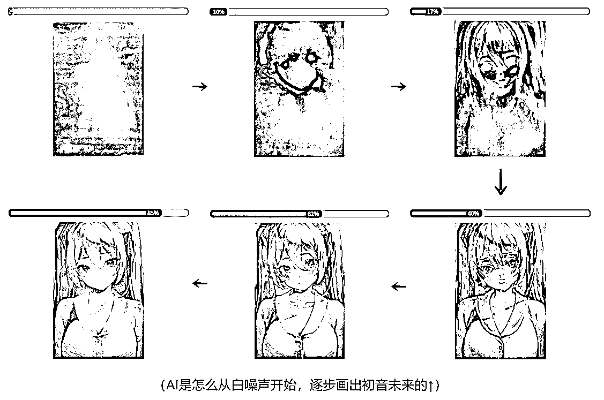

# 1.1 AI 绘画的历史与发展

AI 绘画的整个发展史，总体而言有这样几个关键节点。

第一个节点：GAN 的时代

“旧纪元时期”，彼时 AI 绘画的方案还是 GAN。GAN 这种方案就是训两个模型，一个造假，一个判真，两个模型相互卷，直到卷到造假的模型能造出 “以假乱真” 的图片时，就算练成了。但 GAN 有个致命缺陷叫做 “鞍点问题”，它造成 “模型训练过程中，数据处理的难度很大”，而且数据越复杂、越多样，难度就越大。这时的模型是很不稳定的，自然也不可能依托它形成什么商业模式。

第二个节点：一篇论文，带来新的范式

2020 年发布的开创性论文《Denoising Diffusion Probabilistic Models》，带来了一种新的图像生成范式。用这个方法生成出来的图片效果非常好，比 GAN 要好的多，而且不存在 GAN 的缺陷，由此，这种新范式突破了实用化的临界点。（PS：这就是为什么后来的模型多叫做 XX Diffusion 的原因。)

Diffusion 算法的原理是先将一幅画面逐步加入噪点，一直到整个画面都变成白噪声，记录这个过程，然后逆转过来给 AI 学习（当然不只是一副画，而是极大数量的画）。从 AI 视角看，就是学习一副全是白噪声的画面，怎么一点点去除噪点变清晰，直至变成一幅画。用说的可能不清楚，我弄一组图片在下面，大家看了就明白了。

虽然新范式出现了，但此时还是不具备爆发的全部条件。这一时期出现了很多运用 Diffusion 技术的模型，比如 DALL-E 系列，MidJourney 等等，它们都有非常不错的效果，例如使用 MidJourney 创作的画作《太空歌剧院》就在美国科罗拉多州博览会的艺术比赛中获得了第一名，引发了媒体的竞相转载，以至于在指数工具里飙出了一个很高的 “异常值”，但因为它们要么是彻底闭源的，要么是只开放一些 api，所以 “异常值” 飙的快降得也快，最终没有特别出圈，停留在了新闻和少量技术尝鲜者中。

第三个节点：优秀的开源模型出现

2022 年 8 月份，Stable Diffusion 模型的开源给“AI 绘画的爆发”补上了倒数第二块拼图，这个模型的生成图像效果丝毫不逊于 DALL-E 系列，MidJourney 等商业模型，而且还有优良的开源社区支持。最重要的是，它在“大模型”家族里算是比较小巧的，个人设备也可以完成推理过程。

第四个节点：爆发，二次元的破圈力

2022 年 10 月份，基于 Stable Diffusion 但 “二次元专精” 的 NovelAI 模型发布当天被黑客泄露事件，彻底引爆了 AI 绘画，事件影响大大超过了绝大多数人的预期，AI 绘画作为大部分时间里一直默默无闻的新技术，被一瞬间推进到公众讨论阶段。

时至今日，AI 绘画在全球已经有了非常良好的开源生态，越来越多人将 AI 绘画运用到各行各业，衍生出许多行之有效的新玩法。例如包装领域、插画设计、AI 模特、产品定制、美甲设计等……期待能跟大家一起在新领域碰撞出新火花。

