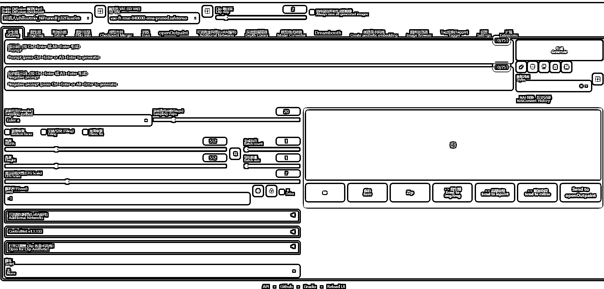

# 1.3.1.2 Stable diffuison

•出图网站：需要下载安装到本机使用，或者使用其他人简化开发好的软件、小程序。

•模型开源信息网址：[`github.com/AUTOMATIC1111/stable-diffusion-webui`](https://github.com/AUTOMATIC1111/stable-diffusion-webui)

•使用门槛：界面复杂，新手上手较困难，如果是本地版，因为开源，所以免费，但是对电脑配置有要求（后文【Stable diffusion 安装使用细节】中会提到）

•详细教程：【五、学会用 Stable Diffusion 完成 AI 绘画】

Stable diffuison 是一个开放的大模型（开源）系统 + 若干特化小模型，任何人都可以借助其代码，训练自己想要的大模型或者小模型，或者开发相应的插件。

但相应地，对描述词与模型有很高的要求。不同的描述词搭配不同的模型，图片的风格也会有天差地别。如【1girl+二次元模型】，就是一张二次元的女孩图片；【1girl+真人模型】，出来的就是 3D 真人图片。

Stable diffuison 有一个官方的大模型，加一个官方的用户操作界面，类似一个初始安卓机（如下图，原页面是纯英文，此处已做汉化）。

上述两个主流出图工具，我们一般简称 MJ（即 MidJourney）和 SD（即 Stable diffuison），也是本次 AI 绘画航海中，我们主要会讲的两大工具。

除此之外，本次手册我们还新增两个 AI 出图工具教程，方便大家学习：

•MEWX AI：国内出图平台，依托于小程序，详细教程👉简易方法：学会用 MEWX AI 完成 AI 绘画

•Vega AI：操作流程更加简化的，国内在线出图工具，页面简单，目前免费，新人上手快。详细教程👉学会用 Vega AI 完成 AI 绘画

如果你想尽快上手 AI 绘画，可以先尝试 MEWX AI，作为国内小程序，他的出图操作更加简单；

但如果你想要探索更多更广阔的 AI 绘画世界，MJ 与 SD 是必须了解的两大工具。

