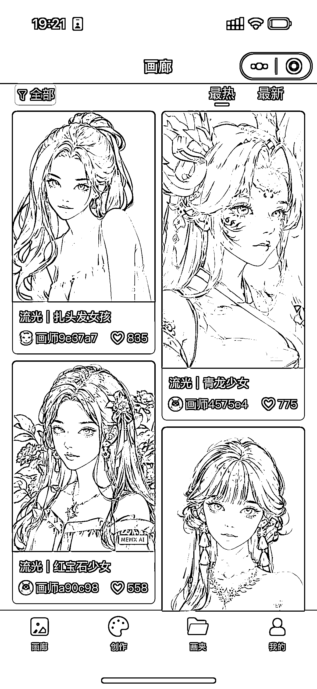
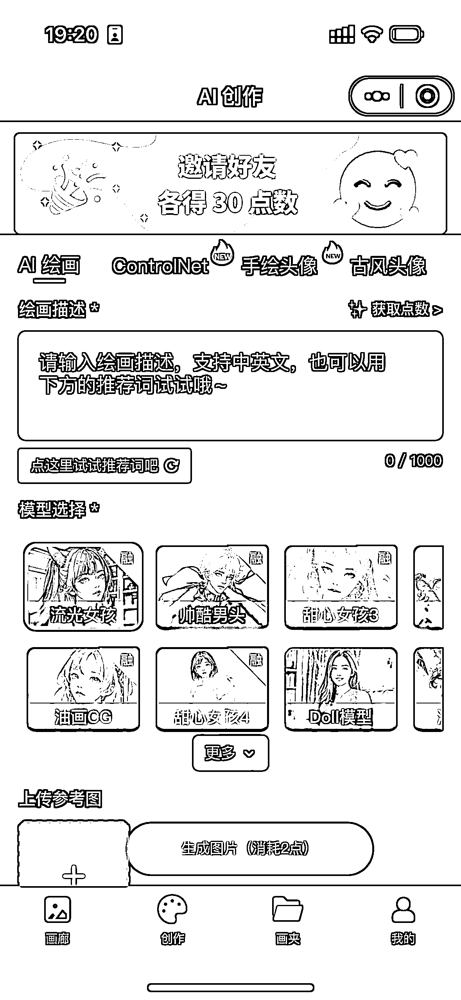
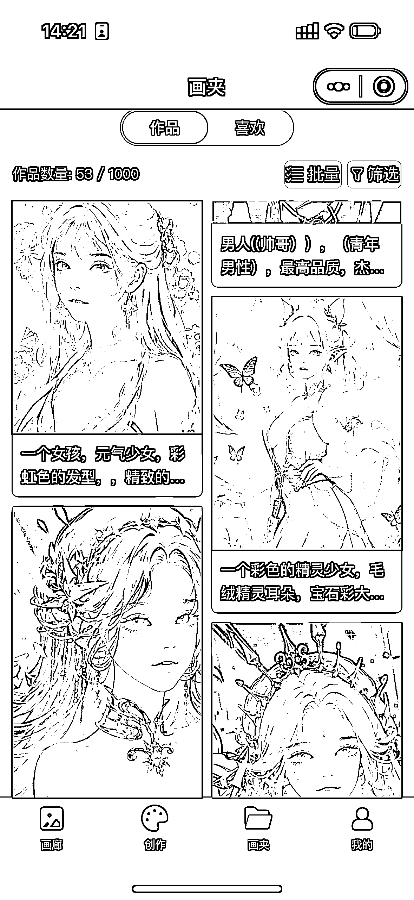
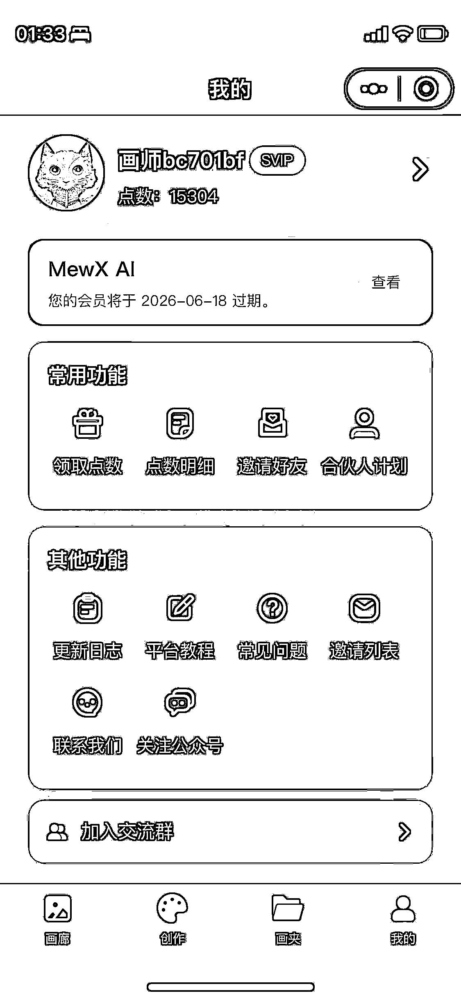
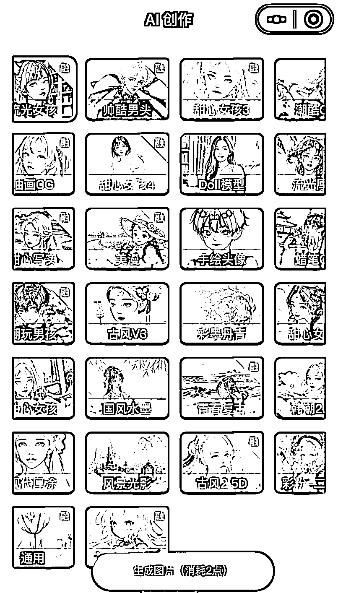

# 2.2 了解 MEWX AI

MEWX AI 小程序主要页面只有 4 个：

•画廊页面：画廊里的都是精选作品。如果写词没有灵感，可以来这里翻阅一下大家的创意和写词技巧，新手也可以来画廊里选择自己喜欢的一键画同款试试。

•创作页面：为我们主要的创作地，在这里不仅可以写简单的词描述生成图片，还可以一键把你的照片转成各种漫画风，也可以使用高级功能如 ContrlNet 等。

•画夹页面：你创作过的作品都可以在你的画夹页面找到。除非是个人主动投稿，否则个人作品都属于私人作品，不会被公开到画廊。

•我的页面：我的页面里展示了关于你账号的一些信息，和一些额外的功能。

画廊页面

创作页面

画夹页面

我的页面

我们出图，主要使用的就是【创作页面】，而在创作过程中，除了我们会输入的关键词或图片，影响出图的另一大因素就是各类模型。

模型可以说是影响图片生成最大的因素，同样的关键词，在不同的模型下表现可能完全不同。

一个模型，笼统来说代表了一种画风和一种表现手法。在合适的词下选择合适的模型，是很充分必要的。

目前 MEWX AI 提供了各类不同的模型供大家选择，其中古风 V3、流光女孩等，使用频率较高，深受喜欢。

具体模型的风格大家可以查看每个模型封面图效果：

