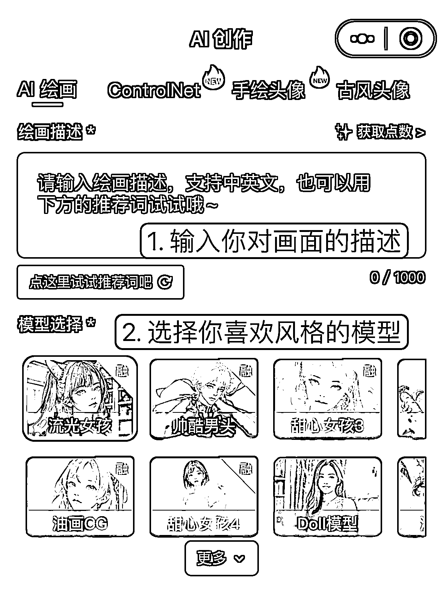
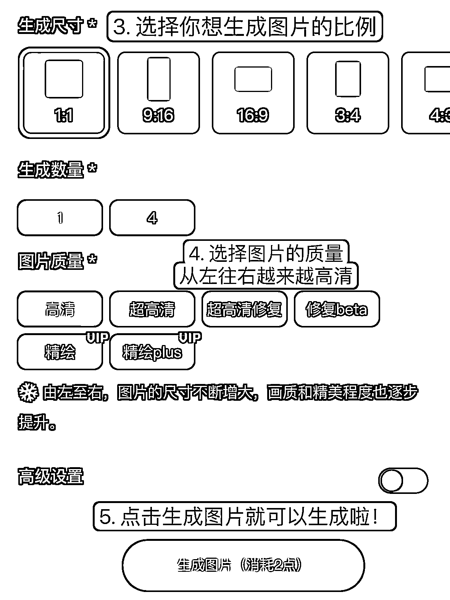
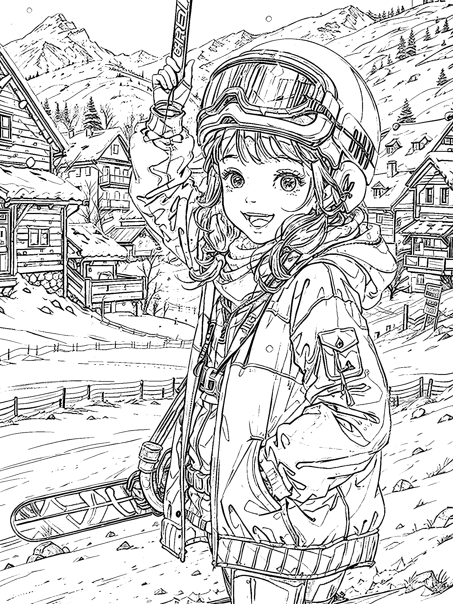

# 2.3.1 常规方法一：纯文字生成图片

用语言告诉 AI 你的需求，即文生图，输入对图片的描述，要求 AI 由你的文字生成画作。

可以输入短语、词语的组合，支持中文、英文，也支持中英文混合输入。

第一步：在【绘画描述】输入你对画面的描述，如果不知道输入什么，也可以查看输入框下方的推荐词。如果想要有更多自己的风格，可以👉【六、学习描述词】查看关键词如何组合使用；

第二步：选择自己喜欢风格的模型，主要有流光/国风/二次元/真人/通用几个大类型可供选择；

第三步：选择想要生成的图片比例、数量；

第四步：选择图片质量，越高清的图片，需要的消耗的点数越多；

第五步：生成图片

绘画描述是最重要的一项，它决定了你的图片里会有什么元素。但也不要一股脑的什么单词短语组合都往上堆砌，可能会让 AI 无法理解你的表达。

这里的原理是什么呢？

用文字描述图片特征后，AI 解析了我们输入的词组和短语后，去生成我们想要的画作。

例如：

关键词：一个开心笑的小女孩，在滑雪场滑雪

可以看出，AI 会根据我们的描述词来生成图片。描述词描述的越清晰越详细，作图就会越准确。而我们没有描述到的画面内容，AI 可能会自由发挥。

•MEWX AI 关键词小技巧•可以加一些修饰词来保证高质量，例如 Masterpiece， best quality， 8k 等。•对某些需要强调的词可以加（）括号来加强权重，一个括号是 1.1 倍的权重，或者例如直接写 （word: 1.6），给这个 word 提升为 1.6 倍的权重。•若想要单人，但画面出现多人，可以在关键词前加 solo 或者独奏。

