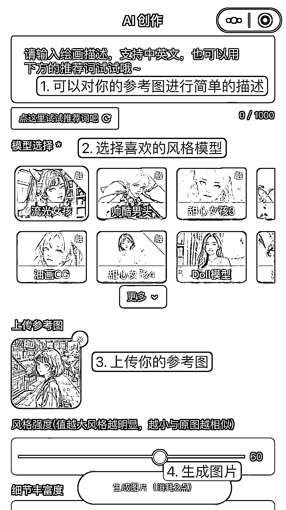

# 2.3.2 常规方法二：参考图生成图片

用图片告诉 AI 你的需求，即图生图，要求 AI 用你选定的风格画出一张类似的作品。

第一步：在【绘画描述】写下你的绘图描述；

第二步：选择你喜欢的风格模型；

第三步：上传你的参考图；

第四步：调整风格强度，一般为 30～80 之内会比较好；

第五步：生成图片

这种方式是你可以上传一张参考图作为生成图的基底，可以是一张照片也可以是一副草图等等。AI 会结合你的参考图与你的绘画描述和选择的模型风格，共同完成画作。

这里值得注意的是，上传参考图后，下方会出现一个叫做风格强度的值。这个值越小生成图会与原图越相似，这个值越大生成图越像你在第二步选择的风格。

大家做的真人漫改头像，也是一样的方式。风格强度调低，就比较接近真人，在此基础上，我们可以根据需要再选择不同模型风格。

