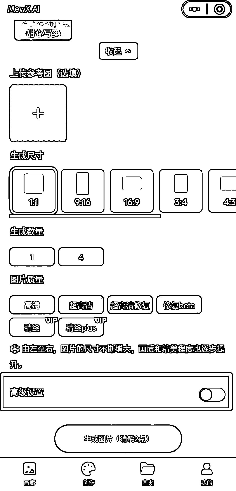
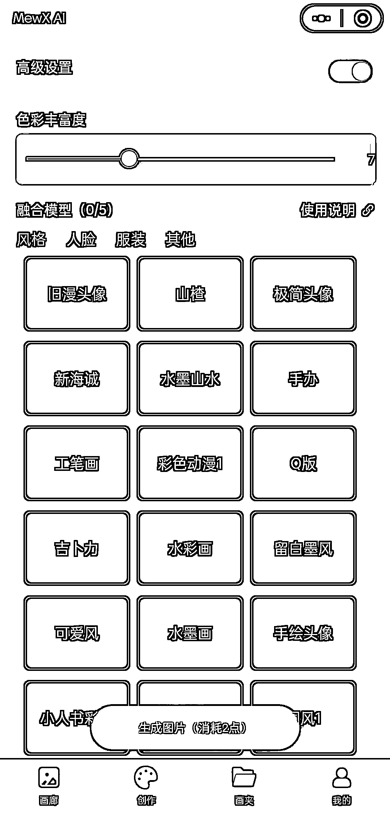
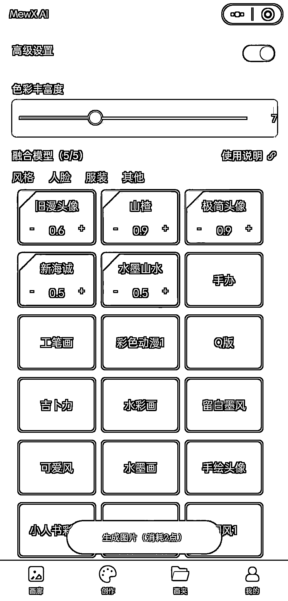
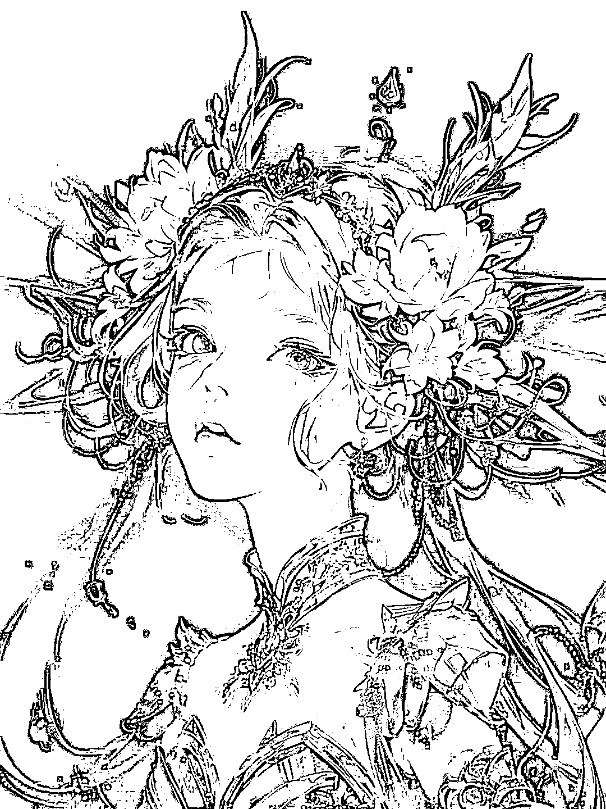
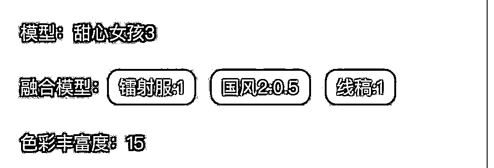
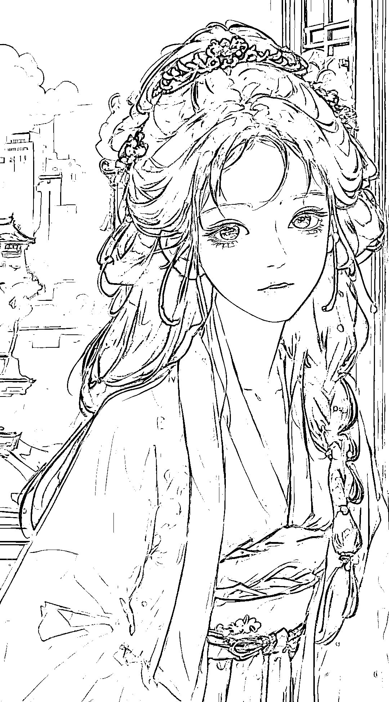
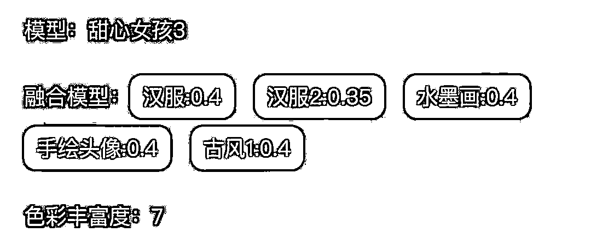
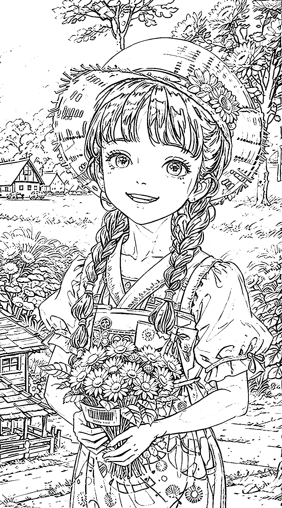
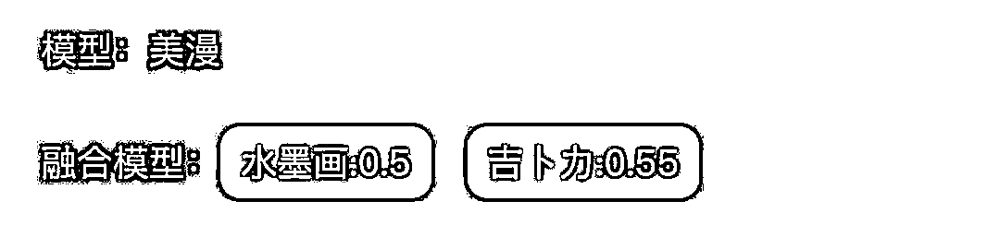

# 2.3.4 高阶玩法：LoRA 模型融合创作

融合模型即为 LoRA，全称为 Low-Rank Adaptation of Large Language Models。

•什么是 LoRA（融合模型）？

LoRA 是一种体积比较小的绘画模型，不同于【基础模型】中只能选择一个大模型进行作画，LoRA 可以在已选择大模型的基础上添加一个或者多个，从而融合出不同的画风和人物特征。

•如何使用 LoRA（融合模型）？

在 MEWX AI 的【创作页面】，我们进行常规绘图创作后，能看到底部有一个【高级设置】，点开它，就能看到一系列融合设置：

你可以在高级设置里选择你想要的融合模型，以及调整其比例。

目前 MewXAI 已上线 34 款不同的融合模型，每个风格的参数比例可以自由调整，范围在 0-2 之间。一次做画最多支持融合 5 个，建议将参数比例调整为 0.2-1 之间，参数越高，生成图片的该风格强度也就越高：

不同的模型搭配不同比例的 Lora，会产生奇妙的化学反应，大家可以多多探索，尝试出自己喜欢的风格，例如：

•注意事项•具体参数比例的调试非常重要，可以先加低比例的融合模型先试试，然后逐渐调整比例；•有时候添加太多或者比例设置太高并不会让结果变好，反而可能会造成崩图。若效果不好，请多次调试，打造自己最满意的风格。

MEWX AI 中还有许多有趣玩法，例如线稿上色、人脸修复、服装设计等，这里不做更多展开，大家积极探索即可～

