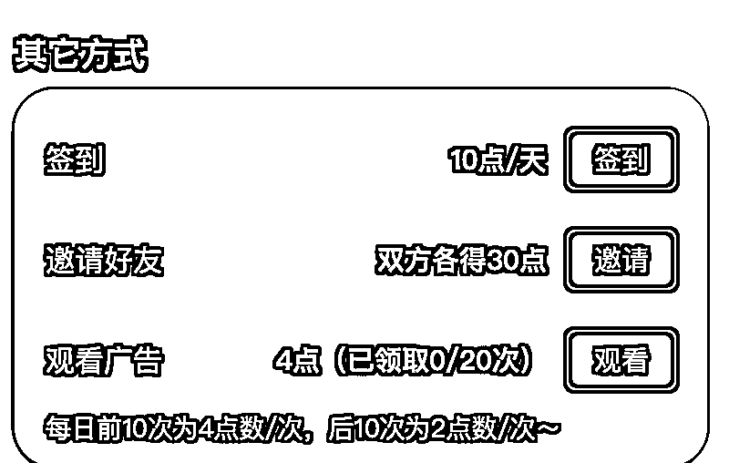
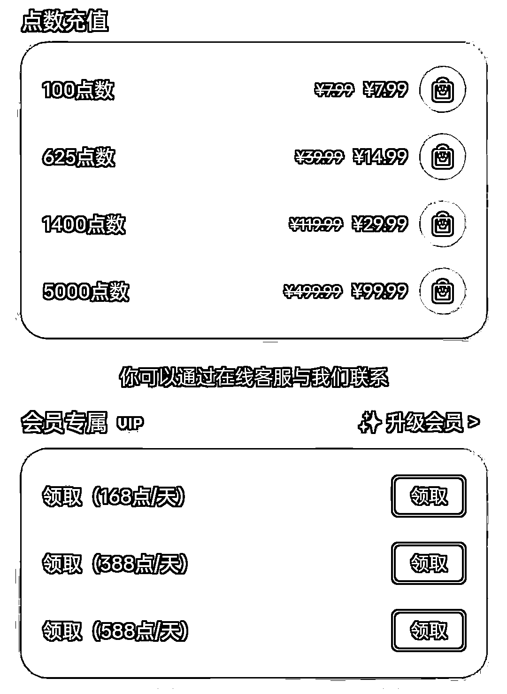

# 2.1.4 使用规则

该平台的步骤操作都是有消耗的：

•每次出图操作会消耗 2-8 个点数，普通用户初始免费点数为 30 点；•每日任务可获赠 70 点数的免费额度（下图所示）；•邀请好友，双方可以各得 30 点数；•如果后期出图熟练，按平台的免费点数，约能出 8～30+图片，对于普通的图文账号玩家来说完全够用。

如果想要获得更多操作点数，可以通过充值或升级会员来实现：

每日任务：免费获取点数

充值或开通会员，获取更多点数

除此之外，为了让大家能够更好的上手 AI 绘画，我们联系了该程序的团队，为大家争取到了两项福利：

•初始免费点数由 30 点升级为 1200 点；

•21 天航行期，充值会员可以享受 7 折优惠

1200 点免费点数，将通过兑换码的形式发放给【5 月航海｜AI 绘画】的船员们，具体发放步骤到时候关注航海大群即可。

因为制作图片需要的 GPU 资源，这个资源需要作者付费购买，所以无法不限量供应，本次航海主要是带你上手 AI 绘画，送的次数就已经够日常使用。如果你有额外的商业需求，需要大量绘图，可自行购买次数或充值会员。

