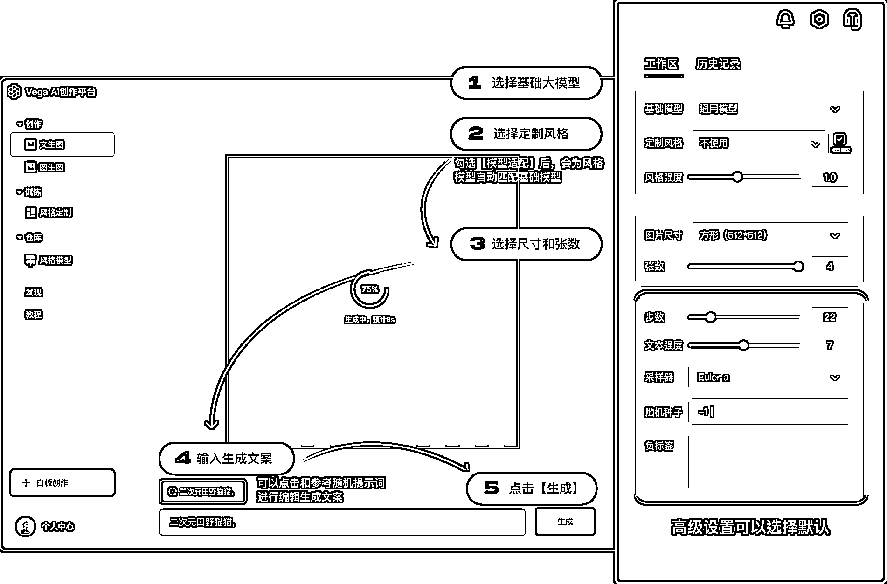

# 3.1.1 玩法一：文生图

进入官网（[`rightbrain.art/`](https://rightbrain.art/)）后，基础操作步骤如下：

•第一步：在右侧工作区选择【基础模型】

•第二步：在右侧工作区选择【定制风格】，建议勾选模型适配

•第三步：在右侧工作区选择尺寸和张数

•第四步：在页面下方的输入框里，输入你的生成文案，即关键词

•第五步：点击【生成】，完成出图，即如下图所示

下面我们来说一下每个步骤中，涉及到的名词是什么？如何使用？