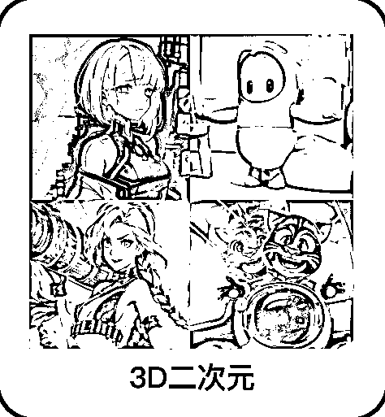
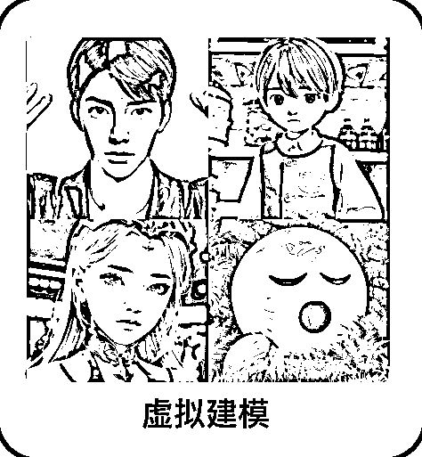
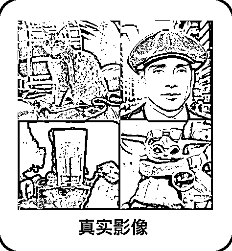
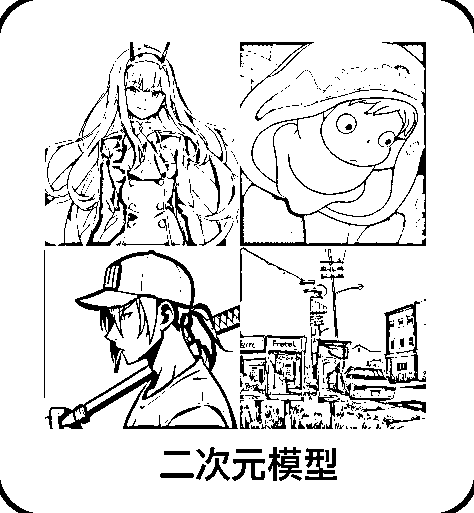

# 3.1.1.1 基础模型（核心）

「基础模型」作为文生图以及模型定制的基底大模型，可以按照以下场景进行选择。

Vega 提供的基础大模型适用案例如下：

基础模型：写真适用场景：亚洲人、真人写真、coser、少年感、少女感

基础模型：3D 二次元适用场景：偏 3D 的动画人物、游戏道具、游戏人物

基础模型：虚拟建模适用场景：建模虚拟人、有光泽的场景和物体

基础模型：真实影像适用场景：宠物、电影人物、工业设计、包装设计

基础模型：二次元适用场景：偏平面的二次元人物、动画场景

