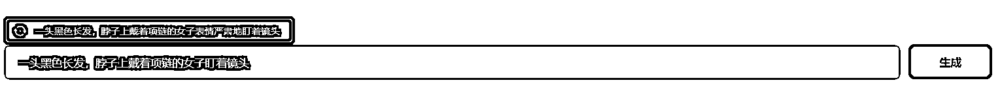
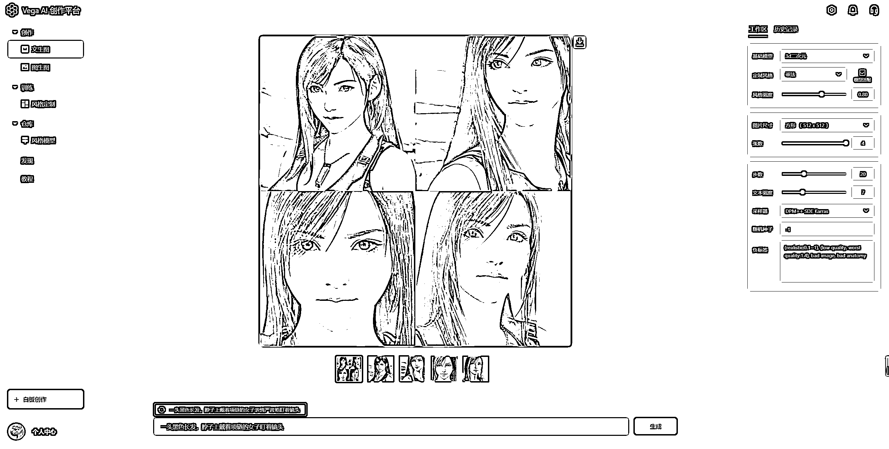

# 3.1.1.4 输入生成文案

输入框上会有提示文案，例如“一头黑色长发，脖子上戴着项链的女子表情严肃地盯着镜头”。点击提示文案左边的更新按钮，还可以更新推荐文案。

•点击文案：直接进到输入框

•根据文案的主体描述，进一步编写文案，如提示文案主体是女子，即可以用女子作为对象进行创作，丰富你的描述关键词，最终生成自己想要的图片。

当然，你也可以按照自己的想法，不参考系统推荐，完全由自己撰写描述词，生成自己想要的图片。

如果想要有更多自己的风格，可以👉【六、学习描述词】查看关键词如何组合使用；