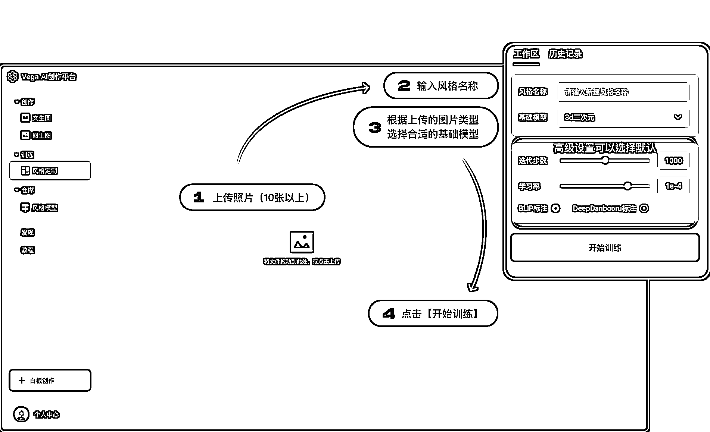
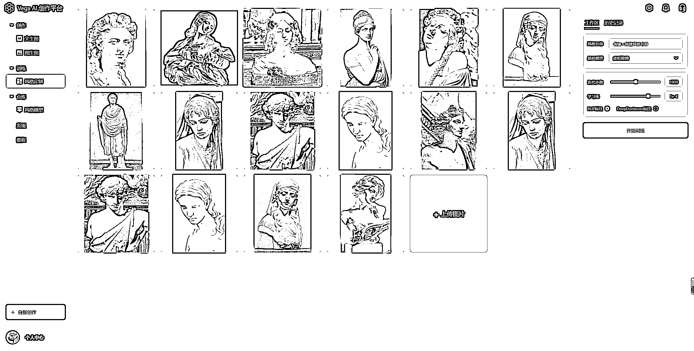
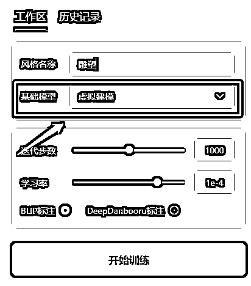
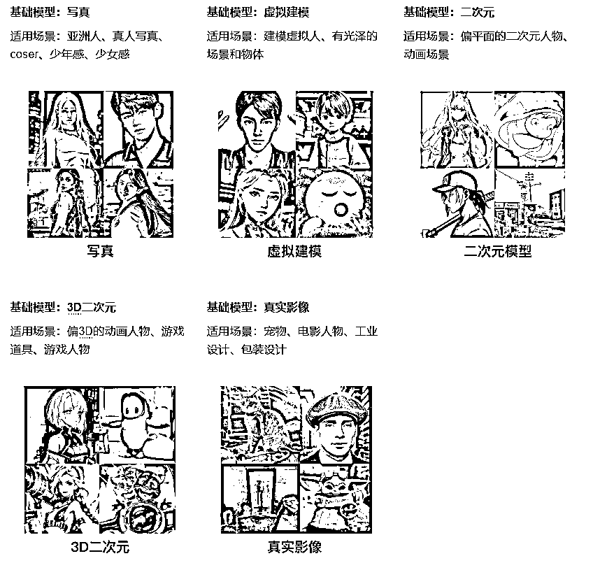
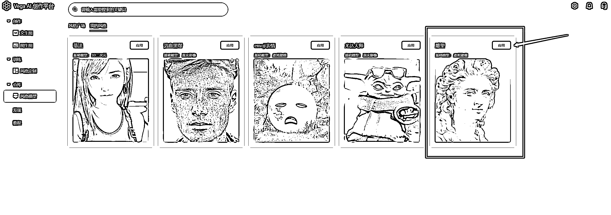
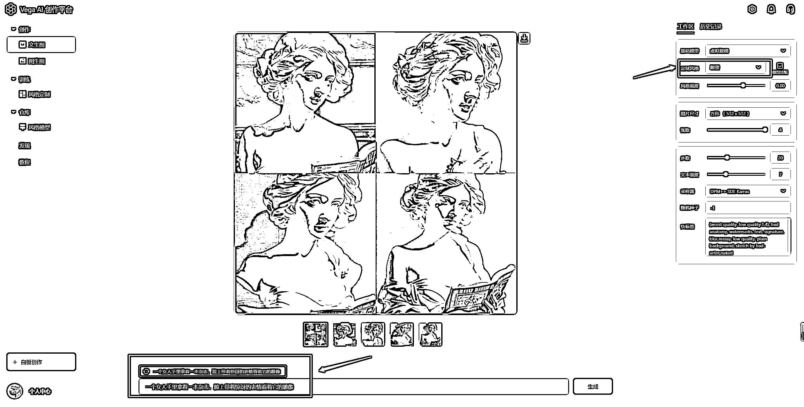

# 3.1.3 玩法三：风格定制

风格定制，即由你自己挑选同一类型的图片 10 张以上，在线训练出自己的专属风格。

原图质量越高，数量越多，效果越好：

第一步：准备图片

•图片类型：如同一人物、同一画风、同一物体、同一纹理、同一材质、同一姿势等

•图片数量：10-100 张之间，图片数量越多效果越好

•图片大小：建议分辨率在 512x512 像素以上

•图片的内容：建议保持主体一致，避免主体元素过小

第二步：上传图片

左侧菜单栏【训练】—>【风格定制】，点击「上传照片」或使用鼠标进行拖拽上传：

第三步：选择训练参数（很重要！！！)

•「风格名称」：“定制风格”模型的名称

•「基础模型」：选择基础模型（很重要！！！)

• 不同基础模型训练效果差别很大，认真选择～基础模型的推荐，可以参照【3.1.1.1 基础模型】

• 高级设置：建议使用默认参数即可～

第四步：开始训练

点击「开始训练」：耐心等待约 15 分钟，等待时间内可以进入其他页面进行操作，训练完成将会有弹窗提示。

第五步：使用风格模型

1）「风格定制」—> 我的模型 可以查看到刚才训练的模型，点击去应用

2）「文生图」选取训练的风格，输入文案即可进行创作

