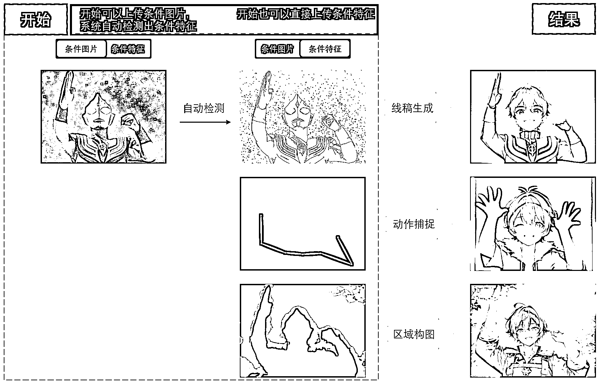

# 3.1.4 玩法四：条件生图

•条件控制有三种方式：分为线稿生成、动作捕捉以及区域构图；

•条件输入有两种形式：条件图片（普通图片即可）、条件特征（线稿、姿态图或者色块图）；•使用“条件图片”，系统就根据选的“条件图片”生成“条件特征”去输入来生图•使用“条件特征”，系统直接使用用户上传的“条件特征”作为输入来生图

•方便理解，举个例子，我们在右侧配置“条件控制”选择“线稿生成”•如果选择“条件图片”，上传普通图像以后，系统会自动提取它的线稿，指引生成新的图像，你可以在条件特征里看到对应的线稿•如果选择“条件特征”，那就需要自己上传线稿、姿态图或者色块图，系统直接根据条件特征生成新的图片

下面我们来具体讲讲条件生图的三种方式。