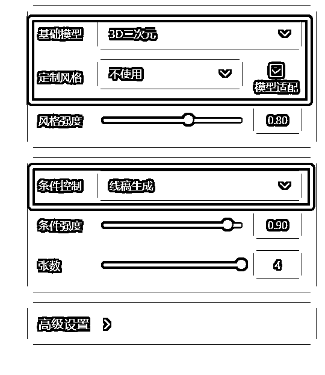
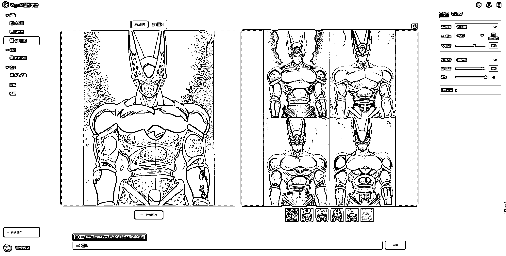
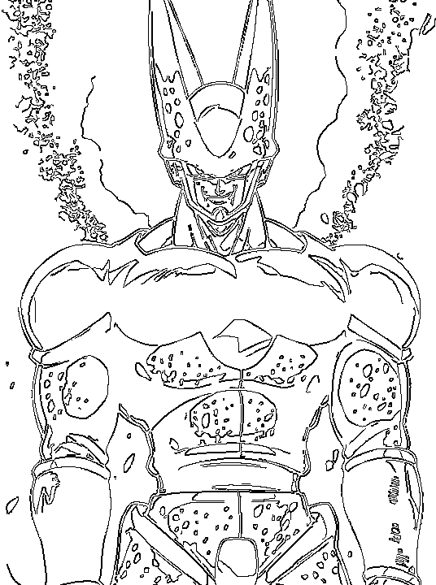

# 3.1.4.1 线稿生成

•第一步：右侧设置区选择「线稿生成」， 选择需要的模型和风格👇

•第二步：画布区我们选择「条件图片」，并上传一张图片👇

•第三步：输入文本描述词（可以选择合适的推荐词）

•第四步：点击生成，等待几秒就可以生成和原图线稿类似的新图了

•点击「条件特征」可以看到原图的线稿，我们可以在这个线稿基础上继续生成：

Plus:

也可以在第二步时，在画布区直接点击「条件特征」上传线稿，类似于上图 👆，直接用线稿生成新图。