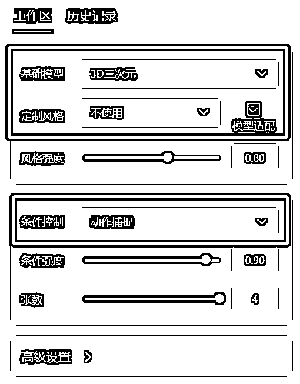
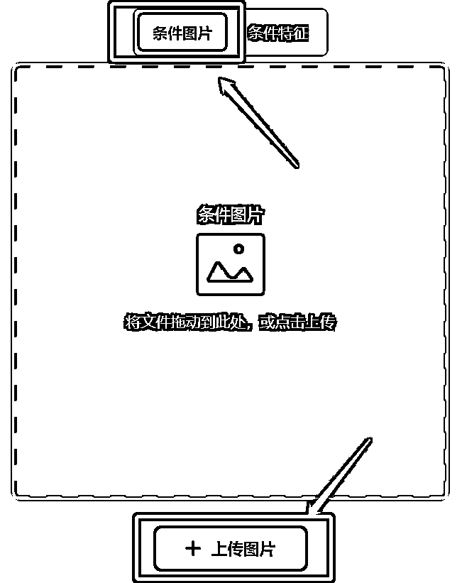
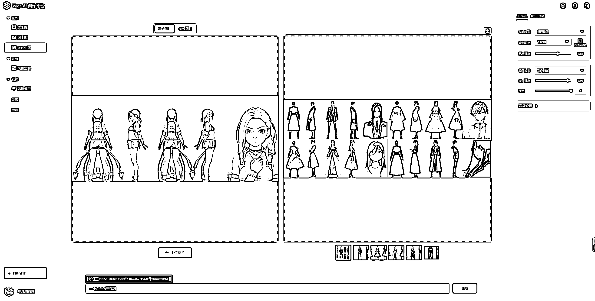
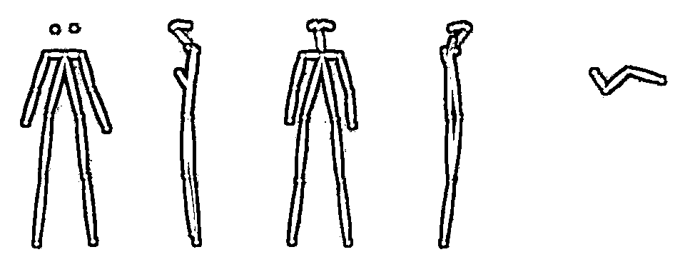

# 3.1.4.2 动作捕捉

类似于「线稿生成」，只不过我们的条件换成了动作。

•第一步：右侧设置区选择「动作捕捉」， 选择需要的模型和风格 👇

•第二步：画布区我们选择「条件图片」，并上传一张图片 👇

•第三步：输入文本描述词（可以选择合适的推荐词）

•第四步：点击生成，等待几秒就可以生成和原图动作形式类似的新图了：

•第五步：在「条件特征」可以看到系统捕捉到的原图的动作，我们可以在这个动作图基础上继续生成其他图片

Plus:

也可以在步骤 2 时直接点击「条件特征」上传动作图，类似于上图 👆，直接用动作图生成新图

Tips:

在线编辑骨骼动作网站：[`avatarposemaker.deezein.com/`](https://avatarposemaker.deezein.com/)，可以在这儿里定义想要骨骼动作