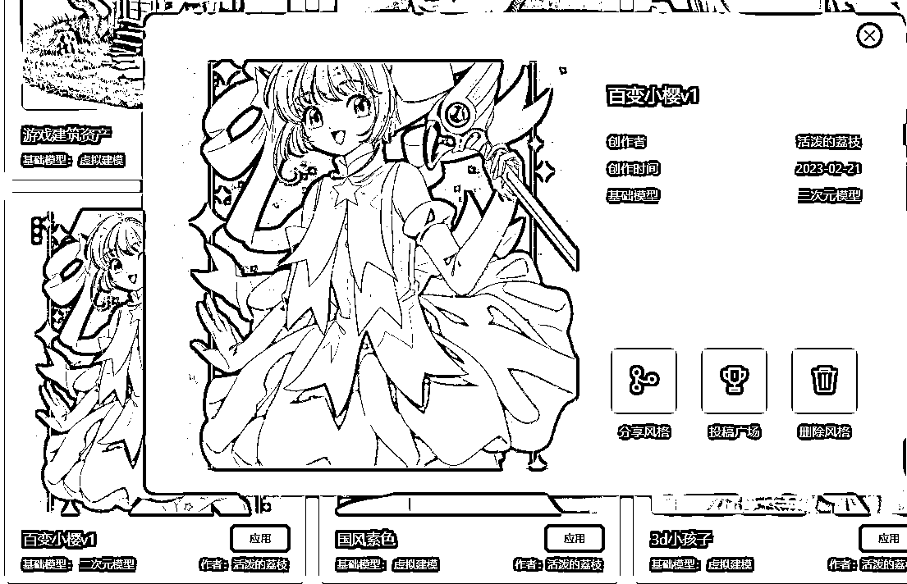
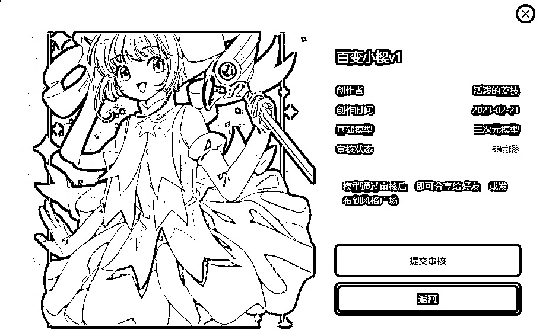
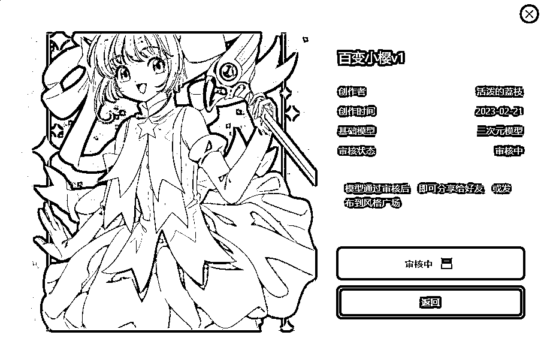
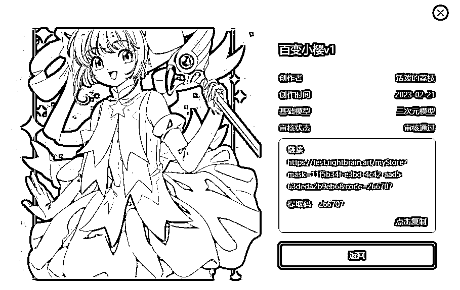
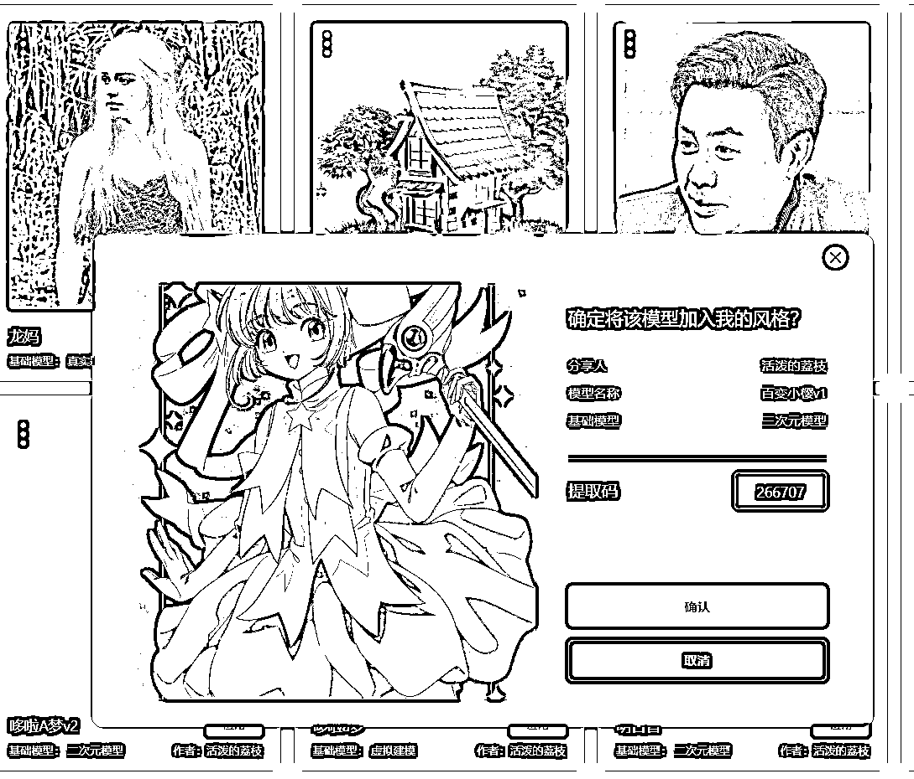

# 3.2.2 模型分享

目前 Vega 已经支持用户分享自己训练的风格模型与风格广场投稿。

注：为避免侵犯他人隐私/肖像权，暂不支持特定真人风格的分享与投稿。

分享风格功能支持用户选择风格生成链接和提取码，他人可通过链接和提取码获取到对应的风格模型。

•进入我的风格界面，点击要分享的风格进入详情页面，选择分享风格：

•如果模型未经过审核，分享前需要先提交官方审核：

•等待审核，审核结果会及时同步到界面右上角的系统通知：

•审核通过后，再次点击分享风格会生成对应的分享链接和提取码：

•他人通过链接访问，填入对应的提取码，即可将分享的模型添加到我的风格中：

