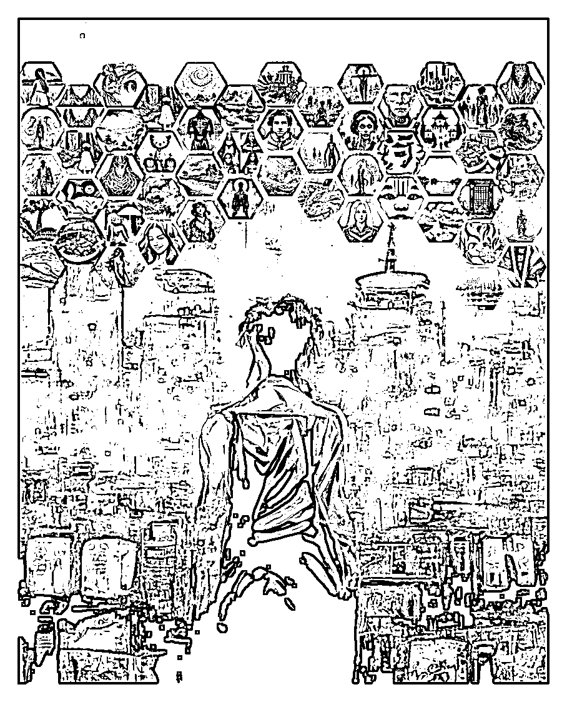

# 四、学会用 MidJourney 完成 AI 绘画 @天辉老师

本篇是初次使用教程，指导你从零起步，开始一步一步使用 MidJourney。

它的显著特点是使用过程更简单，出图更精致更绚丽，出图速度快，电脑、手机端都可以使用。真正的 1 分钟出图。

在不加任何修饰语的情况下，MidJourney 也会随机生成非常好看的图片，操作界面也很友好。

MidJourney 是一个前端通过 discord 聊天软件进行外显交互的 AI 绘图网站，因此在使用的过程中，会需要一个 discord 的账号，如果你之前没有，本文会带着你注册。

前期准备：

① 一个能使用的谷歌账号

② 可以访问外网

已经会基础使用的小伙伴可以跳过本章节。

