# 4.1 初次使用

本质上，是先注册一个 discord 的账号，随后添加 MidJourney 服务器频道

出图网站：[www.MidJourney.com](http://www.midjourney.com/)

① 点击按钮：

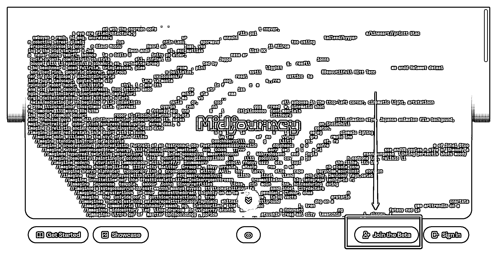

② 进入 discord 界面

如果你之前没有注册过 discord 的账号，这里就会出现注册的界面，输入用户名，点继续，然后它会验证你是不是人类等，包括之后可能还会需要邮箱验证一下等等：

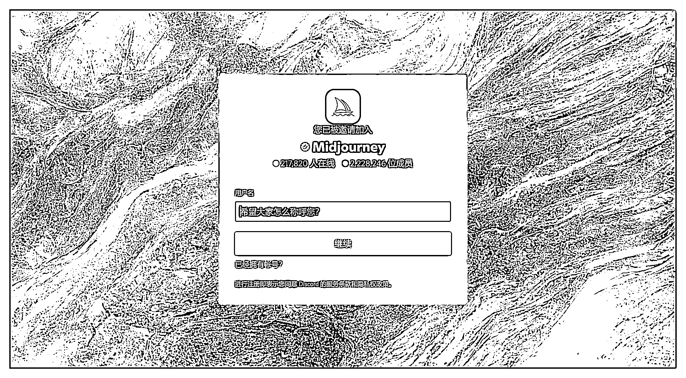

如果注册好，或者之前就有 discord 账号，就会出现接受邀请按钮，点击接受会进入 discord 界面：

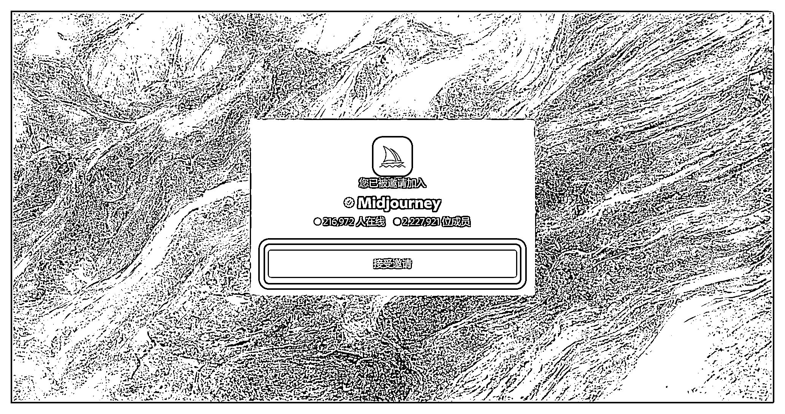

③ 进入 discord 界面后，左边频道栏就会出现一个小帆船图标，点一下：

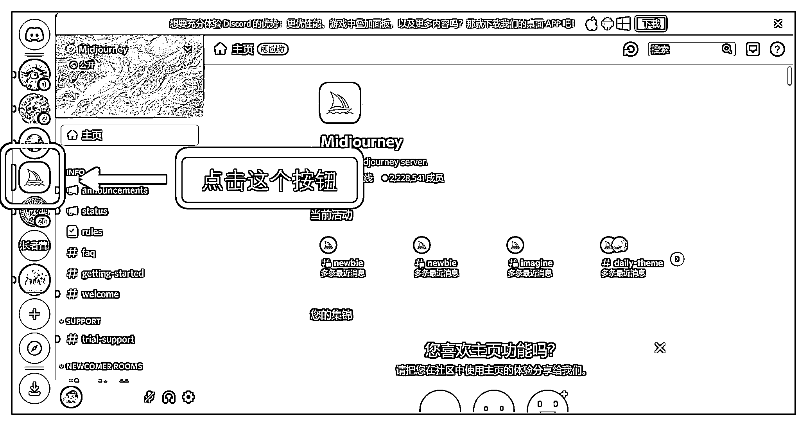

如果此时没有出现小帆船图标，重复一下 ①② 步骤即可。

④ 鼠标放在频道处，往下滑动滚轮：

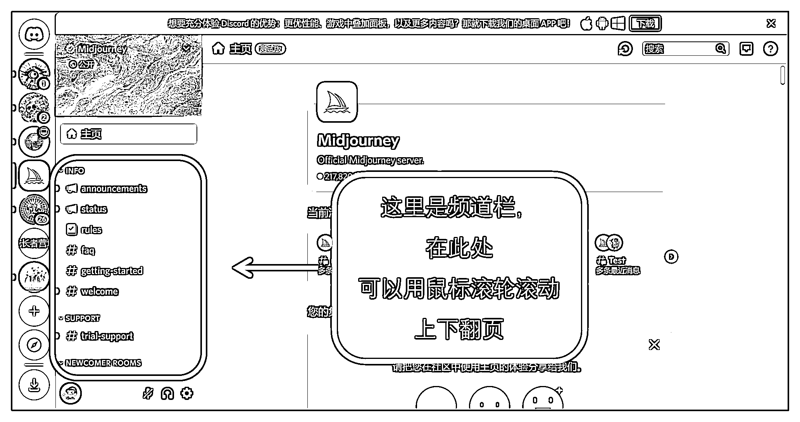

⑤ 找到 “ newbies - XX ” 频道，点击进入（每个人的数字不一定相同）：

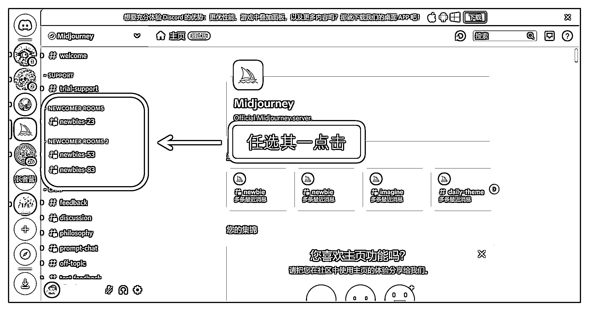

⑥ 在这里，你就可以看到别人出的图片以及别人出的描述词：

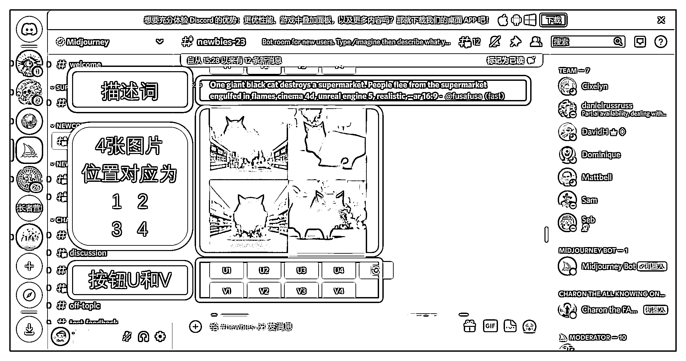

按钮 U：在对应图片的基础上细化，出一张大图

按钮 V：在对应图片的基础上再变化出 4 张新图

⑦ 完成出图

在聊天框打一个 “ / ” 字符，选择出现的 /imagine

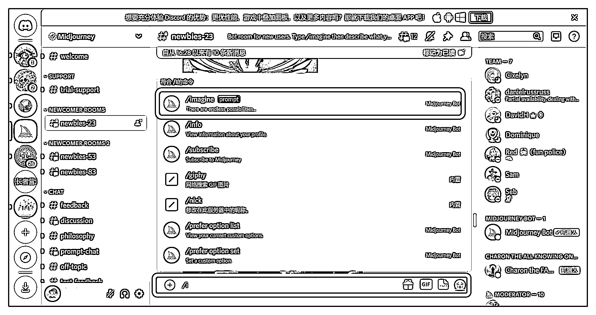

接着就可以在这里输入描述词了：

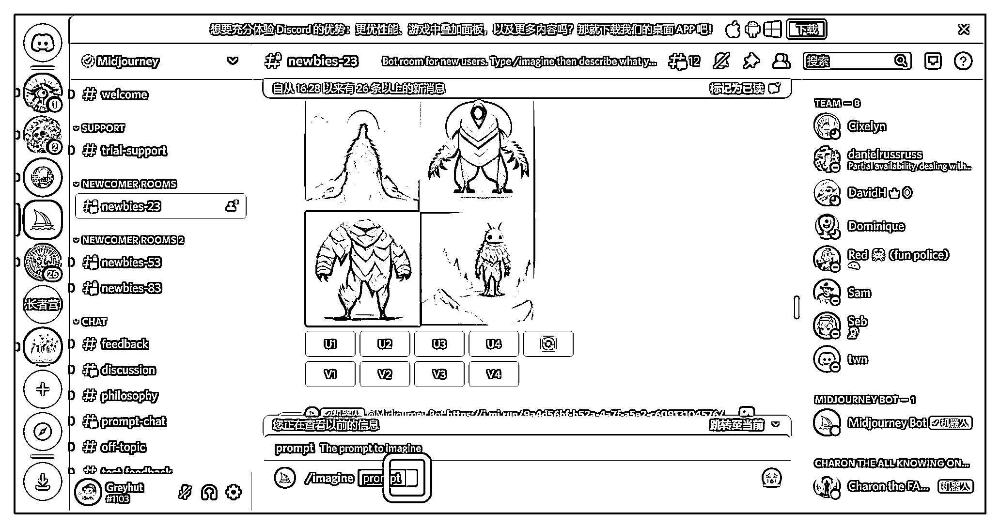

如果不清楚描述词如何写，可以👉【六、学习描述词】查看关键词如何组合使用。

⑧ 我们尝试一组关键词，例如“ 一个质朴的小屋子，宫崎骏风格 ” ，输入 “ A rustic little house， Miyazaki style ”

打字结束后按回车，即可在聊天栏出图：

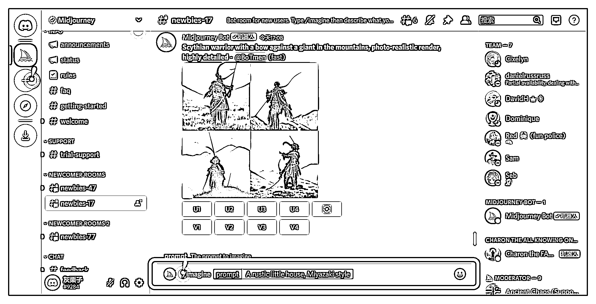

去聊天栏找你正在生成的图片：

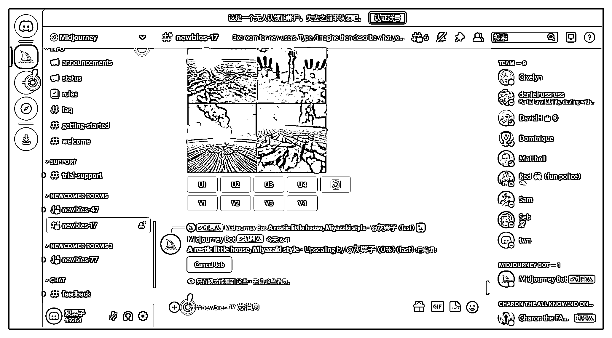

会慢慢出 4 张图，大约 1 分钟左右出完：

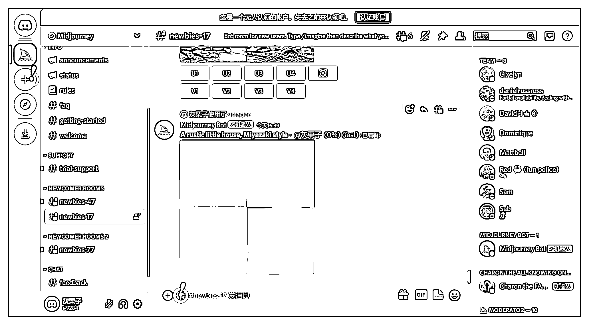

加载到 100%时，会在最新的聊天记录里出现，需要你回去找（找不到就上下翻找）：

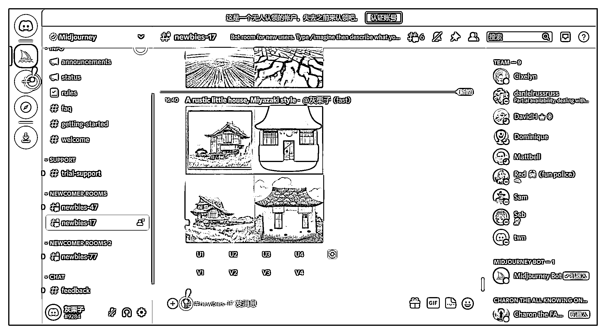

实在找不到，就在搜索栏搜索：

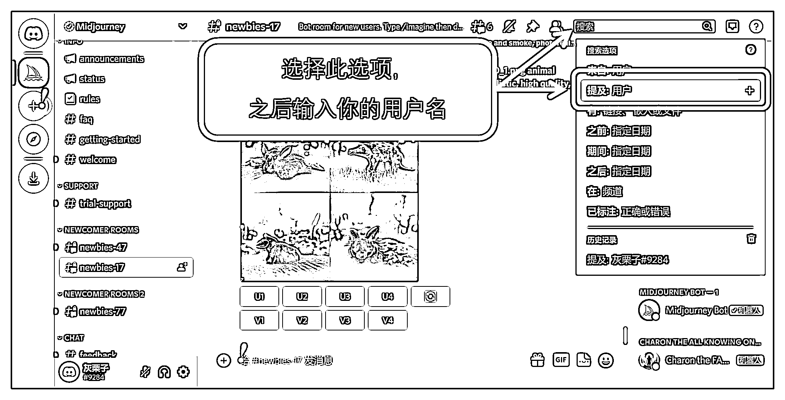

点你的名字：

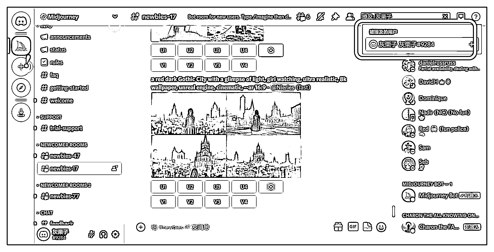

在右边提及你的部分，点击文字部分，左边就会跳转至你出图的界面：

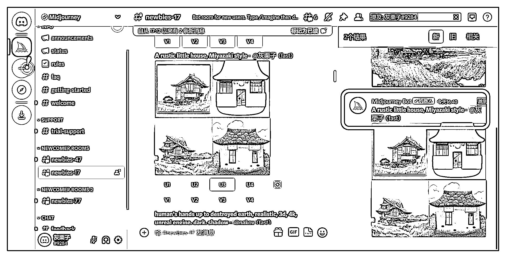

这里，比如我们觉得第三张图更像我们想要的，点一下 U3 按钮 即可。它会在第三张图的基础上细化，出大图：

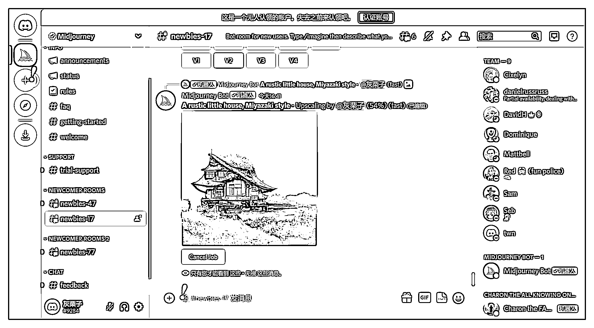

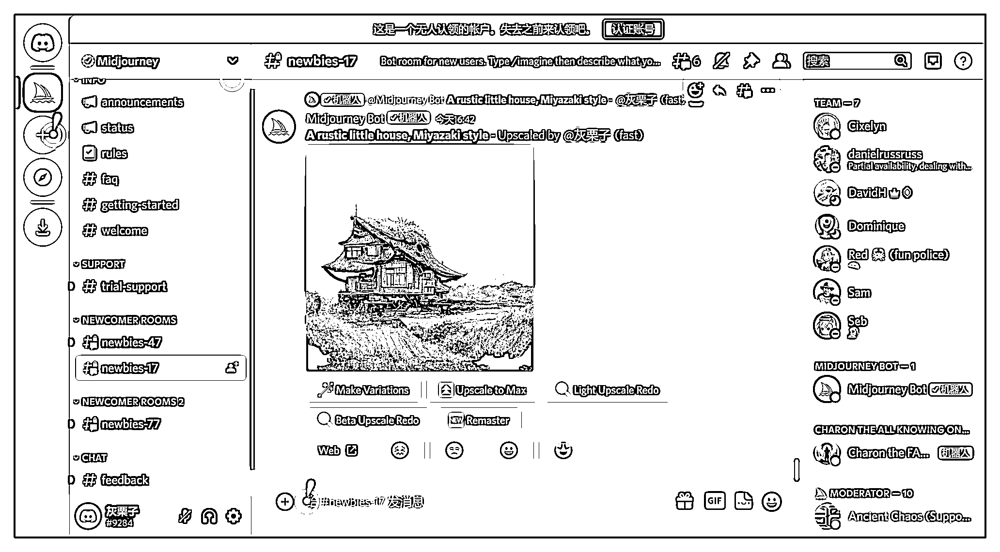

到这里，1 分钟的时间，我们的图片就已经生成完毕。

此处，各个按钮的作用：

Make Variations：在此基础上再生成 4 张图 Light Upscale Redo：轻度重新生成（微调）Beta Upscale Redo：测试重新生成（较大调整）

