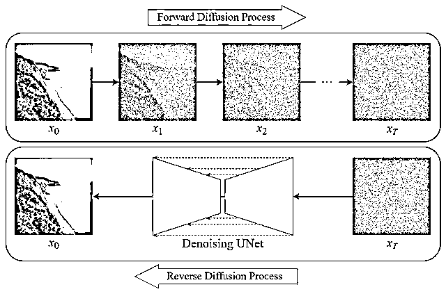

# 5.1 了解 Stable Diffusion @大刘 @天辉

Stable Diffusion 是模型的名称，是一个主题，为了方便大家使用这个软件，GitHub 一位大佬基于 Stable diffusion 开发了一个页面，就是我们现在一直看到的 Stable diffusion webUI，下面是所有 Stable diffusion 都表示 webUI 的页面。

一句话概括 Stable Diffusion：一个开源（免费），可以在自己电脑上无限制生成图片的一款软件。

Stable diffusion 能做到通过文字描述生成一张图片（文生图），亦可以在一张图片上进行部分修改或重新生成一张类似的图片（图生图）。

在 Stable diffusion 中，玩家们有个好听的称呼：魔法师，生成图片的描述词则被称为魔咒。

当你看到这句话的时候，恭喜你，发现了通往魔法世界的九又四分之三站台。

通过这个软件你可以，线稿提取再生成新图片、室内风格设计、训练模特、生成各种头像、商业设计等～

Stable diffusion 图片生成的原理是把一张全是噪点的图，通过去噪的方式还原成最终的图片，如下图：

看不太懂没关系，不需要前期去研究。只需要了解到：

•AI 学习图片是从左到右，生成噪点来学习。

•AI 生成图片时，初始一张都是噪点的纸，通过去噪来还原图片

Stable diffusion 由于其开源特性，发展极为迅猛，可以说很多效果超过了 MidJourney 也完全不过分，知识系统十分庞杂，这里引入门之后，推荐大家在各种平台搜索“Stable diffusion”相关消息，尤其关注“训练”、“模型”等词汇，Novel AI 是 Stable diffusion 的一个二次元特化分支，用相关关键词，搜索可得大量资料。

相对前文的 MidJourney 而言，Stable diffusion 的强大之处还在于集成了众多优秀的插件，可以让你对生成的图片有更好的控制。并且可以训练专属的模型，号称万物皆可炼。