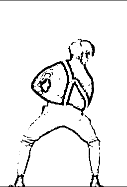
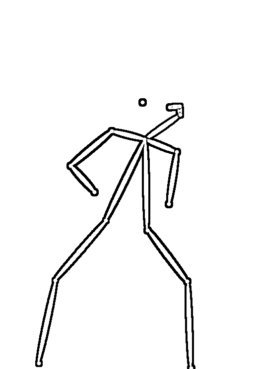
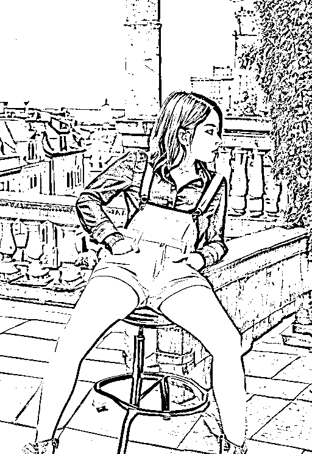

# 5.1.1 丰富的插件

Stable Diffusion 有丰富的插件玩法。

比如 ControlNet，一款可以提取物体轮廓、人体姿势骨架、画面深度信息、进行语义分割的插件，可以控制人物的动作姿势，手势等等细节、重绘的功能可以实现只修改图片部分地方而其他地方没有任何变化。

再比如，

Mov2Mov 可以把一种的视频转换成另一种风格的视频；

Tagger 可以让你随便拿一张图片，能帮你较为精准反推出大部分图片上的关键词。

