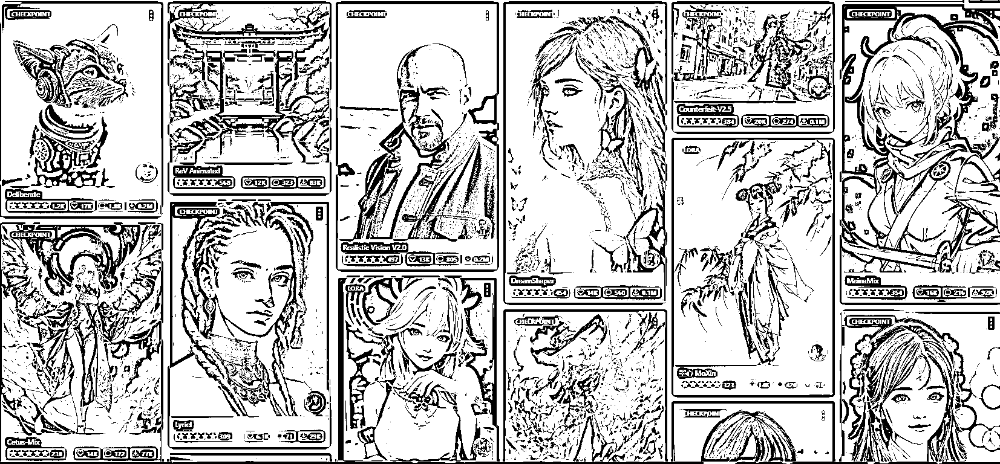
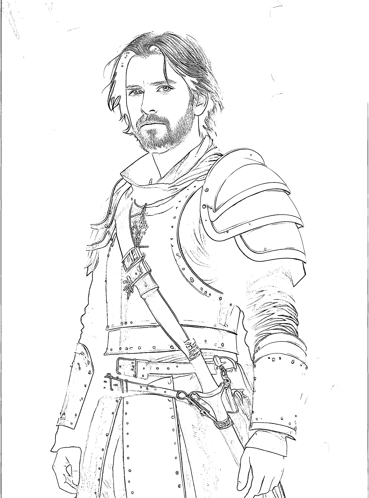
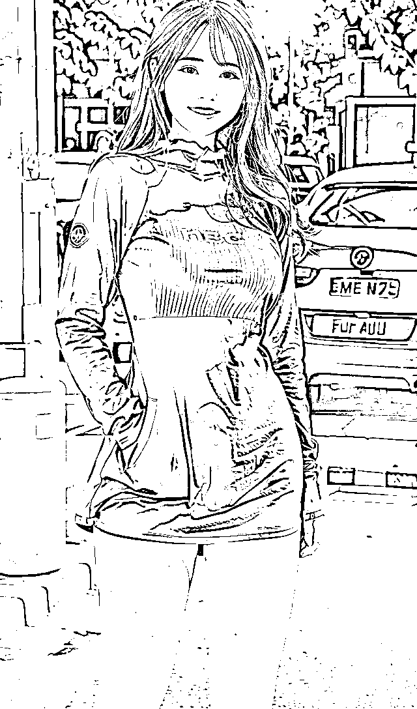

# 5.1.2 丰富的模型以及自己训练的模型

模型图片太多了，光模型大大小小都上万了。随便两张经典模型封面镇楼：

上图左边的魔咒（关键词）：

modelshoot style, (extremely detailed CG unity 8k wallpaper), full shot body photo of the most beautiful artwork in the world, medieval armor, professional majestic oil painting by Ed Blinkey, Atey Ghailan, Studio Ghibli, by Jeremy Mann, Greg Manchess, Antonio Moro, trending on ArtStation, trending on CGSociety, Intricate, High Detail, Sharp focus, dramatic, photorealistic painting art by MidJourney and greg rutkowskiNegative prompt: canvas frame, cartoon, 3d, ((disfigured)), ((bad art)), ((deformed)),((extra limbs)),((close up)),((b&w)), wierd colors, blurry, (((duplicate))), ((morbid)), ((mutilated)), [out of frame], extra fingers, mutated hands, ((poorly drawn hands)), ((poorly drawn face)), (((mutation))), (((deformed))), ((ugly)), blurry, ((bad anatomy)), (((bad proportions))), ((extra limbs)), cloned face, (((disfigured))), out of frame, ugly, extra limbs, (bad anatomy), gross proportions, (malformed limbs), ((missing arms)), ((missing legs)), (((extra arms))), (((extra legs))), mutated hands, (fused fingers), (too many fingers), (((long neck))), Photoshop, video game, ugly, tiling, poorly drawn hands, poorly drawn feet, poorly drawn face, out of frame, mutation, mutated, extra limbs, extra legs, extra arms, disfigured, deformed, cross-eye, body out of frame, blurry, bad art, bad anatomy, 3d renderSeed: 105259061, Steps: 30, Sampler: DPM++ SDE Karras, CFG scale: 10

上图右边的魔咒（关键词）：

photorealistic, long_hair, realistic, solo, long_hair, (photorealistic:1.4), best quality, ultra high res, teeth, Long sleeve,Blue dress, Big mouth,full body, 3girls, Grin, graffiti (medium), ok sign, smile, stand, 1girl,full body,beautiful, masterpiece, best quality, extremely detailed face, perfect lighting, 1girl, solo,best quality, ultra high res, (photorealistic:1.4), parted lipsLipstick,ultra detailed,Peach buttock,looking at viewer,masterpiece, best quality,Negative prompt: (worst quality:2), (low quality:2), (normal quality:2), lowres, normal quality, ((monochrome)), ((grayscale)), skin spots, acnes, skin blemishes, age spot, glans,extra fingers,fewer fingers,strange fingers,bad hand(low quality, worst quality:1.4), (bad_prompt:0.8), (monochrome), (greyscale)Seed: 3662021034, Steps: 59, Sampler: Euler a, CFG scale: 9

