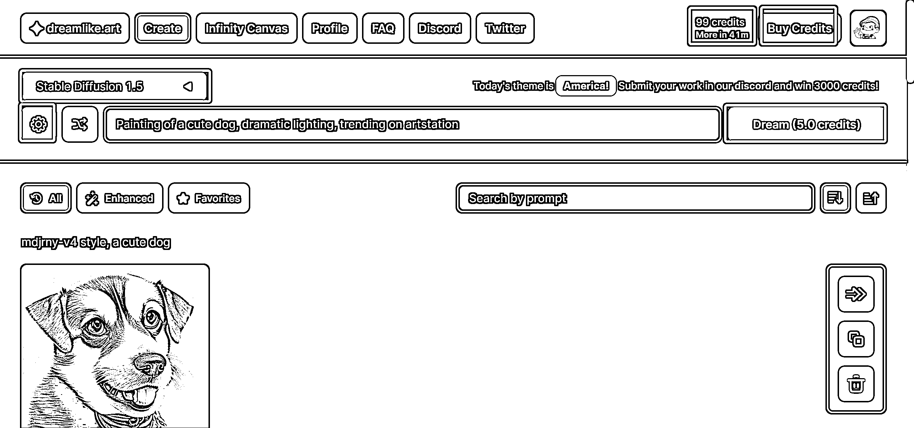
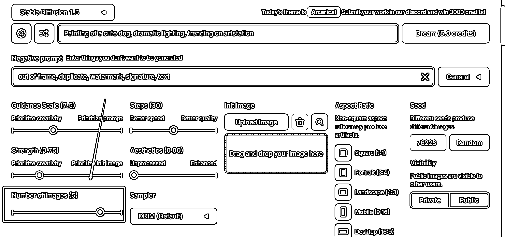

# 5.2.1 直接用 Dreamlike

初始有 100 点额度，默认尺寸下，生成一张图，消耗 1 点额度，当步数上升，尺寸上升时，额度消耗会加大

如果你消耗了额度，每隔 1 小时，给你恢复 1 额度，最多到 100。也就是说，默认尺寸下，可以免费生成 100 张图。

•打开网站

[`dreamlike.art/create`](https://dreamlike.art/create)

•界面（使用需要登录谷歌账号）

右上角，数字「99」那里，是你的免费额度，每隔一小时，增加 1，最多增加到 100。

下面的「Dream」是生成按钮，「5.0 credits」则是指本次生成图片需要消耗 5 额度。

之前说生成一张图消耗 1，这里为啥是消耗 5 呢？因为，它默认一次出 5 张图，如果想要调整数量，可以在左上角小齿轮处做调整。

左边的 Stable Diffusion 1.5 代表选用的模型。

下面的小齿轮是设置，可以将 5 改为 1，这样每次只出一张图，消耗 1 个积分。

主要出图按钮就是这些，填入关键词后就能生成对应的图片。至于其他按钮代表什么意思，大家可以自行摸索，写进航海日志。

100 张图的额度，足够大家研究。

