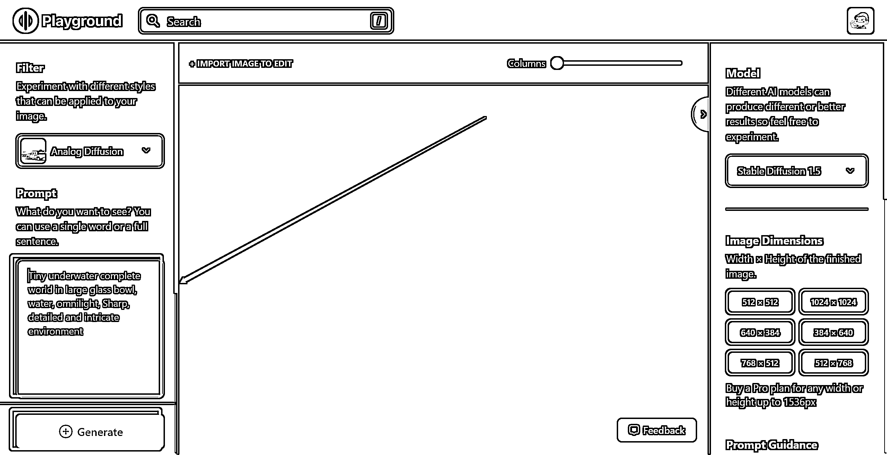
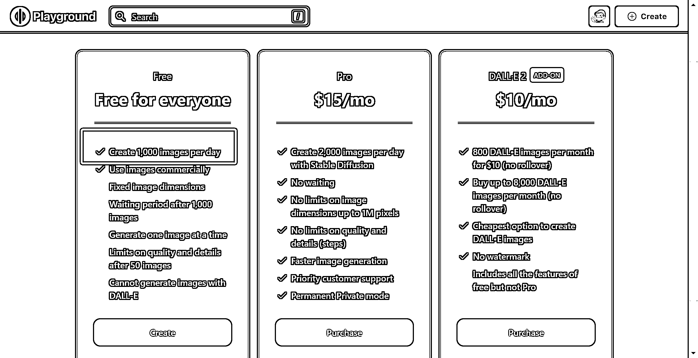

# 5.2.2 直接用 Playground

•网站：[`playgroundai.com/create`](https://playgroundai.com/create)

•界面：

最基础的出图方法：在红色框框里输入英文字符，然后点击 Generate 生成图像

这个网站目前每个用户每天可以生成 1000 张图，足够尝试出各种按钮和参数的功能，所以这里不再赘述，大家积极尝试即可。

尝试的过程，是自己体验的过程，也可以记下来成为日志，成为帮助别人的攻略，它对你只有好处没有坏处。

