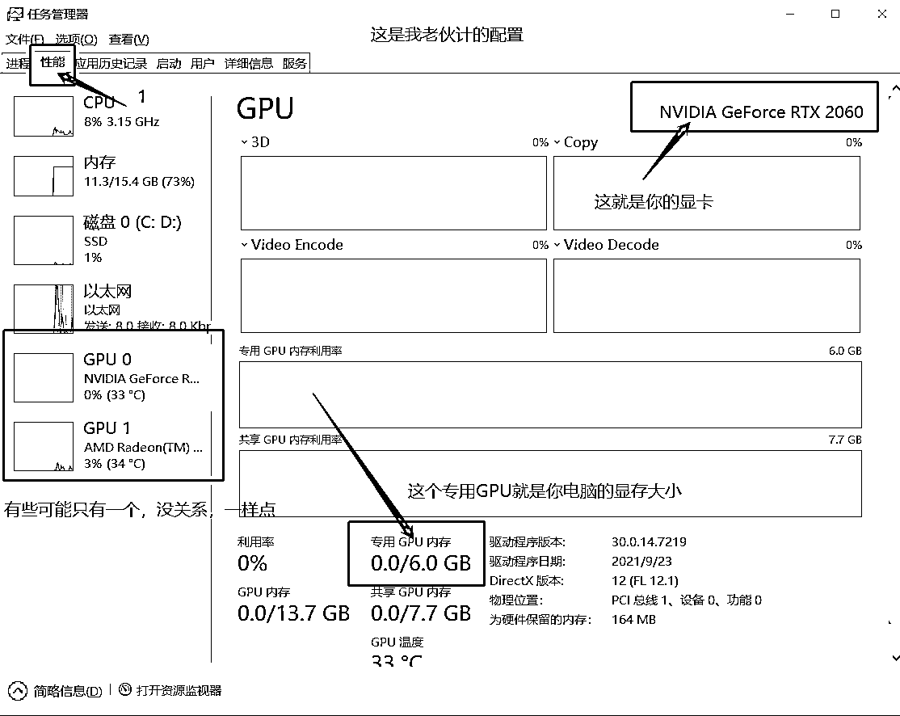

# 5.3.1 查看自己的电脑配置

•本地电脑最低使用配置如下（非购买建议）

CPU：无特殊要求

存储：50G 以上（主要是模型比较多，还有点大），就是你电脑可以放东西的空间。

显卡：推荐 N 卡 20 系列或以上

显存：普通生成图片 4G-6G 即可入门（越大能使用的功能越丰富～炼制模型建议 8G 以上）

•如何查看自己电脑的配置？

鼠标放到最下面的地址栏—>右击—>任务管理器，就会得到以下图片

