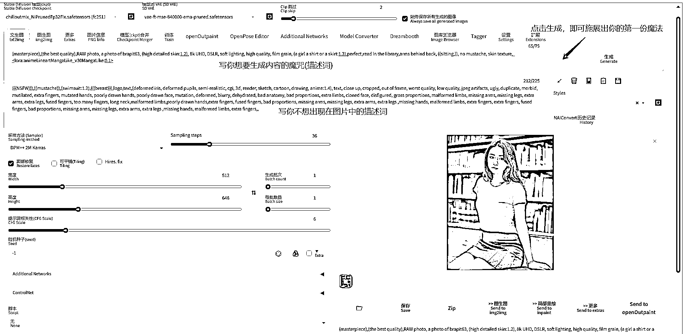
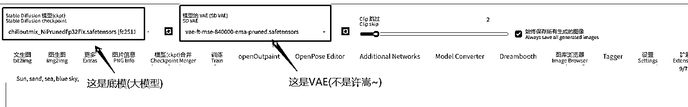
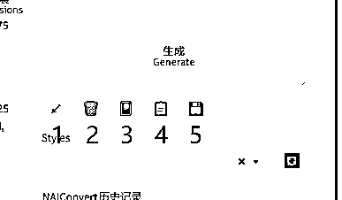
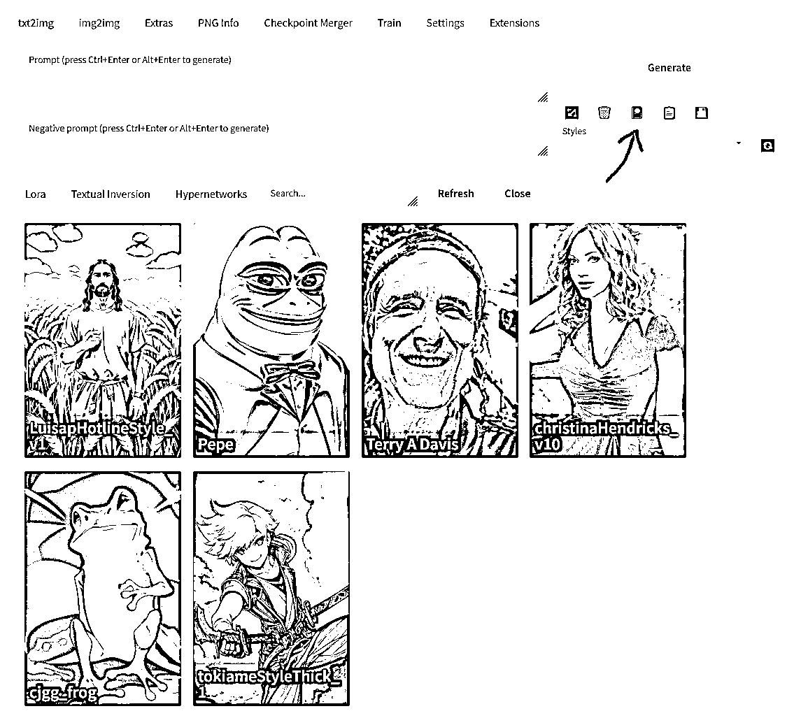

# 5.4.2 生成第一张图

以下就是启动成功后的页面，也就是魔法师施展魔法的地方。

图片放置的位置，可以点击图片左下角那个文件夹，或者上面启动器中的<文生图-单图>：

•模型选择与调整

出图的步骤很直接，那么我们可以如何调整出图呢？其中一个办法就是选择模型：

•调整出图

【生成】按钮下方还有 5 个按钮，辅助我们操作更多步骤：

按钮 ①：从提示词中读取生成参数，如果提示词为空，则读取上一次的生成参数到用户界面

按钮 ②：删除现在描述词框中的描述词

按钮 ③：模型调用的位置（下图）

按钮 ④：粘贴下面 Style 中的描述词

按钮 ⑤：保存你现在描述框中的魔咒（保存后下次点击下方 Style 选中，点一下粘贴即可直接使用）

点击按钮 ③ 后如图所示：

