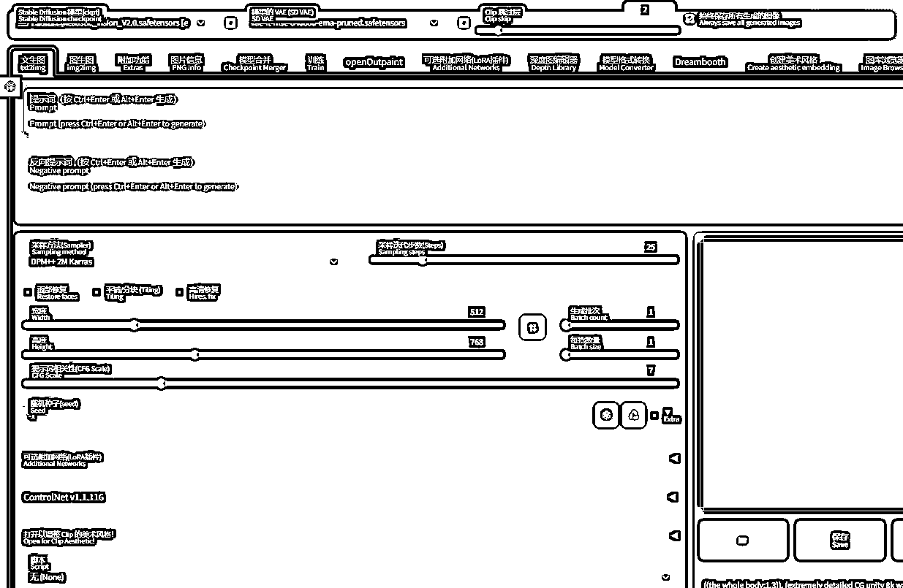
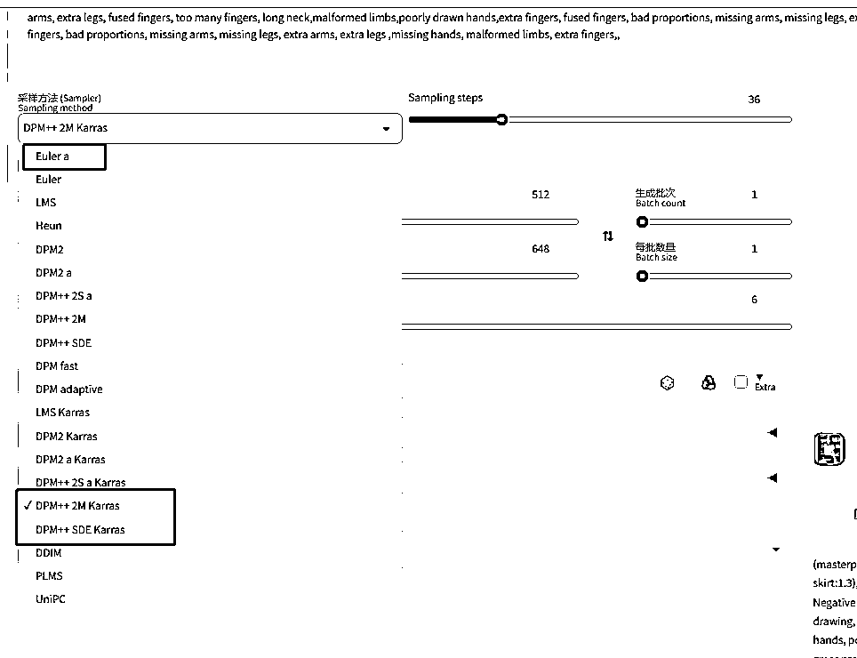
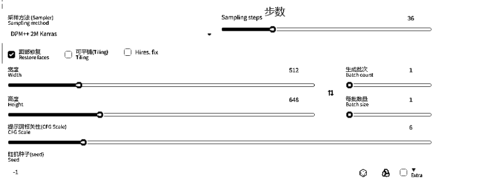
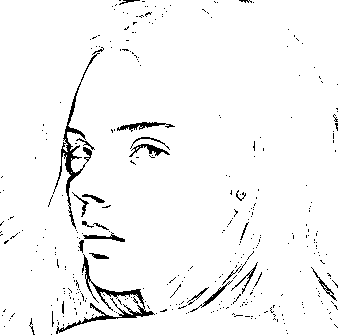
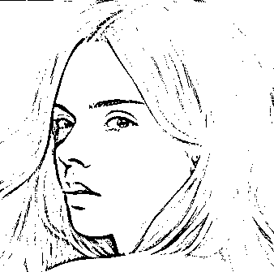
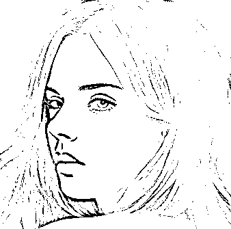
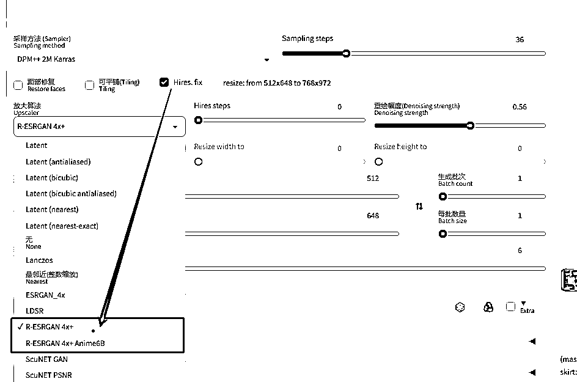
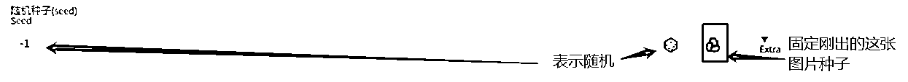

# 5.4.3 参数介绍

这节主要是介绍文生图页面上各种按钮的用法，就是下方页面的按钮：

•采样方法

新手推荐下面三个采样方法，理由是 DPM++ 2M 算法更好一些，Karras 在这基础上的算法更完善一些，Euler a 则是时常会有点小惊喜的效果：

•其他按钮

① 迭代步数 Step

可以理解为 AI 是一个画家，在一张纸上画了多少笔，推荐 20-36，效果都还不错，不要太大。

如果你看懂了前文，并且能理解一点原理，这个步数就是去噪的步数，去噪越多，图片相对会越清晰和细节，但当然图片生成的时间也会增加，不要太大，去噪太多也不好～

② 面部修复

主要是针对人脸的修复，真人 3D 可以勾，二次元和风景千万不要勾。右边两个是不同的算法而已：

原来的

GFPGAN

CodeFormer

③ 高清修复

觉得图片清晰度不高，比较模糊，可以点击勾选高清修复，生成大图（低显存就不开了哈～容易出不了图）

•算法推荐：R-ESRGAN 4x+ Anime6B（二次元）R-ESRGAN 4x+ （真人）

•重绘幅度，就是你在原来的图片上的改动，0.5-0.73 都还不错

•高清修复和面部修复不要同时开，不要同时开，不要同时开

④ 宽度高度

•就是生成图片的宽高度，想要大图不要拉大宽高，容易出奇奇怪怪吓人的图。

•因为 AI 预想的描述词只能画 A4 纸的大小，你给了一张 A3 的纸，多余的地方 AI 只能重复画 AI 上的内容，所以出现多头多手的图时，请调整你的宽高。

•常用尺寸 512*512 768*768 512*768 等

•想要大图可以选高清修复。

⑤ 提示词相关性（CFG）

表示你输入的魔咒对画面的影响度，越小 AI 自由发挥的空间越大，值越大 AI 发挥的空间小，会出现锐化，线条不好的情况。

⑥ 种子 Seed

可以理解为生成每张画用的纸的编号，-1 表示随机抽一张纸和笔，所以不同的种子，哪怕描述词一样，图片也会有点差异。

如果你觉得某张图片非常不错，想在这基础上稍微调整或修改，请固定种子（骰子右边的绿色箭头组成的圆圈，点一下就是固定目前图片的种子）

理论上，同一台电脑中，在应用完全相同参数（如 Step、CFG、Seed、prompts）的情况下，生产的图片应当完全相同。

⑦ 生成批次和数量的介绍

批次：每次生成图片的组数，批次的图相对变化会大一点；

数量：就是一次出几张图，相对变化会小一点（因为是同一批），但是如果显存不太行就还是每次 1 张吧。

