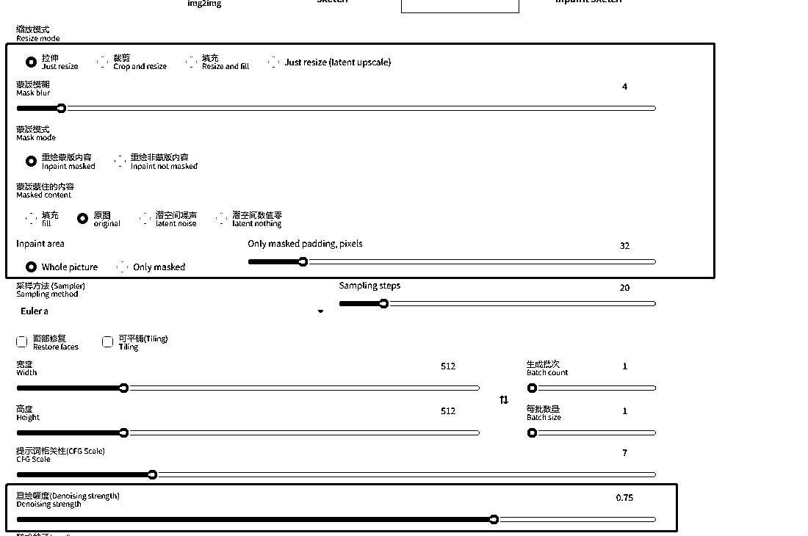
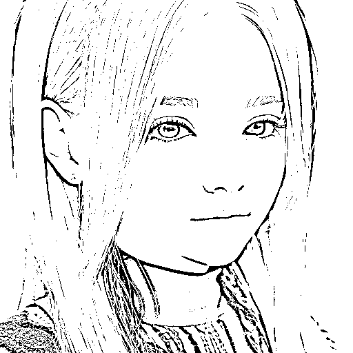
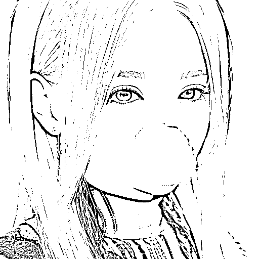
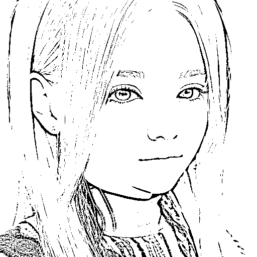
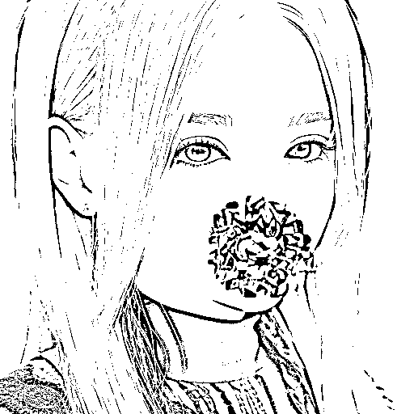
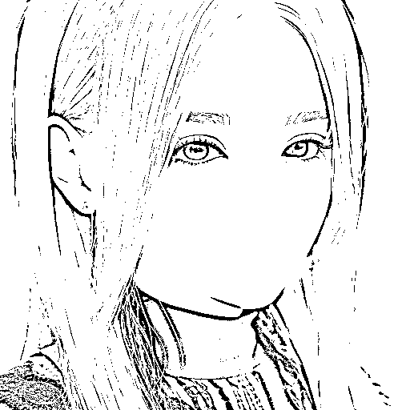

# 5.5.3.1 局部重绘

1）对图片进行部分区域的修改

•拉伸：上传参考图和下面宽高不一致就会直接拉伸参考图的宽高，图片里面的图也会被挤压；

•剪裁：以图片的中点为中心，把多余的部分直接裁掉；

•填充：如果生的图片的尺寸比参考图大，多余的部分 AI 会自动帮助填充内容，常用于风景。

2）蒙版模糊：类似 PS 或美图软件里面的边缘羽化，越小越锐化，越大边缘越模糊到接近原图。

3）蒙版模式

•重绘蒙版内容：只会重新生成蒙版蒙住的内容，其他地方没有变化；

•重绘非蒙版内容：蒙住的部分不变，没有蒙住的地方重绘。

4）蒙版蒙住的内容

•填充：预处理图片时，把蒙住的内容重新打散了，再去重组后填充到蒙版的位置；

•原图：预处理图片时，参考原图修改；

•潜空间噪声：预处理图片时，通过噪声去铺满蒙住的位置，再去噪得出图片；

•潜空间数值零：预处理图片时，理解为那一块儿重回混沌了，然后再生成图片。

原始图

填充

原图

潜空间噪声

潜空间数值零