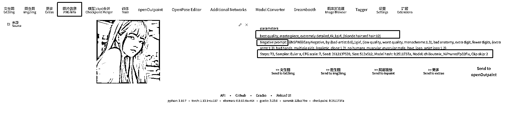

# 5.6.1 图片信息

当我们看到一张觉得非常不错的图片时，如果知道是 Stable diffusion 生成的原图，可以通过图片信息这个功能还原出图片的原始重要信息。

使用方式：

把图片上传到上方图片的位置（拉进去也行），右边会自动出来图片的信息。

第一行就是图片的正描述词：描述词多的会有很多行，看到第二行中的 Negative prompt，就表示正 tag 结束；

第二行中的 Negative prompt：表示负描述词；

第三行很多参数：表示步数、采样方法，用的什么模型，种子，图片大小等等信息；

第四行方框中【>>文生图 >>图生图 >>局部重绘】等：表述一键把上方的图片信息带到这些功能中。