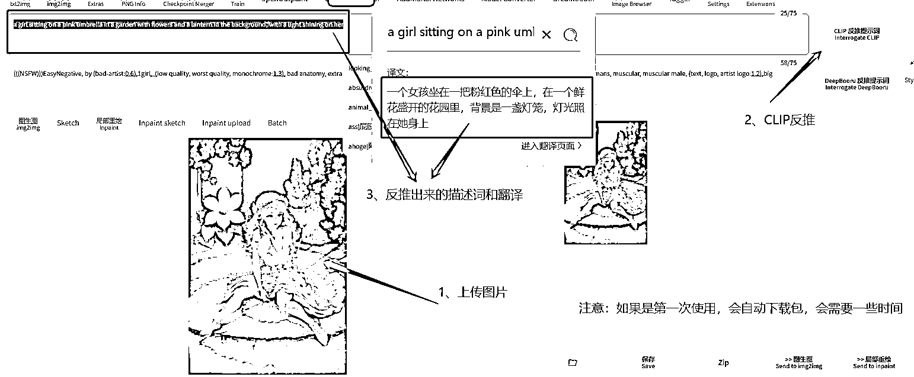
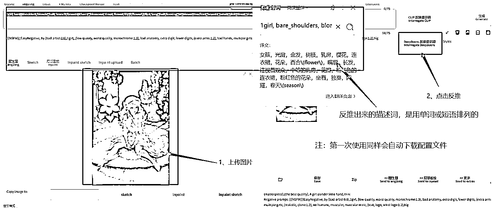

# 5.6.2 tag 反推

哎，有小伙伴就说了，那万一图片不是 SD 的原图怎么搞咧，别急，可以使用 tag 反推功能区识别图片上的内容

•CLIP 反推

CLIP 反推是自然语言的形式，反推出来的描述词是由一句话一句话组成。

例：A girl with long hair wore a pale yellow dress

•DeepBooru 反推提示词

这个反推出来的提示词是单词或者小短语的形式。

例：1girl，long hair，a pale yellow dress

