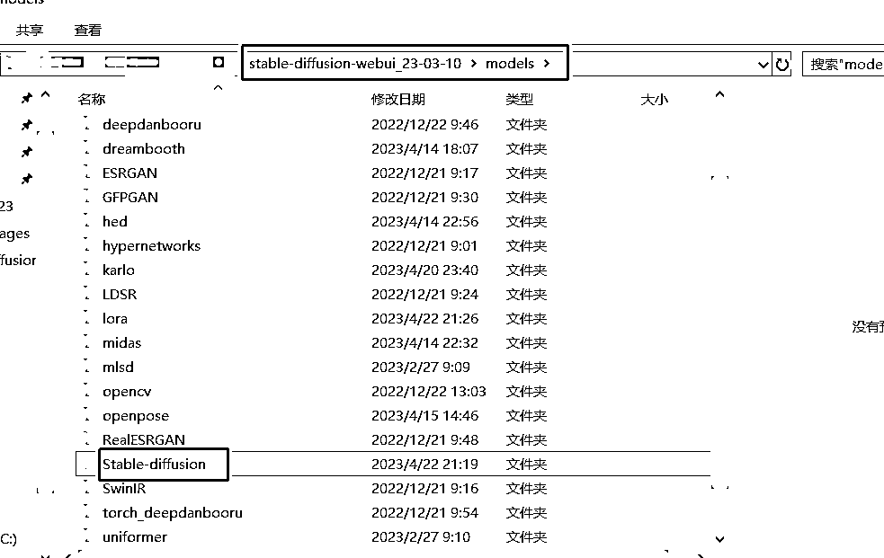
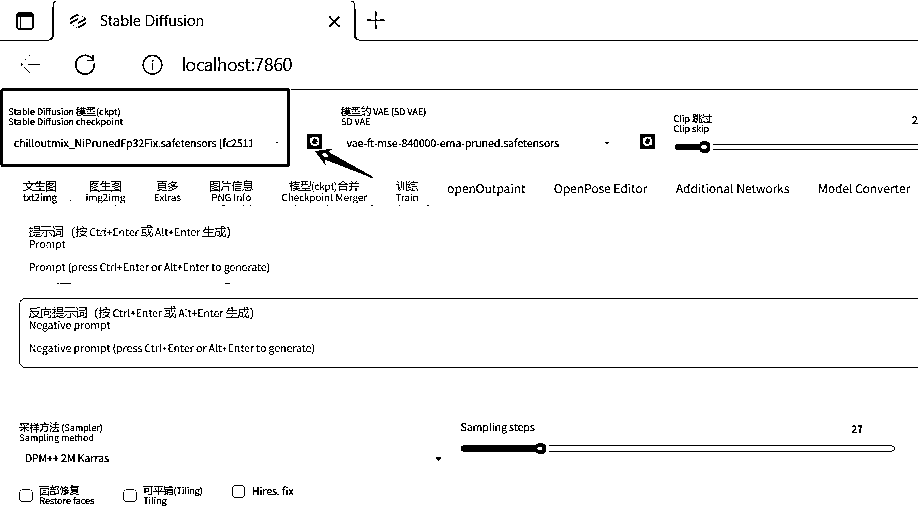

# 5.7.1.2 大模型

如标题，大模型也称为底模，是生成图片的整体风格的基础，就一个字，大。

文件大小通常是 GB 为单位，常见的有 2G、4G、7G

文件后缀目前常见 。ckpt 和 。safetensors

放置位置：你自己的 Stable diffusion 项目\models\Stable-diffusion，放到这个下面即可

使用方法：打开你的绘图界面，点这个刷新圈圈，在这个红色框框中选择你需要的大模型名称即可

