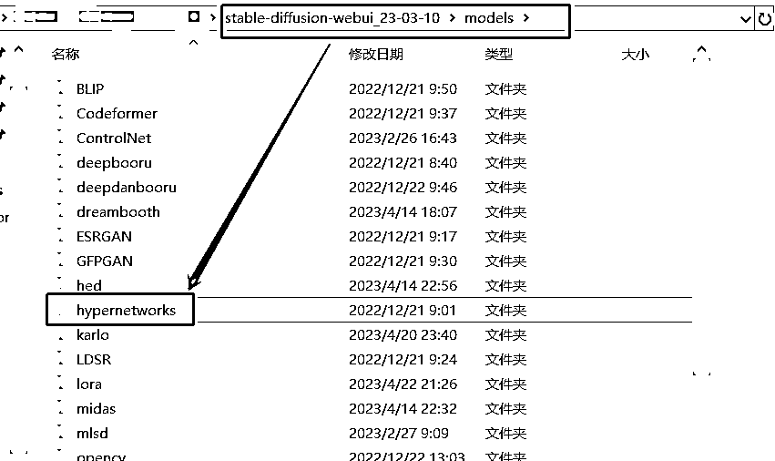

# 5.7.1.5 超网络 Hypernetwork

•文件格式和大小：常见格式为 。pt，大小一般在几十兆到几百兆不等。

由于这种模型可以自定义的参数非常之多，一些离谱的 Hypernetwork 模型可以达到 GB 级别。

•放置位置：Stable diffusion 根目录\models\hypernetwork 下即可

•使用方法：同上 Embedding，这里选择 Hypernetwork 里面的就行。