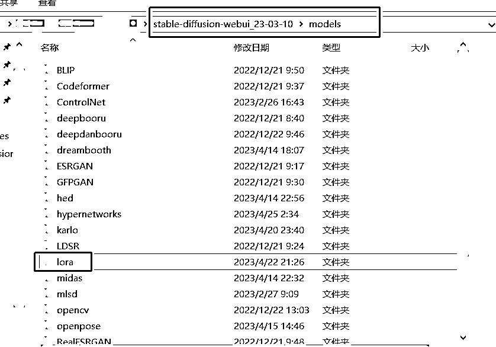
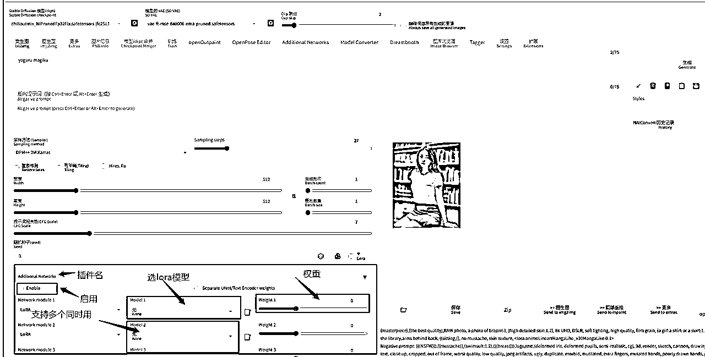
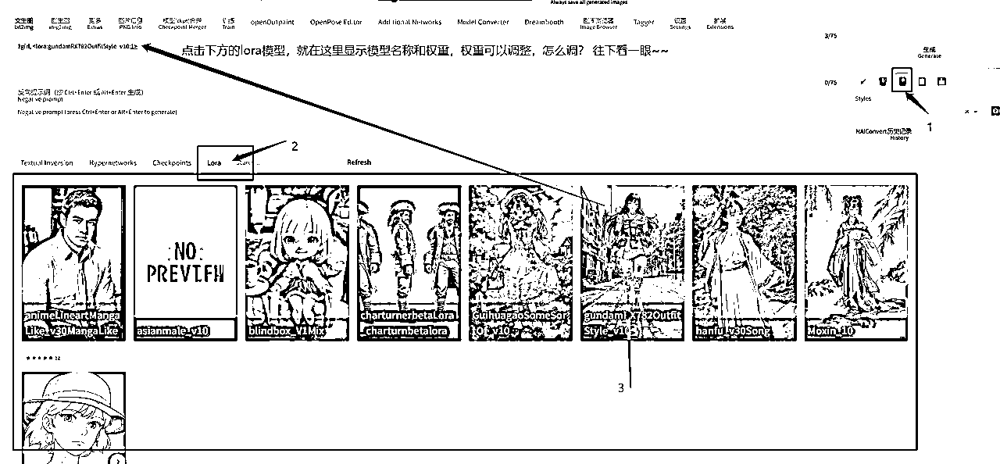

# 5.7.1.6 LORA 模型

Lora 可以理解为是基础大模型下的又一个小模型，是对某种画风或者是人物，物品，风景等等训练的比较专一的小模型。来源一般是 C 站或者自己炼（俗称炼丹，这里不展开了，新手先不慌哈～先用别人练好的玩）。

•文件格式和大小：常用 。ckpt .safetensors 格式，大小一般在 8mb～144.14mb 区间，也有极少部分不在这个里面

•放置位置：和其他小模型不同，lora 有两个位置，一个是通过插件的方式（先有这个），另一种自带的和上面小模型一样

插件 lora 放置的位置

WebUI 自带 lora 放置的位置

•使用方法

插件 lora 的使用

WebUI 自带 lora 的使用

