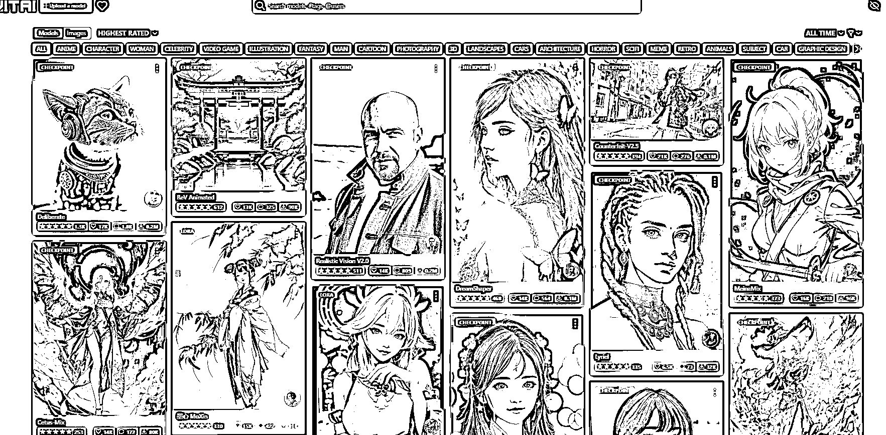
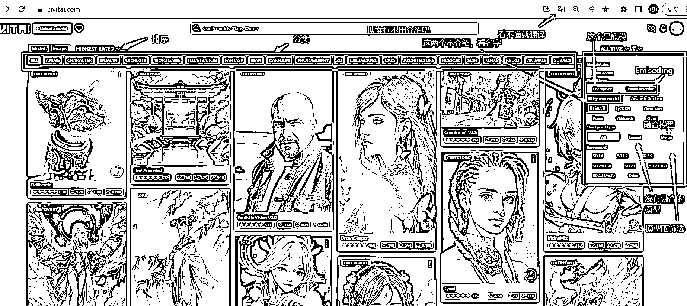
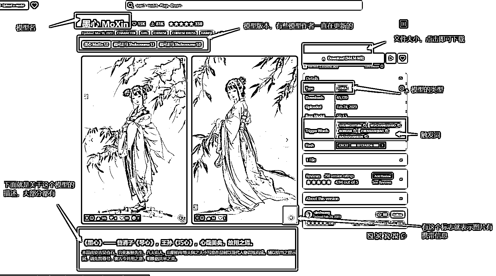
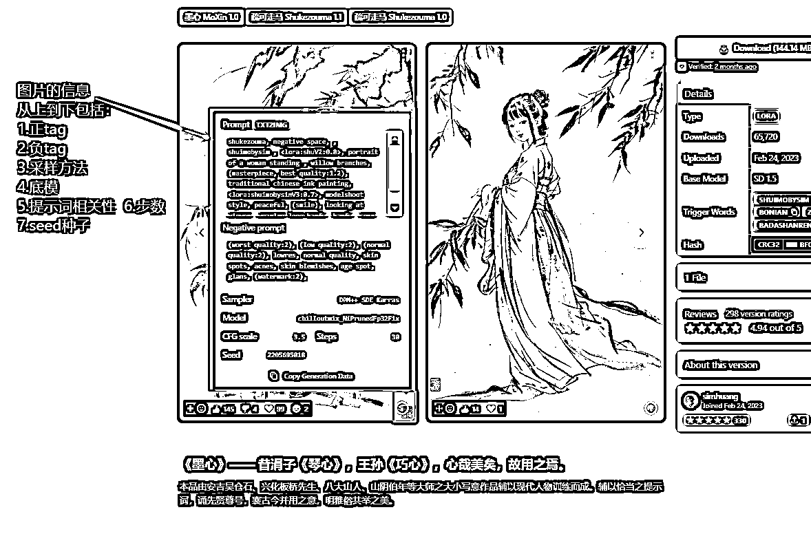
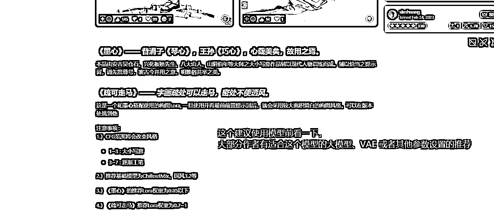
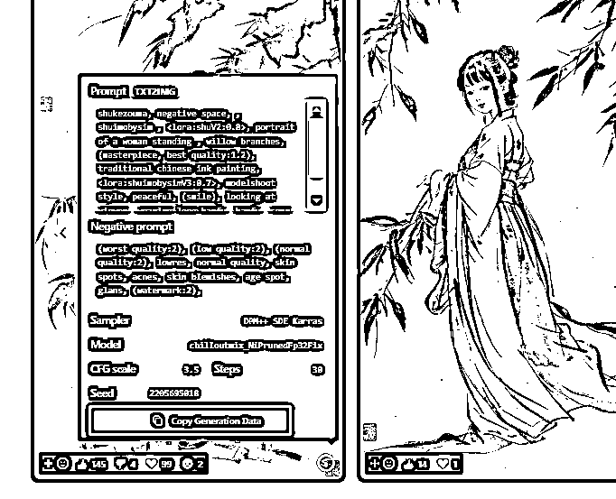
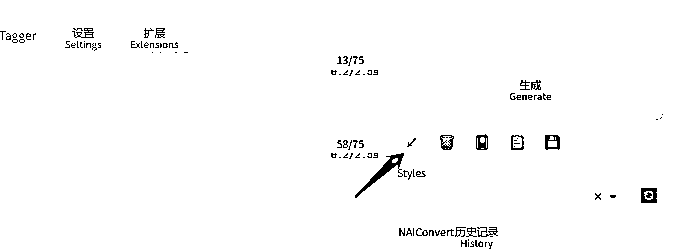

# 5.7.2 LORA 模型和底模的使用技巧

光看标题是不是很难理解，别慌，这一章节的意思其实是，教你还原一张他人生成的图。

当你打开 C 站，看到某一个模型，咦，这模型好看，我想试试～ 这标题上的运用就开始了。

这就是 C 站，一个专为 Stable diffusion 打造的模型网站：

•模型的筛选：

•单独模型介绍：

•查看图片信息

总结一句话，把作者图片上的参数，包括种子，都放到你的出图参数里。大小模型都选择一样的，就会有比较高的还原，有些细节不同也是正常的，毕竟不是同一台电脑。

•快捷使用作者或者其他人的参数方式：点击图片右下角的感叹号，点复制，再去你的 webUI 页面，生成按钮下第一个箭头，点击即可。

