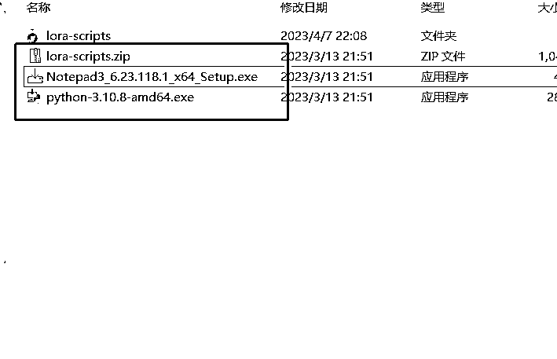
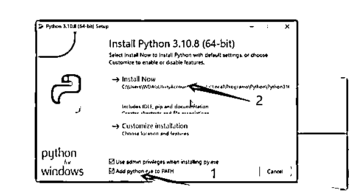
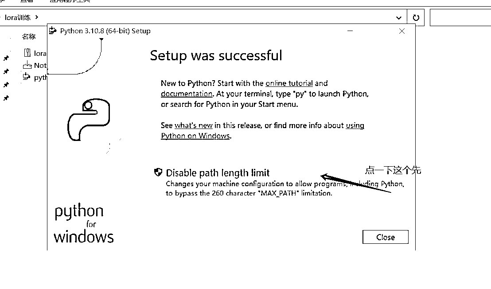
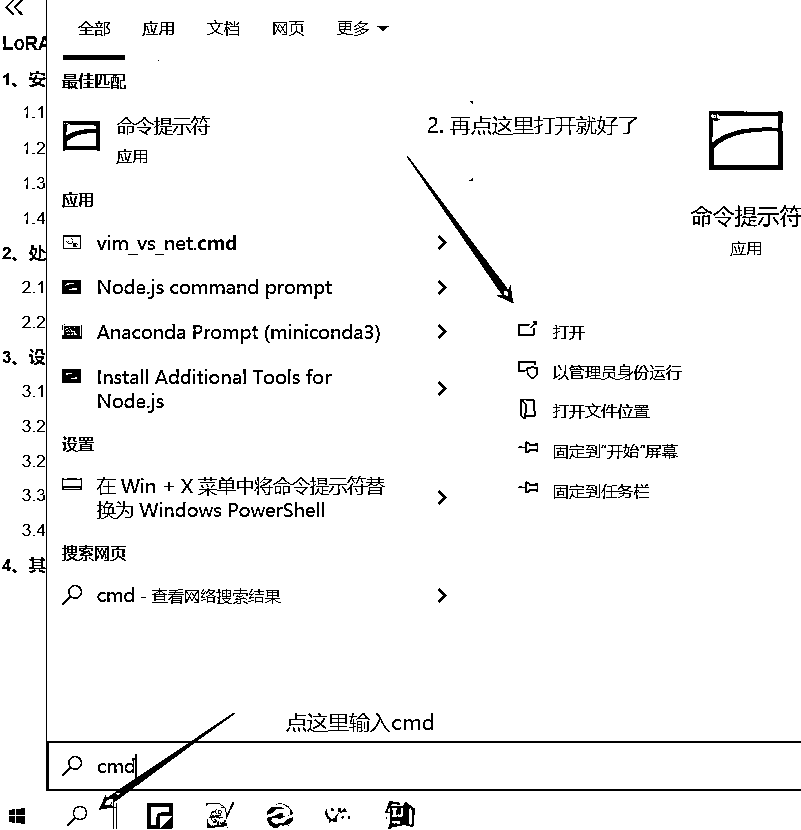
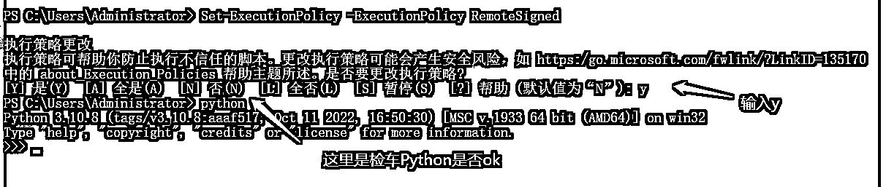
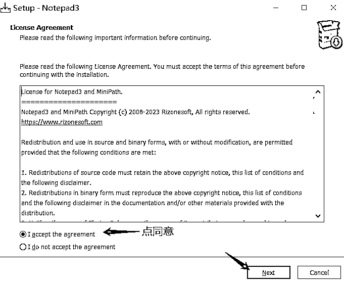
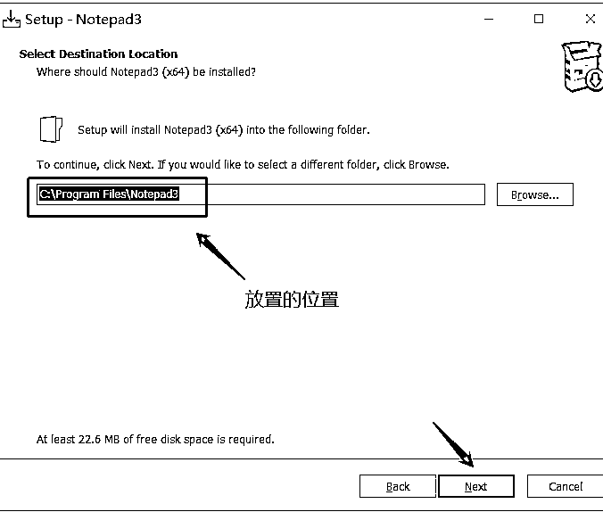
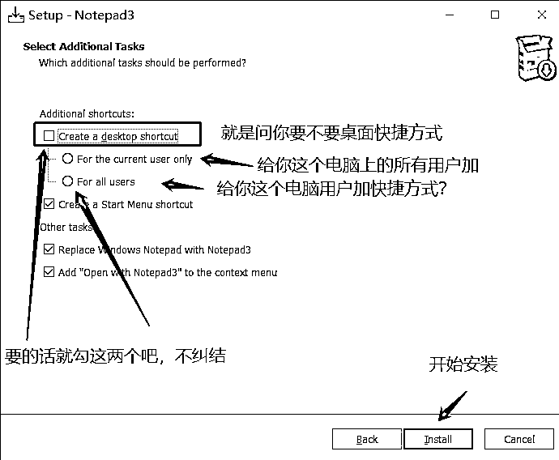
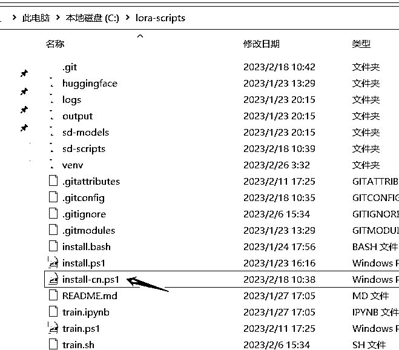
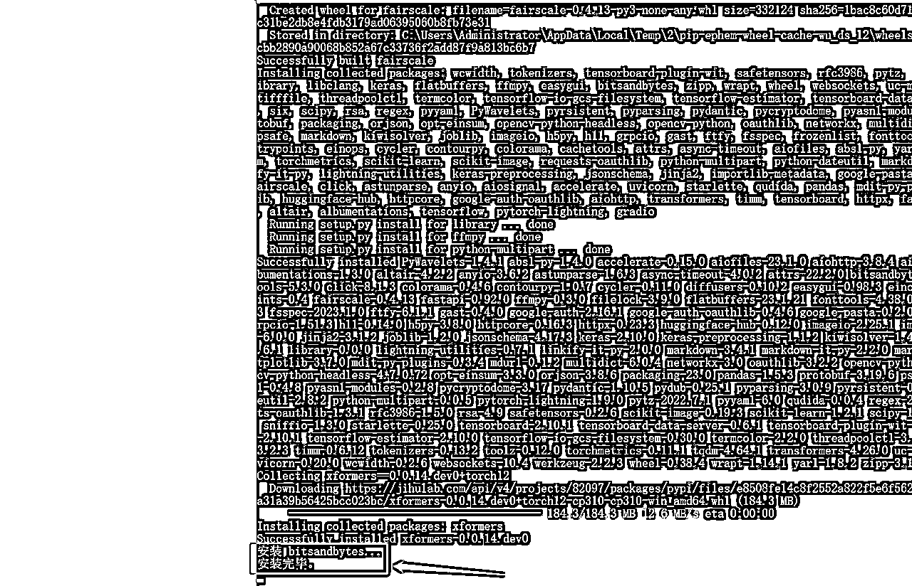

# 5.7.3.2 安装包下载

这个没有可视化 UI 页面，我个人觉得更简洁。

下载 LoRa 解压包，来源 B 站：[秋葉 aaaki](https://space.bilibili.com/12566101)

训练包下载地址：

•夸克：[`pan.quark.cn/s/d81b8754a484`](https://pan.quark.cn/s/d81b8754a484)

•百度：[`pan.baidu.com/s/1WMjja4uHB9tkZoBvgmm_ZA?pwd=lora`](https://pan.baidu.com/s/1WMjja4uHB9tkZoBvgmm_ZA?pwd=lora) 提取码：lora

•Github: [`github.com/Akegarasu/lora-scripts`](https://github.com/Akegarasu/lora-scripts)

下载完成后会有这三个文件：

解释下：

第一个压缩包是模型训练的主体，需要解压，解压位置你自己选，注意路径尽量不要有中文名；

第二个是一个文本编辑器，可以更好的帮你修改文本内容；

第三个是 Python 的安装包，lora 训练原作者是建议 3.10.8 版本。

① 安装环境

•Python 3.10.8：刚下载好的安装包里面有安装包，双击即可开始安装。

左下方这个 addPython.exe to PATH 一定要勾上，这是环境变量；先点击数字 1 再点击 2 开始安装，最后点一下箭头指的位置，再点 close：

② 清除 ps 脚本签名校验和验证 Python 是否安装成功

命令行（黑窗口）打开方式：

③ 输入以下内容（主要是清除 ps 脚本签名校验用的）

Set-ExecutionPolicy -ExecutionPolicy RemoteSigned

上方图片中输入 Python 回车后出现下面的字就算成功了。这个窗口可以关了。

④ Notepad（文本编辑器）

步骤如下：

⑤ 更新主体文件

⑥ 用 PowerShell 运行 install-cn.ps1（安装依赖文件）

