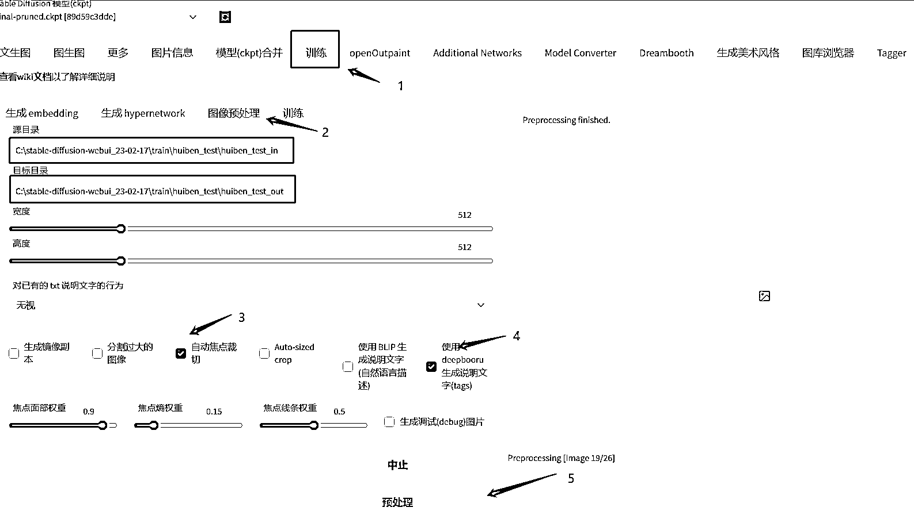

# 5.7.3.4 处理训练图片

打开 Stable Diffusion 的页面

•点击下方图片标识 1 和 2；

•源目录就是放自己手动截屏或者网上下载好的图片文件夹（尽量同一风格，同一分辨率大小，不要出现黑框）；

•目标目录：等下预处理完成后图片和文件放置的位置（自己新建一个就好）；

•点击下方图片标识 3、4、5，等待完成后在目标目录中可查看到：

数字 3 的位置是图片如果大了，就会根据图片的中心点进行裁剪（我不太建议勾选）；

数字 4 就是让 webUI 帮我们给图片打标签（生成描述词）。