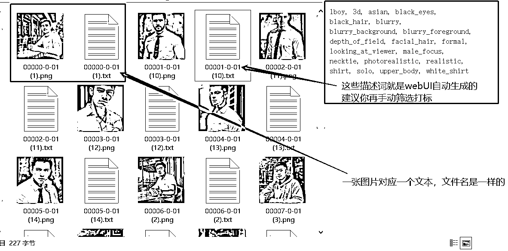

# 5.7.3.5 图片打标

•图片预处理后每张图片生成的 txt 文件中就是你这张图片的描述词（也叫标签，处理这些描述词也叫打标）；

•如果你想固定词语，请手动打标（用工具也可以）；

•打标就是处理这些图片对应文件的描述词，新增或者删掉一部分文本中的描述词；

•AI 会根据文本的描述词去对应图片中的内容，有对应描述词的就会学到，这个描述词代表这个；

•如果没有识别到的，常见两中方式，第一中就是自己手动在每个图片的文本中加一个或多个关键词，AI 就会把在图片中没识别到的内容当成是你手动写进去的描述词去学习（这个词通常就是模型的触发词）。

例：如果我想生成一个女孩的头像，脸是固定的。在文本中就要把关于脸的描述词，比如大眼睛，高鼻子，长眼睫毛这类的词，都删掉，再加一个你新增的描述词 如 jessie。AI 就会把这个文本中的 tag 没对应上的内容，当成你新增的描述词学习，当你使用这个模型的时候，打一个 jessie，出来的脸大概率是 jessie，小概率是你模型没练好。

