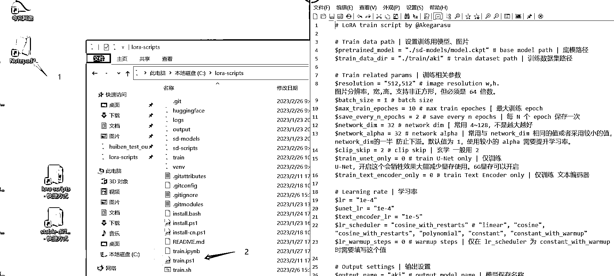
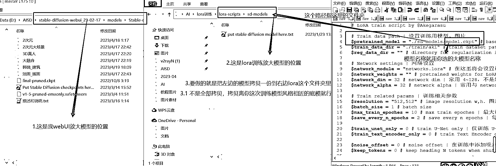
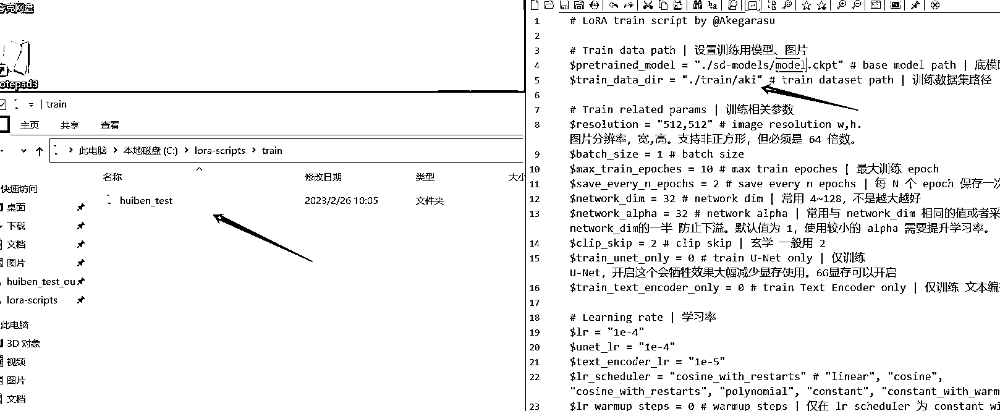
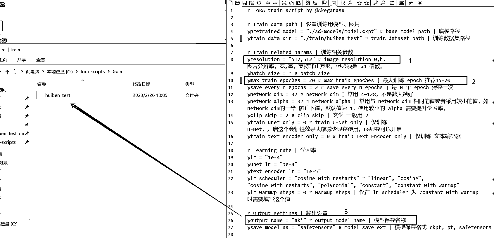

# 5.7.3.7 设置训练参数

• 打开 train.ps1 文件：双击打开步骤 1—>鼠标按住 train.ps1 文件拖到打开的步骤 1 里面，效果如下

•拷贝 SD 底模到 lora 的 models 文件下面去，参考下图

•设置训练数据集路径：把右边文本中的 aki 换成左边这个自己新建的文件夹名称（就是有<数字 _ 名称>那个文件夹的上一层文件夹名称）

•其他参数如下：•标注 1：<分辨率> 填写上面图片预处理时的分辨率就好了，如 512*512，768*768；•标注 2：<训练循环次数> 推荐 15-20（因为上面文件夹的数字如果是 6，这里如果是 20，就是一张图片训练 6 次，循环 20 次，一共学了 180 次）；•标注 3: aki 改成 lora 中自己建的第二层文件夹；•其他暂时不用改变（第一次先跑通流程）；•按 Ctrl+S 保存 按 Ctrl+S 保存 按 Ctrl+S 保存

