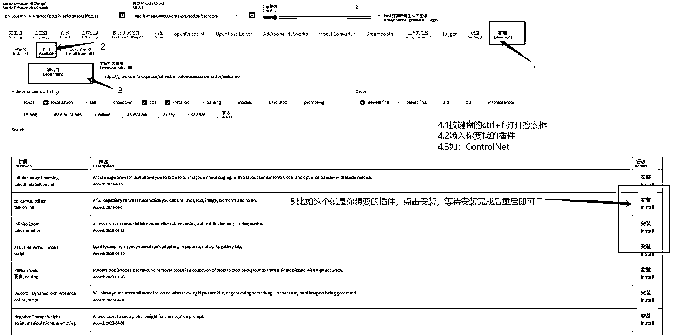
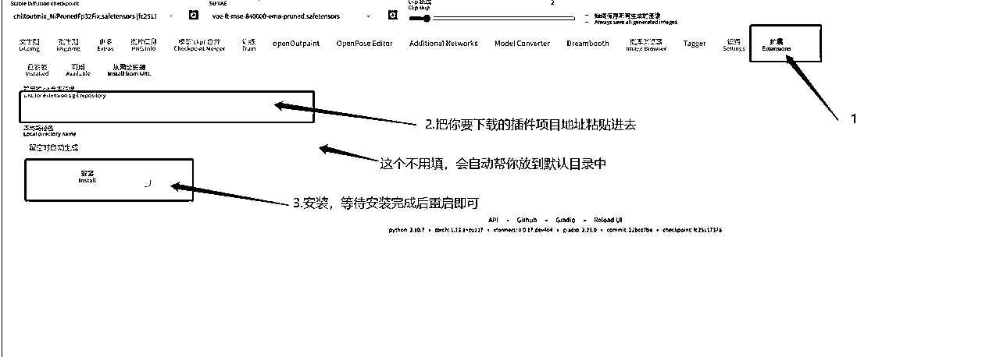
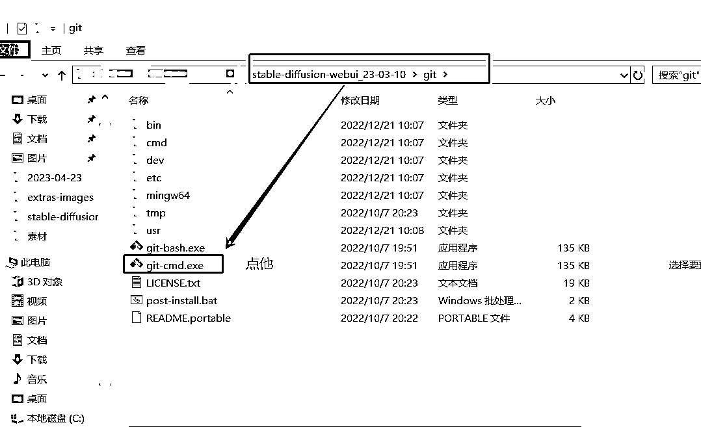
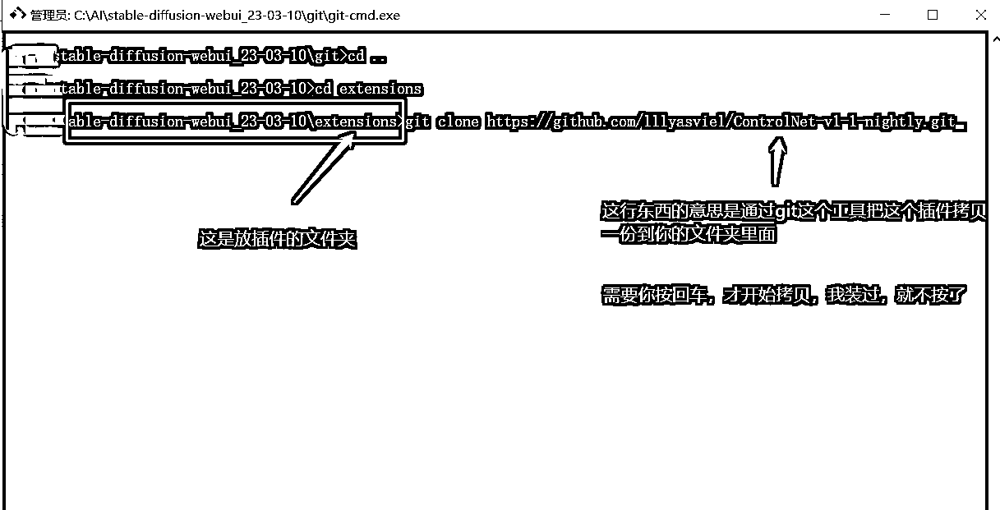
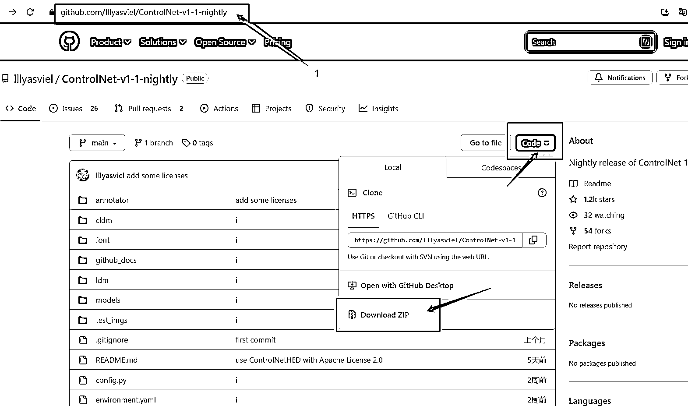

# 5.8.1.2 下载方式

webUI 页面中下载：有两个地方

可用插件

从网址直接装

Git 手动下载：首先你需要有一个 git 工具，具体步骤如下

点击后会出来黑色的窗口，按我的操作来输入 cd .. 回车输入 cd extensions 回车输入 git clone XXXXX.git 回车，等待下载完成注 1：这个 xxxxx 表示你要下载插件地址注 2：用 git 的好处是后期方便插件更新

示例：

zip 解压：不推荐，理由是不方便后期插件的更新

解压步骤：在网站中下载好插件文件的压缩包，到 Stablediffusion 根目录\extensions 文件下解压，重启后即可

