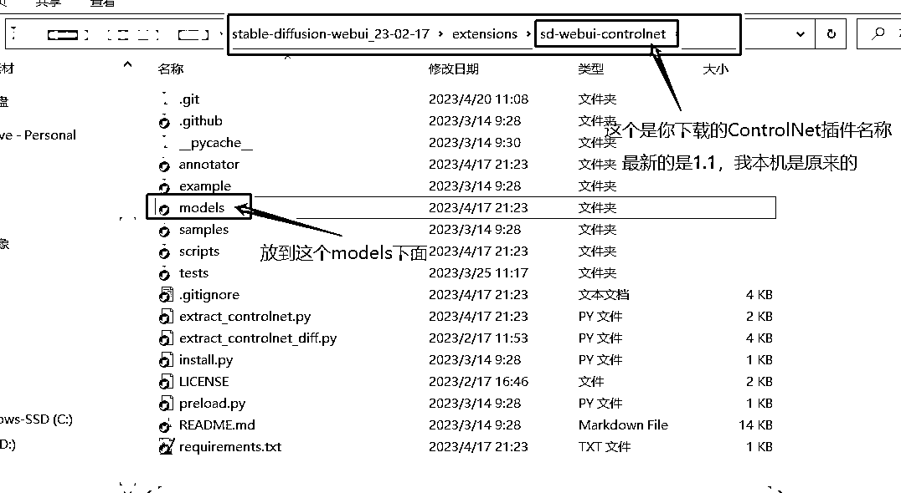

# 5.8.2.3 各个模型的介绍使用

以下是 ControlNet1.1 最新版本的配置介绍，不是之前的版本（以下来自官方文档）。

注：ControlNet 和 ControlNet1.1 暂时不是同一个插件（如果之前下过，需要把之前删掉，再下载新的），后期稳定后会合并到 ControlNet 中的。

•ControlNet 1.1 与 ControlNet 1.0 具有完全相同的体系结构，ControlNet 1.1 包括所有以前的模型，具有改进的稳健性和结果质量，并添加了几个新模型；

•ControlNet 1.1 包括 14 个模型（11 个生产就绪模型，2 个实验模型，1 个未完成模型），模型名称如下

control_v11p_sd15_canny control_v11p_sd15_mlsd control_v11f1p_sd15_depth control_v11p_sd15_normalbae control_v11p_sd15_seg control_v11p_sd15_inpaint control_v11p_sd15_lineart control_v11p_sd15s2_lineart_anime control_v11p_sd15_openpose control_v11p_sd15_scribble control_v11p_sd15_softedge control_v11e_sd15_shuffle control_v11e_sd15_ip2p control_v11u_sd15_tile

•模型下载地址：

[`huggingface.co/lllyasviel/ControlNet-v1-1/tree/main`](https://huggingface.co/lllyasviel/ControlNet-v1-1/tree/main)

•放置位置：

在你的 Stable diffusion（根目录）\extensions\sd-webui-controlnet\models

