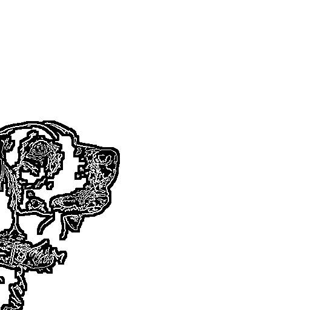
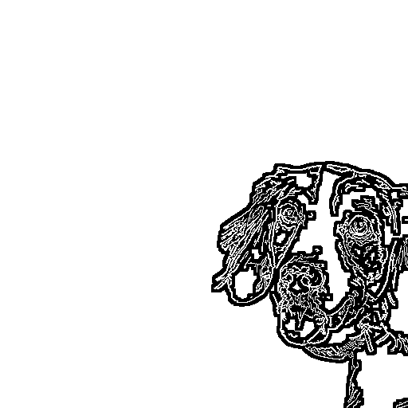
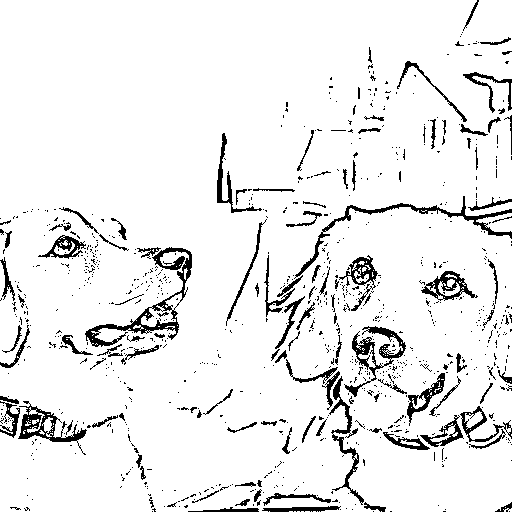
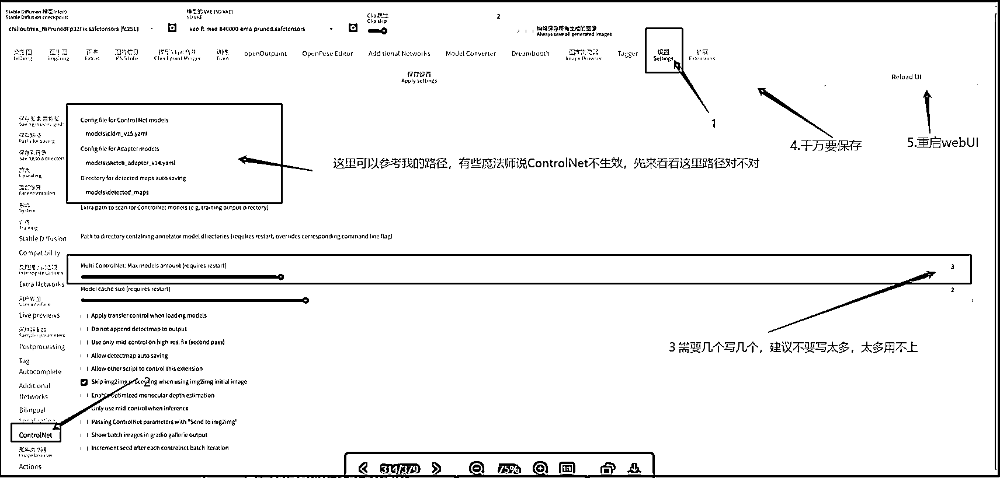
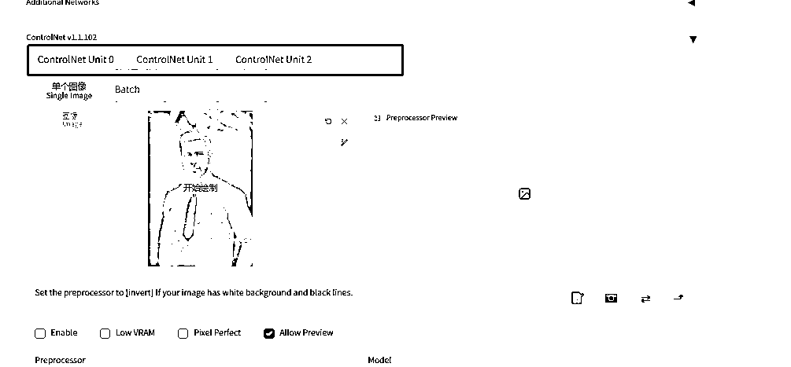

# 5.8.2.5 ControlNet 组合技

组合技，即如何同时使用多个。

例如下图的两只狗狗，这里是使用了两张 Canny 提取的预处理图片，分别放在两个 ControlNet 里面

ControlNet0

ControlNet1

出图

不光是这点，还有例如线稿+骨骼、线稿+深度图、骨骼+语义分割等等等等，多尝试各种组合方式，时常会有意想不到的收获或惊喜～

•怎么开启多个 ControlNet

这样就会有多个了，组合拳打起来～ 闪电五连鞭～

恭喜你！当你能完成插件的安装使用和模型的炼制，就已经成为一名优秀的高阶魔法师啦～

