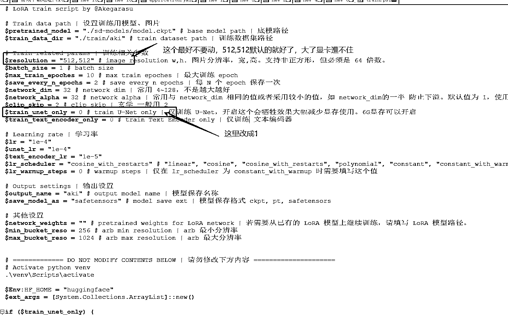
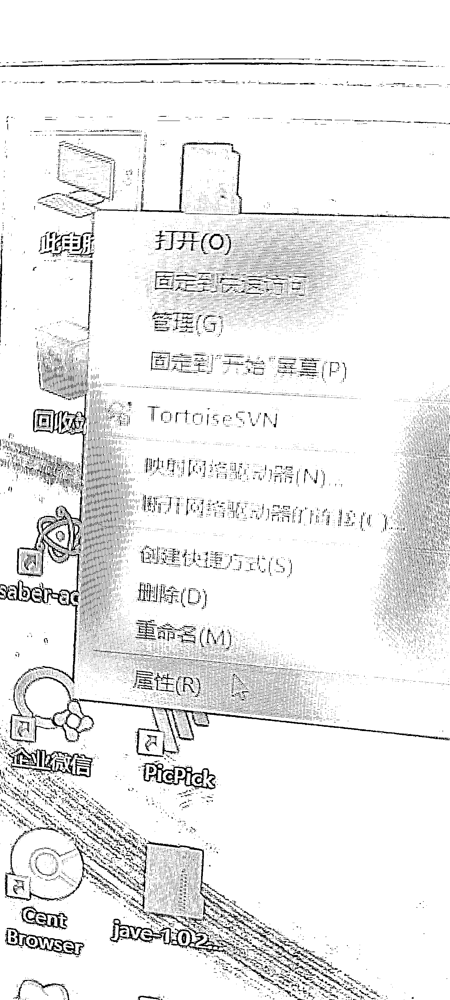
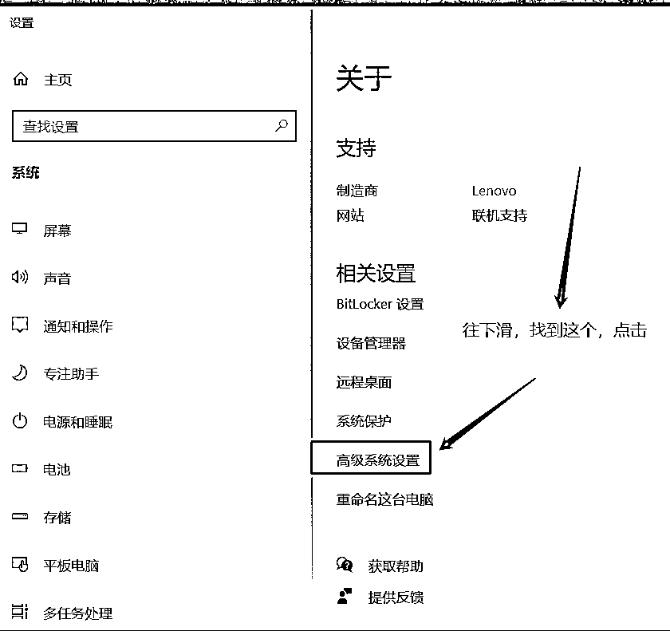
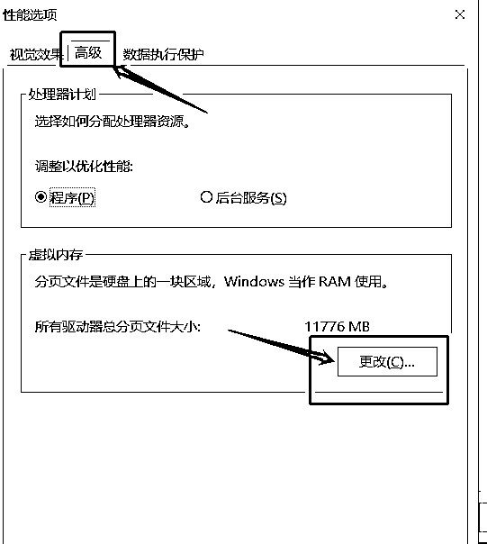
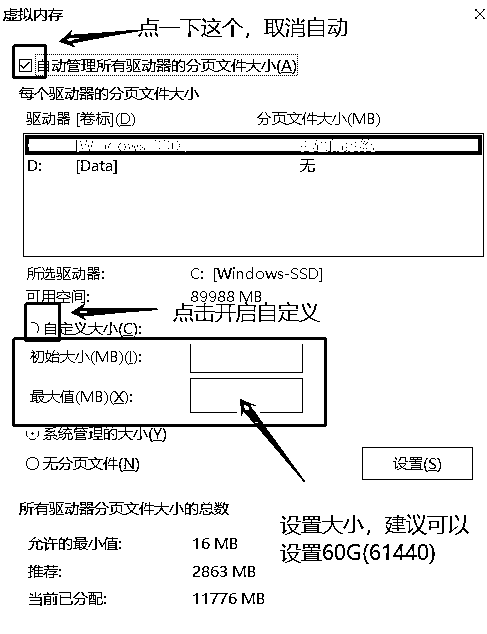

# 5.9 常见问题答疑

问题一：电脑配置比较低，显存只有 6G 怎么办？

解决办法：

问题二：如果报错说页面文件太小怎么办？

解决办法：参考以下步骤设置一下虚拟内存

1.首先打开我的电脑，在系统桌面上找到“此电脑”的图标，鼠标右键点击这个图标在弹出的菜单中点击“属性”选项。

2.在打开的系统页面，点击左侧导航栏中的“高级系统设置”标签。

3.在弹出的系统属性界面中，点击“高级”标签选项卡，在性能那一栏下面有个“设置”按钮，点击这个按钮进入性能选项页面。

4.在“性能选项”窗口中，点击顶端的“高级”标签选项卡，在“虚拟内存”一栏下面有个“更改”按钮，请点击这个按钮。

5.在弹出的虚拟内存窗口中，点击“自动管理所有驱动器的分页文件大小”复选框，去掉复选框里的小勾。

6.点击你电脑系统所在的驱动器，再点击“自定义大小”选项，在“初始大小”和“最大值”的输入框里输入设定的大小数值，最后再点击“设置”按钮和底部的“确定”按钮即大功告成。切记一定再点一下设置按钮，不然不生效！ 建议设置的大一些（不够再加，记得确认，不想玩了记得改回来）

