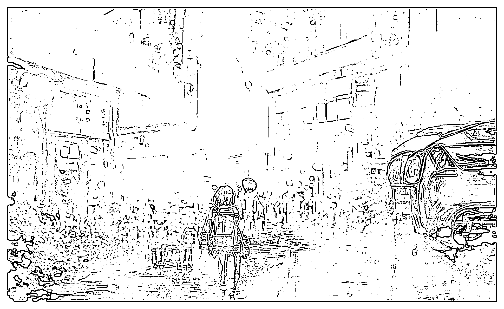
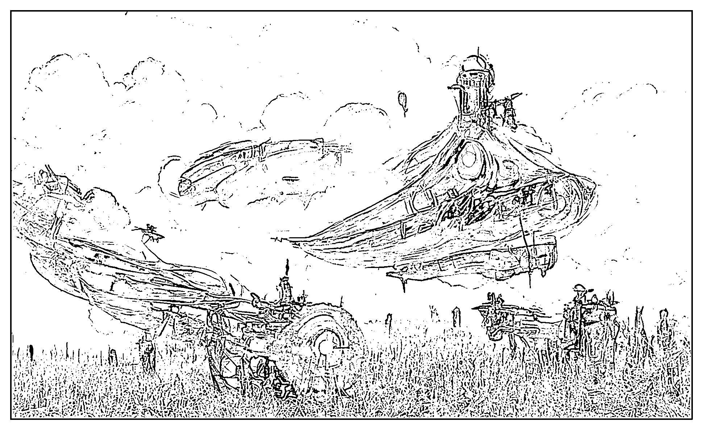
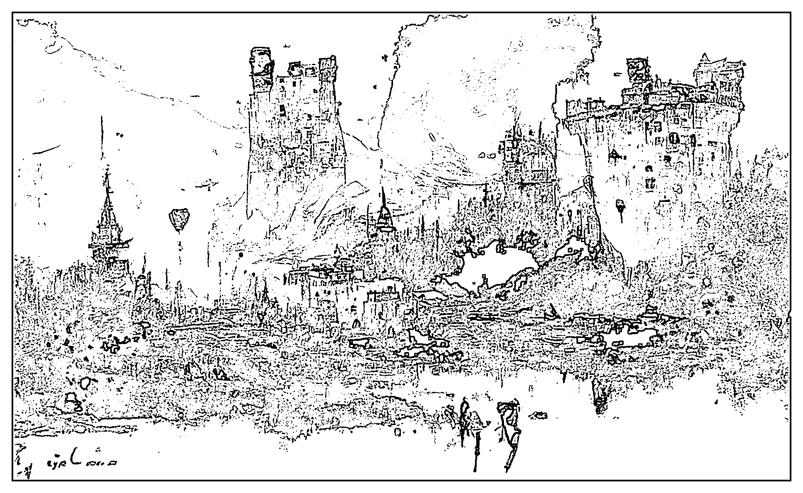
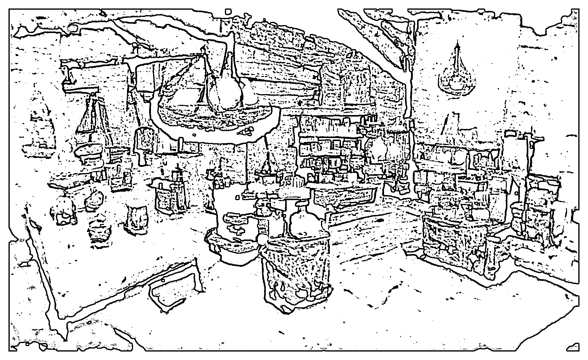
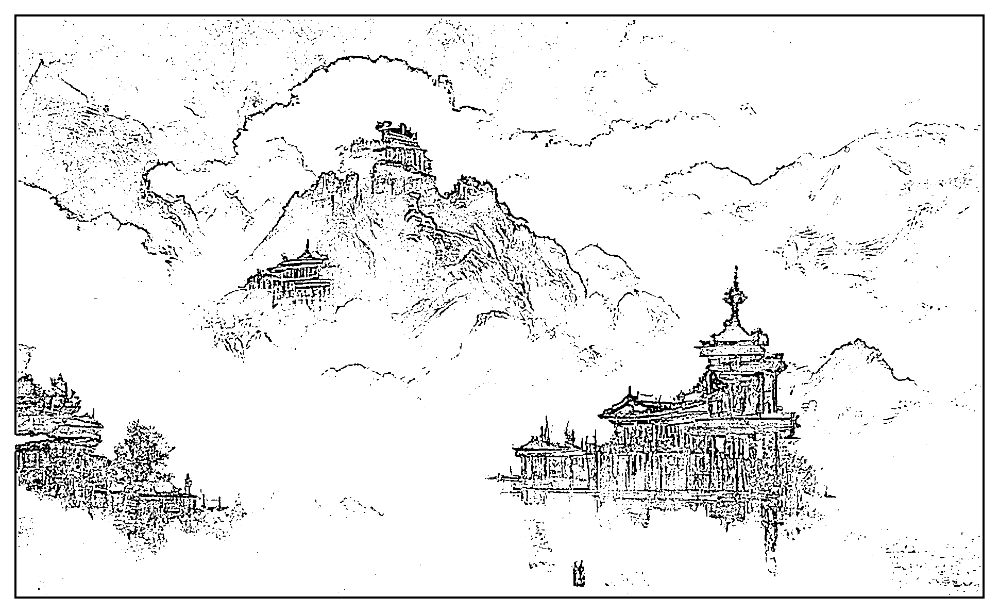
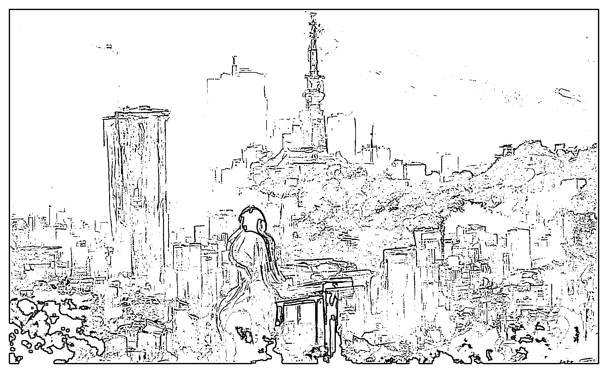
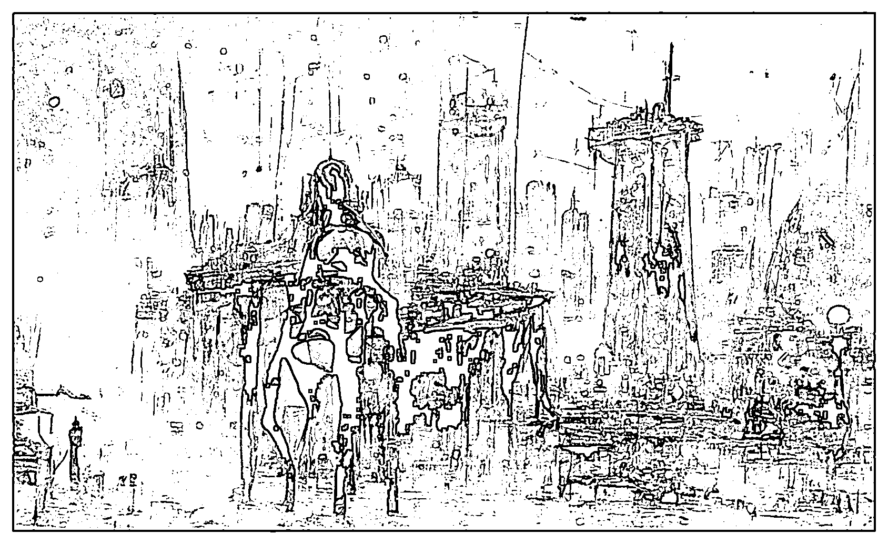
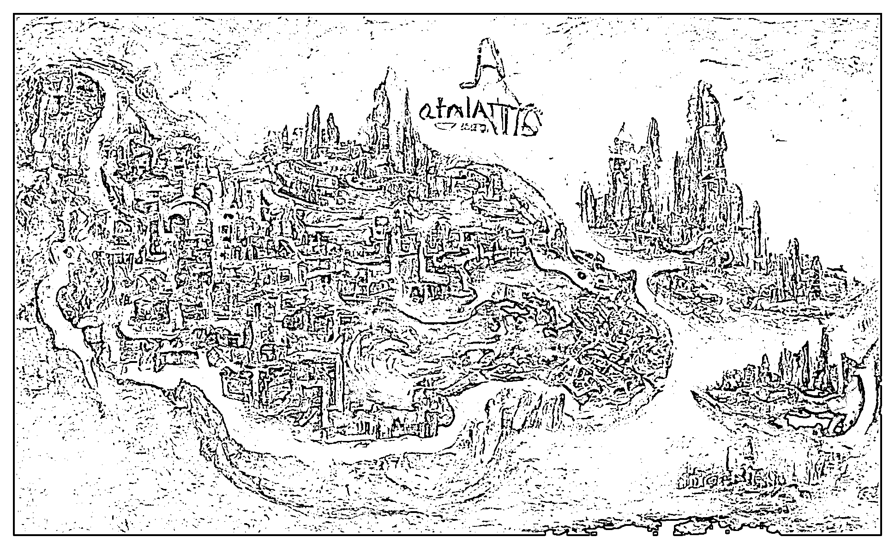
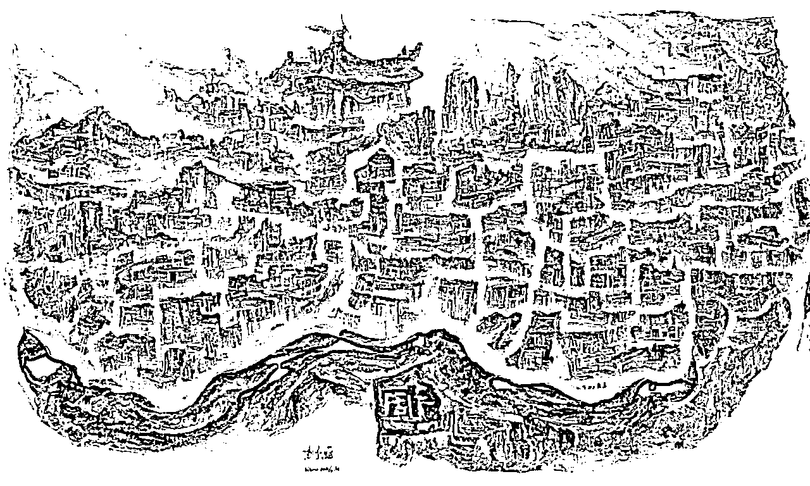

# 6.2.2 参考学习：优质描述词与对应图片

在学习描述词之前，先来看看优秀描述词的生成效果。

使用方式：

找你最喜欢的 AI 图，复制图对应的描述词，按照前文所教方法出图（描述词是纯英文，下方对应的中文是我翻译的，方便大家理解）。

复制描述词可选择：

1）炫彩模型关键词（点击下述链接即可跳转）•[炫彩关键词 1（图文）](https://shengcaiyoushu01.feishu.cn/file/boxcnyUY338Exse7cBJB2fQuwEc)•[炫彩关键词 2（图文）](https://shengcaiyoushu01.feishu.cn/file/boxcnUBX9NU7tr51iKb8QAzfMYe)•[炫彩关键词 3（图文）](https://shengcaiyoushu01.feishu.cn/file/boxcn1gklNHo6u1PwYqJMFrQ2qh)•[炫彩关键词 4（图文）](https://shengcaiyoushu01.feishu.cn/file/boxcnboZXjZvqmf8EBoXAvR6HDb)•[炫彩关键词 5（图文）](https://shengcaiyoushu01.feishu.cn/file/boxcn4i3e8GA7rcMD626JXC0Gbg)•[炫彩关键词 6（图文）](https://shengcaiyoushu01.feishu.cn/file/boxcnoeFLoNfkcjpcB7qFnnx1zE)•[炫彩关键词 7（图文）](https://shengcaiyoushu01.feishu.cn/file/boxcnLjme053b4TAHRUNTWcZO0b)•[炫彩关键词 8（图文）](https://shengcaiyoushu01.feishu.cn/file/boxcnWK4zTkKeuD3hyaEJpnKaPg)•[炫彩关键词 9（图文）](https://shengcaiyoushu01.feishu.cn/file/boxcn1fdUAykEvpqzE3BwS5x42f)
2）Disco Diffusion 模型关键词（点击下述链接即可跳转）•[DD 关键词 1（图文）](https://shengcaiyoushu01.feishu.cn/file/boxcnpnSLKXkZD73mpI48C4sqld)•[DD 关键词 2（图文）](https://shengcaiyoushu01.feishu.cn/file/boxcnkVoY7y0rvBuOkCJuDmjZEO)•[DD 关键词 3（图文）](https://shengcaiyoushu01.feishu.cn/file/boxcnKavem07x69bVVGeQ8thzHf)•[DD 关键词 4（图文）](https://shengcaiyoushu01.feishu.cn/file/boxcnA7PXLbbcIW6h4PpkHo7JSh)•[DD 关键词 5（图文）](https://shengcaiyoushu01.feishu.cn/file/boxcnb07Wols6rr0QNmD5PaMpfe)•[DD 关键词 6（图文）](https://shengcaiyoushu01.feishu.cn/docx/CWHVdPAKooEYQzxYHdKcbtnRnFe)
3）动物写实关键词（点击下述链接即可跳转）•[动物写实 1（图文）](https://shengcaiyoushu01.feishu.cn/docx/W4LSd1AIkoKLcQxp1GLcJ60RnHd)•[动物写实 2（图文）](https://shengcaiyoushu01.feishu.cn/sheets/shtcnjC4IYPy0JoToF88DWsnVIf)•[动物写实 3（图文）](https://shengcaiyoushu01.feishu.cn/file/boxcnvJMgzexw40UyTmQwvChheb)
4）二次元类目关键词（点击下述链接即可跳转）•[二次元词组分享](https://shengcaiyoushu01.feishu.cn/docx/A5LydeNrboHs1QxS0ezcE6eHn3g)•[二次元（图文）](https://shengcaiyoushu01.feishu.cn/file/boxcnqR2X5GrzocIEUzwSC50alb)5）婚纱礼服关键词（点击下述链接即可跳转）•[婚纱 1（图文）](https://shengcaiyoushu01.feishu.cn/file/boxcnUu49jXUDBNQV6r1VVF8mKG)•[婚纱 2（图文）](https://shengcaiyoushu01.feishu.cn/file/boxcnMNFC1ZqK3Jtjpd6TIrnO6b)•[婚纱 3（图文）](https://shengcaiyoushu01.feishu.cn/file/boxcnhd6sYLhB7X30S2YLAtNzEe)•[婚纱 4（图文）](https://shengcaiyoushu01.feishu.cn/file/boxcnrylcsk11P7Vd5rK2j3pS8e)•[婚纱 5（图文）](https://shengcaiyoushu01.feishu.cn/file/boxcnSD4T5G3KGnZdyOBq9dHgih)•[婚纱 6（图文）](https://shengcaiyoushu01.feishu.cn/file/boxcnC8LeOR1hc7J5eOimrG75Q7)
6）抖音爆款关键词（点击下述链接即可跳转）•[抖音爆款 1（图文）](https://shengcaiyoushu01.feishu.cn/file/boxcn92iFuBJeUsTHyenE25vNLc)•[快手爆款 1（图文）](https://shengcaiyoushu01.feishu.cn/file/boxcnP4ju7uauqi8FD8ESLfHWDb)
7）人物关键词（点击下述链接即可跳转）•[人物关键词（图文）](https://shengcaiyoushu01.feishu.cn/file/boxcnpYxsBggZ7Bp3QPBiXEA5Ig)
8）祈福关键词（点击下述链接即可跳转）•[祈福关键词（图文）](https://shengcaiyoushu01.feishu.cn/file/boxcnqwcJZgiKImvWs7ensjMDiV)
9）十二生肖关键词（点击下述链接即可跳转）•[发财系列（图文）](https://shengcaiyoushu01.feishu.cn/file/boxcnL2SrC9Pd12eVpYn9gpzAah)•[功夫系列 （图文）](https://shengcaiyoushu01.feishu.cn/file/boxcnhahsjTQAPgTsHgcuvDZnEc)•[汉服系列（图文）](https://shengcaiyoushu01.feishu.cn/file/boxcngYkzp8mC9fkdYGN03HdVBh)•[铠甲系列（图文）](https://shengcaiyoushu01.feishu.cn/file/boxcnmyGpAP6iU3jIaUnInQKLbb)•[唐装系列（图文）](https://shengcaiyoushu01.feishu.cn/file/boxcnkyXD8okD0HVQkgJH6zJzoc)
10）AI 绘图热度关键词（点击下述链接即可跳转） 200 个热度关键词

图 1

A beautiful ultradetailed anime illustration of a city street by beeple, makoto shinkai, and thomas kinkade, anime art wallpaper 4k, trending on artstation

（一个美丽的超细致的的城市街道动画插图，甲壳虫，makako shinkai 风格，thomas kinkade 风格，4K 动画艺术壁纸，趋近艺术风格）

图 2

Spaceship about to landing on a cornfield, steampunk, clouds in the sky, by Greg Rutkowski, concept art.

（即将降落在玉米地上的飞船，蒸汽朋克，云浮于空，Greg Rutkowski 画师风格，概念艺术）

图 3

A beautiful painting of captivating castles on hills and mountains, along plains and rivers, by Ismail Inceoglu

（一幅美丽的图画，坐落在山丘和山上、平原和河流边的迷人城堡，Ismail Inceoglu 画师风格）

图 4

Rustic interior of an alchemy shop

（质朴的炼金店内部）

图 5

clouds surround the mountains and Chinese palaces,sunshine,lake,overlook,overlook,unreal engine,light effect,Dream, Greg Rutkowski,James Gurney,artstation

（云环绕山脉和中国宫殿，阳光，湖泊，远眺，远眺，虚幻引擎，光效果，梦想，Greg Rutkowski 风格，James Gurney 风格，艺术站风格）

图 6

in the morning light,Overlooking TOKYO city by greg rutkowski and thomas kinkade,Trending on artstationmakoto shinkai style

（在晨光中俯瞰东京城市，greg rutkowski 和 thomas kinkade 风格，趋近 artstationmakoto shinkai 风格）

图 7

Cyberpunk city in the night seen from below,cityscape,mist,rain,artstation,Greg Rutkowski

（赛博朋克城市夜晚，下面视角，城市景观，雾，雨，艺术站风格，Greg Rutkowski 风格）

图 8

A beautiful painting of a map of the city of Atlantis

（一副好看的图画，亚特兰蒂斯城市地图）

图 9

A beautiful painting of a map of the city of China

（一副好看的图画，中国地图）

