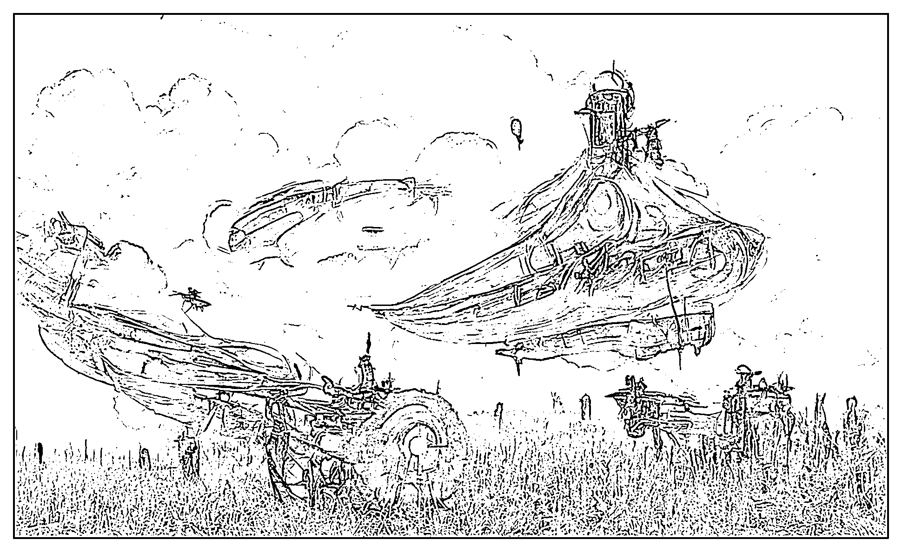
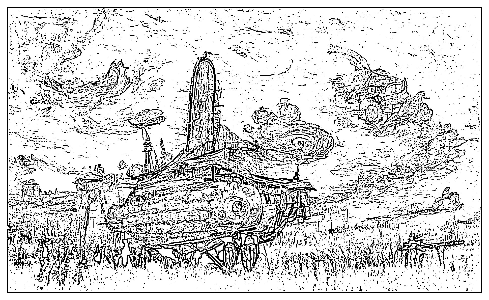
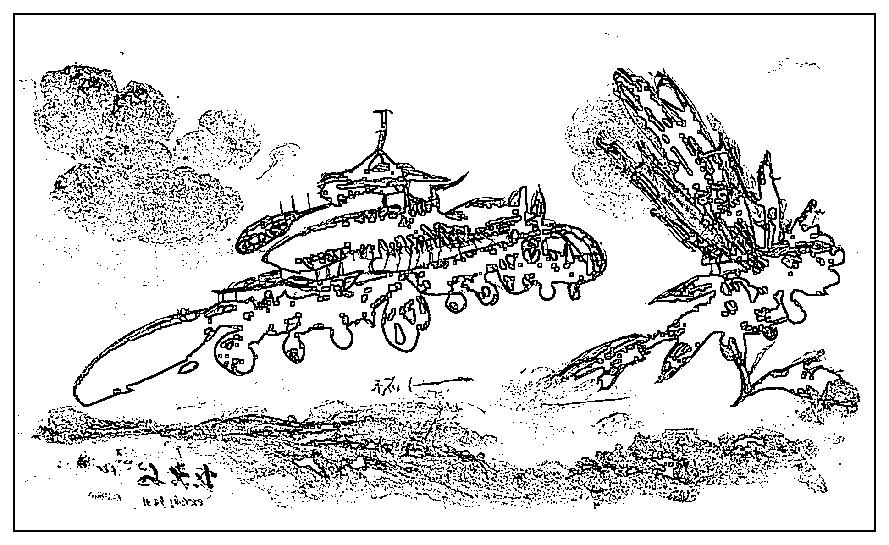
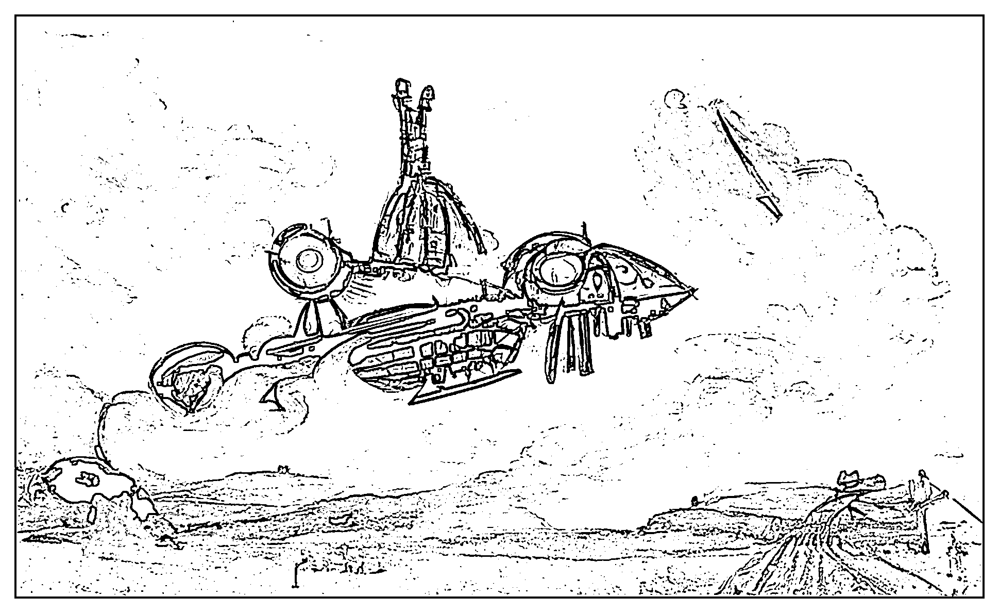
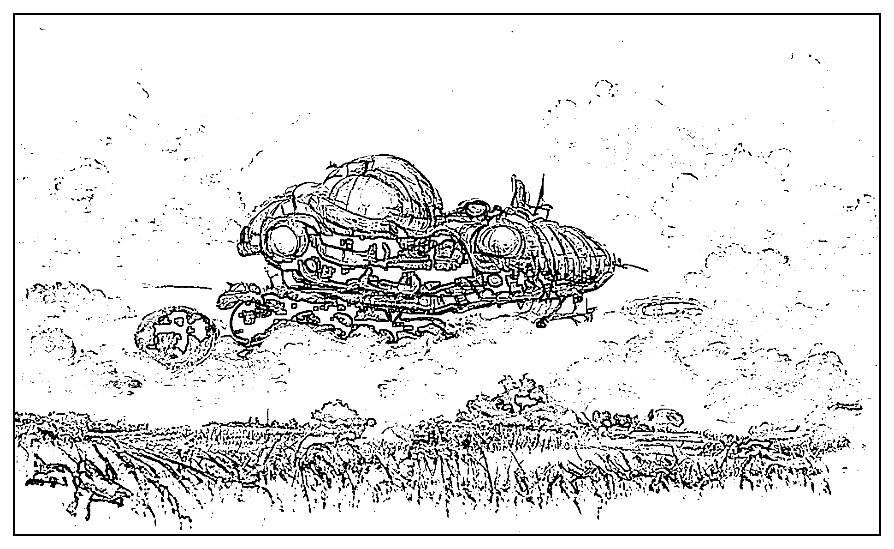
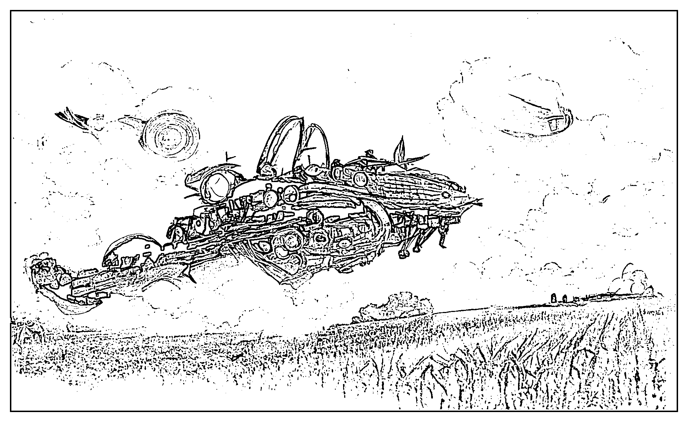
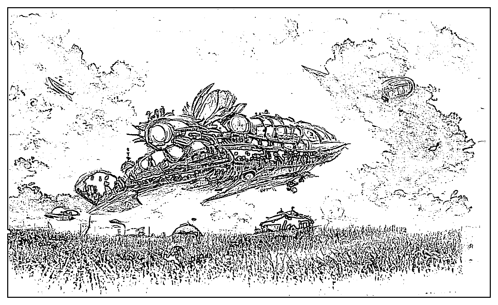

# 6.2.4 替换字词示例

画师风格对图片笔触影响很大，因此拿来举例。

Spaceship about to landing on a cornfield, steampunk, clouds in the sky, by Greg Rutkowski, concept art.

（即将降落在玉米地上的飞船，蒸汽朋克，云浮于空，Greg Rutkowski 画师风格，概念艺术）

by Greg Rutkowski

在保持其他不变的情况下，将 by Greg Rutkowski 替换成 by XXX，比如，换成梵高

Spaceship about to landing on a cornfield, steampunk, clouds in the sky, by Vincent van Gogh, concept art.

不会的英文人名用翻译软件查

by Vincent van Gogh（梵高）

改成其他画师原理相同。

by Qi baishi（齐白石）

by Picasso（毕加索）

by Akira Toriyama（鸟山明 - 七龙珠作者）

by Miyazaki Hayao（宫崎骏）

by Eiichiro Oda（尾田荣一郎 - 海贼王作者）

找到你喜欢的画师风格，加入你的描述词中，会有不一样的惊喜。