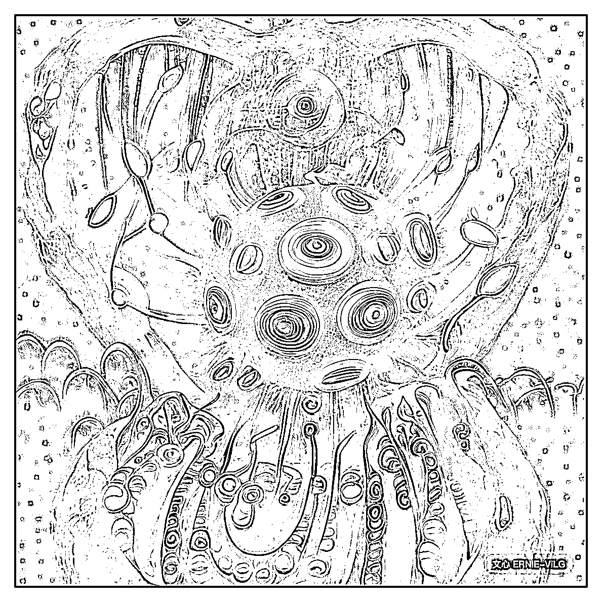

# 6.3 自我突破，学习描述词的组成方式（Promp）

了解完单个字词对画面的影响后，我们来学习如何组成描述词，生成自己想要的图片。

组成方式：【形容词】+【类型】+【细节设定】+【风格修饰词 / 参考艺术家】。

通俗来讲，就是告诉 AI，一个什么样子的某某物，置于什么样子的环境下，画面以什么样的构图形式出现，有哪些光影、摄影、图片渲染模式，整体画风是类似于什么样的画风：

以上描述词在上一篇也讲过，例如：

一个细胞的特写超现代主义插画，新海诚风格，吉田明彦风格，天野喜孝风格，超细节，高清壁纸

用中文拆解比用英文要方便一些，然后再翻译成英文输入即可。

在这里分享一篇文心的描述词写法教程：[描述词的写法（点击跳转）](https://wenxin.baidu.com/wenxin/docs#Jlbbjh075)

其中给出了许多描述词效果、风格词参考、艺术词参考、摄影词参考以及各类技巧，值得大家好好阅读学习。

链接中已经提过的内容不再赘述，补充一些额外的描述词方面的理解，适用于现有的所有 AI 绘画平台。

比起干燥的文字，我们借助一个可视化程度非常高的描述词生成工具来完成后面部分的讲解：[描述词生成器（点击跳转）](https://promptomania.com/generic-prompt-builder/)