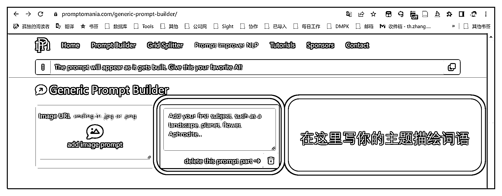
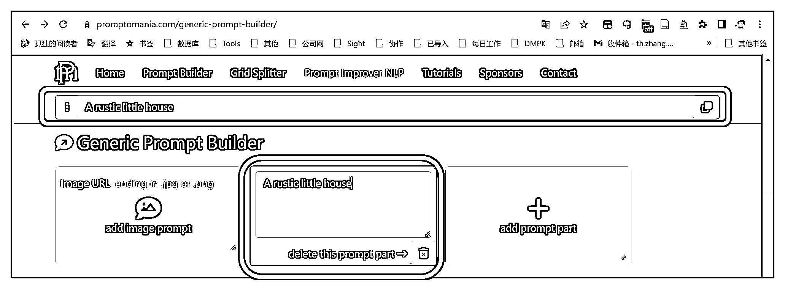
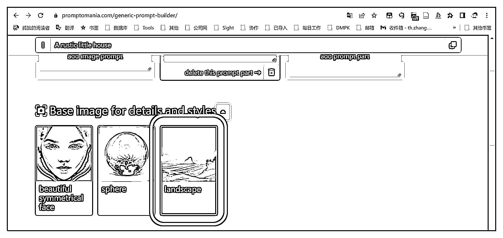

# 6.3.1 绘画主体

主体也就意味着，它是你想要的核心内容。

比如之前所描述的那样：

一个质朴的小屋子；

飞船落在玉米地上；

......

它也可以是：

一只戴着墨镜的猫；

特朗普与希拉里在拥抱；

乡间田野的小村庄；

五彩缤纷的花朵；

一个置物架；

穿梭的星际宇宙；

......

简而言之，你想要什么画面，这部分属于你的自由发挥区域，天马行空，无拘无束。也是我们普通人最能够进行发挥的地方。

然后我们点开上面提到的这个工具：[描述词生成器（点击跳转）](https://promptomania.com/generic-prompt-builder/)

1\. 填下主体词

我们在这里填写前文使用过的描述词：质朴小屋子

A rustic little house

最上面一栏，会自动同步更新描述词

2\. 选择最接近你想要画面的场景

接下来会以你的选择给你可视化的示例：

在这之后，如何修饰你想要的画面，这就需要构图语言。