# 6.3.2 构图语言

构图语言分为美术修饰、摄像语言、主色彩、维度、显示器、几何形状、感受、光线、材质、后处理、细节几个大板块。

当然，也还有其他结构，不过，前期这些完全足够。

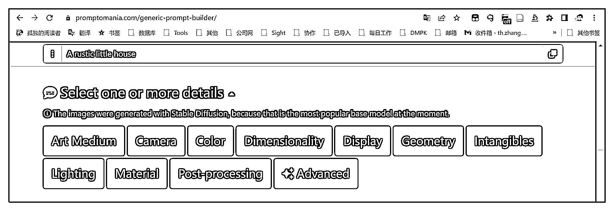

上面的每个按钮都可以点，点一下，就会放大出现次级选项。

简单介绍一下：

•美术语言（Art Medium），就是绘画的笔触、应用场景、图画类型等选项；

•摄影语言（Camera），就是想象你在拍摄它你是什么角度拍摄，怎么曝光，视角在何处等等；

•色彩（Color），画面呈现的色彩，没有什么说的；

•维度（Dimensionality），2D，3D，4D，5D 这些；

•显示器（Display），一些像素语言，可以根据效果选；

•几何形状（Geometry），顾名思义，就是其中某主体的形状；

•感受（Intangibles），这个较为复杂，开心、快乐、郁闷等情感可以是，大、小、胖、瘦，也可以是，风水、矛盾等不可名状的词，都在这里；

•光线（Lighting），光源的位置以及照射方式；

•材质（Material），塑料、金属、大理石、等等；

•后处理（Post-processing），对称、折叠、加框、等等，与照片的后期处理类似；

•增强（Advanced），是丰富细节，还是印象写意。

不懂它们应该怎么选择？

没关系，语言不懂，我们会看啊，只要点开相应的板块，就会有示例图片告诉你它们之间的区别，用眼睛选。

接下来，我会见样选择一个，告诉你一种选择，你当然也可以选择其他的进行组合创造。

•美术修饰

① 点开 Art Medium 选项卡

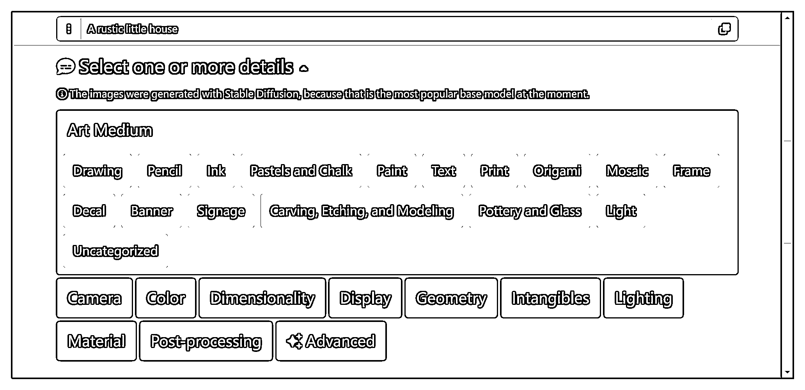

② 选择 “ Print ”（输出形式）→ “ Logo ”，也就是黄色框框处点一下：

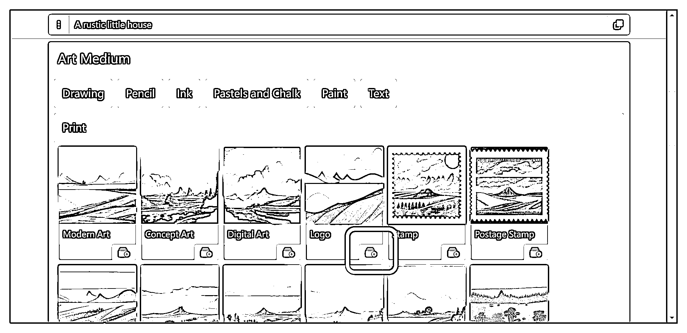

③ 这样，它就会消失不见，同时，上方的框框自动出现对应描述词：

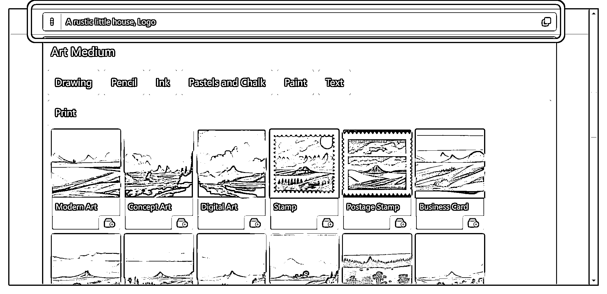

④ 并不是一个系列只能选一个，我们还能选其他的，它就会风格杂糅在一起

需要知道一点，这个描述词并非越多越好，当然，也可以自己试验看看效果。

比如这里我们选择了 “ Drawing ”（绘图类型）→ “Illustration ”，就能进一步决定其画面风格：

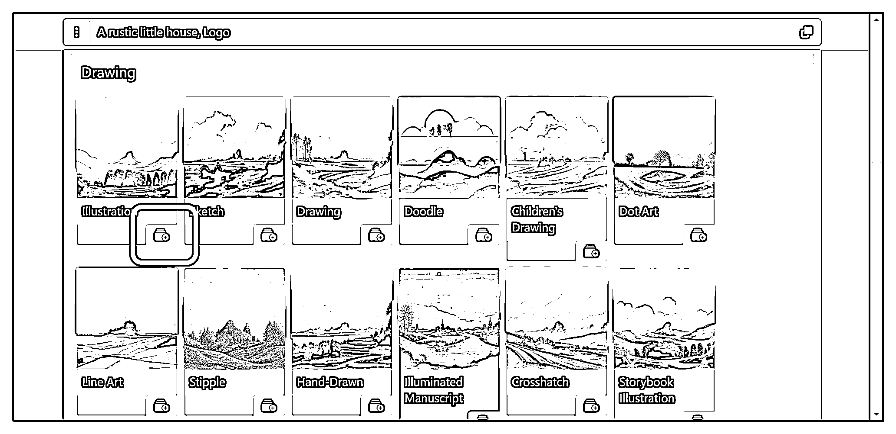

•摄影语言

同理，选择 “ Camera ” → “ Scenes ” → “ Time-Lapse ”

•色彩

同理，选择 “ Color ” → “ Chromatic Palettes ” → “ Polychromatic-Colors ”

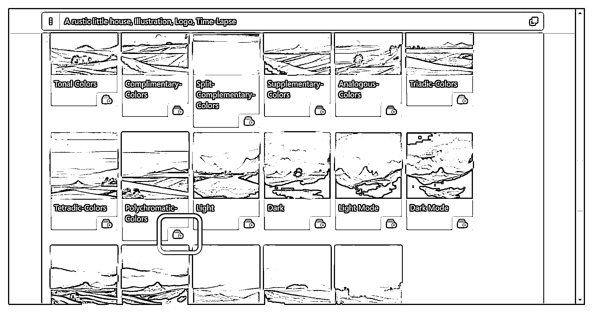

•维度

选择 “ Dimensionality ” → “ 2D-5D ” → “ 2.5D ”

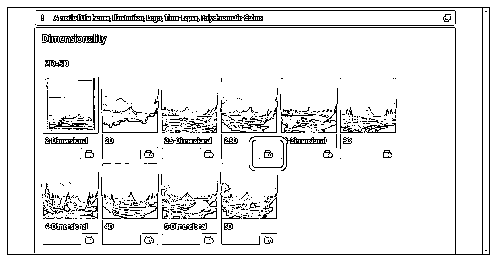

•显示器

选择 “ Display ” → “ Palettes ” → “ HDR ”

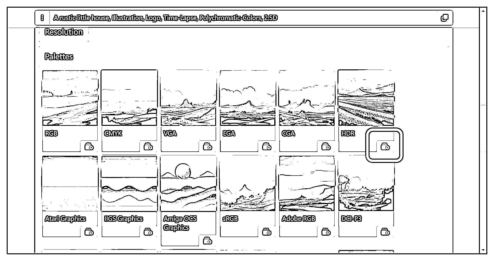

遇到不懂的，可以随时查一查啥意思。

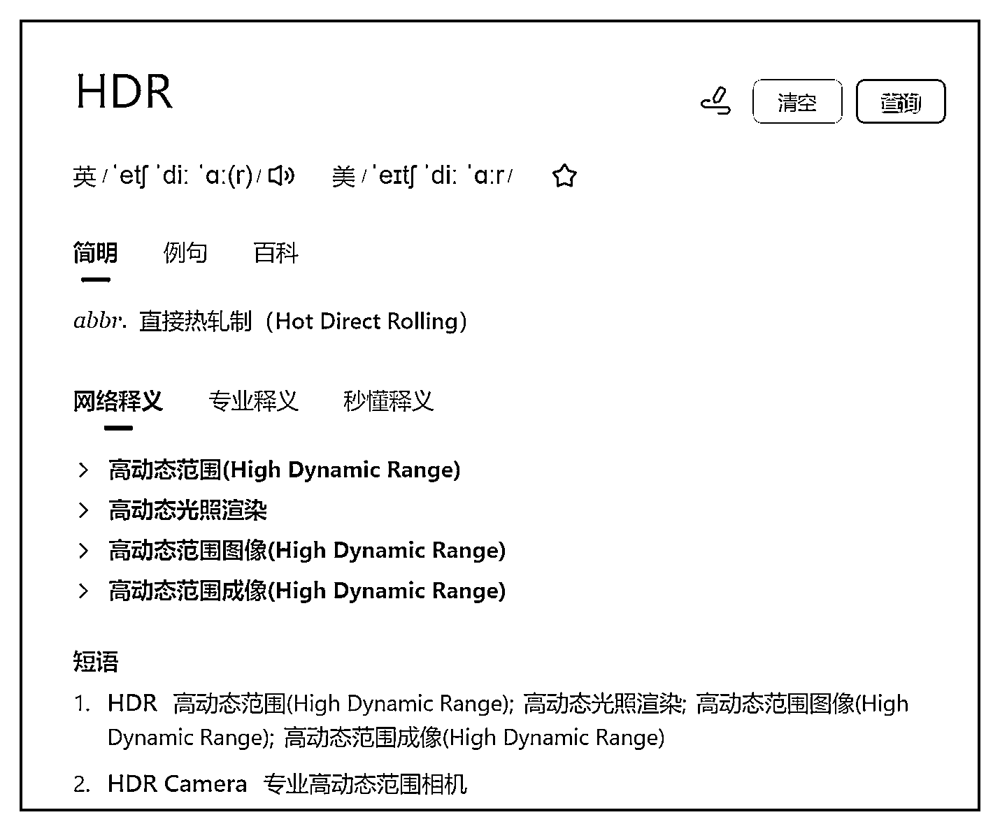

emm......查了也不懂，没关系，这不重要，实在想知道也可以去谷歌再查查。

•几何形状

“ Geometry ” → “ Bodies ” → “ Cupola ”:

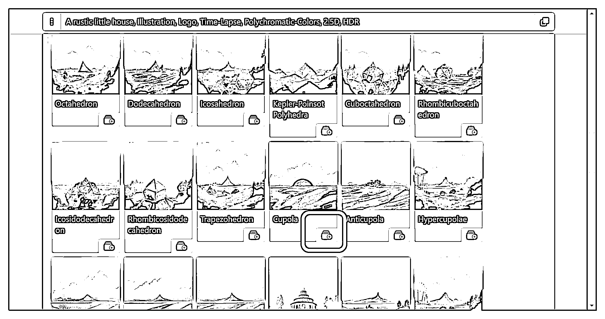

•感受

“ Intangibles ” → “ Emotions and Qualities ” → “ Happy ”:

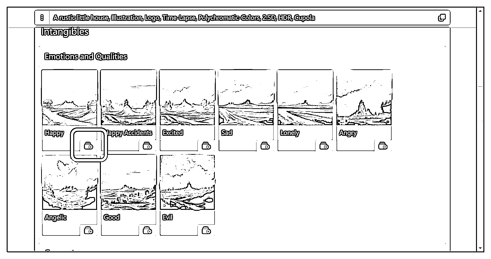

“ Intangibles ” → “ Concepts ” → “ Refreshing ”:

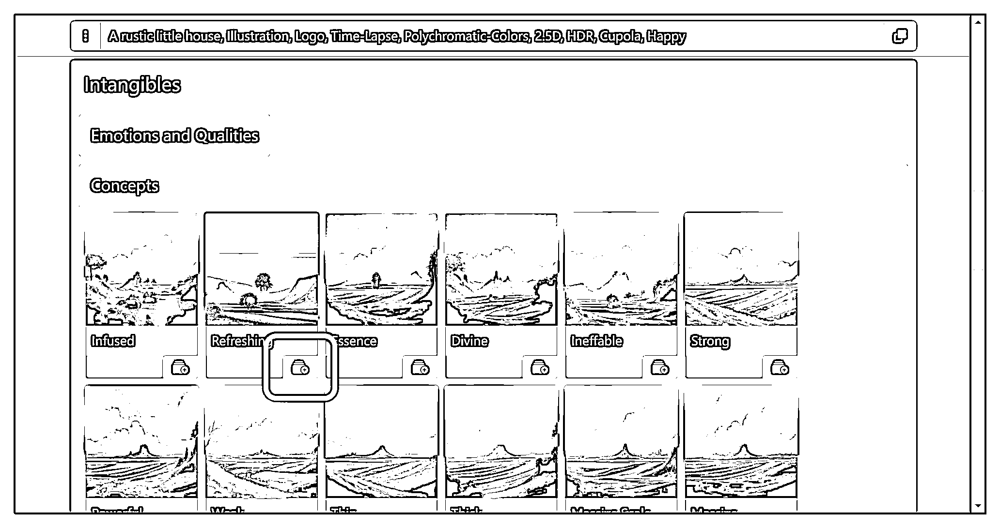

•光线

“ Lighting ” → “ Styles ” → “ Soft Lighting ”:

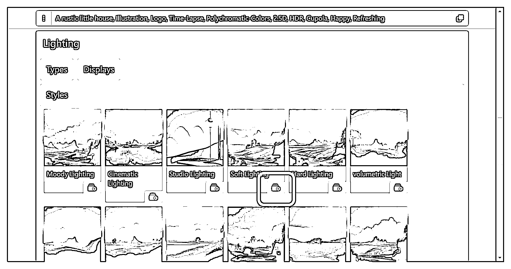

•材质

“ Material ” → “ Plants ” → “ Acorn ”:

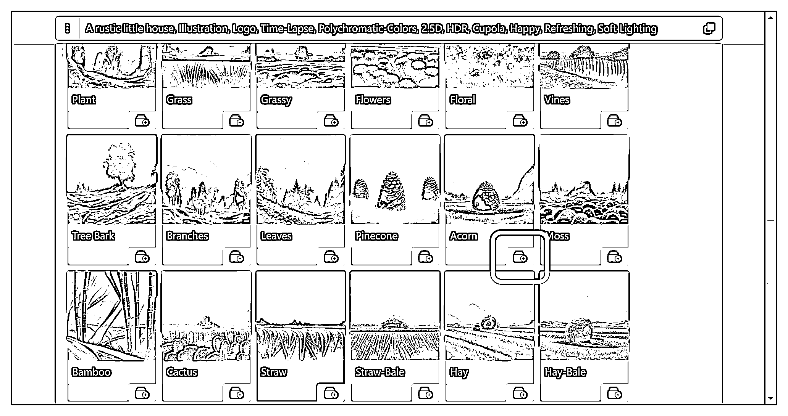

•后处理

“ Post-processing ” → “ Shaders ” → “ Ray Traced ”:

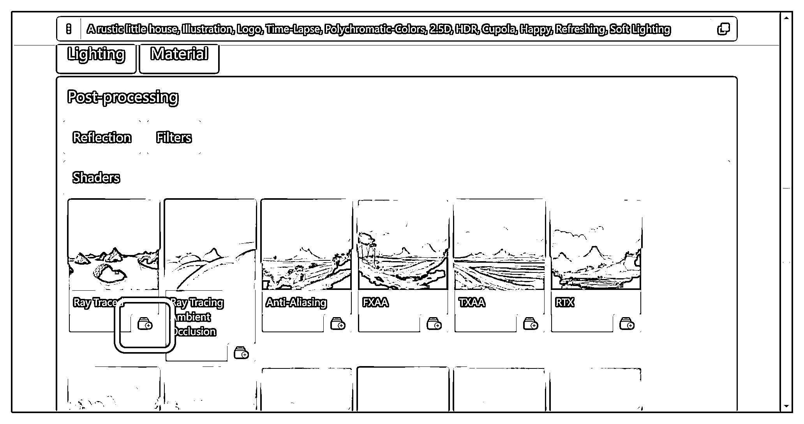

•增强

“ Advanced ” → “ detailed and intricate ”

这个很有意思，选择以后，描述词自动多出来一大堆东西：

insanely detailed and intricate, hypermaximalist, elegant, ornate, hyper realistic, super detailed

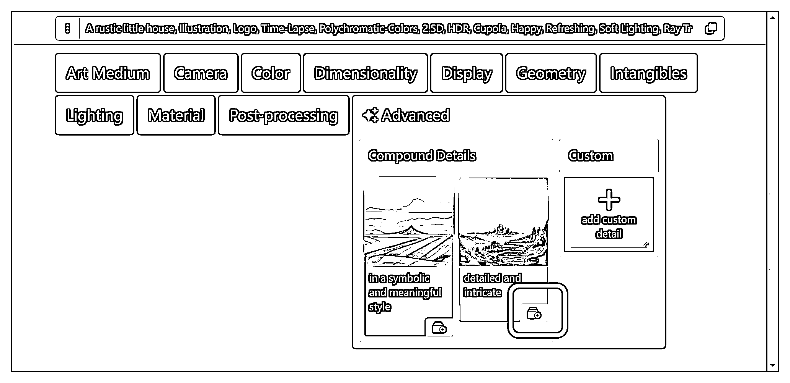

以上逐个选择完毕后，在框框里会自动出现描述词，点右上角的复制按钮即可一键复制。

当然，对选择的不满意，还可以将对应的效果点一下垃圾桶按钮删除，如下图的 “ Cupola ” 效果：

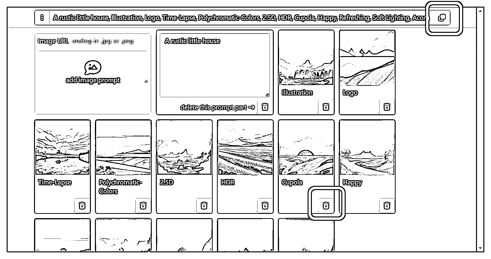

至此，我们将简单的描述词：A rustic little house

转化成了我们想要修图的描述词：

A rustic little house, Illustration, Logo, Time-Lapse, Polychromatic-Colors, 2.5D, HDR, Cupola, Happy, Refreshing, Soft Lighting, Acorn, Ray Traced, insanely detailed and intricate, hypermaximalist, elegant, ornate, hyper realistic, super detailed

需要很强的英文水平吗，不需要，这些单词都能查。

当然，上述过程只是展示了一遍描述词的组成过程，大家可以根据自己的需求更改自己的需求词。

将上述描述词放入前文提到的三个生成模型中，就能产出自己的 AI 绘图了。