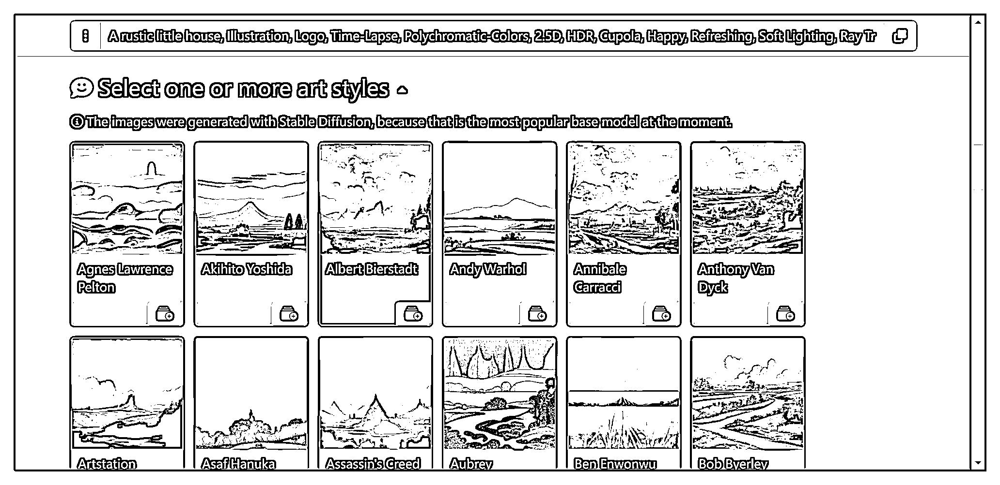
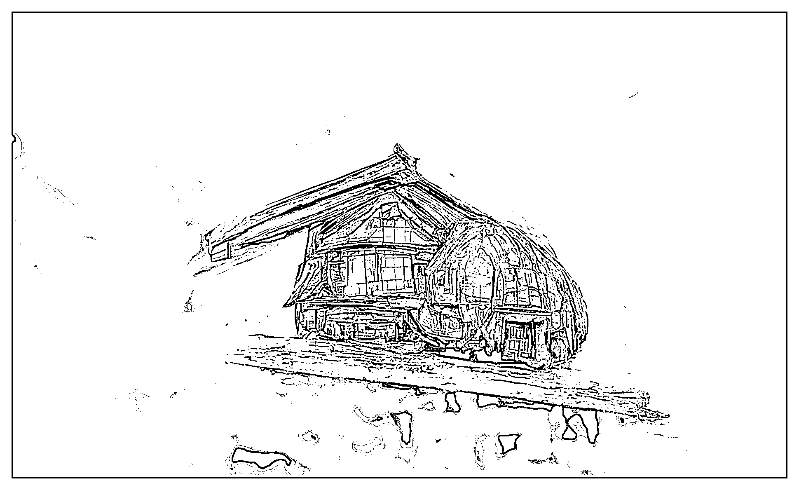
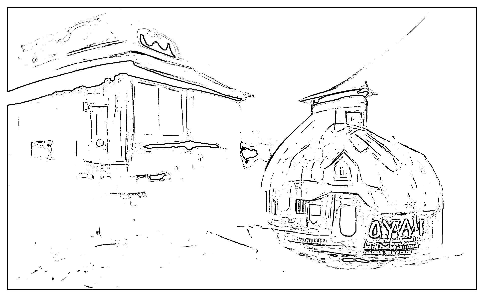
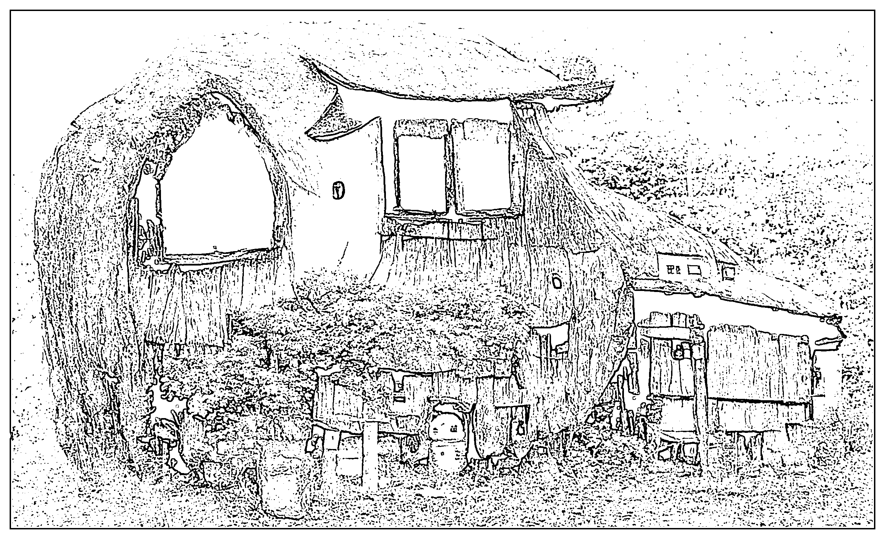
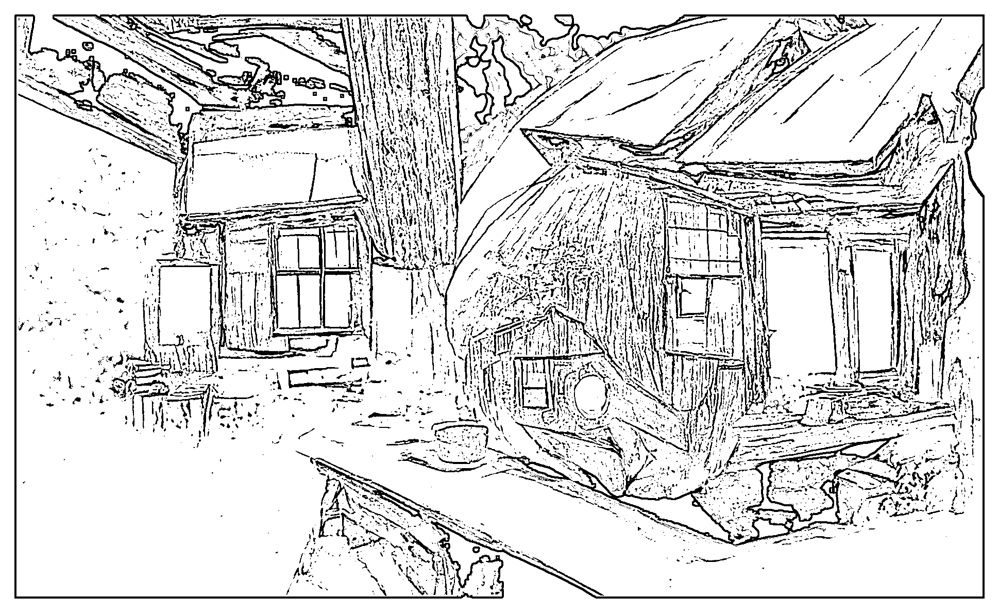

# 6.3.3 画师或整体风格选择

如果上述构图语言全部写完，其实就等于你就是一个固定了风格的画师，但你仍然可以选择画师继续影响你的绘图。

有名气的画师都有一套自己的风格，它们对于色彩、镜头、光影都有自己的一套逻辑。按道理讲，其实写上想要画师的名字，很多语言都不需要写了。

不过，别忘了 AI 是可以整合的，所以，可以用 “ 画师 + 你设置的语言 ” 碰撞的方式看看会出什么样的火花。

操作也很简单，描述词中加一个 “ by XXX ” 即可。

我还是比较喜欢宫崎骏和新海诚，因此，之前的描述词最终成型：

A rustic little house, Illustration, Logo, Time-Lapse, Polychromatic-Colors, 2.5D, HDR, Cupola, Happy, Refreshing, Soft Lighting, Acorn, Ray Traced, insanely detailed and intricate, hypermaximalist, elegant, ornate, hyper realistic, super detailed, by Miyazaki Hayao and Makoto Shinkai

翻译一下：

一个质朴的小房子，插画，logo，延时摄影，多色彩，2.5D， HDR，圆屋顶，快乐，清爽，柔和的光线，橡子材质，射线追踪，疯狂的细节，复杂，超大主义，优雅，华丽，超现实，超细节，宫崎骏和新海诚风格

最终效果如何呢：

对比一下最初的图：

哈哈，兜兜转转，还是最初的小房子更质朴，但改了之后的小房子变得更炫技和华丽了。

不过这也难怪，之前的词都是为了演示所以随机选的。像多色彩、华丽、等词语对质朴这个概念是有害的，可以删去之后再看看效果如何，有兴趣的伙伴可以尝试一下。

比如我们去除了 “ 多色彩（Polychromatic-Colors） ” 、“ 华丽（ornate） ” 两个词语，果然质朴多了。

与最初的图相比，画质、精细度也有了很明显的提升。

描述词如下：

A rustic little house, Illustration, Logo, Time-Lapse, 2.5D, HDR, Cupola, Happy, Refreshing, Soft Lighting, Acorn, Ray Traced, insanely detailed and intricate, hypermaximalist, elegant, hyper realistic, super detailed, by Miyazaki Hayao and Makoto Shinkai

前期，我们对标优质描述词作修改。

现在，我们可以自己生成好描述词，并在自己的基础上作修改了，多试试，多改改，你也可以达到进阶水平。

