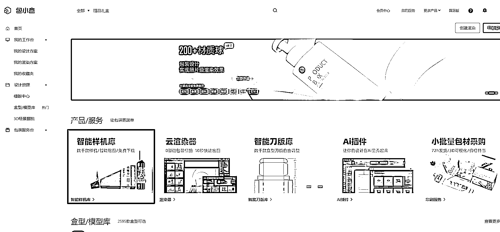
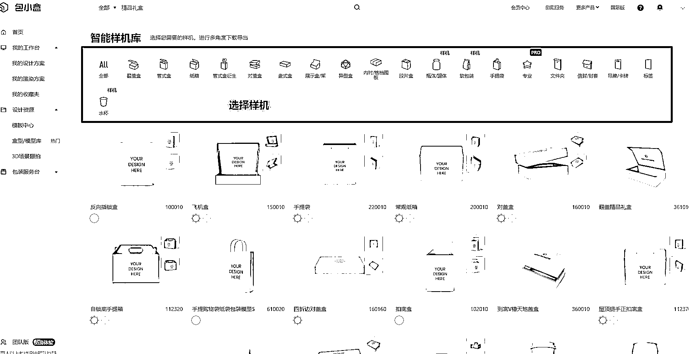
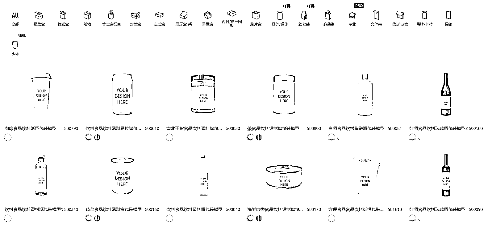
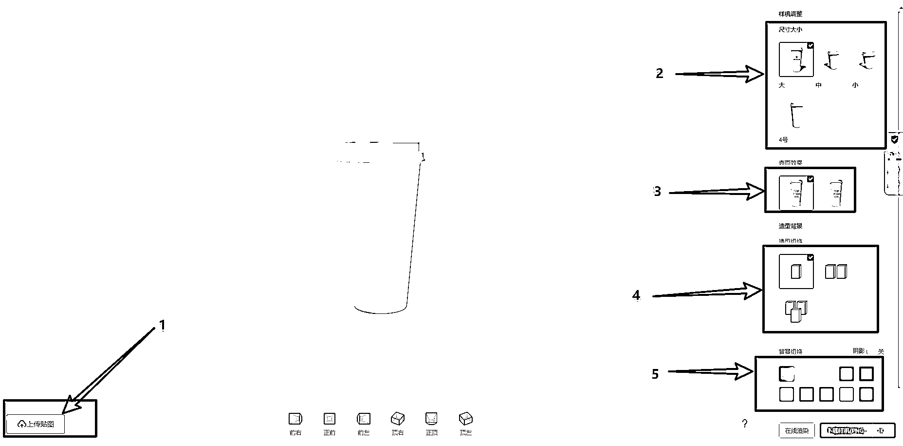
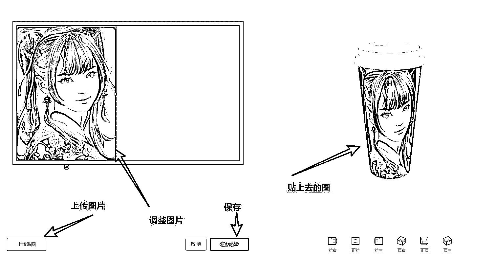
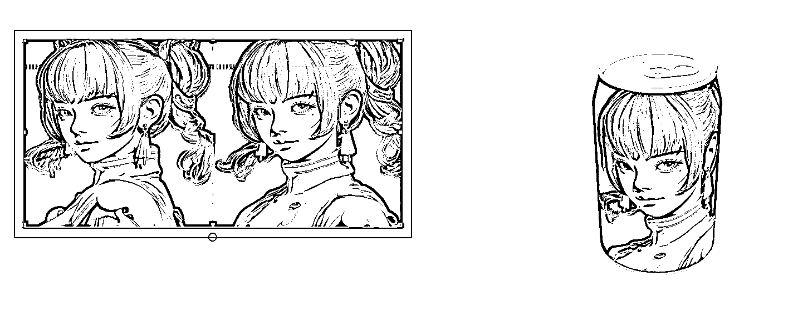

# 第 2 步：包小盒贴图

打开包小盒官网，登录，选择智能样机库：

选择你需要的产品样机，然后点进去，我们就以瓶体为例：

比如我们选择纸杯：

然后上传刚才生成的 MJ 图片进行产品贴图：

换张图，换个样机，例如换成易拉罐，效果也不错：

操作说明：

•杯子，瓶子类的图，可以在 MJ 里面设置生成的图片尺寸为 16：9 的比较好；

•会 Adobe Illustrator（支持 2019-2022 版本）的可以直接下载包小盒的 AI 插件，直接软件操作效果更好；

•会 PS 更好，可以根据尺寸，直接在 PS 排版好，打上字体和标签，然后在贴图。

