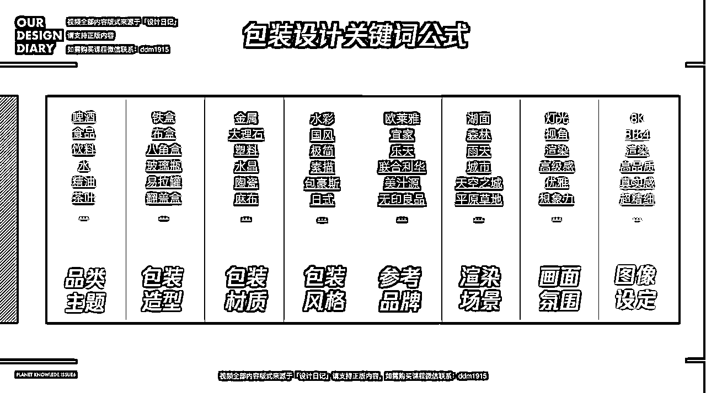
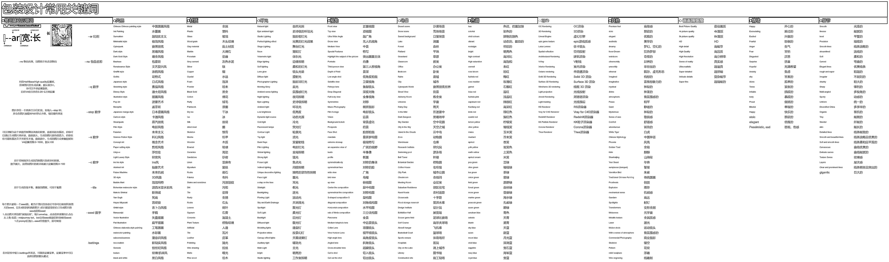

# 7.3 常用关键词 @Sky🏹

在上篇学习关键词时，我们了解过它的写法与组成。但在不同领域，常见关键词与常用关键词公式往往能帮我们节省很大精力。

•包装领域-关键词公式：品类主题+包装造型+包装材质+包装风格+参考品牌+渲染场景+画面氛围+图像设定

•魔法词：packaging design（包装品类与风格）

•辅助词： alcoholic beverrages（酒精饮料）、soft drinks（软性饮料）、home accessories（家居饰品）、cosmetic products （化妆品）、food products （食品）、dim sun（点心）、incense cigarettes（香烟）、household goods（家庭用品）、electrocal（电器）、beatuty products（美容用品）、medical care（医药保健）、festive gifts（节日用品）

•包装设计常用关键词：

这部分的关键词与分类非常多非常细致，上图仅为部分展示，光看小图就能看到密密麻麻的字符，具体详表见：

包装设计常用关键词

上表中的这些关键词，在其他不同领域也能加以应用，关键就看大家如何吸纳变通～

•下面我们来看一些应用示例：

31

目前，AI 绘画在包装领域尚未探索出体系化的变现方式，大家可以尝试做个先驱者，躬身探索。

