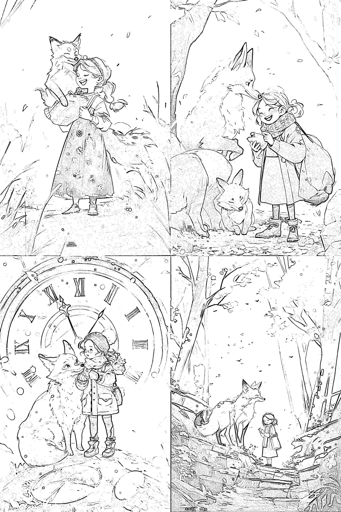
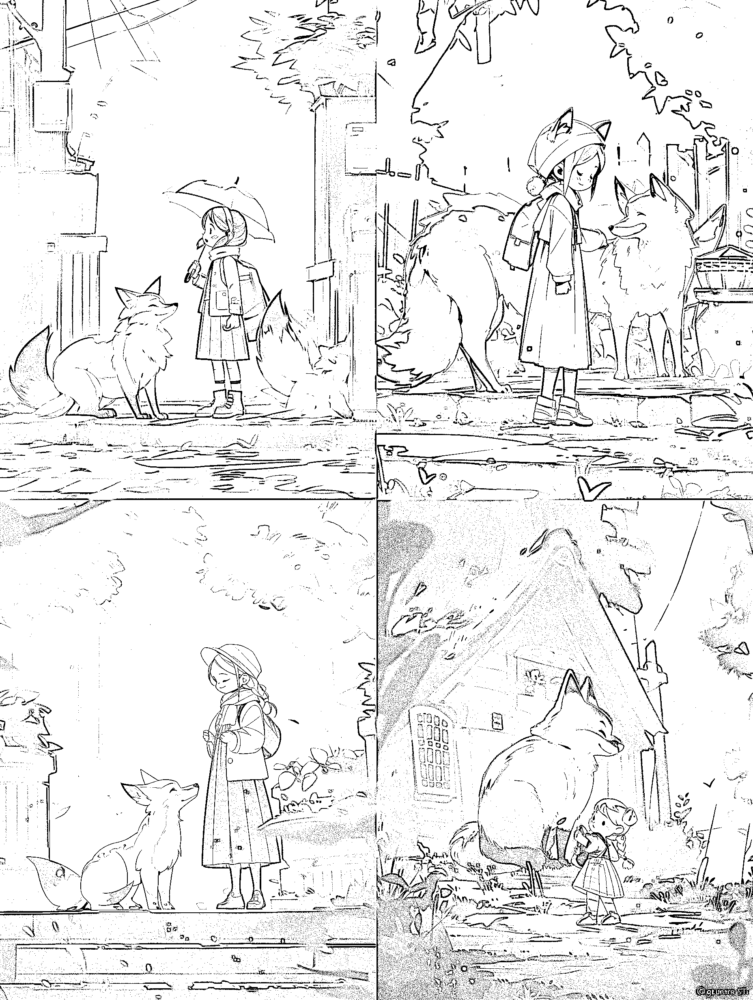
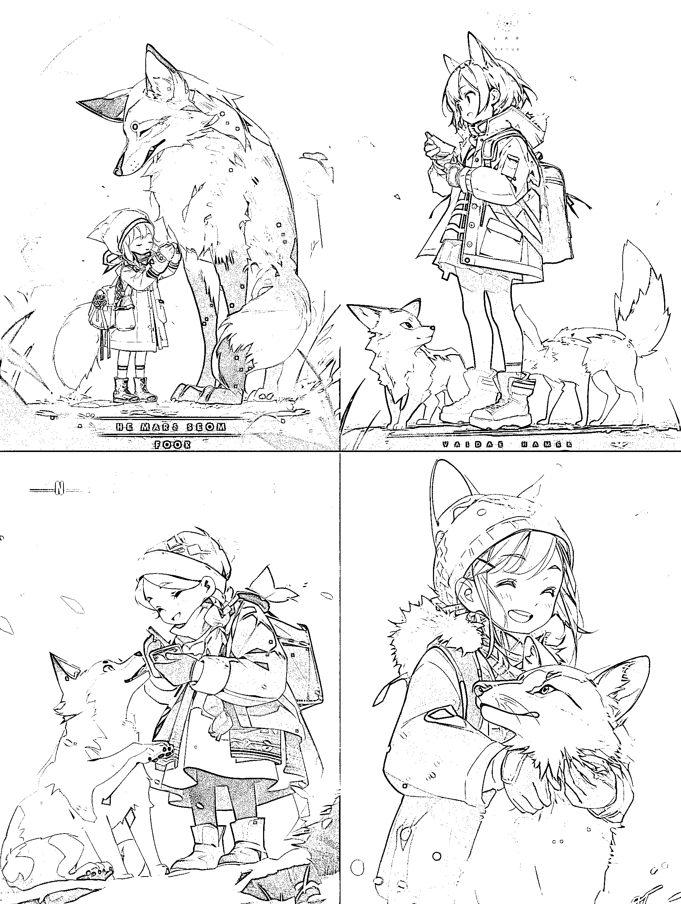
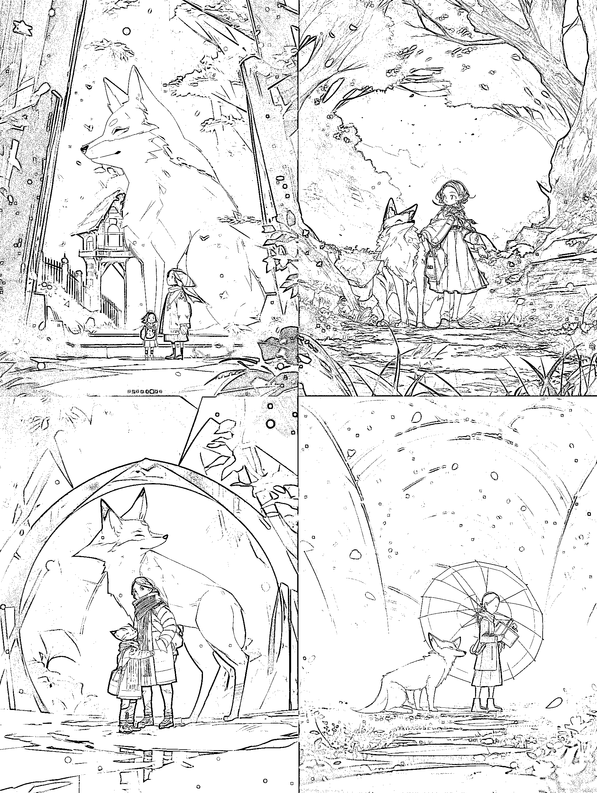
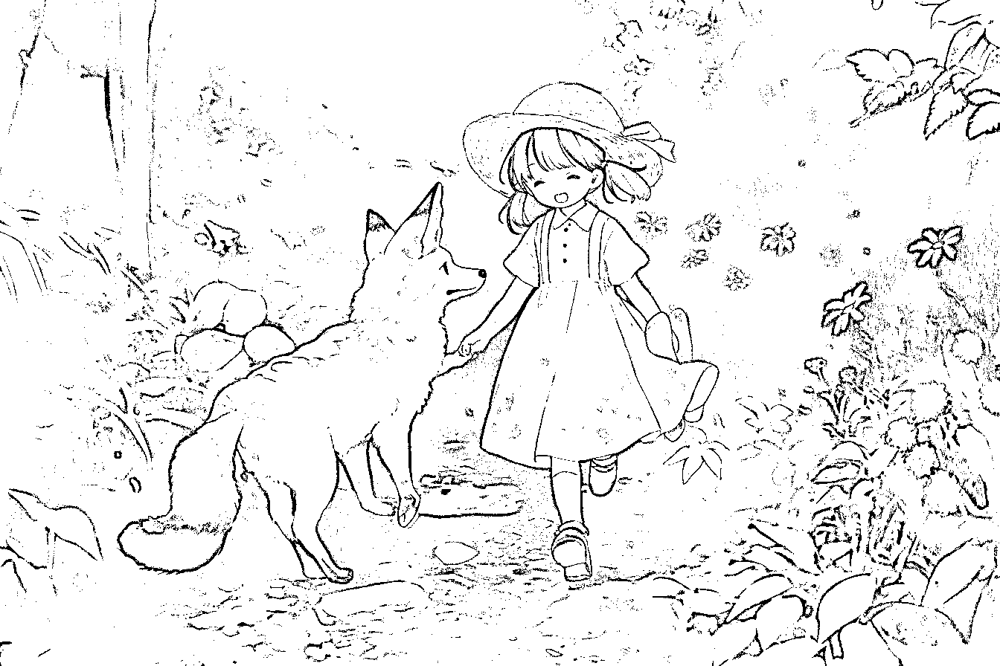
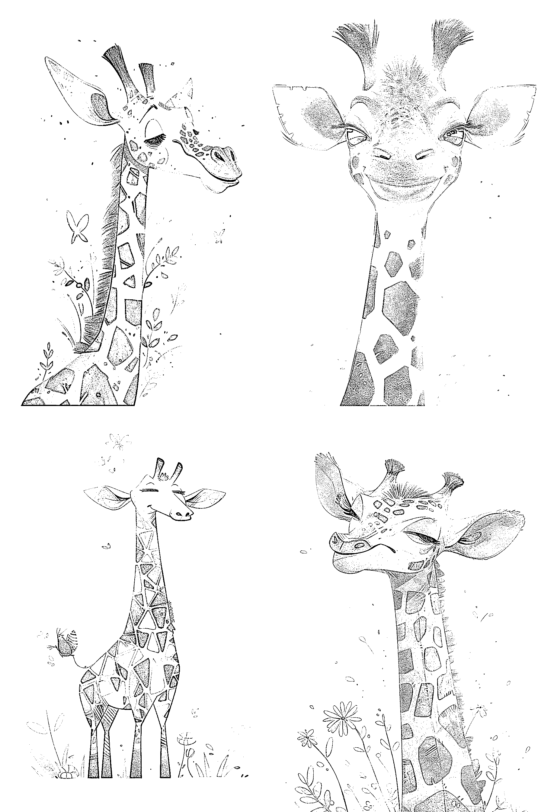
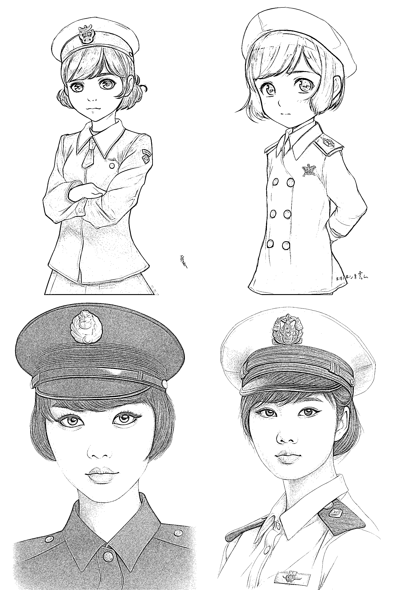
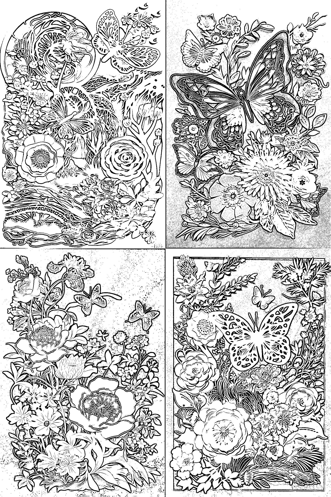

# 8.2 如何实操

根据插画设计的种类，我们可以有一个快速出图的基础公式：【插画设计种类】+【你想要的画面】

为了更直观的让大家了解出图效果，我用 niji 出图，它可以直接用中文，我的关键词是：

手绘插画，一个可爱的小女孩和狐狸 --ar 2:3 --niji 5 --style scenic

素描插画，一个可爱的小女孩和一只狐狸，--ar 2:3 --niji 5 --style scenic

文字插画，一个可爱的小女孩和一只狐狸，--ar 2:3 --niji 5 --style scenic

关于文字插画，因为 AI 绘画现在识别不了字母，但是它对文字的排版还是可以的，我们可以根据图片上的文字排版，把图片上原有的文字消除掉，输入我们想要的文字，这样就可以用为图片封面使用了，对于电影海报插画和绘本封面插画来说，是很方便快捷的。

对于图片上的文字消除+输入，如果大家不熟悉 Photoshop（PS），可以用“稿定设计”或者“美图秀秀”的消除笔+文字来完成。

3D 打印插画，一个可爱的小女孩和一只狐狸，--ar 2:3 --niji 5 --style scenic

现代艺术插画，一个可爱的小女孩和一只狐狸，--ar 2:3 --niji 5 --style scenic

那么在基础公式上，我们还可以再继续添加：

【插画设计种类】+【插画风格】+【你想要的画面】+【by 艺术家姓名】+【其他】

当然这个公式不是固定的，你可以加入你想加入的任何元素，或者直接用【插画风格】+【你想要的画面】都是可以的。

但是一开始，我建议大家先从少到多，这样才能直观的了解一个关键词所产生的画面是否是自己想要的，这个过程是一个非常有趣的探索过程。如：

现实主义风格，儿童插图，一个小女孩在森林里玩耍时遇到了一只可爱的狐狸 realistic style, children's illustration,A little girl was playing in the forest when she met a cute fox --ar 3:2 --niji 5 --style cute

可爱的长颈鹿宝宝，令人愉快的波西米亚风格插图，柔和而充满活力的颜色，艺术涂鸦，有纹理，白色固体背景，艾米丽·温菲尔德·马丁和乔恩·克拉森，人物表 cute baby giraffe, delightful boho illustration, soft vibrant colors, artistic doodle, textured, white solid background, by Emily Winfield Martin and Jon Klassen, character sheet --ar 2:3 --niji 5 --style scenic

铅笔插图手绘，穿着海军制服的中国可爱女孩，非常可爱，黑色的大眼睛，短发，Pencil illustration hand drawn, cute Chinese girl wearing navy uniform, very cute, with big black eyes and short hair, --ar 2:3 --v 5

多维剪纸，中国插画，蝴蝶和花朵，高质量，细节精致，3dMultidimensional Paper Cuttings, Chinese illustration, butterfly and flower, high quality, exquisite details, 3d, --ar 2:3 --v 5

